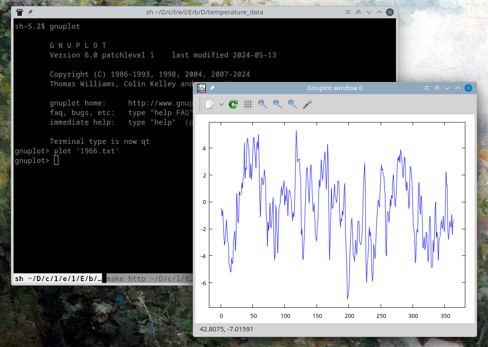

[La pagina con la spiegazione originale degli esercizi si trova qui: <https://labtnds.docs.cern.ch/Lezione4/Lezione4/>.]

In questa lezione proveremo ad applicare gli strumenti sviluppati nelle scorse lezioni a casi concreti di studio. Per prima cosa cercheremo di chiudere il capitolo dell'analisi dei dati climatici studiando l'andamento temporale delle variazioni medie di temperatura dal 1941 al 2023. Vi proponiamo inoltre alcuni temi specifici (facoltativi) che si possono affrontare con gli strumenti che abbiamo sviluppato sinora: l'analisi dei dati raccolti in un tipico esperimento del laboratorio di fisica (esperimento di Millikan e misura del rapporto q/m per l'elettrone) e un semplice problema di riordinamento (per fare qualche esercizio con gli strumenti della STL).


# Esercizio 4.0 — Analisi andamento temporale temperature Milano (da consegnare) {#esercizio-4.0}

In questa lezione tireremo le somme del lavoro svolto in tutte le sessioni precedenti. Scriveremo un codice di analisi (da consegnare) che ci permetta di visualizzare l'andamento del delta giornaliero (calcolato rispetto alla media sul perioro 1941-2023) medio annuale rispetto all'anno dal 1941 al 2023 nell'area di Milano. Per analizzare l'andamento temporale del Δ in funzione del tempo l'oggetto giusto di ROOT da utilzzare è [`TGraphErrors`](https://root.cern.ch/doc/v630/classTGraphErrors.html). La struttura del codice potrebbe essere logicamente la seguente:

-   Loop principale sugli anni che vogliamo investigare;

-   Per ogni anno apriamo il file corrispondente, calcoliamo media ed errore e riempiamo un grafico;

-   A fine ciclo disegnamo il grafico.

Potete scaricare i file di dati usando questo link: [TemperatureMilano.tar.gz](https://labtnds.docs.cern.ch/Lezione4/TemperatureMilano.tar.gz).

Per svolgere questo esercizio (e tutti i successivi) potete chiaramente utilizzare come alternativa a ROOT lo strumento di rappresentazione grafica che preferite (GNUPLOT o Matplotlib). In particolare, potete dare un'occhiata al contenuto di ciascun file `.txt` all'interno dell'archivio `TemperatureMilano.tar.gz` con il comando `plot "NOMEFILE"` eseguito dalla linea di comando di `gnuplot`:




## Quale errore associare ai Δ?

In linea di principio lo stimatore corretto sarebbe la deviazione standard dalla media. In questo caso la stima è più complicata, perché i valori di Δ giornalieri non sono scorrelati tra loro. Per ridurre l'impatto della correlazione e quindi utilizzare uno stimatore dell'errore più corretto, potremmo limitarci ad utilizzare una misura ogni 7 giorni: ci aspettiamo infatti che una misura sia solo debolmente correlata a quello che è successo 7 giorni prima.

Questa è una tecnica molto usata; il valore `7` è detto *stride*, e ricorre molto spesso nelle librerie numeriche (vedi ad esempio il medesimo concetto nella libreria Python [NumPy](https://numpy.org/doc/2.0/reference/generated/numpy.ndarray.strides.html)).

Potreste implementare media e deviazione standard in questo modo:

```c++
// Set the default stride to 1 so that if you avoid passing the
// second parameter, the usual definition of “mean” will be used
[[nodiscard]] double mean(const vector<double> & v, int stride = 1) {
  double accum{};
  int n{};
  for(int k{}; k < ssize(v); k += stride, n++) {  // Note we increment both k and n!
    accum += v.at(k);
  }

  return accum / n;
}
```

Ovviamente dovete tenere conto del numero effettivo di campioni che sommate in `accum`: la riga finale deve essere `accum / n`, non certo `accum / ssize(v)`! Il codice per la deviazione standard si calcola allo stesso modo.

**Attenzione:** non è corretto calcolare la media su *tutti* i campioni e la deviazione standard invece prendendone uno ogni sette, perché i due numeri farebbero riferimento a distribuzioni diverse!

Vi fornisco il codice per i test:

```c++
void test_statistics_with_stride() {
  vector<double> v{1.0, 2.0, 3.0, 4.0, 5.0, 6.0};
  assert(are_close(mean(v, 1), 3.5));
  assert(are_close(mean(v, 2), 3.0));
  assert(are_close(mean(v, 3), 2.5));

  assert(are_close(stddev(v, 1), 1.707825127659933));
  assert(are_close(stddev(v, 2), 1.632993161855452));
  assert(are_close(stddev(v, 3), 1.5));

  println(cerr, "All the tests have passed. Hurrah! 🥳");
}
```

## Esempio di codice con GnuPlot

Ecco come si potrebbe implementare il `main()` usando la libreria [gplot++](miscellanea.html#gplotinstall); il programma salva il grafico nel file `plot.png`:

```c++
int main() {
  test_statistics_with_stride();

  const int stride{7};
  Gnuplot plt{};
  plt.redirect_to_png("plot.png");

  // loop principale su tutti i files (anni) da analizzare

  for (int year{1941}, index{}; year < 2024; year++, index++) {
    string filename{format("temperature_data/{}.txt", year)};

    vector v{Read<double>(filename.c_str())};

    // Qui inserite i vostri calcoli. Attenzione a calcolare
    // la deviazione standard DELLA MEDIA!
    double ave{/* … */};
    double err{/* … */};

    println("Anno {} Δ medio = {:.3f} ± {:.3f}", year, ave, err);

    // inserisco media e deviazione standard dalla media nel grafico
    plt.add_point_yerr(year, ave, err);
  }

  plt.plot_yerr();
  plt.show();
}
```

L'output atteso dovrebbe iniziare così:

```
All the tests have passed. Hurrah! 🥳
Anno 1941 Δ medio = -1.100 ± 0.306
Anno 1942 Δ medio = -0.033 ± 0.409
Anno 1943 Δ medio = 0.909 ± 0.322
Anno 1944 Δ medio = -0.334 ± 0.320
```

Questo è il grafico atteso:


## Esempio di codice con ROOT

Ecco invece come realizzare il `main()` nel caso in cui vogliate usare ROOT:

```c++
// put here all required includes

using namespace std;

int main() {
  test_statistics_with_stride();

  TApplication app{"app", 0, 0};

  // oggetto per rappresentare un andamento x (anno) verso y (delta medio)
  TGraphErrors trend;

  // …

  // loop principale su tutti i files (anni) da analizzare

  // Note that in `for` loops you can use more than one variable.
  // Here we use `year` to denote the full year, while `index`
  // starts from zero and is used because ROOT requires it.
  for (int year{1941}, index{}; year < 2024; year++, index++) {
    string filename{format("temperature_data/{}.txt", i)};

    vector v{Read<double>(filename.c_str()};

    // qui fate i vostri calcoli
    // …

    println("Anno {} Δ medio = {:+.3f} ± {:.3f}", i, ave, err);

    // inserisco media e deviazione standard dalla media nel grafico

    trend.SetPoint(index, i, ave);
    trend.SetPointError(index, 0, err);

    index++;
  }

  // grafica

  TCanvas c{"Temperature trend","Temperature trend"};
  c.cd();
  c.SetGridx();
  c.SetGridy();

  trend.SetMarkerSize(1.0);
  trend.SetMarkerStyle(20);
  trend.SetFillColor(5);

  trend.SetTitle("Temperature trend");
  trend.GetXaxis()->SetTitle("Anno");
  trend.GetYaxis()->SetTitle("#Delta (#circ C)");
  trend.Draw("apl3");
  trend.Draw("pX");

  c.SaveAs("trend.pdf");

  app.Run();
}
```


# Esercizio 4.1 — Misura del rapporto $q/m$ per l'elettrone (analisi dati)  {#esercizio-4.1}

Un esperimento molto interessante che si svolge nel laboratorio di
fisica riguarda la misura del rapporto tra la carica e la massa di un
elettrone. Un fascio di elettroni di energia nota (determinata dal
potenziale $2\Delta V$ applicato ai capi di un condensatore) viene
deflesso da un campo magnetico opportunamente generato. Dalla misura
del raggio di deflessione $r$ si può ricavare una stima del rapporto
$q/m$. La misura in laboratorio è piuttosto complessa a causa degli
effetti sistematici sperimentali, ma il rapporto $q/m$ può essere
determinato sfruttando la relazione \[ (r B)^2 = \frac{m}q\,2\Delta V,
\] perché il rapporto è legato al coefficiente angolare della
relazione.

Nel file di dati sono riportate le misure prese in laboratorio: nella
prima colonna il valore di $2\Delta V$, nella seconda colonna il
valore di $(r B)^2$ e nella terza l'errore sulla determinazione di $(r
B)^2$. Provate a scrivere un codice che pemetta di visualizzare i dati
raccolti e determinare il rapporto $q/m$ ( in questo caso l'oggetto di
ROOT più indicato è
[TGraphErrors](https://labtnds.docs.cern.ch/Survival/root/).

Il file di dati si chiama
    [`data_eom.dat`](https://labtnds.docs.cern.ch/Lezione4/data_eom.dat).
    Potete provare a scrivere il codice da soli. In caso potete
    prendere ispirazione dagli esempi riportati sotto

## Esempio di codice con ROOT

```c++
#include <cmath>
#include <fstream>
#include <iostream>
#include <vector>

#include "TApplication.h"
#include "TAxis.h"
#include "TF1.h"
#include "TGraphErrors.h"
#include "TLegend.h"

using namespace std;

void ParseFile(string filename, vector<double> &myx, vector<double> &myy,
               vector<double> &myerry) {

  ifstream fin{filename.c_str()};

  double x, y, err;

  if (!fin) {
    println(stderr, "Cannot open file {}", filename);
    exit(1);
  }

  while (fin >> x >> y >> err) {
    myx.push_back(x);
    myy.push_back(y);
    myerry.push_back(err);
  }

  fin.close();
}

[[nodiscard]] TGraphErrors DoPlot(vector<double> myx,
                                  vector<double> myy,
                                  vector<double> myerry) {

  TGraphErrors mygraph;

  for (int k{}; k < ssize(myx); k++) {
    mygraph.SetPoint(k, myx[k], myy[k]);
    mygraph.SetPointError(k, 0, myerry[k]);
  }

  return mygraph;
}

int main() {

  TApplication app{"MyApp", 0, 0};

  vector<double> myx{};
  vector<double> myy{};
  vector<double> myerry{};

  // read data from file

  ParseFile("data_eom.dat", myx, myy, myerry);

  // create TGraphErrors

  TGraphErrors mygraph{DoPlot(myx, myy, myerry)};

  // fit the TGraphErrors ( linear fit )

  TF1 *myfun = new TF1("fitfun", "[0]*x+[1]", 0, 1000);
  mygraph.Fit(myfun);
  double moe{myfun->GetParameter(0)};
  double error{sqrt(pow(1. / moe, 4) * pow(myfun->GetParError(0), 2))};

  println("Valore di e/m dal fit = {} ± {}", 1. / moe, error);
  println("Valore del chi2 del fit = {}", myfun->GetChisquare());
  println("          prob del chi2 = {}", myfun->GetProb());

  // customise the plot, cosmetics

  mygraph.Draw("AP");
  mygraph.SetMarkerStyle(20);
  mygraph.SetMarkerSize(1);
  mygraph.SetTitle("Misura e/m");
  mygraph.GetXaxis()->SetTitle("2#DeltaV (V)");
  mygraph.GetYaxis()->SetTitle("(B_{z}R)^{2} (T^{2}m^{2} )");
  TLegend leg(0.15, 0.7, 0.3, 0.85);
  leg.AddEntry(&mygraph, "data", "p");
  leg.AddEntry(myfun, "fit", "l");
  leg.Draw("same");

  app.Run();

  return 0;
}
```

## Esempio di codice con GnuPlot

È possibile usare la libreria
[gplot++](https://github.com/ziotom78/gplotpp) per produrre grafici: è
molto più leggera di ROOT, funziona bene anche con Replit e si può
usare facilmente sotto ogni sistema operativo (Windows, Linux, Mac OS
X). La libreria però non fornisce funzioni di analisi dati, così
dobbiamo implementare noi la funzione per la regressione lineare:

```c++
// File linearfit.h
#pragma once

#include <cassert>
#include <cmath>
#include <vector>

/**
 * Result of a linear fit of the form y_i = A + B × x_i
 *
 * @tparam T The floating-point type to use. Typically it's either `float`,
 * `double`, or `long double`
 */
template <typename T> struct LinearFitResults {
  T a;
  T a_err;
  T b;
  T b_err;
};

/** Perform a least-squares linear fit of samples (x_i, y_i) using the model y_i
 * = A + B × x_i
 *
 * This code implements a simple weighted least-squares algorithm, using the
 * formulae provided in «Numerical Recipes» (Press, Teukolsky, Vetterling,
 * Flannery, 3rd edition), Eqq. 15.2.16–21. These formulae are basically the
 * same as the ones provided in «An Introduction to Error Analysis: The Study of
 * Uncertainties in Physical Measurements» (Taylor), but it is more robust
 * against rounding errors, thanks to the usage of the variable t_i.
 *
 * @tparam T The floating-point data type used to do all the calculations
 * @param x_vec The vector of samples x_i
 * @param y_vec The vector of samples y_i
 * @param y_err_vec
 * @return
 */
template <typename T>
LinearFitResults<T> linear_fit(const std::vector<T> &x_vec,
                               const std::vector<T> &y_vec,
                               const std::vector<T> &y_err_vec) {
  assert(ssize(x_vec) == ssize(y_vec));
  assert(ssize(y_vec) == ssize(y_err_vec));
  const int num_of_samples{ssize(x_vec)};

  // See Numerical recipes, Eqq. 15.2.16–21

  // S = ∑ w_i = ∑ 1/σ_i²
  T S{};

  // Sx = ∑ w_i x_i
  T Sx{};

  // Sx2 = ∑ w_i x_i²
  T Sx2{};

  // Sy = ∑ w_i y_i
  T Sy{};

  for (int i{}; i < (int) num_of_samples; ++i) {
    auto x{x_vec.at(i)};
    auto y{y_vec.at(i)};
    auto w{1.0 / std::pow(y_err_vec.at(i), 2)};
    S += w;
    Sx += w * x;
    Sx2 += w * std::pow(x, 2);
    Sy += w * y;
  }

  // Stt = ∑ t_i², with t_i = (x_i - Sx / S) / σ_i
  T Stt{};
  // Stys = ∑ t_i y_i / σ_i
  T Stys{};

  for (int i{}; i < (int) num_of_samples; ++i) {
    auto x{x_vec.at(i)};
    auto y{y_vec.at(i)};
    auto y_err{y_err_vec.at(i)};
    auto t{(x - Sx / S) / y_err};
    Stt += std::pow(t, 2);
    Stys += t * y / y_err;
  }

  T b{Stys / Stt};
  T a{(Sy - Sx * b) / S};
  T b_err{std::sqrt(1 / Stt)};
  T a_err{std::sqrt((1 + Sx2 / (S * Stt)) / S)};

  return LinearFitResults<T>{a, a_err, b, b_err};
}
```

Con questo file si può usare il programma seguente, che memorizza
tutti i dati in una struttura `Measurements`. Il programma usa la
libreria [gplot++](https://github.com/ziotom78/gplotpp); se volete provare ad
installarla, le istruzioni sono a [questo link](miscellanea.html#gplotinstall).

```c++
#include "gplot++.h"
#include "linearfit.h"
#include <cmath>
#include <iostream>
#include <fstream>
#include <print>
#include <string>
#include <vector>

using namespace std;

template <typename T> struct Measurements {
  vector<T> voltage;
  vector<T> rb;
  vector<T> rb_err;

  int size() const { return (int) ssize(voltage); }
};

/**
 * Read the measurements of the q/m experiment from an input stream
 *
 * @tparam T The floating-point data type to use in the result
 * @param input The input stream where to read data from
 * @param data The object that will contain the result on exit
 */
template <typename T>
[[nodiscard]] void read_from_file(istream &input, Measurements<T> &data) {
  T voltage, rb, rb_err;
  while (input >> voltage >> rb >> rb_err) {
    data.voltage.push_back(voltage);
    data.rb.push_back(rb);
    data.rb_err.push_back(rb_err);
  }
}

template <typename T>
void plot_data_and_fit(const string &filename, const Measurements<T> &data,
                       T a, T b) {
  Gnuplot gnuplot{};
  gnuplot.redirect_to_png(filename);

  // Plot the data that have been read from file
  gnuplot.plot_yerr(data.voltage, data.rb, data.rb_err, "Measurements");

  // Now plot the best-fit line y = A + B x by computing the coordinates of the
  // leftmost and rightmost points
  T x1{data.voltage.front()}, x2{data.voltage.back()};
  T y1{a + x1 * b}, y2{a + x2 * b};
  gnuplot.plot(vector<T>{x1, x2}, vector<T>{y1, y2}, "Best fit");

  gnuplot.set_xlabel("2ΔV [V]");
  gnuplot.set_ylabel("(r×B)² [m²·T²]");
  gnuplot.show();

  println(cerr, "plot saved in file \"{}\"", filename));
}

int main(int argc, const char *argv[]) {
  if (argc != 2) {
    println(cerr, "usage: {} DATA_FILE\n", argv[0]);
    return 1;
  }
  const string file_name{argv[1]};
  ifstream input_file{file_name};
  if (!input_file) {
    println(cerr, "error, unable to load file \"{}\"", file_name);
    return 1;
  }

  Measurements<float> data;
  read_from_file(input_file, data);

  println(cerr, "{} elements have been read from \"{}\"", ssize(data),
          file_name);

  auto result{linear_fit(data.voltage, data.rb, data.rb_err)};

  println("Data have been fitted on a curve y = A + B × x:");
  println("A = {:.4e} ± {:.4e}", result.a, result.a_err);
  println("B = {:.4e} ± {:.4e}", result.b, result.b_err);

  plot_data_and_fit("output_plot.png", data, result.a, result.b);

  auto q_over_m{1 / result.b};
  auto error{sqrt(pow(q_over_m, 4) * pow(result.b_err, 2))};

  println("q/m = {:.4e} ± {:.4e}", q_over_m, error);
}
```


## Esempio di codice in Python

Python è probabilmente il linguaggio di programmazione più usato in
ambito scientifico. Per quelli di voi curiosi, fornisco una
implementazione dello stesso codice sopra usando questo linguaggio:

```python
#!/usr/bin/env python3

# You must install NumPy and Matplotlib before running this code:
#
#     pip install numpy matplotlib

import numpy as np
import matplotlib.pylab as plt

# np.loadtxt loads a text files and returns a N×3 matrix
data = np.loadtxt("data_eom.dat")

# With this instruction we save the three columns of the matrix
# in the three vectors `x`, `y`, and `err`
x, y, err = [data[:, i] for i in (0, 1, 2)]

# Draw a plot
plt.errorbar(x, y, yerr=err, fmt="o")

# Compute the best fit with the model y = A + B x
params, cov = np.polyfit(x, y, 1, w=1 / err, cov="unscaled")

# The quantity m/e is the value of B
m_over_e = params[0]

# This adds the best fit to the previous plot
plt.plot(x, np.polyval(params, x))

plt.xlabel("2ΔV [V]")
plt.ylabel("(rB)² [m² T²]")
plot_file_name = "output.png"
plt.savefig(plot_file_name)
print(f"Plot saved in file {plot_file_name}")

# √cov_00 is the error over the factor B
m_over_e_err = np.sqrt(cov[0, 0])

rel_error = m_over_e_err / m_over_e

# We have m/e, but we must compute e/m, so we use error propagation here
e_over_m = 1 / m_over_e
e_over_m_err = rel_error * e_over_m

# Strings beginning with `f` are treated similarly to the C++ print() function
print(f"e/m = {e_over_m:.2e} ± {e_over_m_err:.2e}")
print("reference: 1.76×10^11 C⋅kg^−1")
```

Una volta che il programma è stato salvato in un file
`esercizio4.0.py`, potete compilarlo ed eseguirlo con un solo comando:

    python esercizio4.0.py


# Esercizio 4.2 — Misura della carica dell'elettrone (analisi dati)  {#esercizio-4.2}

La carica dell'elettrone è stata misurata per la prima volta nel 1909
in uno storico esperimento dal fisico statunitense Robert Millikan.
Questo esperimento si effettua anche nel laboratorio di fisica e
consiste nel misurare la velocità di caduta o risalita di goccioline
d'olio elettrizzate per strofinio in una regione con campo elettrico
regolabile. Nel file di dati sono riportare le misure di carica
elettrica ($Q_i$) per un certo numero di goccioline osservate. Il
valore della carica può essere determinato come il minimo della
funzione
\[
S(q) = \sum \left[\frac{Q_i}{k_i} - q\right]^2,
\]
dove $k_i$ è il numero intero più vicino al rapporto $Q_i / q$.
Provate a scrivere un codice per rappresentare la funzione e
determinare il valore della carica dell'elettrone.

Il file di dati si chiama
[`data_millikan.dat`](https://labtnds.docs.cern.ch/Lezione4/data_millikan.dat).
Anche in questo caso vengono fornite più versioni dell'esercizio.


## Parte comune

Definiamo alcune funzioni generiche nei file `common.h` e `common.cpp`:

```c++
// common.h
#pragma once

#include <vector>
#include <fstream>

using namespace std;

[[nodiscard]] vector<double> ParseFile(string filename);
[[nodiscard]] double fun(double q, vector<double> params);
[[nodiscard]] double deriv(double qmin, vector<double> params);
```

L'implementazione di queste funzioni è nel file `common.cpp`:

```c++
#include "common.h"

#include <iostream>
#include <cmath>

using namespace std;

// ===========================================================
// Read data from file and store them in a vector
// ===========================================================

vector<double> ParseFile(string filename) {
  ifstream fin{filename.c_str()};

  vector<double> v;
  double val;

  if (!fin) {
    println("Cannot open file {}", filename);
    exit(1);
  }

  while (fin >> val)
    v.push_back(val);

  fin.close();
  return v;
}

// ===========================================================
// Compute S(q)
// ===========================================================

double fun(double q, vector<double> params) {
  double sum{};

  for (int k{}; k < ssize(params); k++)
    sum += pow(q - params[k] / (round(params[k] / q)), 2);

  return sum;
}

// ===========================================================
// Compute qmin
// ===========================================================

double deriv(double qmin, vector<double> params) {
  double sum{};
  for (int k{}; k < ssize(params); k++)
    sum += (params[k] / round(params[k] / qmin));
  return sum / ssize(params);
}
```

## Esempio di codice (ROOT)

Sfruttando i file `common.h` e `common.cpp`, possiamo ora fornire una
implementazione del programma che usa le librerie ROOT:

```c++
#include <cmath>
#include <fstream>
#include <iomanip>
#include <iostream>
#include <vector>

#include "TApplication.h"
#include "TAxis.h"
#include "TCanvas.h"
#include "TF1.h"
#include "TGraph.h"
#include "TH1F.h"

#include "common.h"

using namespace std;

// ===========================================================
// This code estimates the best value of qe from a set of
// measurements (drop charges)
// ===========================================================

int main() {
  TApplication app{0, 0, 0};

  // read charges from file

  vector<double> charges{ParseFile("data_millikan.dat")};

  // show charges distribution

  TCanvas can1{};
  can1.cd();
  TH1F histo{"cariche", "Charges distribution", 100, 0, 20e-19};
  for (int i{}; i < ssize(charges); i++) {
    println("{}", charges[i]);
    histo.Fill(charges[i]);
  }
  histo.Draw();
  histo.GetXaxis()->SetTitle("Charge [C]");

  TGraph g{};
  int counter{0};
  double qmin{0};
  double sqmin{DBL_MAX};

  for (double value{1.4e-19}; value < 1.8e-19; value += 0.001e-19) {
    g.SetPoint(counter, value, fun(value, charges));
    if (fun(value, charges) < sqmin) {
      sqmin = fun(value, charges);
      qmin = value;
    }
    counter++;
  }

  println("Found approximate minimum at q = ", qmin);

  TCanvas can2{};
  can2.cd();
  g.Draw("ALP");
  g.SetMarkerStyle(20);
  g.SetMarkerSize(0.5);
  g.SetTitle("Best charge value");
  g.GetXaxis()->SetTitle("Charge (C)");
  g.GetYaxis()->SetTitle("S(q) (C^{2})");

  double mycharge{deriv(qmin, charges)};
  double uncer{
      sqrt(fun(mycharge, charges) / (ssize(charges) * (ssize(charges) - 1)))};
  println("Measured charge = {} ± {} (stat only)", mycharge, uncer);

  app.Run();
}
```

Vi consiglio di compilare nel `Makefile` i file `esercizio4.1.cpp` e
`common.cpp` insieme, anziché creare i file `.o` e linkarli con un
passaggio a parte: è molto più semplice!

```make
esercizio4.1: esercizio4.1.cpp common.cpp common.h
    g++ -g3 -Wall -Wextra -Werror --pedantic -std=c++23 -o esercizio4.1 esercizio4.1.cpp common.cpp
```

## Esempio (gplot++)

Questa è invece una implementazione che usa
[gplot++](https://github.com/ziotom78/gplotpp):

```c++
#include "gplot++.h"
#include <cmath>
#include <cfloat>
#include <fstream>
#include <iomanip>
#include <iostream>
#include <vector>

#include "common.h"

using namespace std;

// ===========================================================
// This code estimates the best value of qe from a set of
// measurements (drop charges)
// ===========================================================

int main() {
  // read charges from file

  vector<double> charges{ParseFile("data_millikan.dat")};

  // show charges distribution
  Gnuplot plt{};

  plt.multiplot(2, 1, "Millikan");

  plt.set_title("Charge distribution");
  plt.set_xlabel("Charge [C]");
  plt.set_ylabel("Number of counts");
  plt.histogram(charges, 10);

  plt.show();

  double qmin{0};
  double sqmin{DBL_MAX};

  // These vector will contain the X,Y coordinates
  // of the points to plot
  vector<double> x_charge{};
  vector<double> y_fun{};

  for (double value{1.4e-19}; value < 1.8e-19; value += 0.001e-19) {
    double cur_value{fun(value, charges)};
    x_charge.push_back(value);
    y_fun.push_back(cur_value);

    if (cur_value < sqmin) {
      sqmin = cur_value;
      qmin = value;
    }
  }
  plt.set_title("Best charge value");
  plt.set_xlabel("Charge [C]");
  plt.set_ylabel("S(q) [C²]");
  plt.plot(x_charge, y_fun);

  plt.show();

  println("Found approximate minimum at q = {0:.4e} C", qmin);

  double mycharge{deriv(qmin, charges)};
  double uncer{
      sqrt(fun(mycharge, charges) / (ssize(charges) * (ssize(charges) - 1)))};
  println("Measured charge = {0:.4e} ± {1:.4e} C (stat only)", mycharge,
          uncer);
}
```

Come sopra, consiglio di compilare insieme `esercizio4.1.cpp` e
`common.cpp` nel `Makefile`:

```make
esercizio4.1: esercizio4.1.cpp common.cpp common.h
    g++ -g3 -Wall -Wextra -Werror --pedantic -std=c++23 -o esercizio4.1 esercizio4.1.cpp common.cpp
```

# Esercizio 4.3 — Determinazione del cammino minimo (approfondimento uso STL)  {#esercizio-4.3}

In questo esercizio possiamo provare ad approfondire l'uso di
contenitori e algoritmi della STL. Proviamo ad affrontare questo
problema: dato un set di punti nel piano cerchiamo il percorso che ci
permette (partendo dall'origine) di toccare tutti i punti percorrendo
la minor distanza possibile. Le coordinate dei punti si trovano in un
file. Eventualmente cercate di produrre un grafico del percorso
effettuato.

-   Il file di dati è
    [data_points.dat](https://labtnds.docs.cern.ch/Lezione4/data_points.dat)

-   Potete provare a scrivere il codice da soli. In caso potete
    prendere ispirazione dall'esempio qui sotto, che implementa un
    algoritmo in stile *brute force* (nel codice si può anche trovare
    un esempio di overloading di `operator<<`, utile per semplificare
    la lettura da file).


## Esempio di codice (ROOT)

```c++
#include "TApplication.h"
#include "TAxis.h"
#include "TGraph.h"
#include <algorithm>
#include <cmath>
#include <fstream>
#include <iostream>
#include <string>
#include <vector>

using namespace std;

// implementazione di una classe posizione

class Posizione {
public:
  Posizione() : m_x{}, m_y{}, m_z{} {}

  Posizione(double x, double y, double z) : m_x{x}, m_y{y}, m_z{z} {}

  friend std::istream &operator>>(std::istream &is, Posizione &p) {
    string temp;

    getline(is, temp, ',');
    p.m_x = stod(temp);

    getline(is, temp, ',');
    p.m_y = stod(temp);

    getline(is, temp, '\n');
    p.m_z = stod(temp);

    return is;
  }

  [[nodiscard]] double getDistance() const {
    return sqrt(m_x * m_x + m_y * m_y + m_z * m_z);
  }

  [[nodiscard]] double GetX() const { return m_x; }
  [[nodiscard]] double GetY() const { return m_y; }
  [[nodiscard]] double GetZ() const { return m_z; }

  [[nodiscard]] double getDistance(Posizione p) const {
    double dx{p.GetX() - m_x};
	double dy{p.GetY() - m_y};
	double dz{p.GetZ() - m_z};
    return sqrt(dx * dx + dy * dy + dz * dz);
  }

  [[nodiscard]] bool operator<(const Posizione &b) const {
    return (getDistance() > b.getDistance());
  }

  void printPositions() {
    println("Posizione : x = {}, y = {}, z = {}", m_x, m_y, m_z);
  }

private:
  double m_x, m_y, m_z;
};

// algoritmo di riordinamento dei vettore di punti

template <typename T>
void findBestPath(T start, T end) {
  Posizione ref{};
  for (auto it{start}; it != end; it++) {
    sort(it, end, [&](Posizione i, Posizione j) {
      return i.getDistance(ref) < j.getDistance(ref);
    });
    ref = *it;
  }
}

// main

int main() {
  TApplication app{"myapp", 0, 0};

  string filename{"data_points.dat"};
  ifstream f{filename};

  if (!f) {
	println(stderr, "Cannot open file {}", filename);
	exit(1);
  }

  vector<Posizione> vp{};

  Posizione p{};
  while (f.good()) {
    f >> p;
    vp.push_back(p);
  }

  for (auto it{vp.begin()}; it != vp.end(); it++)
    it->printPositions();

  findBestPath<vector<Posizione>::iterator>(vp.begin(), vp.end());

  for (auto it{vp.begin()}; it != vp.end(); it++)
    it->printPositions();

  TGraph mygraph{};
  mygraph.SetPoint(0, 0, 0);
  int counter{1};
  for (auto it{vp.begin()}; it != vp.end(); it++) {
    mygraph.SetPoint(counter, (*it).GetX(), (*it).GetY());
    counter++;
  }

  mygraph.GetXaxis()->SetLimits(-10, 10);
  mygraph.SetMinimum(-10);
  mygraph.SetMaximum(10);
  mygraph.GetXaxis()->SetTitle("X");
  mygraph.GetYaxis()->SetTitle("Y");
  mygraph.SetTitle("Percorso");
  mygraph.SetMarkerStyle(21);
  mygraph.SetMarkerSize(1);
  mygraph.SetLineColor(6);
  mygraph.Draw("ALP");

  app.Run();
}
```

---
title: "Lezione 4"
author:
- "Leonardo Carminati"
- "Maurizio Tomasi"
date: "A.A. 2024−2025"
lang: it-IT
...
