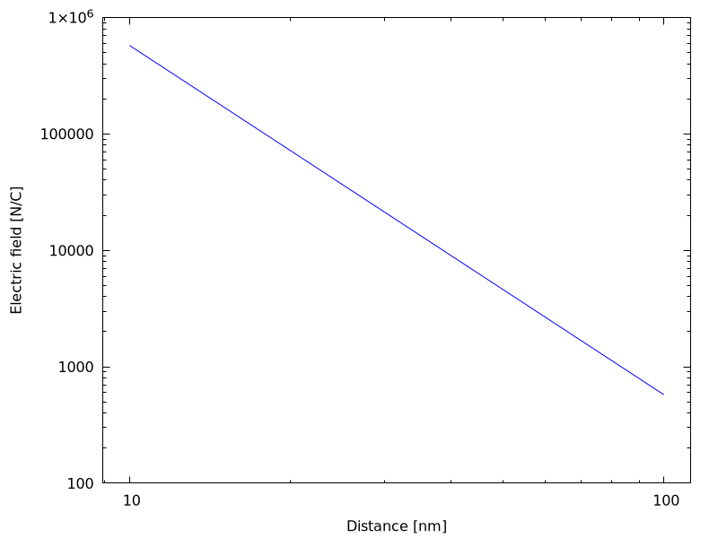
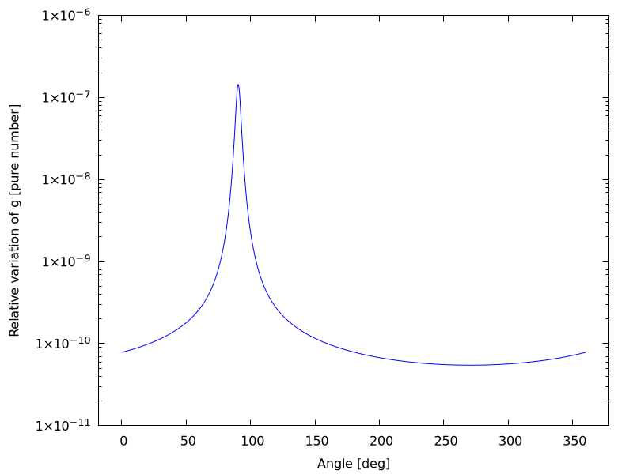

---
title: "Lezione 5: Classi ed ereditarietà"
author: 
- "Leonardo Carminati"
- "Maurizio Tomasi"
date: "A.A. 2021−2022"
lang: it-IT
header-includes: <script src="./fmtinstall.js"></script>
...

[La pagina con la spiegazione originale degli esercizi si trova qui: <https://labtnds.docs.cern.ch/Lezione5/Lezione5/>.]

In questa quinta lezione vogliamo affrontare un semplice problema di elettrostatica utilizzando un codice numerico. In particolare, vogliamo calcolare il campo elettrico generato da un dipolo (e idealmente anche un generico multipolo). Nell'affrontare questo problema fisico approfondiremo il concetto di ereditarietà in C++. Come al solito dovremo preparare un set di classi utili per lo svolgimento dell'esercizio.

# Esercizio 5.0 - Creazione della classe Posizione {#esercizio-5.0}

Implementare una classe `Posizione` che descriva un punto nello spazio
      tridimensionale seguendo queste indicazioni:

#.  Come data membri privati usare la terna di coordinate cartesiane.
#.  Definire un costruttore di default che crei un punto di coordinate (0,0,0).
#.  Definire un costruttore che abbia come argomento una terna di `double` corrispondenti alle coordinate del punto.
#.  Definire metodi per restituire le coordinate del punto in sistemi di coordinate cartesiane, sferiche e cilindriche.
#.  Definire un metodo che calcoli la distanza da un altro punto.

Verificare il funzionamento della classe creando un programmino che legga da riga di comando le coordinate cartesiane di un punto e ne stampi le
    coordinate in un sistema di coordinate sferiche e cilindriche.

## Header file della classe

Nell'header file `posizione.h` vanno dichiarati tutti i metodi ed i data membri. Si noti come i data membri siano tutti privati: questa modo di disegnare le classi implementa il concetto di incapsulamento e *data hiding* in C++.

Un paio di punti già che vale la pena ricordare:

#.  Il qualificatore const dopo la dichiarazione di una funzione informa che la funzione non modificherà il contenuto dell'oggetto. In maniera simile il qualificatore const nell'argomento di `Distanza` specifica che il metodo `Distanza` non modificherà il suo argomento. È sempre utile specificare esplicitamente queste proprietà dei metodi.
#.  L'insieme dell direttive `#ifndef`, `#define`, `#endif` serve per proteggersi da inclusioni incrociate (molto comuni quando si utilizzano diverse classi che interagiscono tra di loro). [Nelle [slide](./tomasi-lezione-02.html#pragma-once) abbiamo però visto che `#pragma once` è un modo più semplice di ottenere lo stesso risultato che mette al riparo da una serie di errori].

```c++
#pragma once

class Posizione {
public:
  // costruttori
  Posizione();
  Posizione(double x, double y, double z);

  // distruttore
  ~Posizione();

  // metodi
  double getX() const; // Coordinate cartesiane
  double getY() const;
  double getZ() const;
  double getR() const; // Coordinate sferiche
  double getPhi() const;
  double getTheta() const;
  double getRho() const; // raggio delle coordinate cilindriche
  double Distanza(const Posizione &) const; // distanza da un altro punto

private:
  double m_x, m_y, m_z;
};
```

## File di implementazione delle classe

Qui vediamo un esempio di implementazione della classe (file `posizione.cpp`). Per prima cosa sono definiti i costruttori ed un distruttore, che in questo caso può esser vuoto.

```c++
#include "posizione.h"
#include <cmath>

// costruttore di default
Posizione::Posizione() : m_x{}, m_y{}, m_z{} {}

// costruttore a partire da una terna cartesiana
Posizione::Posizione(double x, double y, double z) : m_x{x}, m_y{y}, m_z{z} {}

// distruttore (puo' essere vuoto)
Posizione::~Posizione() {}
```

E successivamente sono implementati tutti i metodi descritti nell'header file:

```c++
// Coordinate cartesiane

double Posizione::getX() const { return m_x; }
double Posizione::getY() const { return m_y; }
double Posizione::getZ() const { return m_z; }

// Coordinate sferiche

double Posizione::getR() const {
  return sqrt(m_x * m_x + m_y * m_y + m_z * m_z);
}

double Posizione::getPhi() const { return atan2(m_y, m_x); }

double Posizione::getTheta() const { return acos(m_z / getR()); }

// raggio delle coordinate cilindriche

double Posizione::getRho() const { return sqrt(m_x * m_x + m_y * m_y); }

// distanza da un altro punto
double Posizione::Distanza(const Posizione &b) const {
  return sqrt(pow(getX() - b.getX(), 2) + 
              pow(getY() - b.getY(), 2) +
              pow(getZ() - b.getZ(), 2));
}
```

## Incapsulamento e *data hiding*

Proviamo ad utilizzare l'esempio della classe `Posizione` per riflettere sul concetto di *incapsulamento*. La nostra classe “nasconde” i dati principali (le tre coordinate nel caso specifico) in un set di data-membri privati. Tali data-membri non sono per definizione accessibili al programma principale in modo diretto ma solo attraverso una serie di metodi pubblici (interfacce) che proteggono il dato da un utilizzo incontrollato. Inoltre la protezione del dato dietro interfacce pubbliche mette al riparo da possibili cambiamenti o correzioni nel design di una classe: supponiamo che per qualche ragione l'autore della classe decida che è meglio rappresentare la posizione utilizzando una terna di numeri che corrispondono alle coordinate sferiche. Se l'autore della classe adegua di conseguenza le interfacce pubbliche, un eventuale utilizzatore della classe (il nostro `main`) non si accorgerebbe della variazione. Se invece il main avesse avuto libero accesso alle tre coordinate e le avesse utilizzate direttamente, il cambiamento di design della classe avrebbe richiesto rendendo pesanti cambiamenti anche nel main.

## Esempio di programma

(Scarica un esempio [qui](./codici/esercizio5.0.cpp)).

Questo programma utilizza la nuova classe appena creata: richiede di fornire come argomenti le tre coordinate cartesiane e poi stampa le terne di coordinate cartesiane, sferiche e cilindriche. Il programma è pensato per usare la libreria [`fmt`](https://github.com/fmtlib/fmt), che potete installare usando lo script [`install_fmt_library`](./install_fmt_library): scaricatelo nella directory dell'esercizio ed eseguitelo con `sh install_fmt_library`, oppure eseguite questo comando:

<input type="text" value="curl https://ziotom78.github.io/tnds-tomasi-notebooks/install_fmt_library | sh" id="installFmtCommand" readonly="1" size="60"><button onclick='copyFmtInstallationScript("installFmtCommand")'>Copia</button> 

(Se invece usate Windows, scaricate questo [file zip](./fmtlib.zip) nella directory dell'esercizio e decomprimetelo). Le istruzioni dettagliate sono qui: [index.html#fmtinstall](index.html#fmtinstall).

Questo è il codice sorgente del programma:

```c++
#include "posizione.h"

// Installarla con ./install_fmt_library
#include "fmtlib.h"

#include <iostream>
#include <string>

using namespace std;

// Questo programma vuole com input da riga di comando le coordinate
// X, y e z di un punto e ne restituisce le coordinate sferiche
// e cilindiriche.

int main(int argc, char *argv[]) {
  // Controlla gli argomenti
  if (argc != 4) {
    std::cerr << "Usage: " << argv[0] << " <x> <y> <z>" << endl;

    return -1;
  }
  double x{stod(argv[1])};
  double y{stod(argv[2])};
  double z{stod(argv[3])};

  // Crea un oggetto posizione ed accede ai vari metodi

  Posizione P{x, y, z};
  
  fmt::print("Coordinate cartesiane: [x = {}, y = {}, z = {}]\n",
             P.getX(), P.getY(), P.getZ());
  fmt::print("Coordinate cilindriche: [ρ = {}, φ = {}, z = {}]\n",
             P.getRho(), P.getPhi(), P.getZ());
  fmt::print("Coordinate sferiche: [R = {}, φ = {}, θ = {}]\n",
             P.getR(), P.getPhi(), P.getTheta());
}
```


# Esercizio 5.1 - Creazione della classe Particella ed Elettrone {#esercizio-5.1}

Incominciamo a definire due classi che ci permetteranno di rappresentare le sorgenti del campo (elettrico in questo caso).

-   Costruiamo una classe `Particella` caratterizzata dall'avere una massa ed una carica, quindi dotata dei seguenti metodi:

    #.  Un construttore avente come argomenti massa e carica.
    
    #.  Dei metodi di accesso ai valori di massa e carica.
    
    #.  Un metodo per stampare tali valori. 
    
-   Siccome vogliamo che questa classe sia la classe base di altre classi, dichiareremo i data membri come *protected*.

-   Costruiamo, attraverso il meccanismo di ereditarietà, una classe derivata `Elettrone` che, essendo una `Particella` di massa e carica note (i cui valori sono riportati su [wikipedia](http://it.wikipedia.org/wiki/Elettrone)), ha il solo costruttore di default, che inizializza correttamente i data membri. Modifichiamo il metodo di stampa in modo che indichi che si tratta di un elettrone.

Verifichiamo che le nuovi classi e l'ereditarietà funzioni correttamente:

#.  Istanziamo dinamicamente un oggetto per ogni classe.
#.  Verifichiamo che su tutti questi operano i metodi accessori di massa e carica di `Particella`, ma il metodo di stampa delle classi derivate. 


## Brevi Richiami

File header `particella.h` per la classe `Particella`:

```c++
#pragma once

// Classe astratta per una generica particella
// Definisce i metodi che ogni particella
// deve implementare e delle funzioni di utilizzo generale.

class Particella {
public:
  // costruttori
  Particella();
  Particella(double massa, double carica);

  // distruttore
  ~Particella();

  // metodi

  double GetMassa() const { return m_massa; }
  double GetCarica() const { return m_carica; }
  void Print() const;

protected:
  double m_massa;
  double m_carica;
};
```

Implementazione:

```c++
// Metodi per la classe base

Particella::Particella(double massa, double carica) : m_massa{massa}, m_carica{carica} {}

Particella::~Particella() {}

void Particella::Print() const {
  fmt::print("Particella: m = {}, q = {}", m_massa, m_carica);
}
```

Classe `Elettrone`:

```c++
// Implementazione concreta di una particella elementare
// In questo caso tutte le proprietà della particella
// sono costanti, definite nel costruttore di default.

class Elettrone : public Particella {
public:
  // Costruttore
  Elettrone() : Particella{9.1093826e-31, -1.60217653e-19} {}

  // Distruttore
  ~Elettrone() {}

  void Print() const {
      fmt::print("Elettrone: m = {}, q = {}", m_massa, m_carica);
  }
};
```

## Esempio di programma

(Scarica un esempio [qui](codici/esercizio5.1.cpp))

Questo programma utilizza le nuove classi appena create. Verifica il funzionamento dell'ereditarietà e la dereferenziazione dei puntatori a classe.

```c++
#include "fmtlib.h"
#include "particella.h"
#include <iostream>

using namespace std;

int main() {
  Particella *a{new Particella{1., 1.6E-19}};
  Elettrone *e{new Elettrone{}};

  // Metodi della classe base
  fmt::print("Particella con massa {} kg e carica {} C\n", a->GetMassa(),
             a->GetCarica());
  a->Print();

  // Metodi della classe derivata
  fmt::print("Elettrone con massa {} kg e carica {} C\n", e->GetMassa(),
             e->GetCarica());
  e->Print();

  Particella b{*a}; // costruisco una Particella a partire da una Particella
  Particella d{*e}; // costruisco una Particella a partire da un Elettrone
  Elettrone f{d};   // costruisco un Elettrone a partire da una Particella
}
```

Il programma di esempio contiene un errore, lo trovate?

# Esercizio 5.2 - Creazione delle classi `CampoVettoriale` e `PuntoMateriale` {#esercizio-5.2}

Per risolvere problemi relativi all'elettrostatica o alla gravità proviamo ad effettuare una modellizzazione basata su due elementi principali: una rappresentazione del campo vettoriale e una rappresentazione delle sorgenti dei campi vettoriali.

-   La classe `CampoVettoriale` (scarica l'header file [qui](./codici/campovettoriale.h)): sono molti i casi in Fisica in cui un vettore è collegato ad un punto dello spazio. Ad esempio una forza ha un punto di applicazione, o i vettori del campo elettrico e campo gravitazionale hanno un valore che varia da punto a punto dello spazio.
 -  Costruire una classe `CampoVettoriale`, che erediti dalla classe `Posizione` :
    #.  aggiungere le tre componenti di un vettore alla posizione;
    #.  implementare i metodi per accedere e/o modificare il vettore;
    #.  decidere quali costruttori implementare, in particolare, implementare un costruttore `CampoVettoriale(const Posizione&)` che crei un vettore nullo nella posizione assegnata;
    #.  implementare un metodo `double Modulo()` che restituisca la lunghezza del vettore;
    #.  fare overloading di `operator+` e `operator+=` in modo da poter facilmente sommare campi. 

    Header file della classe `CampoVettoriale`:
    
    ```c++
    #pragma once

    #include "posizione.h"

    class CampoVettoriale : public Posizione {
    public:
      CampoVettoriale(const Posizione &);
      CampoVettoriale(const Posizione &,
                      double Fx, double Fy, double Fz);
      CampoVettoriale(double x, double y, double z,
                      double Fx, double Fy, double Fz);
      ~CampoVettoriale();

      CampoVettoriale &operator+=(const CampoVettoriale &);
      CampoVettoriale operator+(const CampoVettoriale &) const;

      double getFx() const { return m_Fx; }
      double getFy() const { return m_Fy; }
      double getFz() const { return m_Fz; }
      double Modulo() const;

    private:
      double m_Fx, m_Fy, m_Fz;
    };
    ```
    
-   La classe `PuntoMateriale` (scarica l'header file [qui](./codici/puntomateriale.h)): questa classe ci servirà per rappresentare le sorgenti dei campi. Costruire la classe in modo che erediti da entrambe le classi `Particella` e `Posizione`.
    #.  Implementare i costruttori che pensate siano utili.
    #.  Implementare il metodo `CampoVettoriale CampoElettrico(const Posizione&) const` che restituisca il campo elettrico generato dal `PuntoMateriale` nel punto `r` (per i più volenterosi anche il metodo `CampoVettoriale CampoGravitazionale(const Posizione&) const` che restituisca il campo gravitazionale generato dal `PuntoMateriale` nel punto `r`). 

    Header file della classe `PuntoMateriale`:

```c++
#pragma once

#include "particella.h"
#include "posizione.h"

#include "campovettoriale.h"

class PuntoMateriale : public Particella, Posizione {
public:
  PuntoMateriale(double massa, double carica, const Posizione&);
  PuntoMateriale(double massa, double carica, double x, double y, double z);

  ~PuntoMateriale();

  CampoVettoriale CampoElettrico(const Posizione&) const;
  CampoVettoriale CampoGravitazionale(const Posizione&) const;
};
```

N.B.: per entrambe le classi di cui sopra, sentitevi liberi di aggiungere tutti i metodi addizionali che ritenete utili per risolvere questo esercizio o i successivi.

## Brevi Richiami

### Ereditarietà multipla

In C++, una classe può ereditare da più di una classe madre. In questo caso mantiene le proprietà (metodi e data membri) di tutte le classi madri.
Nell'header file `puntomateriale.h` vanno elencate tutte le classi da cui si vuole ereditare, specificando se sono pubbliche o private:

```c++
#pragma once

#include "particella.h"
#include "posizione.h"

#include "campovettoriale.h"

class PuntoMateriale : public Particella, Posizione {
    // …
};
```

La nuova classe avrà, per esempio, definiti sia i metodi `GetMassa()` e `GetCarica()` di `Particella` ed anche `X()`, `R()`… di `Posizione`.

### Utilizzo di costruttori delle classi madri

Specialmente nel caso di ereditarietà multipla, è utile, e spesso necessario, utilizzare i costruttori già esistenti della classe madre.

Tali costruttori possono venire chiamati esplicemente dando il nome della classe madre seguito dagli argomenti opportuni. Ad esempio, siccome esistono i costruttori di `Posizione` con le tre coordinate cartesiane, e di `Particella` con massa e carica, possiamo definire un costruttore:

```c++
PuntoMateriale(double massa, double carica, double x, double y, double z);
```

la cui implementazione può venire data da:

```c++
PuntoMateriale::PuntoMateriale(double massa, double carica,
                               double x, double y, double z)
  : Particella{massa, carica}, Posizione{x, y, z} {
}
```

### Overloading operatori

Per risolvere facilmente questo tipo di problemi è molto utile ridefinire gli operatori `operator=` e `operator+=` per la classe `CampoVettoriale`. Di seguito una possibile implementazione comoda di questo overloading. Notate che nell'operatore `operator+` viene creato un nuovo vettore (somma) che viene restituito *by value*. Per `operator+=` invece la modifica viene effettuata sull'oggetto che chiama l'operatore. L'oggetto stesso (modificato) viene poi restituito *by reference*.

```c++
CampoVettoriale CampoVettoriale::operator+(const CampoVettoriale & v) const {
  return CampoVettoriale{GetX(), GetY(), GetZ(),
                         GetFx() + v.GetFx(),
                         GetFy() + v.GetFy(),
                         GetFz() + v.GetFz()};
}

// Ricordare che, se `v` e `w` sono due oggetti di tipo `CampoVettoriale`, allora
//
//    v += w;
//
// viene considerato dal compilatore C++ come
//
//    v.operator+=(w);
//
// Nel metodo qui sotto, la variabile `v` dell'esempio corrisponde a `*this`.
CampoVettoriale & CampoVettoriale::operator+=(const CampoVettoriale & w) {
  return (*this) = (*this) + w;
}
```


# Esercizio 5.3 - Calcolo del campo elettrico generato da un dipolo (da consegnare) {#esercizio-5.3}

Realizzate un programma che costuisca un dipolo costituito da un elettrone e un protone posizionati ad una distanza $\delta = 10^{-10}\,\text{m}$ e determini:

#.  il valore del campo elettrico di dipolo prodotto in un punto $P$ le cui coordinate sono inserite da linea di comando;
#.  disegni l'andamento del modulo del campo elettrico lungo l'asse del dipolo per una distanza da 100 a 1000 volte $\delta$. Che tipo di andamento ha il campo? (Fate riferimento all'approfondimento seguente sulle [leggi di potenza](#leggi-di-potenza)).

## Esempio di programma

Questo programma utilizza le nuove classi appena create: richiede di fornire come argomenti le tre coordinate cartesiane e poi stampa il campo elettrico di dipolo richiesto dall'esercizio [primo punto]:

```c++
#include "puntomateriale.h"
#include "campovettoriale.h"

#include <iostream>
#include <string>
#include "fmtlib.h"         // Usa la libreria "fmt::" del C++20

using namespace std;

int main(int argc, char * argv[]) {
  if (argc != 4) {
      fmt::print(stderr, "Usage: {} <x> <y> <z>\n", argv[0]);
      exit(-1);
  }

  double x{stod(argv[1])};
  double y{stod(argv[2])};
  double z{stod(argv[3])};
  Posizione r{x,y,z};

  const double e{1.60217653E-19};
  const double me{9.1093826E-31};
  const double mp{1.67262171E-27};
  const double d{1.E-10};

  PuntoMateriale elettrone{me, -e, 0, 0,  d / 2};
  PuntoMateriale protone  {mp,  e, 0, 0, -d / 2};

  CampoVettoriale E{elettrone.CampoElettrico(r) + protone.CampoElettrico(r)};
  fmt::print("E = ({}, {}, {}) N/C\n", E.getFx(), E.getFy(), E.getFz());
}
```

## Creazione di plot

Potete fare riferimento a [questa spiegazione](http://labmaster.mi.infn.it/Laboratorio2/labTNDS/lectures_1819/lezioneROOT_1819.html) per produrre un grafico dell'andamento del campo usando la classe `TGraph` di ROOT.

In alternativa potete usare [gplot++](https://github.com/ziotom78/gplotpp), che funziona sotto Mac e Linux ed è semplice da installare anche sotto Windows. Dovete innanzitutto [installare Gnuplot](https://github.com/ziotom78/gplotpp#installing-gnuplot-and-gploth), seguendo in particolare [questa avvertenza](https://github.com/ziotom78/gplotpp#windows) se usate Windows. Una volta installato Gnuplot, scaricate nella directory del vostro esercizio il file [`gplot++.h`](https://raw.githubusercontent.com/ziotom78/gplotpp/master/gplot%2B%2B.h), oppure se usate Linux o Mac eseguite questa linea di comando nella directory del vostro esercizio:

<input type="text" value="curl 'https://raw.githubusercontent.com/ziotom78/gplotpp/master/gplot%2B%2B.h' > gplot++.h" id="installGplotpp" readonly="1" size="60"><button onclick='copyFmtInstallationScript("installGplotpp")'>Copia</button> 


Per produrre un grafico di $E = E(r)$ con [gplot++](https://github.com/ziotom78/gplotpp), dovete salvare le ascisse e le ordinate dei punti del grafico in due `std::vector`, e poi chiamare il metodo `Gnuplot::plot(x, y)`. 

Di seguito viene riportato un esempio:

```c++
#include "fmtlib.h"
#include "gplot++.h"

// ...

using namespace std;

const double delta = 1e-10;

// Siccome questo programma non richiede di leggere parametri dalla linea di
// comando, non c'è bisogno di specificare "argc" e "argv". (Se lo faceste,
// il compilatore probabilmente emetterebbe qualche tipo di warning, perché
// l'argomento è stato dichiarato ma mai usato).
int main() {
  vector<double> d_vec; // Vettore delle distanze (asse x)
  vector<double> E_vec; // Vettore dei moduli del campo elettrico (asse y)

  // Questo ciclo "for" calcola il valore del campo per 90 punti,
  // da 100δ a 1000δ in passi di 10δ
  for (double dist = 100 * delta; dist <= 1000 * delta; dist += 10 * delta) {
    // Il vettore `d_vec` è usato per la stampa a video e il plot, non per i
    // calcoli, quindi è meglio salvare il dato in nm anziché m (è più leggibile).
    d_vec.push_back(dist * 1e9);

    // Inserire qui il codice che calcola il modulo del campo alla distanza
    // `dist`
    double e_field = ...;

    E_vec.push_back(e_field);

    // Stampa anche a video: è sempre bene farlo per controllare i numeri!
    fmt::print("{:.5e} {:.5e}\n", dist, e_field);
  }

  Gnuplot plt{};

  // Togliere questa riga se si preferisce che il grafico appaia in una finestra
  // interattiva (consigliato sul proprio computer o su quelli del laboratorio,
  // sconsigliato se si usa Repl.it)
  plt.redirect_to_png("esercizio05.3.png");

  // Disegna le ascisse usando una scala bilogaritmica, così che y ∝ 1/r³ viene
  // trasformato in una legge lineare y' = ξ − 3r', con y' = log(y), r' = log(r).
  plt.set_logscale(Gnuplot::AxisScale::LOGXY);
  plt.set_xlabel("Distance [nm]");
  plt.set_ylabel("Electric field [N/C]");

  plt.plot(d_vec, E_vec);

  // Ricordarsi di chiamarlo, altrimenti il grafico non verrà salvato/visualizzato
  plt.show();
}
```

Questo è il risultato atteso:



Notare che la pendenza della retta sul grafico bilogaritmico è −3: per un ordine di grandezza in più sull'asse $x$ (da 10 a 100&nbsp;nm) ci sono tre ordini di grandezza in meno (da $5 \times 10^5$ a $500\,\text{N/C}$) sull'asse $y$. Questo corrisponde al fatto che se $r \gg \delta$ allora
$$
\left|E_\text{dipolo}(r)\right| = \left|k\frac{q^+}{(r + \delta)^2} + k\frac{q^-}{(r - \delta)^2}\right|
= \left|k\frac{e}{(r + \delta)^2} - k\frac{e}{(r - \delta)^2}\right| \approx \frac{4 k e \delta}{r^3} \propto r^{-3}.
$$

# Esercizio 5.4 - Campo di multipolo (approfondimento) {#esercizio-5.4}

Scrivere un programma che calcoli il campo elettrico generato da un multipolo di ordine $n$.
In questo esercizio, un $n$-polo (con $n$ pari) è una distribuzione di n particelle, in cui la particella $k$-esima ha carica $(-1)^k e$, dove $e$ è la carica del protone, e si trova nel punto
$$
P_k = \left(r_0 \cos\left(\frac{2\pi k}n\right), r_0 \sin\left(\frac{2\pi k}n\right)\right)
$$
dove $r_0$ è il raggio a cui sono messe le cariche.

Verificare che a grande distanza ($R \gg r_0$) il campo elettrico varia proporzionalmente a $R^{-2 - n/2}$.

Valutare fino a quali valori di $n$ si riesce a verificare questa dipendenza.

Questo è un problema abbastanza interessante, perché bisogna scegliere una distanza abbastanza grande perché sia valido il comportamento asintotico, ma abbastanza ridotta per evitare problemi di arrotondamento nella somma di molti termini di segno contrario.


# Esercizio 5.5 - Gravità dallo spazio (approfondimento) {#esercizio-5.5}

Il [satellite GOCE](http://www.goceitaly.asi.it/GoceIT/) si trova in orbita a 250 km dalla superficie terrestre e dotato di accelerometri in grado di misurare variazioni dell'accelerazione di gravità fino a $\delta g / g = 10^{-13}$.

Scopo della missione (si veda [questo articolo](http://www.goceitaly.asi.it/GoceIT/images/stories/GOCE/Publications/064-071%20GOCE-Di%20Giorgio.pdf) su [Le Scienze](http://lescienze.espresso.repubblica.it/)) include una mappatura dettagliata del campo gravitazionale terrestre, prodotto dalle distribuzioni non omogenee di massa.
Costruire un programma che :

#.  calcoli l'accelerazione di gravità sul satellite per una Terra perfettamene sferica e dimensioni pari al raggio medio ([wikipedia](http://it.wikipedia.org/wiki/Terra)).
#.  calcoli la variazione relativa di g prodotta da una catena montuosa, schematizzata come una fila di 100 sfere di 1&nbsp;km di raggio poste sopra la superficie media della Terra (usare 3000&nbsp;kg/m³ come densità della roccia) e produca un grafico della variazione in funzione della posizione del satellite sull'orbita.

Per risolvere questo esercizio si costruisca dapprima il sistema di sorgenti di campo (Terra e catena montuosa). Si calcoli il campo generato da tutte le sorgenti in un punto a distanza dal centro della terra pari al raggio terrestre più la distanza del satellite dalla superficie terrestre. Muovere questo punto in modo che percorra tutta l'orbita (in passi da 10&nbsp;Km).


## Leggi di potenza {#leggi-di-potenza}

Se un campo ha un andamento $E = k R^\alpha$, se valutiamo il campo in due punti diversi $R_1$ e $R_2$, possiamo ricavare $\alpha$ dalla relazione:
$$
\alpha = \frac{\log(E_1 / E_2)}{\log(R_1 / R_2)}.
$$

## Grafici

Nel creare un grafico dell'andamento della distorsione dell'accelerazione gravitazionale $\delta g / g$ è meglio usare la scala logaritmica sull'asse $y$, visto che il valore di $\delta g/g$ varia di diversi ordini di grandezza:



La posizione del picco dipende dal punto rispetto all'angolo zero in cui sono state poste le sfere che rappresentano la catena montuosa. Nel grafico qui sopra, la montagna $k$-esima è stata posta ad un angolo $\theta_k = 90^\circ + k \delta\theta$, con $k = 0\ldots 99$ e $\delta\theta = 1\,\text{km} / 2\pi R_T$ l'incremento angolare associato a sfere di raggio 1&nbsp;km e poste sulla superficie terrestre, con $R_T$ raggio medio della Terra.


# Errori comuni

Come di consueto, elenco alcuni errori molto comuni che ho trovato negli anni passati correggendo gli esercizi che gli studenti hanno consegnato all'esame:

-   L'errore di gran lunga più comune è sbagliare l'implementazione della formula del campo, che oggettivamente è complicata! Riguardate in particolare queste cose:

    #.   Unità di misura delle costanti;
    
    #.   Attenzione a come scrivete i numeri in notazione scientifica! Il numero $10^{-4}$ si scrive `1e-4`, **non** `10e-4`, perché la scrittura `1e-4` indica effettivamente $1 \times 10^{-4}$, così come
           7.5e-3 indica $7.5\times 10^{-3}$.
    
    #.   Verificate che ciò che deve stare al numeratore stia veramente al numeratore, e idem per il denominatore!
    
    #.   Ovviamente, il campo di una singola carica deve andare come $1/r^2$! Eppure un bel po' di studenti consegnano codice che non segue neppure questa semplice proprietà…
    
    #.   Quando calcolate la distanza $d$ tra due posizioni, assicuratevi di restituire $d$ e non $d^2$ (quante volte l'ho visto negli esercizi!).

-   Stranamente, ogni anno più di uno studente sbaglia a implementare `operator+` per i vettori, e invece di calcolare `v + w` calcola in realtà `v + v = 2v`, oppure `w + w = 2w`.

-   Nel leggere la posizione `x y z` a cui calcolare il campo del dipolo da linea di comando, assicuratevi di usare la funzione [`std::stod`](https://en.cppreference.com/w/cpp/string/basic_string/stof) oppure [`std::atof`](https://cplusplus.com/reference/cstdlib/atof/), anziché `std::stoi` o `std::atoi`, perché queste ultime due restituiscono valori interi.
