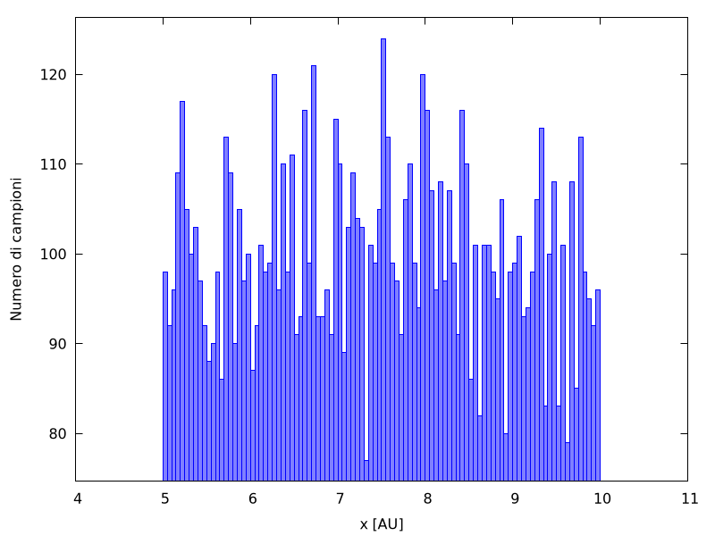
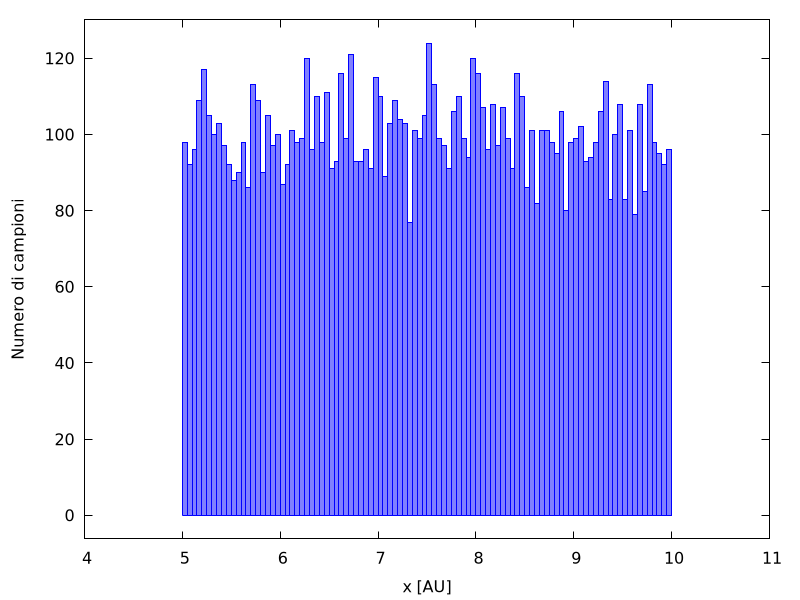

---
title: "Lezione 10: Numeri casuali"
author:
- "Leonardo Carminati"
- "Maurizio Tomasi"
date: "A.A. 2021−2022"
lang: it-IT
header-includes: <script src="./fmtinstall.js"></script>
...

[La pagina con la spiegazione originale degli esercizi si trova qui: [labmaster.mi.infn.it/Laboratorio2/labTNDS/lectures_1819/lezione10_1819.html](http://labmaster.mi.infn.it/Laboratorio2/labTNDS/lectures_1819/lezione10_1819.html).]

In questa lezione impareremo a costruire un generatore di numeri casuali. Lo utilizzeremo quindi per generare numeri secondo una distribuzione uniforme, esponenziale e Gaussiana. Come applicazione utilizzeremo la generazione di numeri casuali per calcolare numericamente integrali mono e multi-dimensionali.

# Esercizio 10.0 - Generatore di numeri casuali (da consegnare) {#esercizio-10.0}

Scrivere un programma che produca quattro istogrammi contenenti ciascuno 10000 numeri pseudo-casuali estratti da:

#.  una distribuzione uniforme tra 5 e 10.
#.  una distribuzione esponenziale tra 0 e +∞ con costante $k=1$.
#.  una distribuzione gaussiana centrata in 1 e larghezza 1 con il metodo di Box-Muller.
#.  una distribuzione gaussiana centrata in 1 e larghezza 1 con il metodo accept-reject. 

Per risolvere questo esercizio si può seguire lo schema seguente:

-   Scrivere una classe opportuna per la generazione di numeri casuali. La classe dovrà contenere un metodo che implementi un generatore lineare congruenziale di base e tutti i metodi necessari per le distribuzioni richieste.

    Header file della classe `RandomGen`:

    ```c++
    #pragma once

    class RandomGen {
    public:
      RandomGen(unsigned int seed);
      void SetA(unsigned int a) { m_a = a; }
      void SetC(unsigned int c) { m_c = c; }
      void SetM(unsigned int m) { m_m = m; }

      double Rand();
      double Unif(double xmin, double xmax); // distribuzione uniforme
      double Exp(double mean); // distribuzione esponenziale
      double Gaus(double mean, double sigma); // distribuzione gaussiana (Box-Muller)
      double GausAR(double mean, double sigma); // distribuzione gaussiana (Accept-Reject)

    private:
      unsigned int m_a, m_c, m_m;
      unsigned int m_seed;
    };
    ```

    Il costruttore si farà carico di inizializzare i parametri del generatore ai valori `m_a = 1664525`, `m_c = 1013904223` e `m_m = 1 << 31`.

-   Preparare un semplice `main` per provare le funzionalità della classe RandomGen. Lo schema di massima potrebbe essere il seguente:

    ```c++
    #include <iostream>
    #include <vector>
    #include "randomgen.h"
    #include "gplot++.h"

    using namespace std;

    int main() {
      // Implementate questa funzione per verificare che i vostri
      // generatori funzionino; fate riferimento alla pagina
      //
      //   https://ziotom78.github.io/tnds-notebooks/lezione10/
      //
      // per sapere quali numeri usare negli assert
      test_random_numbers();
      
      RandomGen myGen{1};
      vector<double> samples(10000); // Usare parentesi tonde () e non graffe {} qui!
      
      for(size_t k{}; k < samples.size(); k++) {
          samples[k] = myGen.Unif(5, 10);
          // Stampa i primi 10 valori per controllo
          if (k < 10)
              cout << samples[k] << endl;
      }

      const int nbins{100};  // Numero di barre nell'istogramma

      Gnuplot plt{};
      plt.redirect_to_png("uniforme.png");
      
      // Per produrre i quattro grafici nella stessa immagine, secondo
      // una matrice 2×2, si può usare il comando
      //
      //   plt.multiplot(2, 2);
      //
      // e poi invocare i comandi qui sotto quattro volte: ogni volta
      // che si invoca `plt.show()`, Gnuplot avanza al plot successivo
      
      plt.set_xrange(4, 11);
      plt.set_xlabel("x [AU]");
      plt.set_ylabel("Numero di campioni");
      plt.histogram(samples, nbins);
      plt.show();
    }
    ```

    Il programma usa [gplot++](https://github.com/ziotom78/gplotpp), installabile con i soliti comandi descritti [qui](./index.html#gplotinstall).
    
    Se eseguite il programma, otterrete questo grafico, non molto incoraggiante:
    
    <center></center>
    
    I dati non sembrano affatto essere distribuiti uniformemente! Il problema è che per default Gnuplot sceglie una scala per l'asse $y$ che non parte da zero, e questo distorce l'aspetto del grafico. Dobbiamo quindi forzarlo a partire da zero con il metodo `plt.set_yrange`:
    
    ```c++
    // Nel main visto sopra
    
    // …
    plt.set_xrange(4, 11);
    plt.set_yrange(0, NAN);
    // …
    ```
    
    Passare `NAN` come estremo superiore indica a Gnuplot che ci va bene che sia lui a calcolare il valore ottimale per l'estremo superiore, perché a noi interessa indicare solo l'estremo inferiore. Il risultato diventa questo:

    <center></center>
    
-   Se invece volete usare ROOT, aggiungete in coda al `main` qualcosa di simile:

    ```c++
    TApplication app{"app", 0, 0};
    TH1F unif{"Uniforme", "Uniforme", 100, 4, 11};
    
    for(double sample : samples) {
        unif.Fill(samples);
    }

    TCanvas can2("Uniforme", "Uniforme") ;
    can2.cd();
    unif.GetXaxis()->SetTitle("x [AU]");
    unif.GetYaxis()->SetTitle("Numero di campioni");
    unif.Draw();

    app.Run();
    ```


## Generatore Lineare congruenziale

I generatori lineari congruenziali generano una sequenza di interi pseudocasuali utilizzando la sequente formula:

$$
n_i = \mathrm{mod}(a \cdot n_{i - 1} + c, m)
$$

Quindi è necessario tenere in memoria il valore del numero intero generato al passaggio precedente. Alla prima iterazione, $n_0 = \text{seed}$.

Per ottenere un numero floating point uniformemente distribuito tra 0 e 1 (con 1 escluso) è sufficiente richiedere:
$$
d_i = n_i / m.
$$

Ricordiamo che in C++ l'operazione mod può essere eseguita con l'operatore `%`, che ritorna il resto della divisione (intera), per cui

```c++
7 % 5 = 2
```

## Generatore esponenziale

Per generare numeri pseudo-casuali secondo la densità di probabilità esponenziale $p(x) = \lambda e^{-\lambda x}$ (per $x \geq 0$) si può facilmente invertire la funzione cumulativa di $p(x)$. A partire da un numero $y$ estratto secondo la distribuzione uniforme tra 0 e 1, il numero
$$
x = - \frac1{\lambda} \log(1 - y)
$$
è distribuito proprio come la distribuzione esponenziale $p(x)$.


## Metodo di Box Muller

Siano $x$ e $y$ due variabili indipendenti distribuite normalmente (Gaussiana con media 0 e sigma 1). L'espressione della loro distribuzione di probabilità (PDF) in due dimensioni è

$$
P(x,y) = 1/2 \exp\left(-\frac{x^2 + y^2}2\right).
$$

Passando alle coordinate polari:
$$
\begin{aligned}
x &= r \cos\theta,\\
y &= r \sin\theta,
\end{aligned}
$$
si ha
$$
P(R, \theta) = \frac12 \exp\left(- \frac{r^2}2\right).
$$
Se calcoliamo l'integrale di tale PDF per $r \in [0, R]$ e $\theta \in [0, 2\pi]$, otteniamo
$$
p = 1 - \exp\left(-\frac{R^2}2\right),
$$
e $p \in [0, 1]$. Invertendo questa formula otteniamo
$$
R = \sqrt{-2\log(1 - p)}.
$$
Definendo ora $s$ e $t$ come due variabili casuali distribuite uniformemente in [0,1], abbiamo
$$
\begin{aligned}
R &= \sqrt{-2 \log (1 - s)},\\
\theta &= 2\pi t,
\end{aligned}
$$
per cui la variabile $x$ distribuita normalmente può essere generata a partire da una coppia $s$ e $t$ distribuita uniformemente in $[0,1]$, secondo la formula
$$
x = \sqrt{-2\log s} \cdot \cos{2\pi t}.
$$
Da ciò segue banalmente la generalizzazione nel caso di variabile $x$ distribuita gaussianamente con media $\mu$ e larghezza $\sigma$:
$$
x = \mu + \sigma\cdot \sqrt{-2\log s} \cdot \cos{2\pi t}.
$$

Qui sotto trovate una implementazione di tale metodo:

```c++
double RandomGen::Gaus(double mean, double sigma) {
  double s{Rand()};
  double t{Rand()};
  double x{sqrt(-2 * log(s)) * cos(2 * M_PI * t)};
  return mean + x * sigma;
}
```

## Metodo Accept-Reject

Il metodo accept-reject può essere utilizzato per generare numeri casuali distribuiti secondo qualsivoglia forma funzionale. Consideriamo di voler generare numeri nell'intervallo $[a, b]$ secondo la distribuzione $f(x)$ in figura:


Il metodo si basa sulla generazione di una coppia di numeri $x \in [a, b], y \in [0, M]$ dove $M$ è un numero maggiore del massimo valore assunto da $f(x)$ nell'intervallo $[a,b]$. La coppia $(x, y)$ può essere facilmente generata a partire da due numeri $s$ e $t$ generati uniformemente in $[0,1]$ usando le formule

$$
\begin{aligned}
x &= a + (b-a)\cdot s,\\
y &= M \cdot t.
\end{aligned}
$$

Generata la coppia $(x, y)$, si valuta quindi $f(x)$ e si accetta $x$ se $y< f(x)$, altrimenti si ripete la procedura. Così facendo si avrà un maggior numero di punti generati laddove $f(x)$ assume valori più grandi.


# Esercizio 10.1 - Verifica del Teorema del Limite Centrale (facoltativo) {#esercizio-10.1}

Generare una serie di numeri casuali uniformemente distribuiti in $[0, 1]$ e calcolare la somma eseguita su un numero $n$ di elementi consecutivi della serie generata. Calcolare la varianza della serie di numeri generata e della serie delle somme. Verificare che questa scali con $n$. Passare da riga di comando sia il numero di elementi della serie di partenza (10000 può essere un buon numero) ed il numero di elementi su cui fare la somma. Creare due istogrammi che contengano la distribuzione dei numeri generata e la distribuzione delle somme. Verificare come cambia la distribuzione delle somme al variare di $n$.

## Il Teorema del Limite Centrale

I teoremi del limite centrale sono una famiglia di teoremi di convergenza debole nell'ambito delle teoria delle probabilità. Per tutti vale l'affermazione che la distribuzione di probabilità della somma (normalizzata) di un gran numero di variabili casuali tende ad una data distribuzione regolare (attrattore), che di norma è la Gaussiana o la Lorenziana.

Nel nostro caso, verificheremo che la somma di $n$ variabili aleatorie $x_i$ indipendenti e identicamente distribuite con media $\mu$ e varianza $\sigma^2 < \infty$ tende a distribuirsi come una variabile casuale gaussiana con media pari a $n\mu$ e varianza $n\sigma^2$, al tendere di $n$ a infinito.


# Esercizio 10.2 - Calcolo di integrali con metodi MonteCarlo (da consegnare) {#esercizio-10.2}

#.  Calcolare 10000 volte il valore dell'integrale di $\sin(x)$ su $[0, \pi]$ utilizzando il metodo della media a 100 punti e fare un grafico (istogramma) della distribuzione dei valori ottenuti.
#.  Estendere il punto precedente calcolando 10000 volte il valore dell'integrale di $\sin(x)$ su $[0, \pi]$ utilizzando il metodo della media a $N$ punti, con $N$ pari a 100, 500, 1000, 5000, 10000 punti. Per ogni valore di $N$ produrre il grafico della distribuzione dei 10000 valori ottenuti. [NOTA: poiché il calcolo degli integrali con $N$ molto elevato potrebbe richiedere un certo tempo, potrebbe essere utile salvare in diversi files i valori degli integrali calcolati per un determinato $N$ e svolgere i punti successivi con un secondo programma che utilizzi come input i files di integrali del programma precedente.]
#.  Stimare l'errore sul calcolo dell'integrale a 100, 500, 1000, 5000, 10000 punti come deviazione standard dei 10000 valori calcolati per ogni $N$. Far un grafico di questo errore in funzione di $N$.
#.  Assumendo che l'andamento dell'errore sia noto (del tipo $k / \sqrt{N}$), si determini quanti punti sono necessari per ottenere una precisione di 0.001. Si ripeta lo stesso lavoro con il metodo hit-or-miss. 

Per il calcolo di integrali con metodi MonteCarlo si può decidere di scrivere una nuova classe dedicata o estendere la classe `Integral` della [lezione 8](carminati-esercizi-08.html#cenni-sullimplementazione). In ogni caso ci dovrà essere un puntatore ad un oggetto di tipo `RandomGen` e due metodi che implementino le due tecniche discusse. A titolo di esempio si può considerare l'header file seguente:

```c++
class IntegralMC {
public:
  IntegralMC(unsigned int seed) : m_myrand{new RandomGen(seed)} {}
  ~IntegralMCQ {}
  double IntegraleHoM(double xmin, double xmax, double fmax,
                      FunzioneBase & f, int punti);
  double IntegraleAVE(double xmin, double xmax, FunzioneBase & f, int punti);

private:
  RandomGen * m_myrand;
}
```

## Calcolo di integrali con il metodo della media

Come discusso a lezione, il metodo della media consiste nel valutare la media delle valutazioni della funzione $f(x)$ in un set di $N$ punti distribuiti uniformemente tra $a$ (minimo estremo di integrazione) e $b$ (massimo estremo integrazione). La stima dell'integrale si ottiene poi dalla seguente formula:

$$
\int_a^b f(x)\,\mathrm{d}x \approx (b - a)\frac{\sum_{n = 1}^N f(x_n)}N.
$$

## Calcolo di integrali con il metodo hit-or-miss

Il metodo hit-or-miss si basa sulla generazione di una coppia di numeri $x \elem [a, b]$  e $y \elem [0, f_\text{max}]$, dove $f_\text{max}$ è un numero maggiore del massimo valore assunto da $f(x)$ nell'intervallo $[a, b]$. Generata la coppia $(x, y)$ si incrementa un contatore $N_\text{tot}$ e si valuta quindi $f(x)$: se $y < f(x)$, allora si incrementa anche il contatore $N_\text{hit}$. La procedura viene ripetuta fino a che il numero di estrazioni è pari un certo valore di $N_\text{max}$ passato come parametro. La stima dell'integrale si ottiene poi dalla seguente formula:

$$
\int_a^b f(x)\,\mathrm{d}x \approx (b - a) f_\text{max}\frac{N_\text{hit}}{N_\text{tot}}.
$$

# Esercizio 10.3 - Calcolo di integrali multidimensionali con metodi MonteCarlo (facoltativo) {#esercizio-10.3}

Provare a risolvere il seguente integrale con una precisione di 0.01:

$$
I = \int_1^2\int_1^2\left(
\frac5{x^2}\cos(4y)\sin(7x) + 10
\right)\,\mathrm{d}x\,\mathrm{d}y,
$$

utilizzando per esempio il metodo della media.

Suggerimento: si potrebbe costruire una classe `FunzioneScalareBase` astratta da cui la funzione integranda erediti. La classe `FunzioneScalareBase` avrà un metodo virtuale puro

```c++
virtual double Eval(const vector<double>&) const=0; .
```

Alla classe che calcola l'integrale si dovrà aggiungere un metodo dedicato del tipo

```c++
double Media(FunzioneScalareBase & f,
             const vector<double> & inf,
             const vector<double> & sup,
             unsigned int punti);
```


# Esercizio 10.4 - Errore nel caso di integrali multimensionali (facoltativo) {#esercizio-10.4}

Provare a ripetere le consegne dell'esercizio 10.2 applicate all'integrale multidimensionale dell'esercizio 10.3. In questo modo si può facilmente verificare che la legge con cui scala l'errore è indipendente dalla dimensione dell'integrale.


## Qualche approfondimento su generatori di numeri casuali in C++11

Nel C++ 11 è stata inserita una libreria per la generazione di numeri casuali: si veda per esempio [qui](http://www.cplusplus.com/reference/random/). Provate a dare un'occhiata a questo [codice](./codici/random_numbers.cpp) per trovare un esempio su come utilizzare questa libreria e su come usare le librerie di ROOT ( si faccia riferimento alla [referenza](https://root.cern.ch/doc/master/classTRandom.html)).
