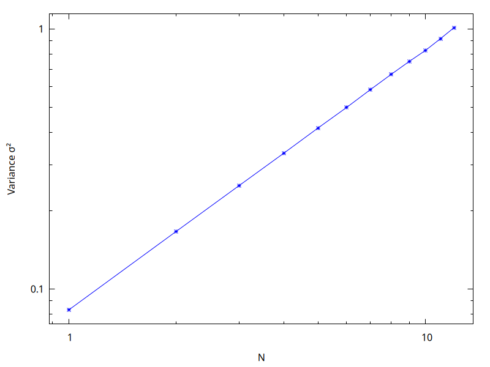
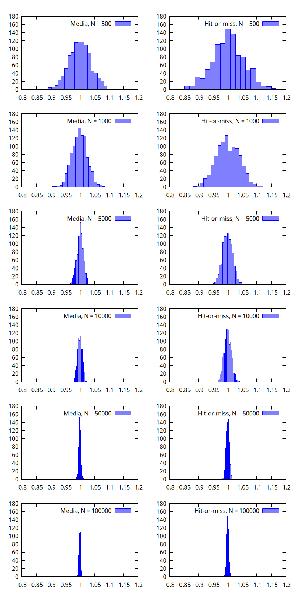

[La pagina con la spiegazione originale degli esercizi si trova qui: <https://labtnds.docs.cern.ch/Lezione10-11/Lezione1011/>.]

In questa lezione familiarizzeremo con l'utilizzo di tecniche numeriche basate su numeri casuali. Per prima cosa costruiremo un semplice generatore di numeri casuali. Lo utilizzeremo quindi per generare numeri che seguano diverse distribuzioni di probabilità (uniforme, esponenziale e Gaussiana). Come applicazione utilizzeremo la generazione di numeri casuali per calcolare numericamente integrali mono e multi-dimensionali. Nella prossima lezione utilizzeremo un generatore di numeri casuali per simulare il comportamento di un apparato sperimentale.

# Esercizio 10.0 - Generatore di numeri casuali (da consegnare) {#esercizio-10.0}

In questo esercizio proveremo a costruire un generatore di numeri casuali e a studiarne il comportamento. Scriveremo un programma che produca quattro istogrammi contenenti ciascuno 10 000 numeri pseudo-casuali estratti dalle seguenti distribuzioni:

-  una distribuzione uniforme tra 5 e 10.
-  una distribuzione esponenziale tra 0 e +∞ con costante $\lambda=1$.
-  una distribuzione gaussiana centrata in 1 e larghezza 1 con il metodo di Box-Muller.
-  una distribuzione gaussiana centrata in 1 e larghezza 1 con il metodo accept-reject.

Per risolvere questo esercizio si può seguire lo schema seguente:

#.  Scrivere una classe `RandomGen` per la generazione di numeri casuali. La classe dovrà avere un costruttore che accetti un *seed* di input e si faccia carico di inizializzare i parametri del generatore ai valori nominali. La classe dovrà inoltre contenere un metodo che implementi un generatore lineare congruenziale di base e tutti i metodi necessari per le distribuzioni richieste.


#.  Preparare un semplice `main` per provare le funzionalità della classe `RandomGen`, producendo quattro istogrammi per le distribuzioni indicate sopra.


## Header file della classe `RandomGen`

```c++
#pragma once

class RandomGen {
public:
  RandomGen(unsigned int seed);
  void SetA(unsigned int a) { m_a = a; }
  void SetC(unsigned int c) { m_c = c; }
  void SetM(unsigned int m) { m_m = m; }

  double Rand();
  double Unif(double xmin, double xmax); // distribuzione uniforme
  double Exp(double mean); // distribuzione esponenziale
  double Gaus(double mean, double sigma); // distribuzione gaussiana (Box-Muller)
  double GausAR(double mean, double sigma); // distribuzione gaussiana (Accept-Reject)

private:
  unsigned int m_a, m_c, m_m;
  unsigned int m_seed;
};
```

Il costruttore deve accettare un `unsigned int` come *seed* di input e inizializzare i parametri del generatore ai valori nominali `m_a = 1664525`, `m_c = 1013904223` e `m_m = 1U << 31`. È possibile usare altri valori per i parametri, come spiegato nella [pagina Wikipedia](https://en.m.wikipedia.org/wiki/Linear_congruential_generator#Parameters_in_common_use), ma vi consiglio di usare questi numeri in modo da poter confrontare i vostri risultati con quelli del [notebook Julia](https://ziotom78.github.io/tnds-notebooks/lezione10/#esercizio_101). (Nel notebook è anche spiegata la strana scrittura `1U << 31`).

**Attenzione!** Qui è *indispensabile* usare `unsigned int`, perché il generatore lineare congruenziale si appoggia a una precisa semantica per gli *overflow*, che è garantita solo dai tipi `unsigned`. Quello che succede è che la formula matematica sopra spesso genera numeri troppo grandi per stare in 32 bit, ma questo è voluto perché `unsigned` gestisce gli overflow troncando i bit più significativi. Questa cosa *non* è vera per gli interi senza segno.


## `main` per il test del generatore `RandomGen`

Un possibile `main` per provare il generatore appena costruito è indicato di seguito:

```c++
#include <iostream>
#include <vector>
#include "randomgen.h"
#include "gplot++.h"

using namespace std;

int main() {
  // Implementate questa funzione per verificare che i vostri
  // generatori funzionino; fate riferimento alla pagina
  //
  //   https://ziotom78.github.io/tnds-notebooks/lezione10/
  //
  // per sapere quali numeri usare negli assert
  test_random_numbers();

  RandomGen myGen{1};
  vector<double> samples(10000); // Usare parentesi tonde () e non graffe {} qui!

  for(int k{}; k < ssize(samples); k++) {
      samples[k] = myGen.Unif(5, 10);
      // Stampa i primi 10 valori per controllo
      if (k < 10)
          cout << samples[k] << endl;
  }

  const int nbins{100};  // Numero di barre nell'istogramma

  Gnuplot plt{};
  plt.redirect_to_png("uniforme.png");

  // Per produrre i quattro grafici nella stessa immagine, secondo
  // una matrice 2×2, si può usare il comando
  //
  //   plt.multiplot(2, 2);
  //
  // e poi invocare i comandi qui sotto quattro volte: ogni volta
  // che si invoca `plt.show()`, Gnuplot avanza al plot successivo

  plt.set_xrange(4, 11);
  plt.set_xlabel("x [AU]");
  plt.set_ylabel("Numero di campioni");
  plt.histogram(samples, nbins);
  plt.show();
}
```

Il programma usa [gplot++](https://github.com/ziotom78/gplotpp), installabile con i soliti comandi descritti [qui](miscellanea.html#gplotinstall).

Se eseguite il programma, otterrete questo grafico, non molto incoraggiante:

<center></center>

I dati non sembrano affatto essere distribuiti uniformemente!

Il problema è che per default Gnuplot sceglie una scala per l'asse $y$ che non parte da zero, e questo distorce l'aspetto del grafico. Dobbiamo quindi forzarlo a partire da zero con il metodo `plt.set_yrange`:

```c++
// Nel main visto sopra

// …
plt.set_xrange(4, 11);
plt.set_yrange(0, NAN);
// …
```

Passare `NAN` come estremo superiore indica a Gnuplot che ci va bene che sia lui a calcolare il valore ottimale per l'estremo superiore, perché a noi interessa indicare solo l'estremo inferiore. Il risultato diventa questo:

<center></center>


Se invece volete usare ROOT, aggiungete in coda al `main` qualcosa di simile:

```c++
TApplication app{"app", 0, 0};
TH1F unif{"Uniforme", "Uniforme", 100, 4, 11};

for(double sample : samples) {
    unif.Fill(samples);
}

TCanvas can2("Uniforme", "Uniforme") ;
can2.cd();
unif.GetXaxis()->SetTitle("x [AU]");
unif.GetYaxis()->SetTitle("Numero di campioni");
unif.Draw();

app.Run();
```

Seguono alcuni suggerimenti.

## Generatore Lineare congruenziale

I generatori lineari congruenziali generano una sequenza di interi pseudocasuali utilizzando la seguente formula:

$$
n_i = \mathrm{mod}(a \cdot n_{i - 1} + c, m)
$$

Quindi è necessario tenere in memoria il valore del numero intero generato al passaggio precedente. Alla prima iterazione, $n_0 = \text{seed}$.

Per ottenere un numero floating point uniformemente distribuito tra 0 e 1 (con 1 escluso) è sufficiente richiedere:
$$
d_i = n_i / m.
$$

Ricordiamo che in C++ l'operazione mod può essere eseguita con l'operatore `%`, che ritorna il resto della divisione (intera), per cui

```c++
7 % 5 = 2
```

## Generatore esponenziale

Per generare numeri pseudo-casuali secondo la densità di probabilità esponenziale
$$
p(x) = \begin{cases}
\lambda e^{-\lambda x},&\qquad(x \geq 0)\\
0&\qquad(x < 0)
\end{cases}
$$
si può facilmente invertire la funzione cumulativa di $p(x)$: è il *metodo della funzione inversa*. A partire da un numero $y$ estratto secondo la distribuzione uniforme tra 0 e 1, il numero
$$
x = - \frac1{\lambda} \log(1 - y)
$$
è distribuito proprio come la distribuzione esponenziale $p(x)$.


## Metodo di Box–Muller

Il metodo di Box-Muller permette di estrarre numeri secondo una densità di probabilità gaussiana, sfruttando il metodo della funzione inversa bidimensionale. Siano $x$ e $y$ due variabili indipendenti distribuite normalmente (Gaussiana con media 0 e sigma 1). L'espressione della loro distribuzione di probabilità (PDF) in due dimensioni è
$$
P(x,y) = \frac12 \exp\left(-\frac{x^2 + y^2}2\right).
$$

Passando alle coordinate polari:
$$
\begin{aligned}
x &= r \cos\theta,\\
y &= r \sin\theta,
\end{aligned}
$$
si ha
$$
P(R, \theta) = \frac12 \exp\left(- \frac{r^2}2\right).
$$
Se calcoliamo l'integrale di tale PDF per $r \in [0, R]$ e $\theta \in [0, \Theta]$, otteniamo
$$
F(R, \Theta) = \frac\Theta\pi \left[1 - \exp\left(-\frac{R^2}2\right)\right],
$$
Definendo $s$ e $t$ come due variabili casuali distribuite uniformemente in [0,1], abbiamo
$$
\begin{aligned}
R &= \sqrt{-2 \log (1 - s)},\\
\Theta &= 2\pi t,
\end{aligned}
$$
per cui due variabili $x$ e $y$ distribuita normalmente possono essere generate a partire da una coppia $s$ e $t$ distribuita uniformemente in $[0,1]$, secondo la formula
$$
\begin{aligned}
x &= \sqrt{-2\log s} \cdot \cos{2\pi t},\\
y &= \sqrt{-2\log s} \cdot \sin{2\pi t},\\
\end{aligned}
$$
Se ci limitiamo per comodità a considerare solo una delle due, possiamo generalizzare al caso di variabile $x$ distribuita gaussianamente con media $\mu$ e larghezza $\sigma$:
$$
x = \mu + \sigma\cdot \sqrt{-2\log s} \cdot \cos{2\pi t}.
$$

Qui sotto trovate una implementazione di tale metodo:

```c++
double RandomGen::Gaus(double mean, double sigma) {
  double s{Rand()};
  double t{Rand()};
  double x{sqrt(-2 * log(s)) * cos(2 * numbers::pi * t)};
  return mean + x * sigma;
}
```
Si noti che tecnicamente dati due numeri $s$ e $t$ possiamo generare due numeri $x$ e $y$ distribuiti gaussianamente. Nel nostro esempio ne consideriamo uno soltanto per comodità di scrittura codice, non certo per efficienza!

## Metodo Accept-Reject

Il metodo accept-reject può essere utilizzato per generare numeri casuali distribuiti secondo una qualsivoglia forma funzionale. Consideriamo di voler generare numeri nell'intervallo $[a, b]$ secondo la distribuzione $f(x)$ in figura:


Il metodo si basa sulla generazione di una coppia di numeri $x \in [a, b], y \in [0, M]$ dove $M$ è un numero maggiore del massimo valore assunto da $f(x)$ nell'intervallo $[a,b]$:
$$
f(x) \leq M\,quad \forall x \in [a, b].
$$
La coppia $(x, y)$ può essere facilmente generata a partire da due numeri $s$ e $t$ generati uniformemente in $[0,1]$ usando le formule

$$
\begin{aligned}
x &= a + (b-a)\cdot s,\\
y &= M \cdot t.
\end{aligned}
$$

Generata la coppia $(x, y)$, si valuta quindi $f(x)$ e si accetta $x$ se $y< f(x)$, altrimenti si ripete la procedura. Così facendo si avrà un maggior numero di punti generati laddove $f(x)$ assume valori più grandi. Potete pensare di scrivere un metodo accept-reject specifico per la gaussiana o pensarne uno più generale che per esempio accetti una generica `FunzioneBase` come input.


# Esercizio 10.1 - Verifica del Teorema del Limite Centrale (da consegnare) {#esercizio-10.1}

Una applicazione molto interessante dell'estrazione di numeri casuali è la verifica del teorema del limite centrale. Per fare questo possiamo generare una serie di numeri casuali uniformemente distribuiti in $[0,1]$ e calcolare la somma eseguita su un numero $N$ di elementi consecutivi della serie generata. Calcolare la varianza della serie di numeri generata e della serie delle somme. Verificare come questa scala con $N$. Si possono pensare a due versioni di questo esercizio:

-   **Semplice**: passare da riga di comando il numero $N$ di elementi da sommare. Creare due istogrammi che contengano la distribuzione dei numeri generati e la distribuzione delle somme di $N$ elementi. Verificare come cambia la distribuzione delle somme al variare di $N$ provando ad eseguire il codice varie volte con diversi valori di $N$.

-   **Completo**: il codice prepara le distribuzioni (istogrammi) delle somme di $N$ elementi con $N$ che va da 1 a 12. Per ogni $N$, il programma calcola la varianza della distribuzione e genera un plot finale della varianza in funzione di $N$.

In entrambi i casi, un numero di campioni maggiore di 10 000 dovrebbe andare bene.


## Il Teorema del Limite Centrale

I teoremi del limite centrale sono una famiglia di teoremi di convergenza debole nell'ambito delle teoria delle probabilità. Per tutti vale l'affermazione che la distribuzione di probabilità della somma (normalizzata) di un gran numero di variabili casuali tende ad una data distribuzione regolare (attrattore), che di norma è la Gaussiana o la Lorenziana.

Nel nostro caso, verificheremo che la somma di $N$ variabili aleatorie $x_i$ indipendenti e identicamente distribuite con media $\mu$ e varianza $\sigma^2 < \infty$ tende a distribuirsi come una variabile casuale gaussiana con media pari a $N\mu$ e varianza $N\sigma^2$, al tendere di $N$ a infinito.


## Risultati attesi

L'output del programma potrebbe essere una coppia di grafici: nel primo una panoramica delle dodici distribuzioni di somme:


Nel secondo grafico, la relazione tra il numero di elementi sommati $N = 1\ldots 12$ e la deviazione standard (oppure la varianza):



Suggerimento: non implementate tutto nel `main`, ma inserite il codice che riempie il vettore di 10 000 elementi in una funzione separata, che può stare benissimo nello stesso file del `main`:

```c++
void compute_sums(
    RandomGen & rng,               // Generatore da usare
    int numbers_to_add,            // Valore di N, tra 1 e 12
    std::vector<double> & result   // Vettore di elementi da riempire
) {
    // Inserite qui l'implementazione: deve iterare su
    // tutti gli elementi di `result`, e in ognuno di essi
    // inserire la somma di N valori restituiti da
    // rng.Uniform(0.0, 1.0), dove N è la variabile `numbers_to_add`
}
```

Nel `main` quindi il codice sarà semplice da scrivere e soprattutto da leggere:

```c++
// Assumo qui di usare Gnuplot, ma usando ROOT il concetto è uguale
Gnuplot plt_histograms{};
Gnuplot plt_errors{};

// Rendi la prima figura più grande del normale: dovrà contenere molti
// istogrammi!
plt_histograms.redirect_to_png("histograms.png", "1280,1024");

// Il secondo grafico può essere lasciato alle dimensioni standard
plt_errors.redirect_to_png("errors.png");

// Nel grafico degli istogrammi, disponili su quattro righe e tre colonne
// (12 istogrammi in totale)
plt_histograms.multiplot(4, 3);

RandomGen rng{1};
// Alloco già lo spazio per 100 000 elementi, e lo faccio
// una volta sola *prima* del ciclo `for`: così il codice
// sarà rapidissimo
std::vector<double> result(100'000);

for(int N{1}; N <= 12; ++N) {
  compute_sums(rng, N, result);
  plt_histograms.histogram(result, 100, format("N = {}", N));
  plt_histograms.show();

  // Aggiunge il punto con la σ al grafico degli errori
  plt_errors.add_point(N, calculate_standard_deviation(result));
}

// Fai un grafico dei punti aggiunti con plt_errors.add_point()
plt_errors.plot();

// Salva il file con il grafico degli errori
plt_errors.show();
```


# Esercizio 10.2 - Calcolo di integrali con metodi Montecarlo (da consegnare) {#esercizio-10.2}

Studiamo in questo esercizio il comportamento delle tecniche Montecarlo per il calcolo numerico di un integrale mono-dimensionale.

#.  Calcolare 10 000 volte il valore dell'integrale di $x \sin(x)$ su $[0, \pi/2]$ utilizzando il metodo della media con $N = 100$ punti e fare un grafico (istogramma) della distribuzione dei valori ottenuti.

#.  Estendere il punto precedente calcolando 10 000 volte il valore dell'integrale di $x\sin(x)$ su $[0, \pi/2]$ utilizzando il metodo della media a $N$ punti, con $N$ pari a 100, 500, 1000, 5000, 10 000 punti. Per ogni valore di $N$ produrre il grafico della distribuzione dei 10 000 valori ottenuti.

#.  Stimare l'errore sul calcolo dell'integrale a 100, 500, 1000, 5000, 10 000 punti come deviazione standard dei 10 000 valori calcolati per ogni $N$. Far un grafico di questo errore in funzione di $N$.

#.  Assumendo che l'andamento dell'errore sia noto (del tipo $k / \sqrt{N}$), si determini quanti punti sono necessari per ottenere una precisione di 0.001. Si ripeta lo stesso lavoro con il metodo hit-or-miss.

Alcune osservazioni per lo svolgimento dell'esercizio:

-   Per il calcolo di integrali con metodi Montecarlo si può decidere di scrivere una nuova classe dedicata o estendere la classe `Integral` della [lezione 7](carminati-esercizi-07.html#cenni-sullimplementazione). Notate che in questo caso la nuova classe dovrà avere un generatore di numeri casuali come membro.

-   Poiché il calcolo degli integrali con $N$ molto elevato potrebbe richiedere un certo tempo, diventa utile spezzare il `main` in due `main` separati: il primo calcola gli integrali e li salva in diversi file di testo (uno per ogni valore di $N$), mentre il secondo legge i files scritti dal primo e li analizza. In questo modo possiamo agevolmente ripetere molte volte l'analisi dei dati senza dover ricalcolare ogni volta gli integrali.

## La classe `IntegraleMC`

Come al solito possiamo pensare ad una interfaccia generica `IntegraleMC` dalla quale derivano le classi concrete `IntegraleMedia` e `IntegraleHoM`:

```c++
#pragma once

class IntegraleMC {
public:
  // Take the seed
  IntegraleMC(unsigned int seed) : m_myrand{seed}, m_errore{}, m_punti{} {}
  virtual ~IntegraleMC() {}

  virtual double Integra(const FunzioneBase & f, double inf, double sup, int punti, double fmax) = 0;

  double GetErrore() const { return m_errore; }
  int GetN() const { return m_punti; }

private:
  RandomGen m_myrand;
  double m_errore;
  int m_punti;
};

class IntegraleMedia : public IntegraleMC {
public:
  double Integra(const FunzioneBase & f, double inf, double sup, int punti, double fmax) override {
      // Implementazione qui
  }
};
```

Alcune osservazioni:

-   Negli anni passati, il codice proposto sopra da Carminati dichiarava all'interno di `IntegraleMC` un **puntatore** a `RandomGen` (ossia, `m_myrand` era dichiarato come `RandomGen * m_myrand`), e questo obbligava ad invocare `new` nel costruttore e `delete` nel distruttore, nonché a definire un costruttore di copia e un *move constructor*. Quest'anno evitiamo di usare il puntatore, e quindi il codice è molto più semplice e più consono alla moderna programmazione C++. Ovviamente, per chiamare il costruttore occorre usare una *initialization list*, che noi ben conosciamo. Carminati propone [questa pagina](https://www.learncpp.com/cpp-tutorial/constructor-member-initializer-lists/) come approfondimento.

-   Per salvare la struttura delle classi virtuale/concreta siamo stati costretti ad aggiungere il campo `fmax` anche ad `IntegraleMedia`, anche se non necessario: serve infatti soltanto per il metodo *hit-or-miss*. In questo caso non è veramente vantaggioso utilizzare questo tipo di schema.


## Un vettore di istogrammi in ROOT

Per chi usa ROOT, in alcuni casi può essere comodo conservare una serie di istogrammi riempiti in un ciclo. Una possibilità è quella di creare puntatori a istogrammi e conservarli in un `vector<TH1F*>` per un eventuale uso seguente. Un esempio è tratteggiato qui sotto, in caso sia utile:

```c++
vector<TH1F*> vhistos;

for(int k{}; k < ssize(cases); k++ ) {   // ciclo sui casi da studiare
  TH1F* h{new TH1F( ... )};              // costruzione istogramma
  for (int j{}; j < n ; j++ )
      h->Fill(...) ;                     // riempimento istogramma
  vhistos.push_back(h);                  // conserviamo i puntatori
}

for(int k{}; k < ssize(cases); k++) {
  // ...
  vhistos[k]->Draw();
  // ...
}
```

## Calcolo di integrali con il metodo della media

Come discusso a lezione, il *metodo della media* consiste nel valutare la media delle valutazioni della funzione $f(x)$ in un set di $N$ punti distribuiti uniformemente tra $a$ (minimo estremo di integrazione) e $b$ (massimo estremo integrazione). La stima dell'integrale si ottiene poi dalla seguente formula:
$$
\int_a^b f(x)\,\mathrm{d}x \approx (b - a) \frac{\sum_{n=1}^N f\bigl(x_n\bigr)}N.
$$


## Calcolo di integrali con il metodo hit-or-miss

Il metodo hit-or-miss si basa sulla generazione di una coppia di numeri $x \in [a, b]$  e $y \in [0, f_\text{max}]$, dove $f_\text{max}$ è un numero maggiore del massimo valore assunto da $f(x)$ nell'intervallo $[a, b]$. Generata la coppia $(x, y)$, si incrementa un contatore $N_\text{tot}$ e si valuta quindi $f(x)$: se $y < f(x)$, allora si incrementa anche il contatore $N_\text{hit}$. La procedura viene ripetuta fino a che il numero di estrazioni è pari al valore di $N_\text{max}$ richiesto. La stima dell'integrale si ottiene poi dalla seguente formula:

$$
\int_a^b f(x)\,\mathrm{d}x \approx (b - a) f_\text{max}\frac{N_\text{hit}}{N_\text{tot}}.
$$

## Risultati attesi

Siccome il programma deve fare molti calcoli, vi consiglio di fornire qualche feedback all'utente:

```c++
  const int num_of_estimates{1000};
  const std::vector num_of_points_list{500, 1000, 5000, 10'000, 50'000, 100'000};

  Gnuplot plt_histograms{};

  plt_histograms.redirect_to_png("es10.3_histograms.png", "800,1600");

  assert( == 6);

  // Useremo 2 colonne per mostrare l'istogramma della media
  // e di hit-or-miss, e tante righe quanti sono i valori in
  // "num_of_points_list"
  plt_histograms.multiplot(ssize(num_of_points_list), 2);

  // Itera `num_of_points` su tutti i valori di `num_of_points_list`:
  // prima num_of_points = 500, poi num_of_points = 1000, poi etc.
  for(auto num_of_points: num_of_points_list) {
    // Questo è un feedback da dare all'utente. Notare che usiamo
    // `stderr`, così il messaggio viene stampato subito!
    println(stderr, "N = {}", num_of_points);
    vector<double> estimates_mean(num_of_estimates);
    vector<double> estimates_hom(num_of_estimates);

    // Esegue molte volte il calcolo dell'integrale per vedere la
    // variabilità dei risultati
    for(int k{}; k < ssize(estimates_mean); ++k) {
      estimates_mean.at(k) = integral_mean(rng, f_sin, 0.0, numbers::pi, num_of_points);
      estimates_hom.at(k) = integral_hom(rng, f_sin, 0.0, numbers::pi, 1.0, num_of_points);
    }

    // Mette nella colonna di sinistra l'istogramma delle stime
    // con il metodo della media…
    plt_histograms.histogram(estimates_mean, 20,
                             format("Media, N = {}", num_of_points));
    plt_histograms.set_xrange(1.8, 2.2);
    plt_histograms.show();

    // …e nella colonna di destra quello con hit-or-miss
    plt_histograms.histogram(estimates_hom, 20,
                             format("Hit-or-miss, N = {}", num_of_points));
    plt_histograms.set_xrange(1.8, 2.2);
    plt_histograms.show();
  }
```

Le distribuzioni attese degli integrali per i diversi valori di $N$ dovrebbero avere questo aspetto:



L'andamento dell'errore nei due casi dovrebbe invece essere così:


Nel caso del metodo della media sono necessari ~ 650.000 punti per ottenere un integrale con un errore di 0.001.

**Attenzione**: fareste meglio a stimare l'errore come la deviazione standard della distribuzione, anziché contare sul fatto che sapete che $\int_0^{\pi/2} x \sin x\,\mathrm{d}x = 1$, perché in questo modo il codice che scrivete per questo esercizio sarà più facile da riutilizzare il giorno dell'esame (in cui non è affatto detto che voi saprete il valore degli integrali che dovete calcolare…)!


# Esercizio 10.3 - Calcolo di integrali multidimensionali con metodi Montecarlo (facoltativo) {#esercizio-10.3}

Provare a risolvere il seguente integrale utilizzando per esempio il metodo della media:

$$
I = \int_1^2\int_1^2\left(
\frac5{x^2}\cos(4y)\sin(7x) + 10
\right)\,\mathrm{d}x\,\mathrm{d}y,
$$

Suggerimento: si potrebbe costruire una classe `FunzioneScalareBase` astratta da cui la funzione integranda erediti. La classe `FunzioneScalareBase` avrà un metodo virtuale puro

```c++
// `n` è il numero di dimensioni del dominio:
// · se f = f(x), allora n=1
// · se f = f(x, y), allora n=2
// · se f = f(x, y, z), allora n=3
// etc.
template<size_t n>
class FunzioneScalareBase<n> {
public:
  // …

  // `input` è un array contenente N parametri; in quest'esercizio, n=2 e input=(x, y)
  virtual double Eval(const array<double, n> & input) const=0;
};
```

Alla classe che calcola l'integrale si dovrà aggiungere un metodo dedicato del tipo

```c++
template<size_t n>
double Media(FunzioneScalareBase<n> & f,
             const array<double, n> & inf,
             const array<double, n> & sup,
             int punti);
```

Integrando la funzione sopra con 100 000 punti, si dovrebbe ottenere come risultato 10.241 ± 0.004.


# Esercizio 10.4 - Errore nel caso di integrali multimensionali (facoltativo) {#esercizio-10.4}

Provare a ripetere le consegne dell'[esercizio 10.2](#esercizio-10.2) applicate all'integrale multidimensionale dell'[esercizio 10.3](#esercizio-10.3). In questo modo si può facilmente verificare che la legge con cui scala l'errore è indipendente dalla dimensione dell'integrale.


# Qualche approfondimento su generatori di numeri casuali in C++11

Nel C++ 11 è stata inserita una libreria per la generazione di numeri casuali: si veda per esempio [qui](http://www.cplusplus.com/reference/random/). Provate a dare un'occhiata a questo [codice](https://labtnds.docs.cern.ch/Lezione10-11/Random_numbers.cpp) per trovare un esempio su come utilizzare questa libreria e su come usare le librerie di ROOT (si faccia riferimento alla [referenza](https://root.cern.ch/doc/master/classTRandom.html)).


# Errori comuni

Come di consueto, elenco alcuni errori molto comuni che ho trovato negli anni passati correggendo gli esercizi che gli studenti hanno consegnato all'esame:

-   Attenzione nell'implementare i test per `RandomGen`! Il [notebook Julia](https://ziotom78.github.io/tnds-notebooks/lezione10/#esercizio_101) usa un *nuovo* generatore per ogni test. Non dovete quindi riutilizzare lo stesso generatore per verificare `Unif()`, `Exp()`, `Gauss()` e `GaussAR()`; il codice seguente è **sbagliato**, perché riusa `rnd` ogni volta:

    ```c++
    RandomGen rnd{1};

    // Test for Unif
    assert(are_close(rnd.Unif(0.0, 1.0), 0.47291105054318905));
    // …and so on for the other four numbers

    // Test for Exp
    assert(are_close(rnd.Exp(1.0), 0.6403859601352556));           // WRONG!
    // …and so on for the other four numbers

    // Test for Gauss
    assert(are_close(rnd.Gauss(2.0, 1.0), 1.9119660920460757));    // WRONG!
    // …and so on for the other four numbers

    // Test for GaussAR
    assert(are_close(rnd.GaussAR(2.0, 1.0), 1.7291105054318905));  // WRONG!
    // …and so on for the other four numbers
    ```

    Potete usare le parentesi graffe `{}` per delimitare uno /scope/ per ciascuna delle quattro famiglie di test:

    ```c++
    ```c++
    {
      RandomGen rnd{1};

      // Test for Unif
      assert(are_close(rnd.Unif(0.0, 1.0), 0.47291105054318905));
      // …and so on for the other four numbers
    } // `rnd` gets destroyed here

    {
      RandomGen rnd{1};

      // Test for Exp
      assert(are_close(rnd.Exp(1.0), 0.6403859601352556));           // Ok
      // …and so on for the other four numbers
    } // `rnd` gets destroyed here

    {
      RandomGen rnd{1};

      // Test for Gauss
      assert(are_close(rnd.Gauss(2.0, 1.0), 1.9119660920460757));    // Ok
      // …and so on for the other four numbers
    } // `rnd` gets destroyed here

    {
      RandomGen rnd{1};

      // Test for GaussAR
      assert(are_close(rnd.GaussAR(2.0, 1.0), 1.7291105054318905));  // Ok
      // …and so on for the other four numbers
    ```

    Alternativamente, se avete implementato un metodo `RandomGen::SetSeed()`, potete invocare `rnd.SetSeed(1)` prima di procedere con i test del metodo successivo.

-   Capita spesso che gli studenti, nell'implementare il costruttore `RandomGen::RandomGen(unsigned int seed)`, siano così preoccupati di inizializzare `m_a`, `m_c` e `m_m` ai valori giusti che si dimenticano di inizializzare `m_seed`! Questo porta il loro codice a produrre valori che sono casuali e distribuiti correttamente, ma **non** sono identici a quelli calcolati nel [notebook Julia](https://ziotom78.github.io/tnds-notebooks/lezione10/#esercizio_101), e quindi i test non passano.

-   In tutti gli esercizi di oggi dovete generare $N$ numeri casuali, per cui quindi serve implementare un ciclo `for`. Attenzione a **non** creare l'oggetto `RandomGen` all'interno del ciclo `for`, perché in tal caso il generatore parte sempre dallo stesso seme e quindi genera una sequenza di numeri tutti identici tra loro:

    ```c++
    vector<double> samples{N};
    for(int i{}; i < ssize(samples); ++i) {
      RandomGen rnd{1};   // No, this line should be *before* the `for` loop!
      samples[i] = rnd.Rand();
    }
    ```

-   La funzione `Rand()` dovrebbe restituire un numero casuale in $[0, 1)$, ma la formula del generatore lineare congruenziale lavora restituisce numeri interi nell'intervallo $[0, m - 1]$; di conseguenza bisogna normalizzare il nuovo valore di `m_seed` dividendolo per `m_m`. Attenzione a questi due errori molto comuni:

    #.  Il nuovo valore del seme è quello restituito dalla formula *prima* della divisione per `m_m`, perché deve essere un numero intero nell'intervallo $[0, m - 1]$.

    #.  Non è corretto scrivere `m_seed / m_m`, perché è una divisione *intera*, e dal momento che `m_seed < m_m`, il risultato è sempre zero. Dovete scrivere `static_cast<double>(m_seed) / m_m` per ottenere un numero a virgola mobile.

    Se avete problemi, fate riferimento al codice di `rand(glc::GLC, xmin, xmax)` nel [notebook Julia](https://ziotom78.github.io/tnds-notebooks/lezione10/#generatore_lineare_congruenziale).

-   Stranamente, un certo numero di studenti non segue quanto richiesto per l'esercizio 10.2 ed inventa metodi alternativi (spesso molto più lenti) per stimare l'errore. Cercate di attenervi a quanto richiesto nel testo, perché si tratta di un approccio risolutivo che si ripropone spesso nei temi d'esame.

-   Sempre nell'esercizio 10.2, imparate ad usare giudiziosamente i cicli `for` per studiare i vari casi, anziché usare spietatamente il copia-e-incolla! Vedete il cosiddetto “esempio maledetto” nella [sezione nel notebook Julia](https://ziotom78.github.io/tnds-notebooks/lezione10/#esercizio_101) per imparare cosa **non** fare in questo genere di esercizi!

-   Come già detto a proposito della [lezione 8](carminati-esercizi-08.html#errori-comuni), se il vostro programma richiede una serie di parametri da linea di comando, assicuratevi di documentarli e di permettere all'utente di avviare il programma con `make esegui`.

---
title: "Lezione 10 e 11: Metodi Montecarlo"
author:
- "Leonardo Carminati"
- "Maurizio Tomasi"
date: "A.A. 2024−2025"
lang: it-IT
...
