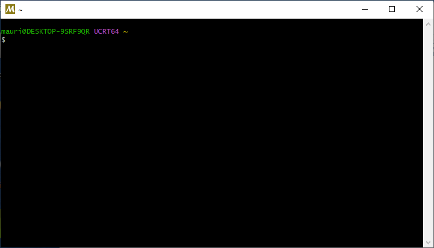

In questa pagina fornisco alcune indicazioni su come installare un compilatore C++ e un editor che permettano di sviluppare i programmi richiesti nelle ore di esercitazione.


# Windows

Non è semplice installare un compilatore C++ sotto Windows che soddisfi le richieste dell'insegnamento di TNDS. La soluzione più diffusa su Internet è quella di installare l'ambiente Microsoft Visual Studio, che ha però una serie di svantaggi:

-   Richiede molte risorse;

-   Non è possibile usare il comando `make` come richiesto nelle prime tre esercitazioni;

-   Usa delle convenzioni più complicate del necessario nel modo in cui vengono strutturati i progetti (file CMake annidati).

Le soluzioni che consiglio sono le seguenti:

1.  Usare WSL (Windows Subsystem for Linux);

2.  Installare Virtual Box e creare una macchina virtuale Ubuntu;

3.  Installare MSYS2;

4.  Installare MobaXTerm e connettersi ai computer del laboratorio.


## WSL

WSL è un meccanismo che consente a Windows di eseguire una macchina virtuale Linux in maniera semi-trasparente. È la scelta più usata dagli studenti, ma potrebbe non funzionare su alcuni computer per cui il BIOS non supporta la virtualizzazione. Se questo è il vostro caso, dovete tentare un'altra strada.

Seguite le [istruzioni sul sito Microsoft](https://learn.microsoft.com/en-us/windows/wsl/install), perché i dettagli cambiano spesso.


## VirtualBox

Oracle VirtualBox consente di creare una vera e propria macchina virtuale. È concettualmente analogo all'uso di WSL (vedi sopra), con lo svantaggio di essere leggermente più complicato da configurare. Però ha il grande vantaggio che l'ambiente di sviluppo (Linux + Gnome) è identico a quello dei computer del laboratorio.

Se avete avuto problemi ad usare WSL, è possibile che neppure questo metodo funzioni, perché richiede un supporto per la virtualizzazione da parte del BIOS.

I passaggi da seguire sono i seguenti:

1.  Installate Virtual Box scaricandolo da [questo sito](https://www.virtualbox.org/);

2.  Scaricate il file ISO dell'ultima versione di Ubuntu da [questo sito](https://ubuntu.com/desktop).

3.  Create una macchina virtuale selezionando dal menu *Machine* la voce *New…*; nella finestra che compare indicate il file ISO che avete scaricato poco prima, e lasciate tutto il resto come da default.

4.  Avviate la macchina con il bottone *Start* (da menu è la voce *Machine* | *Start* | *Normal start*).

5.  Installate il sistema operativo configurandolo come preferite.

6.  Una volta che il sistema è installato e funzionante, aprite il terminale e scrivete il comando

    ```
    sudo apt update && sudo apt install build-essential
    ```

    Questo installerà il compilatore `g++`.

**Annotazione importante**: i file che creerete nella macchina Ubuntu non saranno visibili da Windows! È possibile invece fare il viceversa, ossia far comparire una directory del sistema Windows all'interno di Ubuntu: in questo modo sarà possibile editare lo stesso file in entrambi gli ambienti. Queste directory si configurano con il bottone *Settings*, alla voce *Shared folders*.


## MSYS2

A differenza di WSL e Virtual Box, MSYS2 non usa la virtualizzazione, e può quindi essere impiegato in tutti i tipi di portatile. MSYS2 è un sistema che installa una serie di programmi compilati nativamente per Windows, che però funzionano in maniera molto simile a Linux.

Questi sono i passi da compiere per installare MSYS2 e i compilatori C++:

1.  Andate sul sito <https://www.msys2.org> e scaricate il programma di installazione di MSYS2.

2.  Avviate l'installazione, accettando la directory di default `C:\msys64`.

3.  Al termine dell'installazione, avviate MSYS2. Vedrete comparire un terminale simile a quello Linux:

    

    Questo è un ambiente Windows fatto per assomigliare il più possibile a Linux.

4.  Per installare il compilatore C++ e `make`, eseguite il comando

    ```
    pacman -S gcc make
    ```

5.  Bisogna ricordare che MSYS2 usa una convenzione particolare per indicare i percorsi dei file: lettere di unità come `C:` e `D:` in Windows si traducono in `/c` e `/d` nel terminale di MSYS2, e i backslash come `\` si traducono in `/`. 

    Quindi, se con Visual Studio avete salvato un file in `C:\Utenti\Pippo\prova.cpp`, in MSYS2 figurerà come `/c/Utenti/Pippo/prova.cpp` e il comando per compilarlo sarà quindi

    ```
    $ cd /c/Utenti/Pippo
    $ g++ -o prova -std=c++20 -g3 prova.cpp
    ```

6.  Se volete usare un editor da terminale dentro MSYS2, potete installare [GNU Nano](https://www.nano-editor.org/):

    ```
    pacman -S nano nano-syntax-highlighting
    ```

7.  Se volete aprire con “Esplora risorse” o con Visual Studio Code un file creato all'interno della home in MSYS2, il percorso è in `C:\msys64\home`.


## MobaXTerm

Questa soluzione è indicata se avete la garanzia di una connessione veloce. Ha il vantaggio che sfruttate i computer del laboratorio per eseguire il vostro codice e quindi avete ROOT già pronto da usare, ma lo svantaggio è che la visualizzazione di grafici e l'apertura di finestre sarà più lenta. Inoltre è complicato configurare Visual Studio Code, e vi consiglio invece di usare un programma da linea di comando come `nano` per editare il codice.

Il programma è scaricabile dal sito <https://mobaxterm.mobatek.net/>; tenete presente che la versione di default è a pagamento, ma è possibile scaricarne una versione ridotta gratuita che è più che sufficiente per l'insegnamento di TNDS.

Una volta installata l'applicazione, create una connessione SSH al computer `tolab.fisica.unimi.it`, indicando il vostro nome utente (lo stesso della vostra email, senza `@studenti.unimi.it`) e la vostra password della posta. Avviando la connessione, verrete fatti accedere a uno dei computer del laboratorio, e potrete anche avviare comandi grafici.


# Mac OS X

Il sistema operativo Mac OS X già include il compilatore Clang, che potete invocare con `clang++`; esiste anche l'alias `g++`, che non fa altro che invocare `clang++`.

Se installate [XCode dall'App Store](https://apps.apple.com/us/app/xcode/id497799835), avrete probabilmente a disposizione un compilatore più aggiornato e strumenti in più.


# Debian/Ubuntu/Linux Mint

Se usate una distribuzione Linux basata su Debian (come Ubuntu), installate il compilatore C++ e il comando `make` con il comando

```
sudo apt update && sudo apt install build-essential
```


---
title: Configurare un compilatore C++ sul proprio portatile
author: Maurizio Tomasi
lang: it-IT
header-includes: <script src="./fmtinstall.js"></script>
css:
- ./css/asciinema-player.css
...
