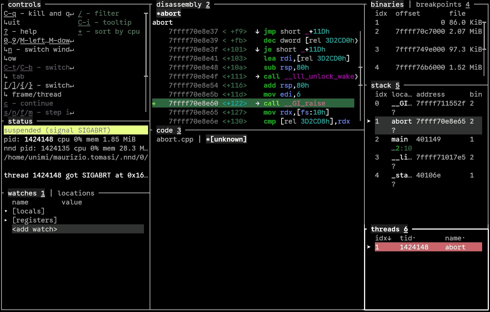

# Fare debug di programmi con NND

È possibile installare il programma [NND](https://github.com/al13n321/nnd) nella propria home directory con il seguente script:

```sh
$ /home/comune/labTNDS_programmi/install-ndd
```

Il programma `nnd` verrà installato in `~/.local/bin`, che dovrebbe essere già nel vostro `PATH`; questo vuol dire che dovreste poter eseguire `nnd` direttamente.

## Preliminari

Per poter usare un debugger, **dovete** usare la lista dei flag indicata durante la [prima lezione](tomasi-lezione-01.html#flag-del-compilatore), perché `-g3` è indispensabile.

Per effettuare il debug di un programma, è sufficiente avviare `nnd` passandogli l’eseguibile del programma. **Attenzione**: se il vostro programma è nella directory corrente, dovete inserire `./` prima del suo nome:

```sh
$ nnd ./mioprogramma      # "nnd mioprogramma" non funziona, ci vuole "./"!
```

## Come usare NND con un programma che va in crash

Consideriamo questo programma:

```c++
// abort.cpp
#include <cstdlib>
#include <print>

using namespace std;

int main() {
  int small{150};
  int large{30};

  if (small > large) {
    // Something is wrong here!
    abort();
  }

  return 0;
}
```

Il programma controlla che la variabile `small` sia più piccola di `large`, e siccome questo non è vero (`150 > 30`, probabilmente per un errore di battitura) il programma invoca `abort()`, che manda in crash il programma. Compiliamo il programma con `-O0` in modo da disabilitare ogni ottimizzazione (questo semplifica il debugging):

```
$ g++ -std=c++23 -g3 -O0 -o abort abort.cpp
$ ./abort
Aborted (core dumped)
```

Per verificare cosa succede, avviamo NND:

```sh
$ nnd ./abort
```

Si aprirà questa schermata:


NDD ha già eseguito il programma ed ha visto che è stata chiamata `abort()`, così si è fermato.

Quello che a noi interessa è il pannello “stack 5”, sulla destra a metà altezza. Esso mostra la concatenazione di funzioni invocate che ha causato l’arresto del programma. Vediamo nell’ordine:

1. `__GI…`, che sta per `__GI_raise`, una funzione usata internamente da `abort`
2. `abort`, che è proprio la funzione che abbiamo chiamato nel nostro `main`
3. `main`, la funzione principale del nostro programma
4. `__li…`, che sta per `__libc_start_main`, una funzione usata internamente da Linux
5. `_sta…`, che sta per `_start`, la primissima funzione invocata da Linux quando si esegue un programma.

Noi però vogliamo vedere cosa nel `main` ha causato la chiamata ad `abort()`, quindi dobbiamo “risalire” la lista delle chiamate e passare da `__GI_raise` (la prima dell’elenco, che è quella selezionata di default) a `main`, che è la terza.

Premendo il tasto `]` (parentesi quadra chiusa), ci abbassiamo di un livello, raggiungendo `abort`:



Notate che nel pannello “stack 5” (che indica l’elenco delle funzioni chiamate in ordine temperale) la voce evidenziata è diventata la seconda. Premiamo ancora una volta `]` per raggiungere `main`:


Ora che siamo nel “contesto” della chiamata ad `abort()`, ecco che è comparso il codice C++ nella finestra “code 3” in basso, e nella finestra in basso a sinistra (“watches 1”) sono comparsi i valori che le variabili `small` e `large` avevano nel momento in cui è stato invocato `abort()`.

Per uscire da NDD basta premere `Ctrl+q` (una guida con i tasti è sempre disponibile in alto a sinistra).

Questo tipo di uso di NDD è molto comodo per investigare in quale punto del codice è stata chiamata `abort()`, e per visualizzare il valore delle variabili al momento del crash.


## Come usare NND per investigare l’esecuzione di un programma

NND non è solo utile per analizzare il momento in cui un programma va in crash. Esso può eseguire un programma passo passo, mostrando in che modo cambia il valore delle variabili dopo ogni istruzione.

Consideriamo quest’altro esempio:

```c++
// calc.cpp

#include <print>

using namespace std;

int main() {
  int sum = 0;
  for(int i = 1; i < 5; ++i) {
    sum += i * i;
  }

  println("The sum of the first 5 squares is {}", sum);
}
```

Compiliamo il programma con `-g3 -O0` (togliete poi `-O0` quando avete finito di fare il debugging):

```sh
$ g++ -std=c++23 -g3 -O0 -o calc calc.cpp
```

Avviamo NND:

```sh
$ nnd ./calc
```

Questa è la schermata iniziale:


Siccome il programma non ha causato alcun crash, il pannello “stack 5” sulla sinistra è vuoto. Stavolta infatti vogliamo eseguire il programma passo passo, per verificare che il funzionamento sia quello atteso. Premiamo `s` (che sta per **S**tart) per far partire l’esecuzione e arrestarla all’inizio del `main`:


NND ha fatto partire il programma, ma ne ha congelato l’esecuzione all’inizio del `main`, come dice il pannello a sinistra “status 2”, che riporta la scritta “suspended”. Notate che nel pannello “watches 1” in basso a sinistra è già comparsa la variabile `sum`, che al momento ha valore `0`.

Possiamo ora eseguire il programma un’istruzione alla volta col tasto `n` (che sta per **N**ext). Vedrete che la riga verde nel codice di `calc.cpp` va avanti di una posizione, passando dalla parentesi graffa `{` alla riga dove si dichiara `sum`:


Premendo ancora `n`, si passa alla riga con `for`, e la variabile `i` appare col suo valore iniziale (`0`) nel pannello “watches 1”:


Continuando a premere `n` si può osservare come le variabili `i` e `sum` cambiano di valore ad ogni iterazione.

Se però non si è interessati all’iterazione nel suo dettaglio, si può ordinare a NND di eseguire il programma fino ad una riga prestabilita. Per fare ciò basta muoversi nella finestra del codice sorgente “code 3” premendo il tasto `3` (ecco perché questi numeri sono mostrati sottolineati!), spostarsi con la freccia su `↑` e giù `↓`, e premere `C` (che sta per **C**ursor). Nell’immagine qui sotto mi sono spostato sulla riga con `println` prima di premere `C`:


Come vedete, l’esecuzione è proseguita fino alla riga evidenziata, ed ora il pannello “watches 3” riporta per `sum` il suo valore al termine del ciclo (`30`).

Per uscire, come al solito basta premere `Ctrl+q`.

Usare NND per eseguire programmi in modo interattivo è estremamente utile.

## Altri comandi di NND

NND offre moltissimi altri comandi, che sono disponibili nella guida (premere `?` per consultarla). Vi consiglio di dare un’occhiata a questi comandi:

- Premere `s` anziché `n` quando si esegue un programma passo passo permette di “entrare” dentro funzioni chiamate nel `main`
- Premere `Enter` in corrispondenza di una riga inserisce un *breakpoint*, ossia un punto di arresto: vuol dire che il programma si arresterà non appena raggiunge quella riga. È funzionalmente equivalente al tasto `C`, che esegue fino al cursore, ma i *breakpoint* possono essere multipli
- Spostandosi nel pannello “watches 1” (col tasto `1`), è possibile cambiare il valore di variabili durante l’esecuzione premendo `Enter`.
- Sempre nel pannello “watches 1”, se una variabile è una classe, premendo la freccia a destra `→` è possibile visualizzare le sue variabili membro. (Premendo `←` si fanno sparire di nuovo).

---
title: Fare debug di programming con NND
author: Maurizio Tomasi ([`maurizio.tomasi@unimi.it`](mailto:maurizio.tomasi@unimi.it))
lang: it-IT
css:
- ./css/asciinema-player.css
...
