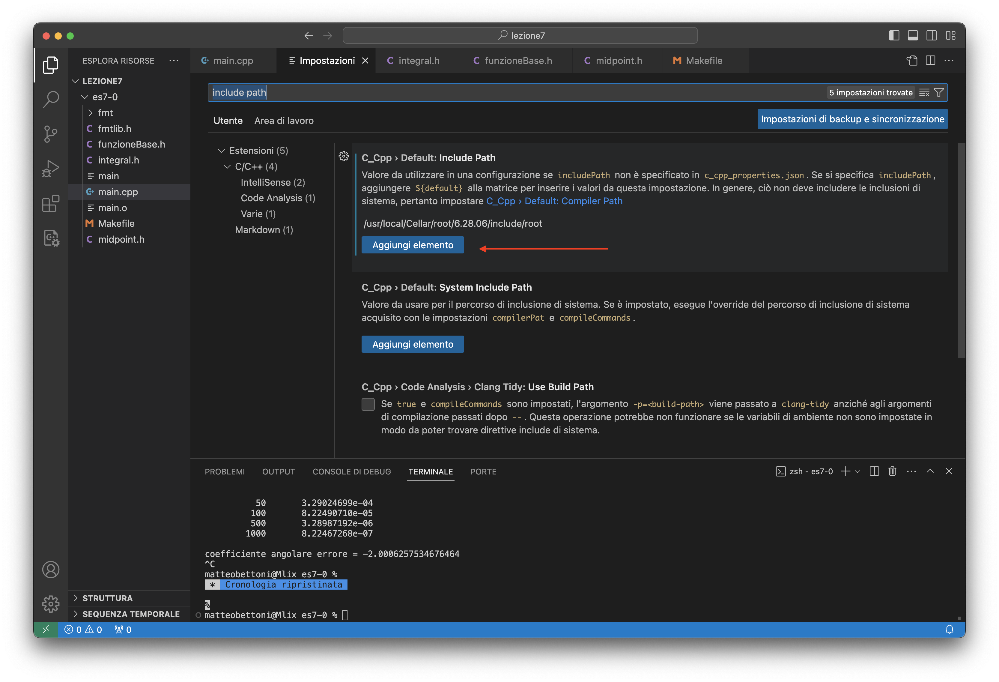

# Esercizi e spiegazioni

<center>
| Data                                      | Esercizi                                                        | Spiegazione                                                         |
|-------------------------------------------|-----------------------------------------------------------------|---------------------------------------------------------------------|
| 24 Settembre 2024                         | [Arrays](carminati-esercizi-01.html)                            | [Lezione 1](tomasi-lezione-01.html)                                 |
| 1 Ottobre 2024                            | [Classe `Vettore`](carminati-esercizi-02.html)                  | [Lezione 2](tomasi-lezione-02.html)                                 |
<!--
| 10 Ottobre 2024                           | [Template e `vector`](carminati-esercizi-03.html)               | [Lezione 3](tomasi-lezione-03.html)                                 |
| 17 Ottobre 2024                           | [Esercizi facoltativi](carminati-esercizi-04.html)              |                                                                     |
| 24 Ottobre 2024                           | [Classi ed ereditarietà](carminati-esercizi-05.html)            | [Lezione 5](tomasi-lezione-05.html)                                 |
| 31 Ottobre 2024                           | [Ricerca di zeri](carminati-esercizi-06.html)                   | [Lezione 6](tomasi-lezione-06.html)                                 |
| 7 Novembre 2024                           | [Quadratura numerica](carminati-esercizi-07.html)               | [Notebook 7](https://ziotom78.github.io/tnds-notebooks/lezione07/)  |
| 14 Novembre 2024                          | [Equazioni differenziali](carminati-esercizi-08.html)           | [Notebook 8](https://ziotom78.github.io/tnds-notebooks/lezione08/), [slides](tomasi-lezione-08.html) |
| 20 Novembre 2024                          | Idem                                                            | [Esempio svolto](2024-11-21 Equazioni differenziali Tomasi.pdf)     |
| 28 Novembre 2024                          | [Numeri pseudo-casuali e integrali](carminati-esercizi-10.html) | [Notebook 10](https://ziotom78.github.io/tnds-notebooks/lezione10/) |
| 5 Dicembre 2024                           | Idem                                                            | Idem                                                                |
| 12 Dicembre 2024                          | [Metodi Monte Carlo](carminati-esercizi-12.html)                | [Notebook 10](https://ziotom78.github.io/tnds-notebooks/lezione10/) |
-->
</center>

<!--
Link al Google Form per il [seminario su C++, Python e Julia](tomasi-lezione-08.html#/seminario-su-c-python-e-julia): <https://forms.gle/ZaDv5n6PjDEaNRoT8>. [Slides](tomasi-c++-python-julia.html).
-->


# Temi d'esame svolti

Carminati ha pubblicato sul sito del corso una serie di temi d'esame: <https://labtnds.docs.cern.ch/ProveEsame/TemiEsame/>. Su questo sito ho pubblicato una traccia di soluzione per ciascuno di essi, con una serie di commenti: [temi-svolti.html](temi-svolti.html).


# Come prepararsi all'esame scritto {#esamescritto}

Di seguito un piccolo vademecum per aiutarvi a svolgere nel migliore dei modi l'esame scritto.

#.  Potete mettere in pratica questo vademecum esercitandovi con i cinque temi pubblicati da Carminati a questo link: <https://labtnds.docs.cern.ch/ProveEsame/TemiEsame/>. Una spiegazione di come affrontarli è disponibile in una [pagina dedicata](temi-svolti.html).

#.  Dovete sapere **molto bene** la teoria per affrontare lo scritto, perché c'è sempre almeno una domanda la cui risposta è banalissima se si conoscono le equazioni che giustificano un metodo, quasi impossibile se non le si sanno. (Esempio: un problema potrebbe chiedere di determinare l'errore atteso da un integrale col metodo di Simpson, ma voi non sapete il valore vero. Nelle lezioni teoriche però si spiega qual è la relazione tra il passo $h$ del metodo di Simpson e l'errore atteso, e si fornisce pure una formula matematica per stimare l'errore senza sapere il valore esatto dell'integrale).

#.  Curate benissimo gli esercizi, ed arrivate il giorno dello scritto con un archivio ordinato di tutti i file che vi serviranno. Vi raccomando di mettere tutto il codice in file `.h` evitando i file `.cpp`. Se quindi avete implementato una classe in questo modo:

    ```c++
    // File RandomGen.h

    #pragma once

    class RandomGen {
      RandomGen::RandomGen(int seed);

      // Etc.
    };


    // File RandomGen.cpp

    #include "RandomGen.h"

    RandomGen::RandomGen(int seed) {
      // Implementation…
    }
    ```

    sarebbe meglio levare di mezzo il file `RandomGen.cpp` e avere tutto nel file `RandomGen.h`:

    ```c++
    // File RandomGen.h

    #pragma once

    class RandomGen {
      RandomGen::RandomGen(int seed) {
        // Here comes the implementation that was originally in RandomGen.cpp
      }

      // Etc.
    };
    ```

    Avere solo i file `.h` vi dà un grande vantaggio: non dovete complicare troppo il `Makefile` che scriverete durante il compito, perché basta includere i file `.h` che vi servono nel `main.cpp` e siete a posto. (Questo è esattamente quanto ho fatto nel file `gplot++.hpp`, che infatti non richiede modifiche al `Makefile` per essere usato).

    Per essere ancora più efficienti il giorno dello scritto, potreste addirittura decidere di mettere *tutte le funzioni e classi* che avete scritto in un unico file `.h`, chiamandolo ad esempio `mylibrary.h`. In questo modo sarà sufficiente scrivere `#include "mylibrary.h"` nel vostro file `main.cpp` ed avrete automaticamente a disposizione tutto il vostro lavoro! (**Attenzione**: in tal caso ricordatevi che ogni funzione che metterete in `mylibrary.h` dovrà essere dichiarata `inline`, ad esempio `inline double CalcolaMedia(const std::vector<double> & v)`, altrimenti potreste avere errori strani nella creazione dell'eseguibile).

#.  Leggete con attenzione il testo, e annotate a margine (o su un foglio di brutta) le cose che sono esplicitamente richieste e quali no. Capita che gli studenti si incaponiscano a produrre un grafico fatto in un certo modo, quando il testo richiedeva semplicemente di “tabulare i risultati” (ossia, stamparli semplicemente a video!)

#.  Prima di iniziare a scrivere codice come forsennati, provate a stimare almeno l'ordine di grandezza delle risposte. Alcuni esempi pratici:

    -   Se si fornisce una funzione e si chiedono gli zeri, fate un grafico con Gnuplot o con Excel per stimarli grossolanamente;

    -   Se si deve fare una simulazione di un esperimento per stimare l'errore su un certo parametro, provate a fare una semplice propagazione degli errori (se i conti non risultano troppo complicati!);

    -   Se si devono generare numeri casuali con una specifica distribuzione, implementate come prima cosa nel `main` un codice per estrarre ~10 000 numeri e fatene un istogramma: la sua forma corrisponde alla distribuzione fornita?

    -   Etc.

    Non spendete però troppo tempo per arrivare a una stima con carta e penna: se dopo dieci minuti di lavoro siete ancora in alto mare, lasciate perdere!

#.  Leggete *tutto* il testo dell'esame prima di iniziare a scrivere il codice. Magari nel primo punto vi viene chiesto di assumere una certa quantità fisica (una massa, una velocità…) come costante, ma in uno dei punti successivi dovete cambiarne il valore oppure addirittura trasformarla in una quantità che dipende dal tempo o dallo spazio. Se leggete prima tutto il testo, potete già fare caso a queste cose e progettare la struttura del codice in maniera più efficace.

#.  I temi di esame sono solitamente espressi come una lista di punti, ciascuno dei quali è una domanda. **MAI** implementare tutto il codice, da cima a fondo, che risolve tutti i punti e solo alla fine eseguirlo! Implementate il codice che vi serve per risolvere il primo punto, stampatelo, verificate i risultati, e quando vi convince passate al secondo. In questo modo, se i numeri prodotti per il primo punto appaiono strani, potete correggere gli errori prima di passare al punto successivo. Altrimenti rischiate di dover buttare via tutto il lavoro: magari vi rendete conto che per risolvere bene il primo punto avevate bisogno di *due* variabili `std::vector` anziché una sola, e di conseguenza quanto avete implementato per i punti successivi non è più valido.

#.  Non succederà mai che viene richiesto l'uso di ROOT o di Gnuplot esplicitamente; fare però i grafici è utile per avere l'intuizione se i risultati che il vostro codice produce sono sensati oppure no.

#.  Prima di fare i grafici, preoccupatevi **sempre** di stampare con `cout` o con `fmt::println` i valori tabulati delle quantità che andate a mettere nei grafici. Noi docenti siamo sempre disposti a chiudere un occhio se un grafico risulta sbagliato o vuoto, però i valori che il programma stampa a video sono corretti: vuol dire che avete semplicemente sbagliato a creare il grafico, e questo è un errore assolutamente perdonabile.

    Nel caso di simulazioni Monte Carlo, i numeri da stampare sono sempre moltissimi, quindi stampatene giusto qualcuno:

    ```c++
    const int num_of_simulations = 10'000;
    std::vector<double> results{num_of_simulations};

    for(int i{}; i < num_of_simulations; ++i) {
      results[i] = run_simulation();

      // Stampo i primi 5 valori calcolati a video, giusto come controllo
      if(i < 5) {
        fmt::println("{}\t{}", i, results[i]);
      }
    }
    ```

#.  Capita spesso che venga richiesto di ripetere un'analisi più volte. Ad esempio, si deve calcolare un integrale col metodo di Simpson usando un numero di step via via crescente, o si deve risolvere un'equazione differenziale variando il numero di passi, etc.

    Alcuni studenti, presi dal “panico dell'esame”, lavorano di copia-e-incolla: risolvono il problema nel primo caso, poi copiano e incollano lo stesso codice nel `main` tante volte quante sono i casi da studiare, e aggiustano a mano quei parametri che vanno aggiornati. Ecco un esempio:

    ```c++
    int main() {
      // Il tema d'esame richiede di simulare un esperimento N volte
      // e stimare l'errore su un certo parametro A, e chiede di
      // vedere come l'errore su A cambia al variare di N. Il testo
      // chiede di far assumere a N i valori { 100, 500, 1000, 5000 }.

      double risultato{};

      // Codice per N = 100
      for(int i{}; i < 100; ++i) {
        // Qui aggiorno la variabile `risultato`
      }
      fmt::println("Risultato per N = 100: {}", risultato);

      // Codice per N = 500, copiato da sopra
      for(int i{}; i < 500; ++i) {
        // Qui aggiorno la variabile `risultato`
      }
      fmt::println("Risultato per N = 500: {}", risultato);

      // Codice per N = 1000, copiato da sopra
      for(int i{}; i < 1000; ++i) {
        // Qui aggiorno la variabile `risultato`
      }
      fmt::println("Risultato per N = 1000: {}", risultato);

      // Codice per N = 5000, copiato da sopra
      for(int i{}; i < 1000; ++i) {
        // Qui aggiorno la variabile `risultato`
      }
      fmt::println("Risultato per N = 5000: {}", risultato);
    }
    ```

    Questo porta ad alcuni problemi gravi:

    -   Se vi accorgete solo dopo aver fatto copia-e-incolla che c'era un errore nel caso con `N = 100`, lo dovrete correggere per tutti gli altri casi. Questo vi farà sprecare molto tempo, che in un esame è una risorsa preziosa;

    -   In ognuna delle copie del codice che avete incollato bisogna ovviamente cambiare qualcosa qua e là; è facile che ci sia almeno una di quelle copie in cui modificate la riga sbagliata, oppure non la modificate del tutto. (È il caso dell'esempio sopra: ve ne eravate accorti?)

    La cosa migliore da fare è quella di spostare il codice che va ripetuto all'interno di una funzione, e poi chiamarla più volte nel `main`:

    ```c++
    double calcola_risultato(int N) {
      // Qui va tutta l'implementazione del calcolo
      // ...
    }

    int main() {
      std::vector<int> list_of_N{100, 500, 1000, 5000};

      for(int i{}; i < (int) list_of_N.size(); ++i) {
        // Ricordate di usare list_of_N.at(i) anziché list_of_N[i],
        // perché così il compilatore controlla che il valore di `i`
        // non esca dai limiti del vettore
        int cur_N{list_of_N.at(i)};

        double risultato{calcola_risultato(cur_N)};
        fmt::println("Risultato per N = {}: {}", cur_N, risultato);
      }
    }
    ```

    Per fare un esempio un po' più complicato, immaginiamo che vi venga chiesto di fare la simulazione di un esperimento dati tre parametri $A$, $B$ e $C$, e che l'esercizio si articoli in tre punti:

    -   Prima dovete calcolare il risultato dell'esperimento supponendo che il parametro $A$ sia affetto da errore, mentre altre due quantità $B$ e $C$ usate nella simulazione non hanno errore;

    -   Poi dovete invece supporre che sia $B$ affetto da errore, ma non $A$ e $C$;

    -   Infine dovete supporre che solo $C$ sia affetto da un errore.

    Si possono inventare soluzioni sofisticate che impieghino un `std::vector` per seguire l'idea della variabile `list_of_N` nell'esempio precedente, ma nel caso di uno scritto (in cui il tempo è limitato) è meglio non stare a lambiccarsi troppo… Il codice seguente va più che bene:

    ```c++
    double calcola_risultato(double A, double err_A,
                             double B, double err_B,
                             double C, double err_C) {
      // Qui va tutta l'implementazione della logica, che può essere lunga!
      // ...
    }

    int main() {
      // Questi sono i parametri dell'esperimento, che immaginiamo siano
      // forniti nel testo dell'esercizio
      double A_rif{1.0};
      double B_rif{2.0};
      double C_rif{3.0};
      double err_A_rif{0.03};
      double err_B_rif{0.05};
      double err_C_rif{0.02};

      // Soluzione del primo punto: introduco solo un errore su A
      double risultato1{calcola_risultato(A_rif, err_A_rif, B_rif, 0.0, C_rif, 0.0)};

      // Soluzione del secondo punto: introduco solo un errore su B
      double risultato2{calcola_risultato(A_rif, 0.0, B_rif, err_B_rif, C_rif, 0.0)};

      // Soluzione del terzo punto: introduco solo un errore su C
      double risultato3{calcola_risultato(A_rif, 0.0, B_rif, 0.0, C_rif, err_C_rif)};

      // Stampo i risultati
      fmt::println("Punto 1 (errore solo su A): {}", risultato1);
      fmt::println("Punto 2 (errore solo su B): {}", risultato2);
      fmt::println("Punto 3 (errore solo su C): {}", risultato3);
    }
    ```

#.  Prima di consegnare lo scritto, rimettete a posto la formattazione. Se usate Replit, è sufficiente premere Ctrl+S dopo aver modificato ciascun file. Altrimenti, dal terminale eseguite questo comando, che è molto più rapido:

    ```
    clang-format -i *.cpp *.h
    ```

    per sistemare le indentazioni e i rientri di tutti i file `*.h` e `*.cpp` presenti nella cartella. Questo vi farà fare un figurone! (Sarebbe stata un'ottima cosa fare lo stesso anche per gli esercizi che avete consegnato. Ma se state leggendo queste righe per la prima volta solo il giorno dello scritto, ahimè è troppo tardi…)


# Suggerimenti vari


## Configurazione del compilatore {#gcc}

Per fare in modo di usare l'ultima versione disponibile del compilatore GCC, digitate questo comando:

```
/home/comune/labTNDS_programmi/enable-latest-gcc
```

Dopodiché chiudete il terminale e riapritelo. Verificate che ora il comando `g++` usi la versione 13 del compilatore:

```
$ g++ --version
g++ (GCC) 13.2.1 20231205 (Red Hat 13.2.1-6)
Copyright (C) 2023 Free Software Foundation, Inc.
This is free software; see the source for copying conditions.  There is NO
warranty; not even for MERCHANTABILITY or FITNESS FOR A PARTICULAR PURPOSE.
```

È sufficiente eseguire il programma `enable-latest-gcc` **una volta sola**, perché poi la configurazione resta salvata.


## Installazione di ROOT e Gnuplot {#rootgnuplot}

A partire dal Gennaio 2022, Repl.it non fornisce più una serie di programmi nelle proprie Repl, e purtroppo tra i programmi rimossi c'è anche Gnuplot. I docenti hanno provveduto ad installare sia ROOT che Gnuplot in ciascuno dei template usati per gli esercizi, ma questo non avviene se volete creare voi Repl aggiuntive.

Se avete creato una Repl per conto vostro e volete configurarla esattamente come quelle usate a lezione, eseguite questo comando dalla console della nuova Repl:

<p><input type="text" value="curl -s https://ziotom78.github.io/tnds-tomasi-notebooks/install_standard_packages | sh" id="installStdPackages" readonly="1" size="60"><button onclick='copyFmtInstallationScript("installStdPackages")'>Copia</button></p>

Una volta eseguito, ROOT e Gnuplot, più altri utili programmi, saranno installati ed operativi.

## Uso della libreria `fmt` {#fmtinstall}

Siete invitati ad impratichirvi con la libreria [fmt](https://github.com/fmtlib/fmt), che potete installare usando lo script [`install_fmt_library`](./install_fmt_library): si esegue con il comando `sh install_fmt_library`, e il comando **va eseguito nella directory in cui avete i vostri codici!**.

Lo script `install_fmt_library` è già fornito nei template degli esercizi forniti per il turno T2, ma potete installarlo anche in altre Repl con questo comando:

<p><input type="text" value="curl https://ziotom78.github.io/tnds-tomasi-notebooks/install_fmt_library | sh" id="installFmt" readonly="1" size="60"><button onclick='copyFmtInstallationScript("installFmt")'>Copia</button></p>

**Importante**: Il comando va dato all'interno della directory in cui codificate l'esercizio. Ciò significa che **ciascuna** delle directory che contiene un esercizio per cui è necessario usare `fmt` deve contenere una copia della libreria. Non preoccupatevi di sprecare spazio, perché la libreria `fmt` occupa pochi centinaia di KB.

Se non avete il comando `curl` o state usando Windows, scaricate questo [file zip](./fmtlib.zip) nella directory di ciascun esercizio in cui prevedete di usare `fmt` e decomprimetelo.

Questo è un esempio che mostra come installare ed usare la libreria:

<center>
  <script id="asciicast-FolwvNAVKQTqGXQs4grz4qjFk" src="https://asciinema.org/a/FolwvNAVKQTqGXQs4grz4qjFk.js" async></script>
</center>

## Gplot++ {#gplotinstall}

Se avete difficoltà ad usare ROOT, potete interfacciare il vostro codice a [Gnuplot](http://www.gnuplot.info/) mediante la libreria [gplot++](https://github.com/ziotom78/gplotpp): è sufficiente scaricare il file [`gplot++.h`](https://raw.githubusercontent.com/ziotom78/gplotpp/master/gplot%2B%2B.h), oppure eseguire questo comando:

<p><input type="text" value="curl 'https://raw.githubusercontent.com/ziotom78/gplotpp/master/gplot%2B%2B.h' > gplot++.h" id="installGplot" readonly="1" size="60"><button onclick='copyFmtInstallationScript("installGplot")'>Copia</button></p>

Ricordate che la libreria funziona a patto che abbiate installato Gnuplot sul vostro computer.


## ROOT e Visual Studio Code {#rootvscode}

(Suggerimento di Matteo Bettoni) Di default, Visual Studio Code non riconosce le librerie di ROOT e segnala quindi errore quando incontra istruzioni come

```c++
#include "TGraph.h"
```

Un modo per togliere queste segnalazioni di errore è quello di aprire il menu “Impostazioni”, e scegliere la voce “Estensioni”/“C/C++”/“Intellisense” e selezionare “Default: Include Path”. Premere il bottone “Aggiungi elemento”, ed inserire nella casella di testo il contenuto dell'output del comando

```
root-config --incdir
```




---
title: Lezioni del corso di TNDS
author: Maurizio Tomasi
date: A.A. 2024−2025
lang: it-IT
header-includes: <script src="./fmtinstall.js"></script>
css:
- ./css/asciinema-player.css
...
