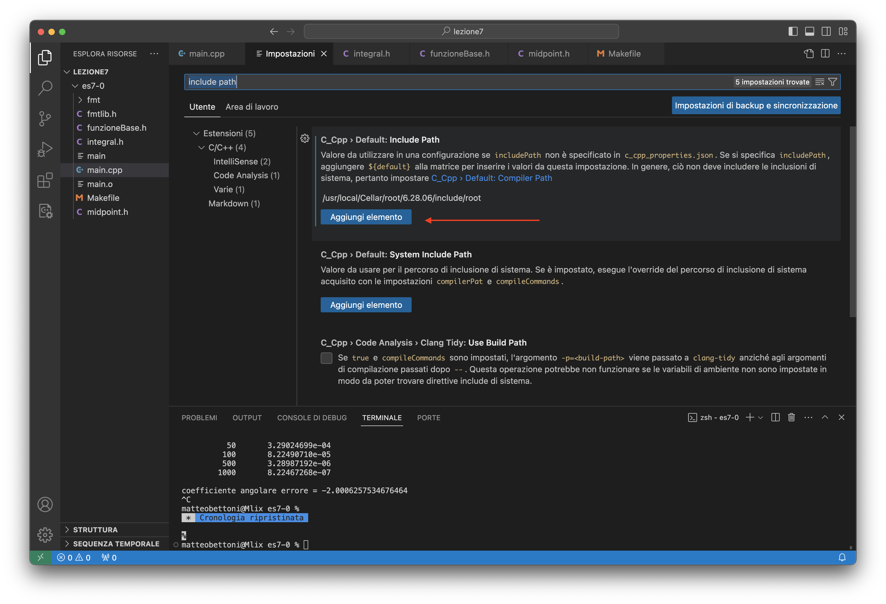

# Configurazione del compilatore sui computer del laboratorio {#gcc}

Il compilatore `g++` disponibile di default sui computer del laboratorio è molto vecchio:

```sh
$ g++ --version
g++ (GCC) 8.5.0 20210514 (Red Hat 8.5.0-26)
Copyright (C) 2018 Free Software Foundation, Inc.
This is free software; see the source for copying conditions.  There is NO
warranty; not even for MERCHANTABILITY or FITNESS FOR A PARTICULAR PURPOSE.
```

Per fare in modo di usare l'ultima versione disponibile del compilatore GCC, digitate questo comando:

```
/home/comune/labTNDS_programmi/enable-latest-gcc
```

Dopodiché chiudete il terminale e riapritelo. Verificate che ora il comando `g++` usi la versione 13 del compilatore:

```
$ g++ --version
g++ (GCC) 14.2.1 20250110 (Red Hat 14.2.1-7)
Copyright (C) 2024 Free Software Foundation, Inc.
This is free software; see the source for copying conditions.  There is NO
warranty; not even for MERCHANTABILITY or FITNESS FOR A PARTICULAR PURPOSE.
```

È sufficiente eseguire il programma `enable-latest-gcc` **una volta sola**, perché poi la configurazione resta salvata.


# Gplot++ {#gplotinstall}

Se avete difficoltà ad usare ROOT, potete interfacciare il vostro codice a [Gnuplot](http://www.gnuplot.info/) mediante la libreria [gplot++](https://github.com/ziotom78/gplotpp): è sufficiente scaricare il file [`gplot++.h`](https://raw.githubusercontent.com/ziotom78/gplotpp/master/gplot%2B%2B.h), oppure eseguire questo comando:

<p><input type="text" value="curl 'https://raw.githubusercontent.com/ziotom78/gplotpp/master/gplot%2B%2B.h' > gplot++.h" id="installGplot" readonly="1" size="60"><button onclick='copyFmtInstallationScript("installGplot")'>Copia</button></p>

A differenza di ROOT, non è necessario modificare il Makefile per usarla, perché è una libreria *header-only*.

Ricordate che la libreria funziona a patto che abbiate installato Gnuplot sul vostro computer. Seguite le [istruzioni nel README](https://github.com/ziotom78/gplotpp?tab=readme-ov-file#installing-gnuplot-and-gploth), specialmente se usate Windows.


# ROOT e Visual Studio Code {#rootvscode}

(Suggerimento di Matteo Bettoni) Di default, Visual Studio Code non riconosce le librerie di ROOT e segnala quindi errore quando incontra istruzioni come

```c++
#include "TGraph.h"
```

Un modo per togliere queste segnalazioni di errore è quello di aprire il menu “Impostazioni”, e scegliere la voce “Estensioni”/“C/C++”/“Intellisense” e selezionare “Default: Include Path”. Premere il bottone “Aggiungi elemento”, ed inserire nella casella di testo il contenuto dell'output del comando

```
root-config --incdir
```



# Installazione di ROOT e Gnuplot in Replit (obsoleto) {#rootgnuplot}

A partire dal Gennaio 2022, Repl.it non fornisce più una serie di programmi nelle proprie Repl, e purtroppo tra i programmi rimossi c'è anche Gnuplot. I docenti hanno provveduto ad installare sia ROOT che Gnuplot in ciascuno dei template usati per gli esercizi, ma questo non avviene se volete creare voi Repl aggiuntive.

Se avete creato una Repl per conto vostro e volete configurarla esattamente come quelle usate a lezione, eseguite questo comando dalla console della nuova Repl:

<p><input type="text" value="curl -s https://ziotom78.github.io/tnds-tomasi-notebooks/install_standard_packages | sh" id="installStdPackages" readonly="1" size="60"><button onclick='copyFmtInstallationScript("installStdPackages")'>Copia</button></p>

Una volta eseguito, ROOT e Gnuplot, più altri utili programmi, saranno installati ed operativi.


---
title: Suggerimenti vari
author: Maurizio Tomasi
date: A.A. 2024−2025
lang: it-IT
css:
- ./css/asciinema-player.css
...
