Qt Creator è un'Integrated Development Environment (IDE) per il C++, sviluppato dalla compagnia norvegese Trolltech. È un sistema semplice ma potente che integra le funzionalità di diversi programmi:

-   Un editor, come Visual Studio Code;

-   Un compilatore C++, come `g++` o `clang++`;

-   Sistemi di *build* come `make` e CMake;

-   Un debugger, come `gdb`;

-   Un programma per formattare automaticamente il codice, come `clang-format`;

-   Una finestra di terminale da cui eseguire i propri programmi.

Il nome IDE deriva proprio dal rendere tutte queste potenzialità disponibili nel medesimo ambiente.


# Configurare Qt Creator

Di default, la versione di Qt Creator sui computer del laboratorio usa un compilatore che non è compatibile con i nostri programmi. Prima di usarlo occorre quindi configurare i compilatori.

Avviate Qt Creator e dal menu *Edit* in alto a destra selezionate la voce *Preferences…*.

Tra le voci nella lista a sinistra, scegliete *Kits*:

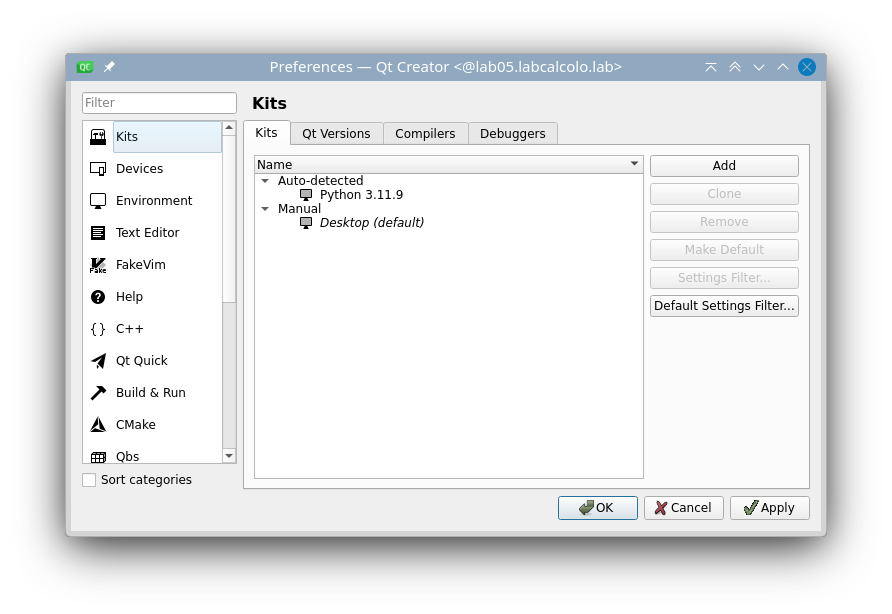

Selezionate dalla lista centrale la voce che è scritta in corsivo e riporta in coda “*(default)*”; nell'immagine sotto è *Desktop (default)*. Quando fate click con il mouse, dovrebbero comparire una serie di controlli in basso: *Name*, *File system name*, *Run device type*, etc.

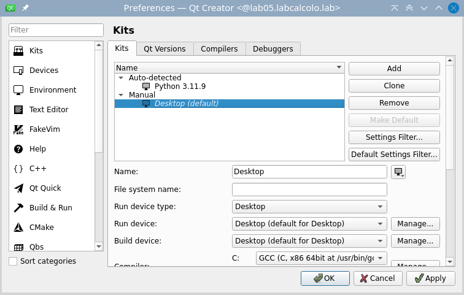

Scorrete verso il basso e controllate cosa viene riportato alla voce *Compiler*. Se compare *Clang* per il compilatore C++, questo è **sbagliato**:


Scegliete il compilatore GCC (opzionalmente, fatelo non solo per il C++ ma anche per il C), poi scegliete il bottone *Apply* e quindi *Ok*:

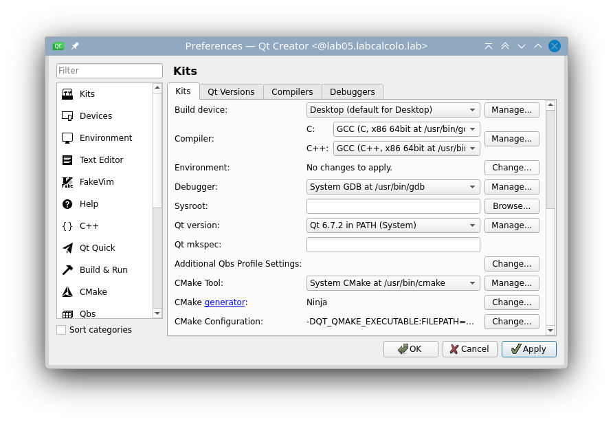

Ora Qt Creator dovrebbe essere configurato correttamente.


# Come usare Qt Creator

Di default, Qt Creator crea un progetto che usa le librerie Qt, il prodotto più famoso dell'azienda Trolltech. (Potete vederla come una libreria analoga a ROOT per dimensioni e complessità, che consente di sviluppare applicazioni grafiche per desktop e per dispositivi mobili come smartphone e tablet).

A noi **non** interessa però sviluppare con le librerie Qt, e avremo bisogno di impostazioni diverse da quelle di default, quindi per creare un nuovo progetto seguite queste istruzioni:

1.  Appena si apre la finestra principale, vi verrà proposto di creare un “Progetto”. Per progetto si intende una collezione di file C++, di header, e di makefile che servono per compilare un eseguibile. Dovrete quindi creare un progetto separato per ogni esercizio che farete. Selezionate dalla pagina principale il grande bottone verde *Create new project…*:

    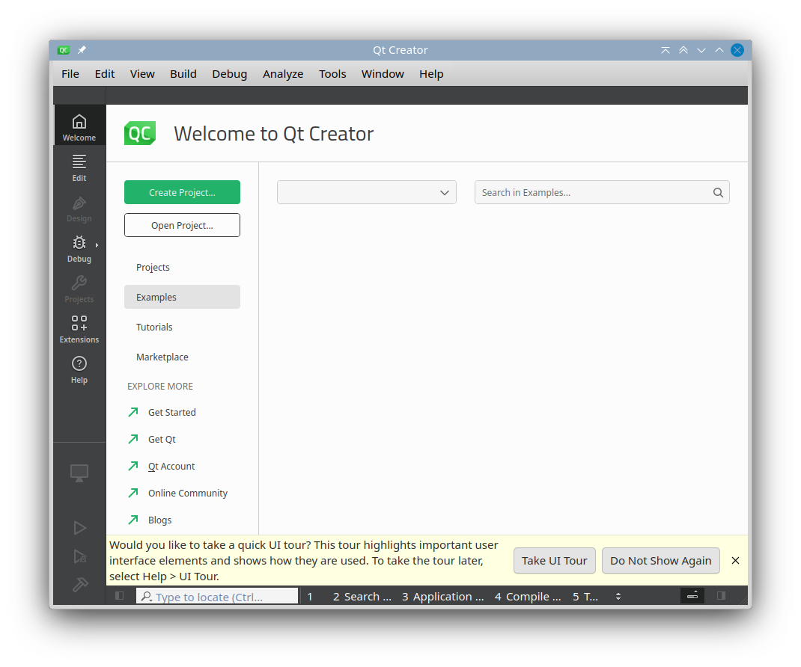

2.  Vi verrà chiesto che tipo di progetto creare. **Non dovete scegliere il default**, che prevede di usare le librerie Qt! Scegliete invece dal menu *Non-Qt project* la voce *Plain C++ Application*, come mostrato in figura:

    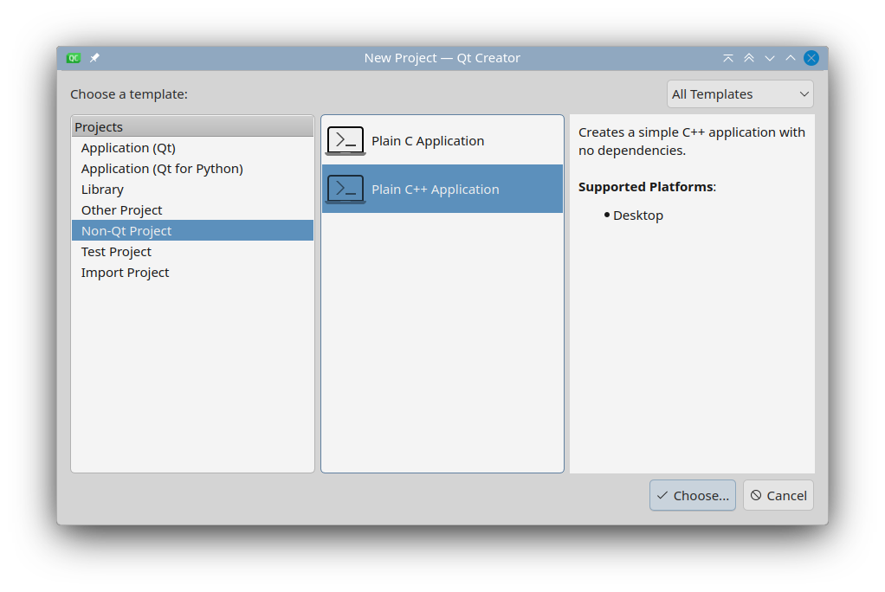

3.  Dovete ora specificare la cartella in cui tutti i file del progetto saranno salvati. Vi consiglio una cartella con il numero dell'esercizio scritto esplicitamente, come ad esempio `esercizio40` (purtroppo non potete usare il punto, quindi `esercizio4.0` non va bene):

    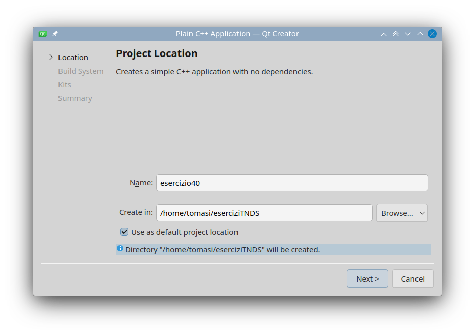

    Se selezionate la voce *Use as default project location*, tutte le directory con i nuovi progetti che creerete saranno salvate sotto quella indicata alla voce *Create in:* (nell'immagine sopra è `/home/tomasi/eserciziTNDS`). È **molto** consigliato!

4.  Lasciate tutte le altre voci inalterate e concludete la creazione del progetto. Vedrete che il programma aprirà il file contenente la funzione `main()`:

    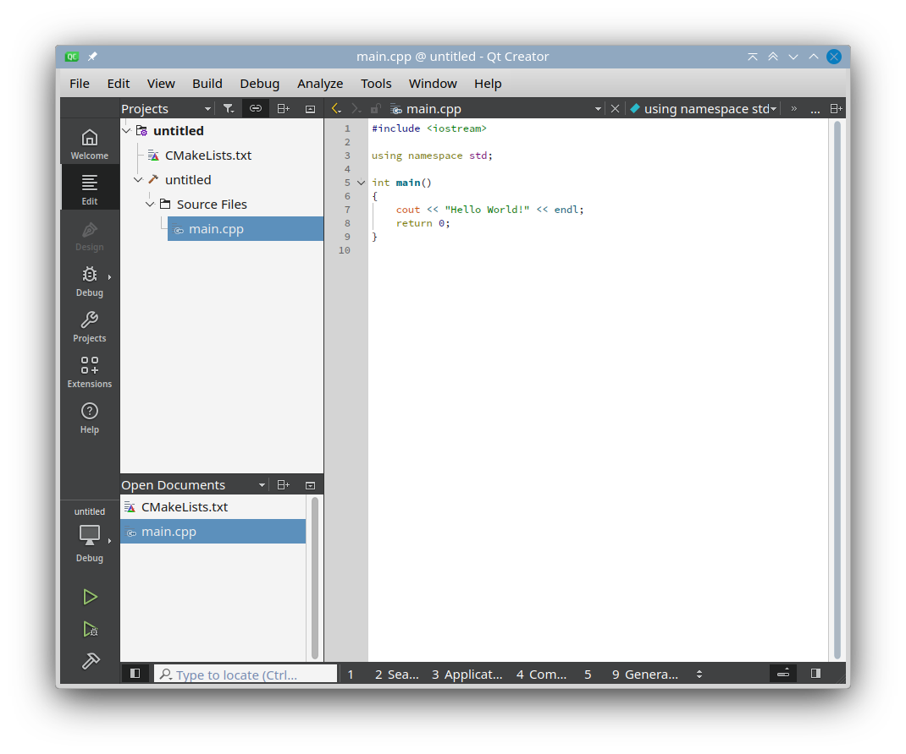

5.  Purtroppo la versione corrente di Qt Creator usa di default il linguaggio C++17, che è un po' troppo vecchio. Cambiate la versione modificando il file `CMakeLists.txt`: è sufficiente fare doppio click su di esso nel pannello in alto a sinistra per aprirlo. Cambiate da `17` a `20` il valore nella riga 5 che contiene il testo `set(CMAKE_CXX_STANDARD 17)`, e lasciate tutto il resto inalterato:

    

A questo punto il progetto è configurato, e potete iniziare a scrivere il codice! Quando volete salvare il file che state editando, premete `Ctrl+S`.

La pressione di `Ctrl+S` esegue una formattazione automatica del codice, aggiustando i rientri e le spaziature in modo automatico. È equivalente ad eseguire da terminale il comando

```
clang-format -i NOMEFILE.cpp
```


# Compilare ed eseguire il programma

Qt Creator prevede la comoda scorciatoia da tastiera `Ctrl+R` per eseguire queste azioni:

1.  Salva tutti i file ancora non salvati;

2.  Compila il programma;

3.  Mostra gli errori di compilazione in caso la compilazione sia fallita;

4.  Esegue il programma in caso di successo, mostrando l'output nel pannello inferiore.

Questo è il risultato di premere `Ctrl+R` nel semplice programma generato automaticamente da Qt Creator:

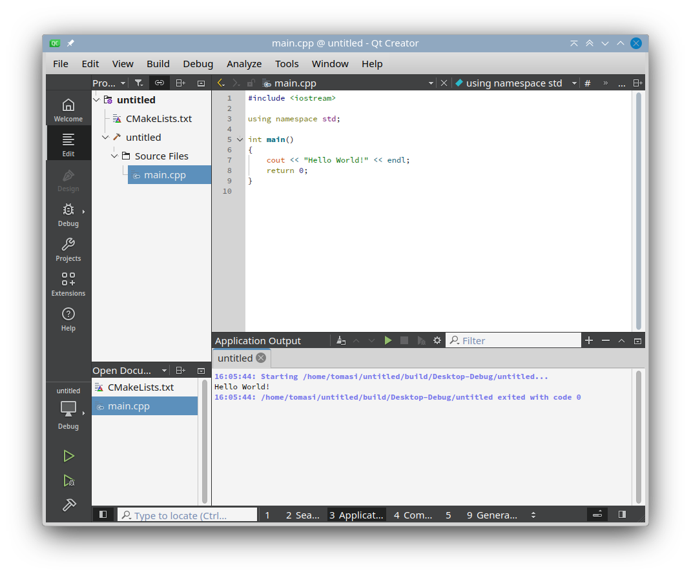

La combinazione `Ctrl+R` è forse la scorciatoia da tastiera **più importante**, e quella che vi risparmierà molto tempo nello sviluppo!

Se ci fosse un errore nel codice, ad esempio perché abbiamo dimenticato il punto e virgola `;` alla fine della riga del `cout`, questo è ciò che vedremmo:

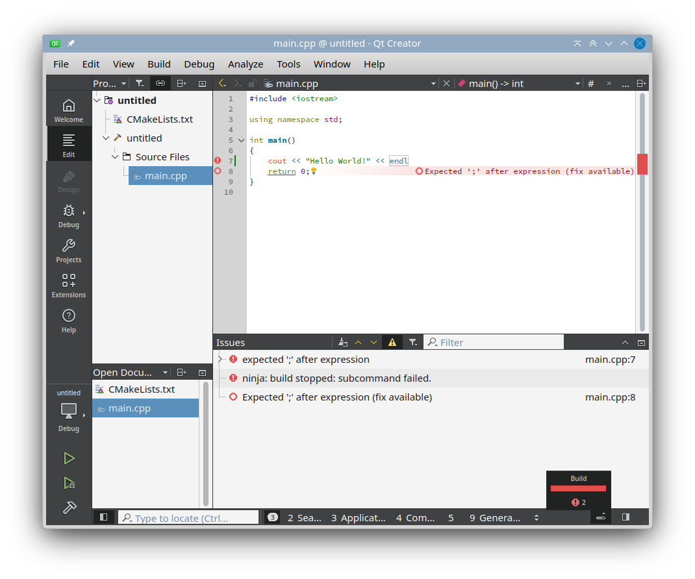

Non solo l'editor mostra l'errore sotto la riga incriminata, ma il pannello inferiore contiene una lista completa di ogni errore. Facendo click su uno di essi, l'editor si porta sulla riga incriminata per poterla modificare immediatamente.


# Aggiungere altri file al progetto

Difficilmente il vostro esercizio sarà contenuto in un solo file. Per aggiungere un nuovo file `.h` o `.cpp` al progetto, fate click col tasto destro sull'elemento *Source files* nell'albero delle directory a sinistra:

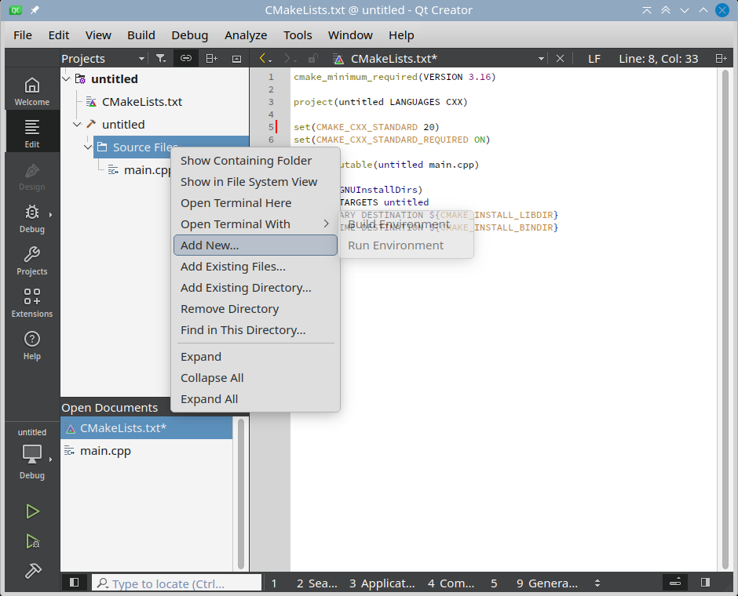

Scegliete la voce *Add new…* e selezionate se volete un file header (`.h`) o C++ (`.cpp`):

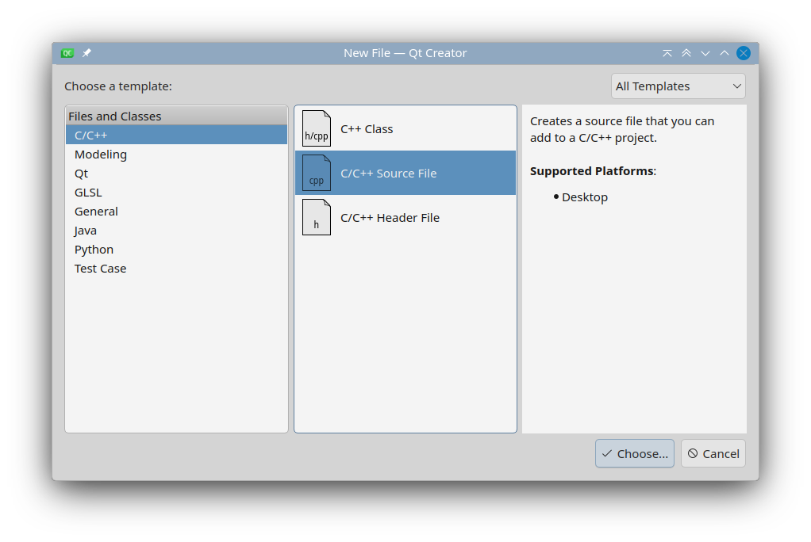

Indicate il nome del file, e se è un file `.cpp` vedrete che viene automaticamente aggiunto in `CMakeLists.txt`, come si vede in questo esempio dove il nome del nuovo file è `funzioni.cpp`:

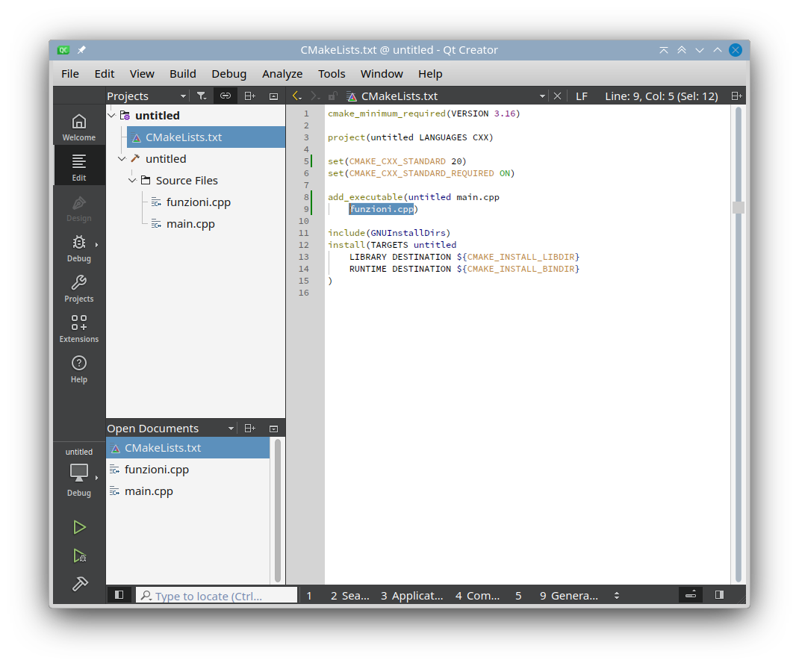

Questo significa che quando premerete `Ctrl+R` per compilare ed eseguire il programma, questo verrà incluso nella compilazione.


# Parametri da linea di comando

Molti esercizi di TNDS richiedono di passare parametri dalla linea di comando. Per informare il comando `Ctrl+R` di passare parametri aggiuntivi, occorre selezionare dalla barra scura a sinistra la voce “Project” e scegliere la voce “Run”. Inserite gli argomenti nella voce *Command line arguments*, come mostrato in figura:

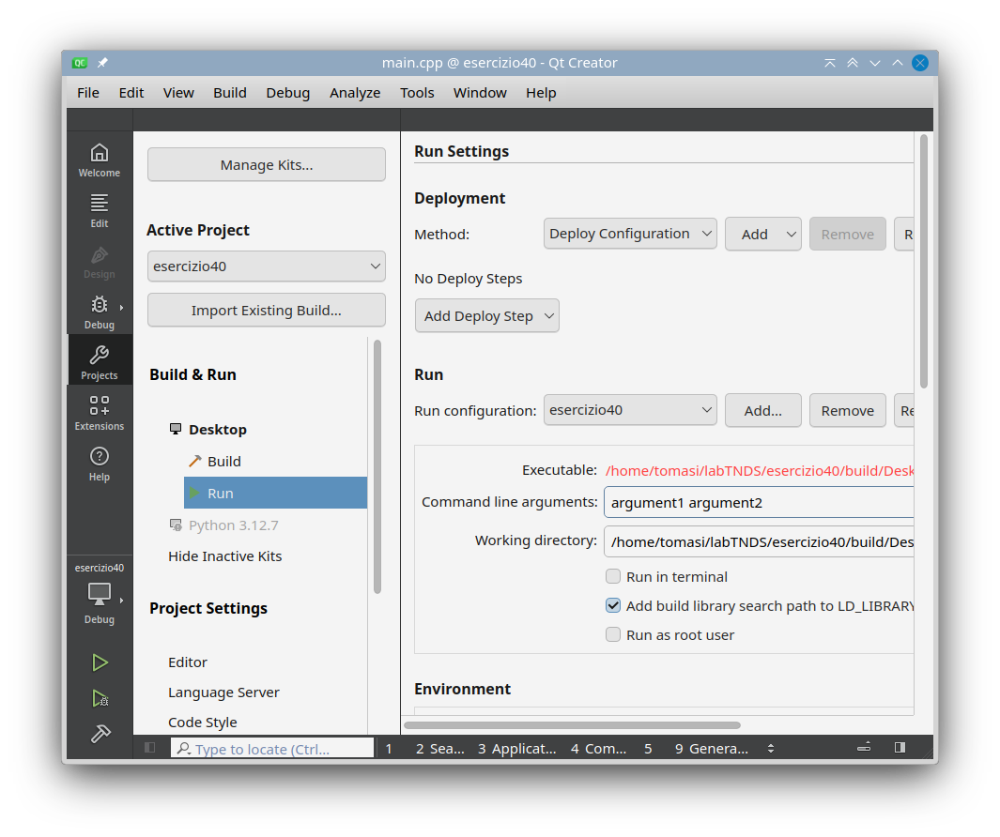

Digitando `argument1 argument2`, l'output di un programma che stampa il valore di `argv` è il seguente:

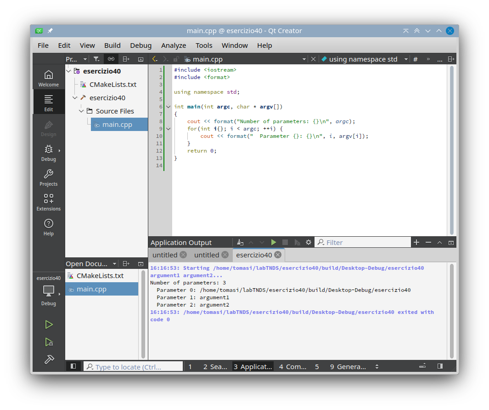

Notate che il valore di `argv[0]`, che contiene l'eseguibile, indica che la directory in cui è stato salvato l'eseguibile **non** è quella in cui sono salvati i file sorgente, ma è la sottodirectory `build/Desktop-Debug/`. Qt Creator funziona in questo modo per tenere separati i file generati dal compilatore e i file che compongono il codice sorgente del vostro programma: in `build/Desktop-Debug/` sono salvati anche tutti i file `*.o`, e quindi per “ripulire” la directory come se si facesse `make clean` è sufficiente cancellare la directory `build`.


# Refactoring

Col termine *refactoring* si intende la modifica del codice in modo da renderlo più leggibile.

Immaginiamo un programma minimamente complicato, che prenda in input un vettore di elementi $v_i$ e debba calcolare la quantità
$$
Q = \frac1{N}\sum_{i=1}^N \bigl(3 v_i + \sin(v_i)\bigr)^2.
$$

Definiamo quindi una funzione `f(x)` che calcoli il valore del termine nella somma:

```c++
double f(double x) {
    double pippo{x * 3 + sin(x)};
    return pippo * pippo;
}
```

dove abbiamo chiamato la variabile `pippo` perché non ci è venuto in mente un termine migliore. Implementiamo poi il `main`:

```c++
int main(int argc, char * argv[])
{
    vector v{5.4, 3.7, 6.9, 4.4, 3.7, 6.1};

    double pippo{};
    for(int i{}; i < ssize(v); ++i) {
        pippo += f(v[i]);
    }
    pippo /= ssize(v);

    cout << format("Q = {:.1f} for {} samples\n", pippo, ssize(v));
    return 0;
}
```

Ancora una volta, per la fretta chiamate la variabile `pippo`. Il programma funziona e stampa il valore di `Q`:


Però non vorreste consegnare un codice scritto così, con le variabili tutte chiamate `pippo`. Ma d'altra parte non potete usare la funzione *Edit | Find/Replace* (tasto `Ctrl+F`), perché vorreste usare un nome diverso per la variabile `pippo` nella funzione `f()` e per `pippo` nel `main()`.

Gli strumenti di *refactoring* fanno esattamente al caso vostro: è sufficiente spostarsi con il cursore sul nome della variabile o funzione da rinominare e premere `Ctrl+Shift+R` per modificare al volo solo quell'istanza. Nel caso di funzioni o metodi di classi, Qt Creator cambierà tutte le corrispondenze **nell'intero progetto**, anche se sono in file `.cpp` o `.h` separati. Questo video mostra la combinazione `Ctrl+Shift+R` applicata al nostro esempio:

<video controls>
  <source src="media/qtcreator-refactor.webm" type="video/webm; codecs=vp9,vorbis">
  <source src="media/qtcreator-refactor.mp4" type="video/mp4">
</video>


# Debugging

Qt Creator consente di eseguire i programmi in modalità *debugging*, per monitorarne l'esecuzione.

Eseguire un programma in modalità *debugging* permette ad esempio di arrestarne l'esecuzione quando arriva a una certa riga, eseguire il programma una riga alla volta, ispezionare ed addirittura modificare il valore delle variabili!

Il modo più semplice per usare la modalità debugging è di fare click con il mouse immediatamente a sinistra del numero della riga da fermare. In questo esempio ho fatto click accanto alla riga #17, ed è apparso un cerchio rosso che indica l'esistenza di un *breakpoint* (si può far apparire o scomparire il *breakpoint* anche premendo il tasto `F9`):

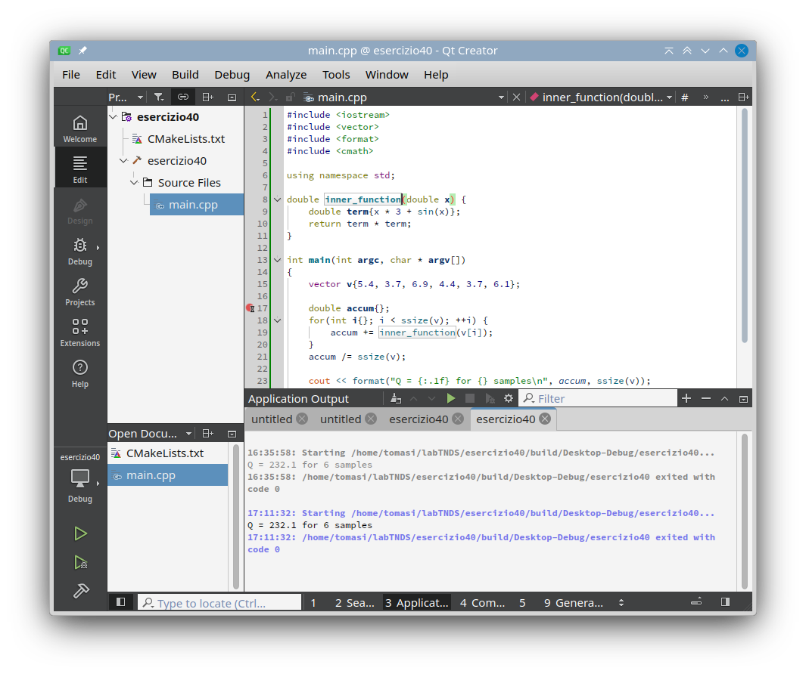

A questo punto, premendo `F5` o scegliendo dal menu *Debug* la voce *Start debugging*, il programma sarà compilato ed eseguito, ma l'esecuzione verrà arrestata appena il programma sta per eseguire la riga 17:

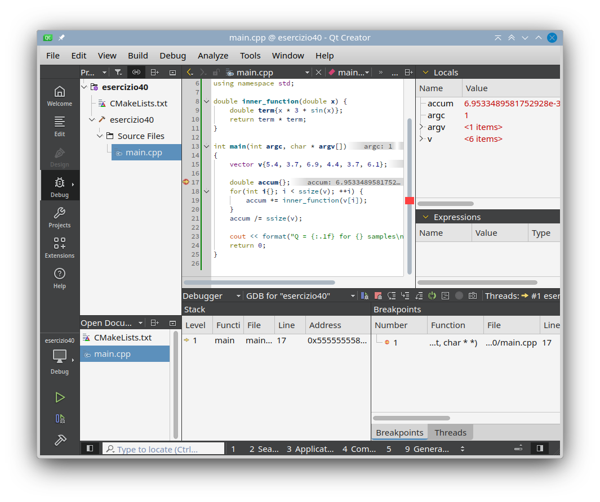

Il programma è stato “congelato” appena prima che potesse eseguire la riga

```c++
double accum{};
```

È comparso un pannello in alto a destra che mostra che la variabile `accum` è già stata allocata, ma non è ancora stata inizializzata a zero: infatti il suo valore è un numero casuale (`6.9533…`). Possiamo vedere anche che `argc` vale `1`, e facendo click sul simbolo `>` a sinistra di `argv` e di `v` ispezionare gli elementi dei due vettori.

Il programma può essere fatto uscire dalla sua condizione “congelata” in vari modi:

-   Il tasto `F5` fa riprendere l'esecuzione normalmente, fino al *breakpint* successivo (se c'è) o fino alla fine naturale del programma (voce *Continue* del menu *Debug*)

-   Il tasto `F10` esegue la riga corrente e va alla prossima (voce *Step over*);

-   Il tasto `F11` è come il tasto `F10`, ma se la riga corrente contiene l'invocazione a una funzione, come ad esempio `inner_function`, l'esecuzione “entra” nella funzione e si ferma lì (voce *Step into*);

-   Il tasto `Shift+F11` esegue la funzione in cui ci si trova finché questa non termina, poi congela di nuovo il programma (voce *Step out*);

-   Posizionandosi su una linea arbitraria e premendo `Ctrl+F10`, il programma riprende l'esecuzione finché non raggiunge quella linea (voce *Run to line*); equivale all'impostazione di un *breakpoint* “temporaneo”.


Esistono molte funzionalità più avanzate per fare *debugging*; ve ne elenco alcune:

-   È possibile modificare il valore di una variabile facendo doppio click sul suo nome nel pannello più a destra;

-   Facendo click col tasto destro sul simbolo rosso di un *breakpoint*, è possibile impostare condizioni per stabilire quando deve essere eseguito;

-   È possibile aggiungere espressioni complesse (ad esempio, `2 * accum + v[0]`), il cui risultato verrà stampato ogni volta che il programma si ferma.


# Usare ROOT con Qt Creator

Se il vostro programma usa ROOT, dovete modificare il file `CMakeLists.txt` aggiungendo prima della riga `add_executable(…)` la riga seguente:

```
find_package(ROOT REQUIRED)
```

che dice a CMake che il vostro programma non può essere compilato se non è installata la libreria ROOT, e in fondo al file

```
target_link_libraries(esercizioXXX ${ROOT_LIBRARIES})
```

che dice che l'eseguibile `esercizioXXX` (il nome deve essere lo stesso dentro la parentesi dopo `add_executable`) va compilato insieme alle librerie ROOT.

Ad esempio, la riga

```
add_executable(esercizio40 main.cpp funzioni.cpp)
```

deve diventare

```
find_package(ROOT REQUIRED)
add_executable(esercizio40 main.cpp funzioni.cpp)
target_link_libraries(main ${ROOT_LIBRARIES})
```


# Usare gplot++ con Qt Creator

Basta copiare il file `gplot++.h` nella cartella del progetto. Non è necessario aggiornare `CMakeLists.txt`, perché la libreria consiste solo del file header.


# E i Makefile?

Qt Creator **non** usa il programma `make`; di default usa [Ninja](https://ninja-build.org/), che è una versione più moderna di `make` (soprattutto, è molto più efficiente!).

Se l'eseguibile `ninja` non è presente, Qt Creator dovrebbe essere in grado di appoggiarsi a `make`.


---
title: Usare Qt Creator
author: Maurizio Tomasi
lang: it-IT
header-includes: <script src="./fmtinstall.js"></script>
css:
- ./css/asciinema-player.css
...
