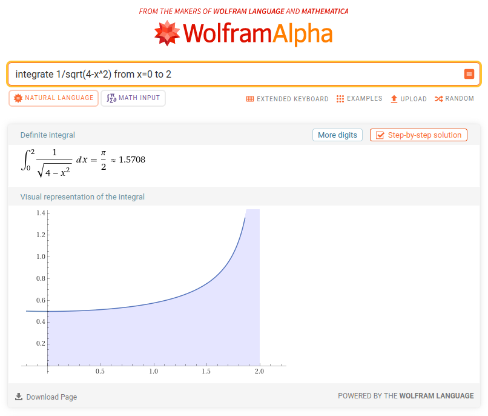
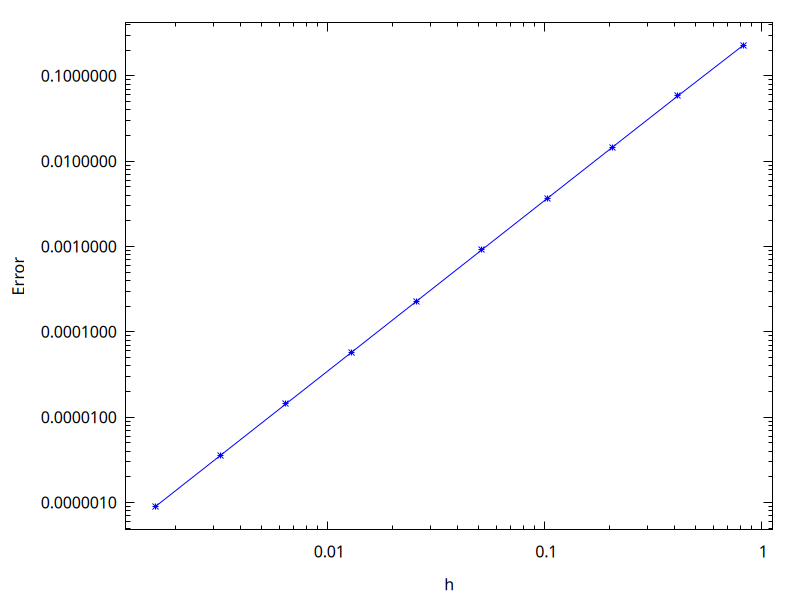
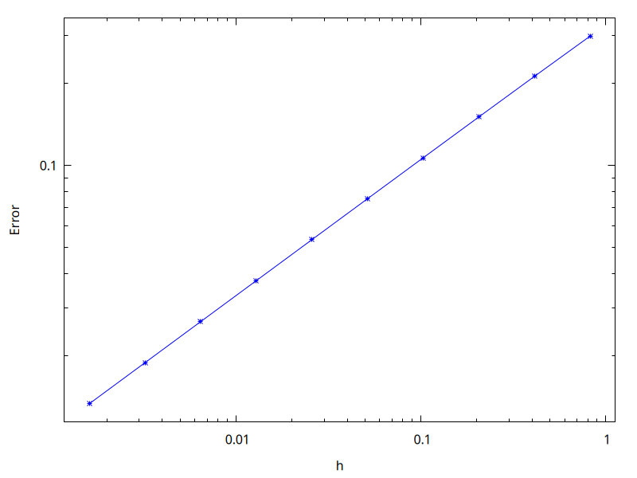
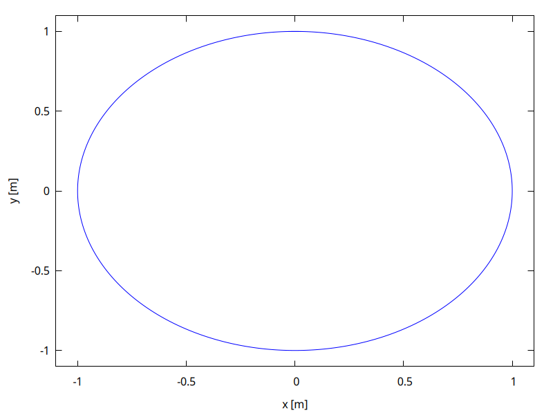
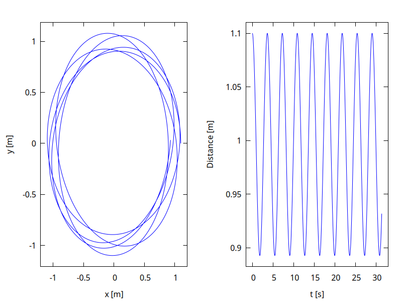
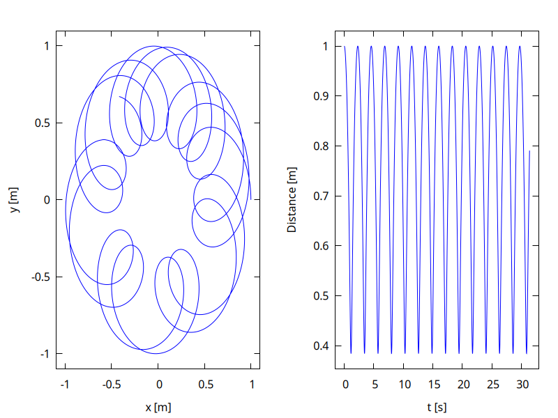
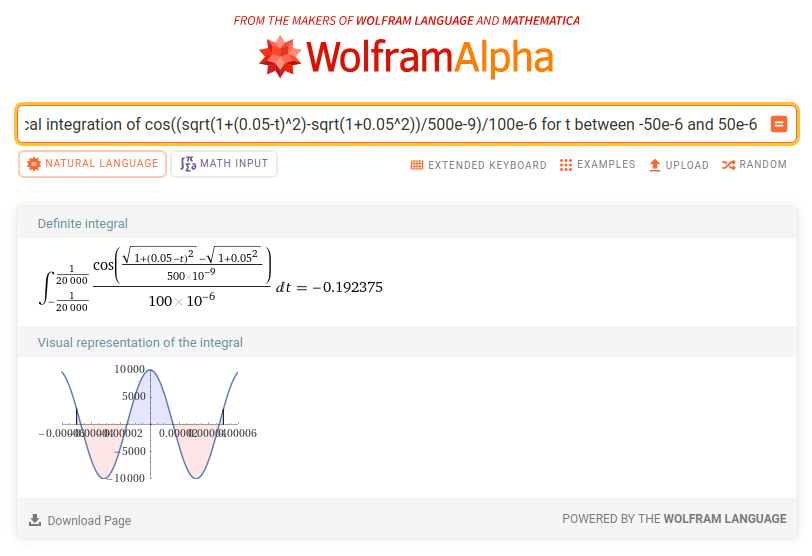

In questa pagina fornisco indicazioni utili allo svolgimento dei temi d'esame messi a disposizione da Carminati alla pagina <https://labtnds.docs.cern.ch/ProveEsame/TemiEsame/>.

# Premessa

Prima di discutere come svolgere i temi d'esame proposti da Carminati, vi fornisco qualche informazione di massima che si applica a ciascuno dei temi:

-   Non fornisco qui l'implementazione completa, perché ciò significherebbe condividere anche delle routine che devono essere implementate nel corso dell'anno da ciascuno studente (es., il metodo di bisezione, l'integrazione col metodo del punto medio, il metodo di Runge-Kutta…).

-   Non ripeto concetti già spiegati a lezione, ed assumo anzi che chi legge questa pagina abbia già una buona infarinatura della teoria ed abbia svolto e sistemato tutti gli esercizi.

-   In ogni tema uso tecniche un po' diverse da quelle che avete visto a lezione; di solito, queste varianti che vi mostro servono per rendere il codice più veloce da scrivere (importante nell'esame scritto, dove avete a disposizione solo due ore!).

-   Assumo che ciascuno di voi usi lo standard C++23: questo significa usare il flag `-std=c++23` con il compilatore.

-   Nei miei svolgimento non uso ROOT, ma Gnuplot interfacciato con la libreria [gplot++](https://github.com/ziotom78/gplotpp): lo trovo molto più semplice e veloce da usare. Fate riferimento a [questo link](miscellanea.html#gplotinstall) per sapere come installarlo sul vostro computer

-   Siete caldamente invitati a tenere presente i punti elencati al link [Come prepararsi all'esame scritto](prepararsi-esame.html) mentre leggete questa pagina!


# Alcuni trucchi sempre utili

Nello svolgimento dei temi d'esame presentato sotto faccio spesso ricorso ad alcuni trucchi, che illustro una volta per tutte in questa sezione

## Fare a meno dell'incapsulamento {#uso-di-struct}

Nell'[esercizio 5.0](carminati-esercizi-05.html#esercizio-5.0) abbiamo visto come si implementa una classe rispettando il principio dell'*incapsulamento*, in cui i dati della classe non sono direttamente accessibili all'esterno:

```c++
class Posizione {
public:
  // costruttori
  Posizione();
  Posizione(double x, double y, double z);

  // distruttore
  ~Posizione();

  // metodi
  double getX() const { return m_x; }
  double getY() const { return m_x; }
  double getZ() const { return m_z; }

  // […]

  double Distanza(const Posizione &) const; // distanza da un altro punto

private:
  // Dall'esterno è impossibile accedere a questi campi
  double m_x, m_y, m_z;
};
```

Questo è utile nel caso in cui si decida in futuro di cambiare il modo in cui la classe è implementata internamente. L'idea è che se si impedisce a chi usa la classe di sapere che le coordinate sono salvate in tre variabili chiamate `m_x`, `m_y` e `m_z`, sarà più facile cambiare poi la rappresentazione interna in qualcosa d'altro; ad esempio, si potrebbe cambiare la classe in modo che internamente si mantengano le coordinate sferiche, e `getX()`, `getY()` e `getZ()` ritornino quindi le componenti X/Y/Z calcolandone al volo la conversione da sferiche a cartesiane.

Tuttavia, implementare le classi in questo modo richiede un sacco di tempo e forza a compiere molte ripetizioni, aumentando la possibilità di errore. (Nell'esempio sopra, c'è un errore nel codice, ve ne eravate accorti?). L'idea dell'incapsulamento è quella di rendere il codice più facilmente modificabile in un futuro possibilmente lontano, ma il vostro esame scritto viene sviluppato giusto nel paio di ore richieste per la prova: l'incapsulamento è quindi inutile, oltre che potenzialmente dannoso per il tempo che vi fa sprecare.

Se volete definire una classe nel codice dell'esame, vi consiglio di farlo nel modo più rapido possibile:

#.  Definite tutti i metodi e i campi dati `public`.

#.  Non implementate funzioni `get*()` e `set*()`, perché se tutti i dati sono pubblici non servono.

#.  Evitate di definire i distruttori, a meno che non usiate `new` nel costruttore (non è il caso di `Posizione`, e in **nessuno** dei temi d'esame che abbiamo dato negli ultimi dieci anni è stato mai indispensabile usare `new`).

#.  Potete anche evitare di definire i costruttori: in tal caso il C++ ne implementerà uno di default, in cui vengono richiesti i valori di tutte le variabili membro. In altre parole, la classe

    ```c++
    class Posizione {
    public:
        Posizione(double x, double y, double z) : m_x{x}, m_y{y}, m_z{z} {}

        double m_x, m_y, m_z;
    };
    ```

    può essere abbreviata così:

    ```c++
    class Posizione {
    public:
        double m_x, m_y, m_z;
    };
    ```

    ed il costruttore che accetta tre parametri è automaticamente scritto dal compilatore C++. Comodo, no?

#.  In C++ si possono fornire valori di default alle variabili membro della classe. In questo modo, se scrivete

    ```c++
    class Posizione {
    public:
        double m_x{1.0}, m_y{2.0}, m_z{3.0};
    };
    ```

    potete poi creare una variabile `Posizione` e inizializzare le sue coordinate automaticamente:

    ```c++
    int main() {
        Posizione p{1, 2, 3}; // Inizializzata a (1, 2, 3)
        Posizione q{};        // Idem!
        // ...
    }
    ```

#.  Forse non lo sapete, ma in C++ c'è una scorciatoia per definire una classe con membri pubblici: la parola chiave `struct`. La scrittura

    ```c++
    class Posizione {
    public:
      double m_x{}, m_y{}, m_z{};
    };
    ```

    è equivalente a

    ```c++
    // Scrivo `struct` anziché `class`, così è tutto `public` di default
    struct Posizione {
      double m_x{}, m_y{}, m_z{};
    };
    ```

    ma è più veloce da scrivere.

Vi garantisco che il docente non si arrabbierà se usate questi accorgimenti e rinunciate all'incapsulamento: al massimo prenderà spunto dal vostro codice per chiedervi di parlare all'esame orale di “incapsulamento” da un punto di vista teorico, e se voi mostrerete di saperlo, il docente sarà ugualmente soddisfatto.


## Usare i template al posto di gerarchie di classi {#template}

I template in C++ possono essere usati per rendere più veloce la programmazione, requisito importante in un esame scritto, ma richiedono di ripensare il codice scritto a lezione. Non è quindi una tecnica che raccomando a tutti, ma i più smaliziati possono trarre giovamento se re-implementano alcuni algoritmi degli esercizi usando i template.

Consideriamo l'[esercizio 7.0](carminati-esercizi-07.html#esercizio-7.0), che richiede di implementare il metodo di integrazione della media. A lezione è stato indicato di creare una classe `Integral`, una classe `FunzioneBase` e classi derivate da quest'ultima per ciascuna delle funzioni da integrare:

```c++
class FunzioneBase {
public:
  virtual double Eval(double x) const = 0;
};

class Parabola : public FunzioneBase {
public:
  double Eval(double x) const override;
};

class Integral {
  // ...

  virtual double calculate(int step, const FunzioneBase & f) = 0;
};

class MidPoint : public Integral {
  // ...

  double calculate(int step, const FunzioneBase & f) override;
};
```

L'esercizio era ovviamente pensato per farvi capire il funzionamento dell'ereditarietà e del polimorfismo. È però possibile implementare l'algoritmo del midpoint senza usare né l'uno né l'altro, appoggiandosi ai template: in questo modo il codice diventa molto più semplice da scrivere ed usare:

```c++
template<typename Fn>
double midpoint(Fn fn, double a, double b, int n) {
  double accum{};
  for (int i{}; i < n; ++i) {
    double x{a + (b - a) * (2 * i + 1) / (2 * n)};
    accum += fn(x);
  }

  return accum * (b - a) / n;
}
```

La definizione del template dice che `Fn` è un tipo che sarà specificato quando si invoca `midpoint`, e il tipo corrisponde a una funzione che accetta un `double` e restituisce un `double`, perché è così che viene impiegata la variabile `fn` nel ciclo `for`. Vediamo una cosa interessante: una variabile come `fn` in C++ può contenere non solo valori numerici o stringhe, ma addirittura una *funzione*.

Una volta definita la funzione template `midpoint()`, questa si usa in modo molto naturale:

```c++
double myfn(double x) {
  return x * x - 3 * x + 4;
}

int main() {
  println("The integral is {}\n", midpoint(myfn, 0.0, 2.0, 10));
}
```

Spero che apprezzerete la brevità di questo codice: non c'è bisogno di creare una classe derivata `MyFn` né di creare una sua istanza `MyFn myfn{}` nel `main`. Nel nostro esempio, `myfn` è il nome di una funzione ma viene passato come parametro (di tipo `Fn` e di nome `fn`) alla funzione template; in altre parole, quando invochiamo `midpoint` così:

```c++
midpoint(myfn, 0.0, 2.0, 10)
```

non scriviamo `myfn(…)` con le parentesi e un argomento al loro interno, scriviamo solo il nome della funzione perché non vogliamo invocarla ma solo passarla come parametro. Nel template `midpoint`, il compilatore C++ fa corrispondere il tipo `Fn` alla dichiarazione `double (double x)`, ossia una funzione che accetta un `double` e ritorna un `double`.

Questo tipo di funzione template è così diffuso che il C++20 consente di abbreviare la definizione

```c++
template<typename Fn>
double midpoint(Fn fn, double a, double b, int n) {
  // ...
}
```

nel modo seguente, usando la parola chiave `auto`:

```c++
double midpoint(auto fn, double a, double b, int n) {
  // ...
}
```

(È come se `auto` servisse per dire al compilatore: “non fare tante storie sul tipo di `fn`, decidi tu quale tipo ti va meglio!”).

Le due scritture sono equivalenti, ma la seconda è molto più veloce da scrivere. (Però dovete ricordare di usare un compilatore C++ abbastanza recente e passare il flag `-std=c++23`). Attenzione però che ogni `auto` che usate è un tipo diverso. Quindi la funzione

```c++
void myfun(auto a, auto b) {
  // ...
}
```

**non** è equivalente a

```c++
template<typename T>
void myfun(T a, T b) {   // `a` and `b` are of the same type
  // ...
}
```

ma corrisponde invece a

```c++
template<typename T, typename U>
void myfun(T a, U b) {   // `a` and `b` can be of different types
  // ...
}
```

Se volete che `a` e `b` abbiano lo stesso tipo, allora non potete usare `auto` e dovete usare invece obbligatoriamente la parola chiave `template`.

Per quanto riguarda il punto in cui si **usa** il template, ossia quando nel nostro esempio viene invocato nel `main()`, se si usano le [espressioni lambda](https://learn.microsoft.com/it-it/cpp/cpp/lambda-expressions-in-cpp?view=msvc-170), si può addirittura fare a meno di definire la funzione `myfn()`:

```c++
// Shortest version ever: just five lines!!!
int main() {
  println("The integral is {}\n",
               midpoint([](double x) { return x * x - 3 * x + 4; },
                        0.0, 2.0, 10));
}
```

La strana scrittura `[](double x) { return ...; }` permette di definire “al volo” una funzione senza nome che accetta un parametro `double x` e restituisce un `double`, e passarla come argomento.

È facile vedere come l'esempio appena mostrato sia più asciutto e rapido da scrivere rispetto ad un approccio orientato agli oggetti:

```c++
class Parabola : public FunzioneBase {
public:
  double Eval(double x) const override {
      return x * x - 3 * x + 4;
  }
};

int main() {
  Midpoint midpoint;
  Parabola myfun
  println("The integral is {}\n",
               Eval.integrate(0.0, 2.0, 10, myfun));
}
```

In questo caso (1) non possiamo usare le espressioni lambda, (2) dobbiamo definire una classe `Parabola`, e (3) dobbiamo nel `main()` dichiarare due variabili: il codice è lungo più del doppio!

Chi fosse interessato all'uso dei `template`, con un piccolo sforzo può convertire gli algoritmi visti a lezione (bisezione, midpoint, Simpson, Runge-Kutta…) in template tramite un banale copia-e-incolla e qualche piccolo aggiustamento (e la cancellazione di un bel po' di roba che diventa inutile, come tutte le classi base), e raccoglierli tutti in un file `algoritmi.h`. Vi sorprenderete di quanto corto sarà questo file: i template consentono di condensare molto il codice! Questo file `algoritmi.h` vi sarà poi utile da includere nel vostro compito, anziché andare a cercare il codice di ogni singolo esercizio in mille sottocartelle.

Chi non si spaventa all'idea di usare i `template` e le espressioni lambda, con un po' di pratica può guadagnare velocità nella scrittura del codice: cosa che, come ho già scritto, è molto utile durante gli scritti.

**Avvertenza**: in linea di principio, con la definizione template di `midpoint()` si potrebbe pensare di poter calcolare l'integrale di $f(x) = \sin x$ passandogli direttamente la funzione `sin` definita in `<cmath>`:

```c++
#include <cmath>

midpoint(std::sin, 0.0, 2.0, 10);  // Doesn't work
```

ma questo non funziona perché `<cmath>` definisce [più funzioni](https://en.cppreference.com/w/cpp/numeric/math/sin) chiamate `sin()`: una per `float`, una per `double`, e una per `long double`. Nel template non è chiaro quale usare, e quindi il compilatore C++ si arrabbia. La soluzione più veloce è quella di racchiuderla in un'espressione lambda, in modo da esplicitare il tipo:

```c++
// Works because we explicitly tell the compiler that we want `double sin(double x)`
midpoint([] (double x) { return std::sin(x); }, 0.0, 2.0, 10);
```

Questo fastidioso inconveniente capita solo con le funzioni definite in `cmath`: quelle che definite voi non hanno di solito alcuna ambiguità.


## Functori {#functori}

Nella sezione [Usare i template al posto di gerarchie di classi](#template) ho mostrato che i `template` permettono di evitare la creazione di gerarchie di classi e l'uso del polimorfismo quando si devono implementare algoritmi che agiscono su *funzioni*.

L'approccio che usa i `template` può essere facilmente applicato a oggetti derivati da `FunzioneBase` o `FunzioneVettorialeBase` usando i cosiddetti “functori” (orribile anglicismo, il termine originale è *functor*).

Riprendiamo l'implementazione di `midpoint()` vista sopra:

```c++
double midpoint(auto fn, double a, double b, int n) {
  double accum{};
  for (int i{}; i < n; ++i) {
    double x{a + (b - a) * (2 * i + 1) / (2 * n)};
    accum += fn(x);
  }

  return accum * (b - a) / n;
}
```

Abbiamo visto che con questa definizione è possibile passare direttamente funzioni senza bisogno di creare classi derivate da `FunzioneBase`:

```c++
double myfn(double x) {
  return x * x - 3 * x + 4;
}

int main() {
  println("The integral is {}\n", midpoint(myfn, 0.0, 2.0, 10));
}
```

Però ogni tanto potrebbe essere comodo invece usare le classi: ad esempio quando la funzione dipende da parametri, come nel caso in cui voglia esprimere una generica parabola $f(x) = ax^2 + bx + c$. Con il vecchio approccio basato sugli oggetti, è banale farlo: nel caso della parabola, basta creare una classe che abbia tre variabili membro `a`, `b` e `c`. Ecco un esempio in C++:

```c++
// We use `struct` so that everything is `public` by default
struct Parabola : public FunzioneBase {
  double a, b, c;

  // No need to create a constructor, the compiler will do it for us

  double Eval(double x) const override {
    return a * x * x + b * x + c;
  }
};

int main() {
  Parabola par1{1.0, 2.0, 3.0};  // x² + 2x + 3
  Parabola par2{2.0, 0.0, -1.0}; // 2x² - 1

  // ..
}
```

Una funzionalità del genere è comoda, ma non funziona con la definizione `template` di `midpoint()`, perché per valutare `par1` nel punto $x = 3$ bisogna scrivere `par1.Eval(3.0)`, mentre `midpoint()` non si aspetta di invocare un metodo `Eval`: se le si passasse `par1`, per com'è fatta la versione `template` di `midpoint()` riscriverebbe la riga `accum += fn(x)` come `accum += par1(x)` anziché `accum += par1.Eval(x)`, e il compilatore darebbe errore.

Si può risolvere il problema trasformando `Parabola` in un *functore*, ossia in una classe che “finge” di essere una funzione. Questo è possibile facendo l'overloading di `operator()`:

```c++
// We use `struct` so that everything is `public` by default
struct Parabola : public FunzioneBase {
  double a, b, c;

  double Eval(double x) const override {
    return a * x * x + b * x + c;
  }

  // This operator makes the class a “functor”
  double operator()(double x) const {
    return Eval(x);
  }
};
```

Nel nostro esempio, `operator()` non fa altro che invocare internamente `Eval`, ed è quindi del tutto equivalente. Ma ora si può usare qualsiasi oggetto `Parabola` come se fosse una funzione:

```c++
int main() {
  Parabola par1{1.0, 2.0, 3.0};  // x² + 2x + 3
  Parabola par2{2.0, 0.0, -1.0}; // 2x² - 1

  // par1 looks like a function, but it's a class!
  println("par1 in x = 3 is {}", par1(3.0));

  // The same for par2
  println("par2 in x = 3 is {}", par2(3.0));
}
```

Con la definizione di `operator()`, gli oggetti `Parabola` possono essere passati alla nostra versione di `midpoint()` che usa i `template`:

```c++
Parabola par{1.0, 2.0, 3.0};

println("{}", midpoint(par, 0.0, 2.0, 50));
```

Dal momento che `Parabola` è comunque una classe derivata da `FunzioneBase`, essa può essere passata anche a tutte quelle funzioni che avevate definito negli esercizi e che usano la programmazione ad oggetti.


# Tema 1 (stima di integrali) {#temaA}

Questo è il link per aprire il testo: <https://labtnds.docs.cern.ch/ProveEsame/AppelloTNDS_1.pdf>

Si tratta di un tema molto articolato, con ben sette punti, ma ciascuno di questi è abbastanza veloce da implementare.


## Lettura del testo {#letturaTestoA}

Uno dei consigli più importanti forniti nel documento [Come prepararsi all'esame scritto](prepararsi-esame.html) è quello di leggere il testo da cima a fondo prima di iniziare a scrivere del codice: è necessario infatti capire se ci sono più punti che possono essere svolti in modo simile, o delle peculiarità che richiedono di impostare il codice in un certo modo.

In questo primo tema mostrerò come si legge un tema in modo “evoluto”; potreste restarne spaventati, ma non temete! Nei temi successivi mostrerò una serie di tecniche operative che vi permetteranno di imparare a fare questo lavoro essenziale.

Vediamo quindi come fare per leggere i sette punti di questo tema in modo corretto.

> Si stimi il valore di questo integrale con il metodo del punto medio (“midpoint"). Sapendo che il valore vero dell’integrale è $3e^2/16$, costruire una tabella o un grafico in cui si mostra l’andamento dell’errore per un numero di punti che va da 2 a 1024 in potenze di 2.

Si dovrebbe quindi già capire qui che sarà necessario recuperare il codice dell'[esercizio 7.0](carminati-esercizi-07.html#esercizio-7.0), dove si è implementato il metodo del punto medio. Nella lezione di teoria si è discusso come stimare l'errore nel caso in cui non sia noto il valore esatto dell'integrale, ma qui siamo facilitati, perché il valore vero viene dato già nel testo: $3e^2/16$. (C'era da aspettarselo: in un tema d'esame con ben sette domande, sarebbe molto strano trovare richieste complicate già al primo punto!)

Dovremo stampare “una tabella o un grafico”; è *sempre* buona cosa stampare la tabella, anche nel caso in cui producete il grafico. Ovviamente, già ci dobbiamo aspettare che l'errore diminuisca man mano che il numero di punti cresce.

Procediamo ora con la lettura del secondo punto:

> Assumendo che l’errore scali con una legge del tipo $\varepsilon = k_1 h^{k_2}$, dove $h$ è la dimensione del passo di integrazione, stimare i valori dei coefficienti $k_1$ e $k_2$.

Leggendo questo punto, ci rendiamo conto che nel punto precedente sarà bene non limitarsi a stampare la tabella, ma fare anche il grafico: il testo infatti qui ci dice che l'andamento dell'errore, se plottato in scala logaritmica, deve seguire una retta della forma $y = m x + q$, con $y = \log\varepsilon$, $x = \log h$, pendenza $m = k_2$ e intercetta $q = \log k_1$.

(Questo può essere un buon momento per prendere un foglio di brutta e fare un paio di calcoli per ridurre espressioni come $\varepsilon = k_1 h^{k_2}$ e capire se si vorrà usare una scala lineare, o logaritmica sulle x, o sulle y, o come nel caso di questo esercizio specifico **bilogaritmica**…).

Passiamo al terzo punto:

> A partire dal metodo del punto medio si aggiunga un nuovo metodo di integrazione (“midright”) che invece di considerare il valore della funzione nel punto medio di un intervallo, la valuti nell’estremo di destra. Si stimi il valore del medesimo integrale con il nuovo metodo di integrazione. Come nel caso precedente sapendo che il valore vero dell’integrale è $3e^2/16$, costruire una tabella o un grafico in cui si mostra l’andamento dell’errore per un numero di punti che va da 2 a 1024 in potenze di 2.

Qui le cose si fanno interessanti… Dovremo quindi riprendere la nostra implementazione dell'algoritmo del punto medio, farne un copia-e-incolla e modificare questa copia in modo che anziché prendere il punto centrale prenda quello destro. (Sarebbe forse stato più appropriato chiamarlo “right-point” anziché “mid-right”, perché “mid” qui non c'entra, ma seguiamo il nome dato nel testo!)

Avremo quindi una nuova classe `MidRight`, derivata da `Integral` e modellata come la classe `MidPoint`, nel senso che il codice che implementa il metodo `MidRight::calculate()` sarà molto simile a `MidPoint::calculate()`, e differirà solo nel calcolo del valore in cui valutare l'integranda. Non abbiamo ancora iniziato a scrivere il codice (stiamo ancora leggendo il testo!), ma nella nostra mente potrebbe iniziare ad apparire il vago profilo di una classe fatta così:

```c++
class MidRight : public Integral {
private:
  double calculate(int nstep, FunzioneBase &f) override {
    // Et cetera...
  }
};
```

Notiamo subito che questo punto \#3 del tema d'esame è molto simile al punto \#1: persino i valori da usare nella tabella sono identici! L'unica cosa per cui lo svolgimento differisce è il metodo di integrazione: “midpoint” al punto \#1, “midright” al punto \#3. Questa osservazione ci suggerisce quindi di implementare una funzione dedicata a questo compito e chiamarla due volte nel `main()`. Smpre continuando ad immaginare il codice che scriveremo, potremmo pensare di fare una cosa così:

```c++
void calculate_errors(const Integral & integral) {
  const double true_value{3 * exp(2.0) / 16};

  for (int n{2}; n <= 1024; n *= 2) {
    // Usa `integral` per calcolare l'integrale
    // ...

    // Confronta l'integrale con il valore di `true_value`
    // ...

    // Stampa l'errore a video
    // ...
  }
}
```

e poi ovviamente immaginiamo di usare questa ipotetica `calculate_errors()` nel `main()`, più o meno così:

```c++
int main(void) {
    println("# Svolgimento punto 1:\n");
    MidPoint midpoint{};
    calculate_errors(midpoint);  // Qui dico di integrare col midpoint

    println("# Svolgimento punto 2:\n");
    // ...

    println("# Svolgimento punto 3:\n");
    MidRight midright{};
    calculate_errors(midright);  // Qui dico di integrare col midright

    // Et cetera…
}
```

Attenzione! Ripeto ancora una volta che non stiamo ancora scrivendo del codice, questi frammenti di C++ stanno ancora nella vostra testa, oppure ancora meglio sul vostro foglio di brutta! Non scriviamo ancora nulla perché non abbiamo ancora terminato di leggere il testo della prova d'esame, e non sappiamo se una funzione come `calculate_errors()` farà al caso nostro. E infatti, se leggiamo il punto 4, facciamo una scoperta interessante:

> Assumendo che l’errore scali con una legge del tipo $\varepsilon = k_1 h^{k_2}$, dove $h$ è la dimensione del passo di integrazione, stimare i valori dei coefficienti $k_1$ e $k_2$.

Il punto \#4 è esattamente identico al \#2, parola per parola! Questo vuol dire che la nostra funzione `calculate_errors` che avevamo immaginato sopra andrebbe estesa in modo che non si limiti a stampare la tabella (punto \#1 e punto \#3), ma anche a calcolare i coefficienti $k_1$ e $k_2$ (punto \#2 e punto \#4).

Nella nostra testa (o nei nostri appunti), `calculate_errors` si trasforma quindi in qualcosa del genere

```c++
void calculate_errors(const Integral & integral) {
  const double true_value{3 * exp(2.0) / 16};

  // Salviamo tutti i valori di h e gli errori in due vettori
  vector<double> step_size{};
  vector<double> error{};

  for (int n{2}; n <= 1024; n *= 2) {
    double cur_h{(b - a) / n};

    // Usa `integral` per calcolare l'integrale
    // ...

    // Confronta l'integrale con il valore di `true_value`
    // ...

    // Stampa l'errore a video
    // ...

    // Aggiunge il valore di `h` a `step_size` e l'errore a `error`
    step_size.push_back(cur_h);
    error.push_back(error);
  }

  // Ora eseguiamo una interpolazione sui valori che abbiamo salvato in
  // `step_size` ed `error`
  // ...

  // Stampiamo i valori di k₁ e k₂
  // ...
}
```

Se finora abbiamo immaginato tutto il codice nella testa, ormai le cose da considerare stanno diventando decisamente troppe: meglio tirare fuori quel famoso foglio di brutta e iniziare davvero a scrivere… Anche perché ci siamo dimenticati di una cosa: il grafico! Abbiamo detto che è importante verificare che su scala bilogaritmica l'andamento dell'errore sia lineare!

È sempre bene creare i grafici in file PNG anziché mostrarli a video: potete navigare tra di essi più facilmente, se usate Replit è più veloce visualizzarli, e potete salvare copie di backup se state per fare modifiche al codice e volete confrontare i risultati prima o dopo. In tal caso, la funzione `calculate_errors` deve accettare un nuovo parametro, che contiene il nome del file PNG in cui sarà salvato il grafico:

```c++
void calculate_errors(const Integral & integral, string png_file_name) {
  // ... (tutto identico a prima, fino alla fine) ...

  // ...ma prima di terminare creiamo il grafico
  Gnuplot plt{};
  plt.redirect_to_png(png_file_name);
  plt.plot(step_size, error);
  plt.set_xlabel("Step size h");
  plt.set_ylabel("Error");
  plt.set_logscale(Gnuplot::AxisScale::LOGXY);
  plt.show();
}
```

Il fatto che il nome del file PNG sia passato come argomento ci permetterà di chiamare più volte nel `main()` la funzione `calculate_errors()`, senza che il file PNG venga sovrascritto a ogni chiamata. Questa è una tecnica che seguiremo in tutti i temi d'esame che svolgeremo in questa pagina.

Veniamo ora al punto 5:

> Stimare l’errore nel calcolo del medesimo integrale utilizzando il metodo della media con un numero di estrazioni pari a 16 ripetendo il calcolo un migliaio di volte.

Bene, giunti a questo punto del compito dovremo quindi recuperare l'[esercizio 10.2](carminati-esercizi-10.html#esercizio-10.2) sul calcolo dell'integrale col metodo della media. Non dovrebbero esserci complicazioni, si tratta semplicemente di implementare un ciclo `for` e poi calcolare l'errore: possiamo usare la funzione per calcolare la deviazione standard (o la varianza, ma in questo caso dovremo poi estrarre la radice quadrata) che avevamo implementato nell'[esercizio 3.1](carminati-esercizi-03.html#esercizio-3.1).

> Quanti punti sarebbero necessari per ottenere con il metodo della media la stessa precisione che si ottiene con il metodo del “midpoint” tradizionale a 16 punti?

Qui si vede se gli studenti hanno studiato o no la teoria: com'è legato l'errore nel metodo della media al numero $N$ dei punti? Se si conosce la formula, basta fare un paio di calcoli su un foglio di brutta per trovare la formula matematica che dà la soluzione e implementarla nel proprio codice C++.

C'è però un piccolo dettaglio che non dobbiamo farci sfuggire. Per fare questo calcolo, ci occorre che il programma “ricordi” l'errore associato al metodo del mid-point che aveva trovato per il caso $N = 16$ nello svolgimento del punto \#1.

Ci sono vari modi per fare questo:

#.  Il più facile è quello di eseguire il nostro programma una volta che i punti \#1 e \#2 sono implementati e corretti, annotarsi su un foglio l'errore calcolato nel caso $N = 16$ passaggi, e poi inserire brutalmente questo numero nella sezione del codice C++ che svolge questo punto \#6.

    Questo procedimento però è orribile! Se, una volta implementato il codice, ci accorgessimo prima di consegnare che c'era un errore nello svolgimento del punto \#1 e riuscissimo a correggerlo, rischieremmo di dimenticarci di aggiornare il valore corrispondente qui!

#.  Sarebbe allora meglio che la funzione `calculate_errors()` non ritorni un tipo `void`, ma proprio l'errore associato al caso $N = 16$:

    ```c++
    // Ho cambiato il tipo di ritorno da `void` a `double`
    double calculate_errors(const Integral & integral, string png_file_name) {
        // ...

        double error_to_return{};
        for (int n = 2; n <= 1024; n *= 2) {
            // Calcolo l'errore...
            // ...

            // ...ed ora lo salvo
            if(n == 16) {
                error_to_return = cur_error;
            }
        }

        // Creo e salvo il grafico
        // ...

        // Restituisco l'errore associato al valore N=16
        return error_to_return;
    }
    ```

    Nel `main()` quindi salverei l'errore restituito per lo svolgimento del punto \#1 e lo userei poi quando è il tempo di risolvere il punto \#6. (Se uno è elegante, può passare il valore `16` come parametro aggiuntivo di `calculate_errors()`).

#.  La soluzione più consigliabile però è quella di far restituire a `calculate_errors()` l'intera tabella calcolata. È vero che nel punto \#6 ci serve solo l'errore per $N = 16$, ma avere a disposizione tutta la tabella ci può permettere rapidamente di usare dei `print` per fare debug nel `main()` (o usare [NND](debugging.html)!), nel caso in cui il risultato del punto \#6 ci sembrasse strano.

    Proprio nell'ottica di aiutarci a fare debug, potremmo restituire queste quantità:

    #. I valori di $N$;
    #. I valori di $h$;
    #. I valori degli integrali calcolati;
    #. Gli errori;
    #. I valori di $k_1$ e $k_2$ nella formula dell'errore interpolato.

    Vorremmo restituire tutti questi valori alla fine della funzione `calculate_errors()`, ma c'è un problema: il C++ permette di restituire solo *un* valore!

    La classica soluzione è quella di implementare una `struct` (vedi il [suggerimento](#uso-di-struct)):

    ```c++
    struct ErrorTable {
      vector<int> num_of_steps{};
      vector<double> step_size{};
      vector<double> value{};
      vector<double> error{};

      double k1{};
      double k2{};
    };
    ```

    e usare questa definizione per `calculate_errors`:

    ```c++
    ErrorTable calculate_errors(const Integral & integral,
                                string png_file_name) {
        ErrorTable result;

        // Fai i calcoli e riempi la variabile `result`
        // ...

        return result;
    }
    ```

In questo modo potremo poi nel `main()` recuperare l'errore per il caso $N = 16$ facilmente.

Sarebbe anche meglio racchiudere l'implementazione del punto \#5 in una funzione che accetti il numero `N` come input, in modo da poterla poi invocare per il punto \#6 con il nuovo numero di punti e verificare così il risultato. Annotiamo quindi sul foglio di carta che dovremo implementare una funzione con questo prototipo:

```c++
double run_integral_mc_mean(int N) {
  // ...
}
```

La funzione dovrà ovviamente restituire la deviazione standard dei 1000 campioni, ossia l'errore associato alla stima dell'integrale, in modo da poter implementare il punto \#6 sulla base del risultato del punto \#5.

> Si consideri ora il seguente integrale: [nuovo integrale]. Si provi a calcolarne il valore utilizzando uno dei due metodi (“midpoint” o “midright”) indicati sopra: quale usereste? Quanto vale il coefficiente $k_2$ in questo caso ?

Di solito l'ultimo punto è “per la lode”, e richiede un po' di lavoro in più. Qui dobbiamo abbandonare l'integrale che abbiamo usato nei sei punti precedenti e usarne uno nuovo, quindi si richiedono alcuni accorgimenti:

#.  Se abbiamo definito il valore vero del primo integrale ($3e^2/16$) in una costante chiamata `true_value`, sarebbe bene rinominare quella costante `true_value1`, in modo da poter poi definire una nuova costante `true_value2` anche per questo secondo integrale. (Il testo non dice quanto vale, ma è facile calcolarlo).

#.  La nostra funzione `calculate_errors()` accettava come unico parametro la classe che implementa il metodo di integrazione, perché a seconda del punto a cui stiamo rispondendo si vuole passare un'istanza della classe `MidPoint` o della classe `MidRight`. Quella funzione fa al caso nostro anche per il punto \#7, ma dobbiamo modificarla in modo che anche la funzione da integrare sia passata come argomento:

    ```c++
    // Passo come argomenti sia l'algoritmo di integrazione che l'integranda
    ErrorTable
    calculate_errors(const Integral & integral,
                     const FunzioneBase & fn,
                     string png_file_name) {
        // ...
    }
    ```

#.  Pensandoci meglio, come fa `calculate_errors` a calcolare l'errore, se il valore vero dell'integrale è diverso a seconda dell'integrale? Dovremmo passare anche il valore vero a `calculate_errors`:

    ```c++
    // Passo sia l'integrale che la funzione da integrare, che il valore atteso!
    ErrorTable
    calculate_errors(const Integral & integral,
                     const FunzioneBase & fn,
                     double true_value,
                     string png_file_name) {
        // ...
    }
    ```

Phew! Abbiamo terminato la lettura del testo, e ci siamo fatti un'idea del lavoro richiesto. Possiamo ora passare all'implementazione.


## Implementazione del punto 1 {#temaApuntoA}

Iniziamo col definire una serie di costanti che corrispondono ai parametri che compaiono nel testo:

```c++
#include <numbers>

using namespace std;

// Costante di Nepero
const double e{numbers::e};

// Estremi di integrazione
const double a{0.0};
const double b{exp(0.5)};

// Valore vero del primo integrale
const double true_value1{3 * exp(2.0) / 16};

// Valore vero del secondo integrale; l'integranda può essere riscritta
// tramite un cambio di variabile come 1/√(1 - y²), che è la derivata
// di arcsin(y). Se non ci arrivate, potete usare Wolfram Alpha da browser
const double true_value2{numbers::pi / 2};
```

Nel caso in cui non sappiate calcolare il valore del secondo integrale, potete usare il sito [WolframAlpha](https://www.wolframalpha.com/):



Passiamo ora ad implementare la funzione integranda. Se usiamo l'approccio di derivare una classe da [`FunzioneBase`](carminati-esercizi-06.html#esercizio-6.1), la nostra sarà fatta così:

```c++
struct Funzione1 : public FunzioneBase {
    double Eval(double x) const override {
        double x_squared{x * x};
        return x_squared * x * log(sqrt(e + x_squared));
    }
};
```

Un errore che compiono spesso gli studenti è quello di non verificare che le funzioni date nel testo siano implementate bene in C++. Si tratta di funzioni a volte complesse, dove è facile chiudere la parentesi nel posto sbagliato. Implementiamo alcuni test per essere certi che `Funzione1` operi come deve:

```c++
bool are_close(double a, double b, double eps = 1.0e-7) {
  return fabs(a - b) < eps * fabs(a);
}

void test_code() {
  Funzione1 fun1;

  // I valori attesi sono calcolabili a mano
  assert(are_close(fun1.Eval(0.0), 0.0));
  assert(are_close(fun1.Eval(1.0), 0.5 * log(e + 1)));
  assert(are_close(fun1.Eval(2.0), 8.0 * log(sqrt(e + 4.0))));

  cerr << "All the tests passed. Hurrah!\n";
}
```

Veniamo ora al “cuore” del punto \#1. Riguardando i nostri appunti, vediamo che abbiamo stabilito di implementare sia il punto \#1 che il punto \#2 in una funzione `calculate_errors()`. Seguiamo quindi il prototipo che avevamo stabilito per implementarla, ricordando che dovremo riempire una variabile di tipo `ErrorTable` in modo da poterla restituire ed impiegarla nel `main()`:

```c++
ErrorTable
calculate_errors(const Integral & integral,
                 const FunzioneBase & fn,
                 double true_value,
                 string png_file_name) {
  ErrorTable results;

  for (int n = 2; n <= 1024; n *= 2) {
    results.num_of_steps.push_back(n);

    double h{(b - a) / n};
    results.step_size.push_back(h);

    double cur_value{integral.integrate(a, b, n, fn)};
    results.value.push_back(cur_value);

    double cur_error{abs(cur_value - true_value)};
    results.error.push_back(cur_error);
  }

  // Vedi più sotto
  results.print_table();

  return results;
}
```

Per stampare i valori, avremmo potuto inserire direttamente il codice in `calculate_errors`; però questa è effettivamente una funzionalità che appartiene alla classe `ErrorTable`, così scegliamo di implementarla come metodo (che, essendo la classe stata definita tramite la parola chiave `struct`, è di default pubblico e quindi invocabile da chichessia):

```c++
struct ErrorTable {
  vector<int> num_of_steps{};
  vector<double> step_size{};
  vector<double> value{};
  vector<double> error{};

  double k1{};
  double k2{};

  /// Output the table with the errors
  void print_error_table() {
    println("Error table:\n");
    println("{:>6s}\t{:>20s}\t{:>20s}\t{:>20s}\t{:>20s}", "N", "h",
            "Value", "Error", "Estimated error");
    for (int i{}; i < ssize(step_size); ++i) {
      double estimated_error{interpolated_error(step_size[i])};
      println("{:6d}\t{:20.7e}\t{:20.7e}\t{:20.7e}\t{:20.7e}",
              num_of_steps.at(i), step_size.at(i), value.at(i),
              error.at(i), estimated_error);
    }
    println("\n");
  }
};
```

Dobbiamo ora implementare il `main`, che è banale:

```c++
int main() {
  // Chiamiamo i test che verificano il codice che abbiamo scritto
  test_code();

  // Stampiamo il valore vero dell'integrale, in modo da tenerlo sott'occhio
  print(
      "True value of the integral between a={:.3f} and b={:.3f}: {:.5f}\n\n", a,
      b, true_value1);

  println("# Point #1\n");

  Midpoint midpoint;
  Function1 fun1;

  // Salviamo il risultato in `midpoint_results`, perché sappiamo che
  // poi dovremo usarlo nello svolgimento del punto #6
  ErrorTableResults midpoint_results{calculate_errors(midpoint,
                                                      fun1, true_value1,
                                                      "point1.png")};
}
```

Et voilà, se compiliamo il codice, ecco l'output:

```
All the tests passed. Hurrah!
True value of the integral between a=0.000 and b=1.649: 1.38545

# Point #1

Error table:
     N                   h               Value               Error     Estimated error
     2       8.2436064e-01       1.1577259e+00       2.2772215e-01       2.2772215e-01
     4       4.1218032e-01       1.3273320e+00       5.8116025e-02       5.7101881e-02
     8       2.0609016e-01       1.3708484e+00       1.4599573e-02       1.4318435e-02
    16       1.0304508e-01       1.3817938e+00       3.6542570e-03       3.5903821e-03
    32       5.1522540e-02       1.3845342e+00       9.1383628e-04       9.0029700e-04
    64       2.5761270e-02       1.3852195e+00       2.2847606e-04       2.2575165e-04
   128       1.2880635e-02       1.3853909e+00       5.7120077e-05       5.6607773e-05
   256       6.4403175e-03       1.3854337e+00       1.4280086e-05       1.4194536e-05
   512       3.2201587e-03       1.3854444e+00       3.5700255e-06       3.5593142e-06
  1024       1.6100794e-03       1.3854471e+00       8.9250664e-07       8.9250664e-07
```

ed ecco il grafico:



L'andamento su scala bilogaritmica è effettivamente lineare, e l'errore decrescere man mano che decresce il passo $h$: ottimo!


## Implementazione del punto 2 {#temaApuntoB}

Per implementare il punto \#2, nei nostri appunti avevamo scritto di modificare la funzione `calculate_errors`, che ora dovrà implementare alcune istruzioni aggiuntive dopo aver calcolato la tabella, per inizializzare le variabili `k1` e `k2` della classe `ErrorTable`:

```c++
ErrorTable
calculate_errors(const Integral & integral,
                 const FunzioneBase & fn,
                 double true_value,
                 string png_file_name) {
  // Tutto il ciclo `for` resta identico
  // ...

  // Calcola k1 e k2, la implementeremo tra un attimo
  results.calculate_k1_and_k2();

  results.print_error_table();

  println("k₁ = {:.2f}, k₂ = {:.2f}", results.k1, results.k2);
  println("\n");

  return results;
}
```

Per calcolare $k_1$ e $k_2$, dobbiamo ricordare che il testo dice di interpolare il passo $h$ e l'errore $\varepsilon$ con la formula $\varepsilon = k_1 \cdot h^{k_2}$. Possiamo interpolare tra il primo punto (che chiamiamo $a$) e l'ultimo punto (che chiamiamo $b$), considerando che il grafico rivela un andamento approssimativamente lineare su scala logaritmica:
$$
\begin{cases}
\varepsilon_a = k_1 \cdot h_a^{k_2},\\
\varepsilon_b = k_1 \cdot h_b^{k_2},\\
\end{cases}
$$
e facendone il rapporto per semplificare $k_1$ si ottiene
$$
\frac{\varepsilon_a}{\varepsilon_b} = \left(\frac{h_a}{h_b}\right)^{k_2}\quad\Rightarrow\quad k_2 = \frac{\log\bigl(\varepsilon_b / \varepsilon_a\bigr)}{\log\bigl(h_b / h_a\bigr)}.\\
$$
da cui è ora facile ricavare $k_1$:
$$
k_1 = \frac{\varepsilon_a}{h_a^{k_2}}.
$$

Implementiamo quindi il metodo `ErrorTable.calculate_k1_and_k2()`:

```c++
struct ErrorTable {
  // ...

  void calculate_k1_and_k2() {
    // Usiamo il primo e l'ultimo valore della tabella per calcolare
    // un'interpolazione lineare sulla scala bilogaritmica

    k2 = log(error.back() / error.front()) /
         log(step_size.back() / step_size.front());
    k1 = error.front() / pow(step_size.front(), k2);
  }
};
```

Abbiamo usato qui i comodi metodi `front()` e `back()` della classe `std::vector`, che restituiscono il valore del primo e dell'ultimo elemento del vettore.

L'output che otteniamo appena sotto la tabella è il seguente:

```
k₁ = 0.33, k₂ = 2.00
```

che ci rassicura: $k_2$ è l'esponente del termine $h$, e vediamo che il metodo del mid-point segue una legge $\varepsilon \propto h^2$, che è quello che ci dovevamo aspettare, visto che conosciamo molto bene la teoria! 😉

## Implementazione dei punti 3 e 4 {#temaApuntoCD}

È necessario ora implementare il cosiddetto metodo del “mid-right”. Facciamo un copia-e-incolla della definizione della classe `MidPoint` dentro il nostro file `main.cpp`: è inutile creare un file `midright.h` e un file `midright.cpp`, e poi stare a impazzire aggiornando il `Makefile`…

Ricordate che nell'[esercizio 7.0](carminati-esercizi-07.html#esercizio-7.0) avevamo implementato la classe `Integral` in modo che fosse da sovrascrivere il metodo privato `calculate`, e che potevamo assumere che gli estremi di integrazione $a$ e $b$ fossero già ordinati: $a < b$. Questo ci torna utile: ora non dobbiamo fare alcun controllo su di essi né ricordarci di cambiare il segno all'integrale se necessario.

```c++
class MidRight : public Integral {
private:
  double calculate(int nstep, FunzioneBase &f) override {
    double accum{};
    for (int i{}; i < nstep; ++i) {
      accum += f.Eval(a + (b - a) * (i + 1) / n);
    }

    return accum * (b - a) / n;
  }
};
```

Dobbiamo però sincerarci che il metodo sia stato implementato correttamente. Abbiamo ancora la classe `Seno` implementata nell'[esercizio 7.0](carminati-esercizi-07.html#esercizio-7.0), così copiamola nel `main.cpp` e aggiungiamo un paio di test alla funzione `test_code()` che avevamo implementato prima. Col metodo del mid-right usando $N = 1$ si restituisce il valore della funzione sull'estremo destro $x = b$, quindi
$$
\int_0^1 \sin x\,\mathrm{d}x \stackrel{N = 1}{\approx} \sin1.
$$
Con $N = 2$, si restituisce invece la media tra il valore nella posizione centrale $x = (a + b)/2$ e l'estremo $x = b$:
$$
\int_0^1 \sin x\,\mathrm{d}x \stackrel{N = 2}{\approx} \frac{\sin\frac12 + \sin1}2.
$$
Implementiamo quindi entrambi questi test, per essere sicuri che la nostra implementazione di `MidRight` funzioni bene:

```c++
void test_code() {
  // ...

  Seno seno{};
  MidRight midright{};

  assert(are_close(midright.integrate(0.0, 1.0, 1, seno),
                   sin(1.0));
  assert(are_close(midright.integrate(0.0, 1.0, 2, seno),
                   (sin(0.5) + sin(1.0)) / 2);

  cerr << "All the tests passed. Hurrah!\n";
}
```

Una volta implementato `MidRight`, l'implementazione dei punti \#3 e \#4 è automatica per come avevamo implementato `calculate_errors()`: basta invocarlo una seconda volta nel `main()` passando però una istanza di `MidRight` anziché `MidPoint`:

```c++
int main() {
  test_code();

  // Il codice per i punti #1 e #2 resta ovviamente uguale
  // ...

  println("# Points 3 and 4\n");

  MidRight midright;
  calculate_errors(midright, fun1, true_value1, "point3.png")};
}
```

Notate che a differenza del punto \#1 qui non salviamo il risultato di `calculate_errors`, perché non ci interessa. L'output è il seguente:

```
# Points 3 and 4

Error table:

     N                h               Value               Error     Estimated error
     2    8.2436064e-01       3.4101235e+00       2.0246755e+00       2.0246755e+00
     4    4.1218032e-01       2.2839247e+00       8.9847667e-01       9.8376464e-01
     8    2.0609016e-01       1.8056283e+00       4.2018032e-01       4.7799900e-01
    16    1.0304508e-01       1.5882384e+00       2.0279037e-01       2.3225377e-01
    32    5.1522540e-02       1.4850161e+00       9.9568059e-02       1.1284922e-01
    64    2.5761270e-02       1.4347751e+00       4.9327111e-02       5.4832031e-02
   128    1.2880635e-02       1.4099973e+00       2.4549318e-02       2.6642202e-02
   256    6.4403175e-03       1.3976941e+00       1.2246099e-02       1.2945115e-02
   512    3.2201587e-03       1.3915639e+00       6.1159093e-03       6.2898701e-03
  1024    1.6100794e-03       1.3885042e+00       3.0561697e-03       3.0561697e-03


k₁ = 2.48, k₂ = 1.04
```

e questo è il grafico:


Notate che ora l'errore segue la legge $\varepsilon \propto h$ (l'esponente di $h$ è 1): il mid-right non funziona così bene come il mid-point.


## Implementazione del punto 5 {#temaApuntoE}

Per svolgere il punto \#5 dobbiamo recuperare l'algoritmo per il calcolo dell'integrale col metodo della media dall'[esercizio 10.2](carminati-esercizi-10.html#esercizio-10.2), e la funzione `stddev` per calcolare la deviazione standard dall'[esercizio 3.1](carminati-esercizi-03.html#esercizio-3.1).

Come avevamo stabilito quando abbiamo letto il testo dei punti \#5 e \#6, implementiamo il codice che risolve il punto \#5 in una funzione `run_integral_mc_mean`:

```c++
double run_integral_mc_mean(int N) {
  IntegraleMedia media{1};
  vector<double> mc_samples(1000);
  for (int i{}; i < ssize(mc_samples); ++i) {
    mc_samples.at(i) = media.Integra(fun1, a, b, N, 0.0);
  }
  double error_mc{stddev(mc_samples)};
  print("Estimate of the integral using the mean method with N={} points: "
             "{:.5f} ± {:.5f}\n\n",
             N,
             mc_samples.front(), // Let's take the first sample
             error_mc);

  return error_mc;
}
```

Se volete potete produrre anche un istogramma di `mc_samples`, per verificare la bontà dei risultati. Ci sono alcune cose a cui stare attenti:

-   Non confondete il numero di campioni del metodo della media ($N = 16$) con il numero di estrazioni Monte Carlo (1000)!

-   Anche se non è richiesto dal testo del problema, è bene stampare il valore stimato dell'integrale e non solo il suo errore: se tutto è implementato come si deve, dovremmo ritrovare un valore che non si discosta molto dal valore vero ($3e^2 / 16 \approx 1.385$).

-   Attenzione al valore che attribuite all'integrale! Anche se avete 1000 stime dell'integrale in `mc_mean`, non potete calcolarne la media e dire che quel valore è affetto dall'errore restituito dalla chiamata a `stddev`. In altre parole, questo codice è **errato**:

    ```c++
    print("Estimate of the integral using the mean method with N={} points: "
               "{:.5f} ± {:.5f}\n\n",
               N,
               mean(mc_samples), // WRONG WRONG WRONG!
               error_mc);
    ```

    perché l'errore associato al valore medio dei valori in `mc_samples` non è la deviazione standard $\sigma$ restituita da `stddev`, bensì l'errore della media $\sigma / \sqrt{N}$. Questo non è però quanto richiede il testo del tema d'esame, che parla esplicitamente di “errore nel calcolo […] dell'integrale […] con un numero di estrazioni pari a 16”. Se mediate insieme 1000 valori, non è più l'errore del caso $N = 16$, ma corrisponde a un caso in cui $N = 16 \times 1000$.

    Nel nostro codice stampiamo come valore di riferimento il primo dei 1000 calcolati (`mc_samples.front()`), ma ne avremmo potuto scegliere un qualsiasi elemento del vettore e sarebbe andato bene ugualmente.

Nel `main()` eseguiamo `run_integral_mc_mean()` salvando il risultato in una variabile `error_mc`: ci servirà poi per implementare il punto \#6:

```c++
const int N{16};
double error_mc{run_integral_mc_mean(N)};
```

L'output prodotto è il seguente:

```
# Point #5

Estimate of the integral using the mean method with N=16 points: 1.08628 ± 0.41611
```

che è confortante, perché è compatibile con il valore vero dell'integrale (1.385) entro la barra d'errore.


## Implementazione del punto 6 {#temaApuntoF}

Per svolgere il punto \#6 dobbiamo recuperare l'errore che avevamo calcolato nel punto \#1, e che è stato salvato all'interno della variabile `midpoint_results` nel `main`. La variabile contiene l'intera tabella degli errori, ma a noi serve solo quello che corrisponde a $N = 16$. Potremmo scrivere una funzione che cerca nella tabella qual è l'indice `k` che corrisponde al caso `midpoint_results.num_of_steps[k] == 16`, ma è più rapido guardare sul video qual è la riga corrispondente nell'output del nostro programma (la terza) e inserire questo valore direttamente nel codice, inserendo un `assert` per sicurezza:

```c++
const int row_index{3};
assert(midpoint_results.num_of_steps[row_index] == 16);

// Dobbiamo fare in modo che il metodo della media raggiunga questo errore
const double target_error{midpoint_results.error[row_index]};
```

In questo modo, se prima di consegnare lo scritto ci accorgeremo di aver sbagliato a produrre la tabella e la riga corrispondente non sarà più la numero 3, il codice ci avviserà del problema. Ricordate sempre che è meglio essere prudenti, e spendere un po' di tempo per implementare questi `assert()` può evitare di avere errori la cui correzione richiede molto tempo!

Sapendo che l'errore nel metodo della media varia come $\varepsilon(N) = \sigma / \sqrt{N}$, manipolando l'espressione otteniamo che
$$
N_{\text{target}} = N \cdot \left(\frac{\varepsilon(N)}{\epsilon_{\text{target}}}\right)
$$
che si traduce immediatamente nel seguente codice C++:
```c++
const int new_N{static_cast<int>(N * pow(error_mc / target_error, 2.0))};


print("Number of points required for the mean method to achieve an "
           "error of {:.3e}: {}\n\n",
           target_error, new_N);

// Esegui di nuovo il Monte Carlo per verificare che l'errore calcolato sia corretto
run_integral_mc_mean(new_N);
```

Questo è l'output:

```
# Point #6

Number of points required for the mean method to achieve an error of 3.654e-03: 207466

Estimate of the integral using the mean method with N=207466 points: 1.38456 ± 0.00366
```

L'errore prodotto è compatibile con quello atteso: `0.00366` rispetto a `3.654e-03`, quindi lo svolgimento è corretto.


## Implementazione del punto 7 {#temaApuntoG}

Resta l'ultimo punto, quello “per la lode”, che però non richiede molto sforzo per essere implementato. È sufficiente ereditare una nuova classe da `FunzioneBase` e implementare l'integranda:

```c++
struct Funzione2 : public FunzioneBase {
    double Eval(double x) const override {
        return 1.0 / sqrt(4.0 - x * x);
    }
};
```

Aggiungiamo per sicurezza un paio di test in `test_code()`:

```c++
void test_code() {
  // I test per `Funzione1` restano invariati
  // ...

  Funzione2 fun2
  assert(are_close(fun2.Eval(0.0), 0.5));
  assert(are_close(fun2.Eval(1.0), 1.0 / sqrt(3.0)));
  assert(isinf(fun2.Eval(2.0)));

  // I test per MidRight restano invariati
  // ...
```

Notate che verifichiamo che in $x = 2$ la funzione sia uguale a $\infty$: la funzione `isinf` restituisce `true` se il numero floating-point è uno dei [tipi di infinito](https://www.doc.ic.ac.uk/~eedwards/compsys/float/nan.html) supportati da `double`.

Ovviamente dobbiamo usare il metodo del mid-point con la seconda integranda, perché il mid-right richiederebbe di calcolarla in $x = 2$, dove non è definita. Dobbiamo anche ricordarci di confrontare il valore stimato dell'integrale con `true_value2` (ossia $\pi / 2$) anziché `true_value1`:

```c++
int main() {
  test_code();

  // ...

  println("# Point #7\n");

  println("We must use mid-point, otherwise the function to integrate is "
          "estimated outside of its domain.\n");
  Funzione2 fun2;
  ErrorTable fun2_results{calculate_errors(midpoint, fun2,
                                           true_value2, "point7.png")};
}
```

Questo è l'output:

```
# Point #7

We must use mid-point, otherwise the function to integrate is estimated outside of its domain.

Error table:

     N                h               Value             Error     Estimated error
     2    8.2436064e-01       1.2723267e+00     2.9846960e-01       2.9846960e-01
     4    4.1218032e-01       1.3583103e+00     2.1248598e-01       2.1136014e-01
     8    2.0609016e-01       1.4200533e+00     1.5074307e-01       1.4967390e-01
    16    1.0304508e-01       1.4640336e+00     1.0676275e-01       1.0599102e-01
    32    5.1522540e-02       1.4952436e+00     7.5552682e-02       7.5057145e-02
    64    2.5761270e-02       1.5173514e+00     5.3444936e-02       5.3151439e-02
   128    1.2880635e-02       1.5329976e+00     3.7798727e-02       3.7638994e-02
   256    6.4403175e-03       1.5440660e+00     2.6730367e-02       2.6653914e-02
   512    3.2201587e-03       1.5518942e+00     1.8902153e-02       1.8874870e-02
  1024    1.6100794e-03       1.5574302e+00     1.3366169e-02       1.3366169e-02


k₁ = 0.33, k₂ = 0.50
```

e questo è il grafico:



# Tema 2 (equazioni differenziali) {#temaB}

Questo è il link per aprire il testo: <https://labtnds.docs.cern.ch/ProveEsame/AppelloTNDS_2.pdf>

## Lettura del testo {#temaBLetturaTesto}

Nello svolgimento del [primo esercizio](#temaA) abbiamo mostrato come svolgere un'efficace [lettura del testo](#letturaTestoA), ma non abbiamo spiegato *come* si può arrivare a leggere l'enunciato di un tema d'esame in un modo efficace. Qui faremo quindi un lavoro più dettagliato dal punto di vista pratico: fingeremo di avere a disposizione un foglio di carta su cui segneremo le cose importanti da fare. All'inizio lasceremo cinque caselle vuote, una per ogni punto riportato nel testo:

> Cose da fare:
>
> 1. ?
>
> 2. ?
>
> 3. ?
>
> 4. ?
>
> 5. ?

Leggeremo il tema punto per punto come abbiamo fatto per il Tema 1, e annoteremo in questa lista le cose importanti.

Il primo punto chiede di usare il metodo Runge-Kutta per risolvere un'equazione differenziale del secondo ordine, quindi dovremo recuperare il testo dell'[esercizio 8.2](carminati-esercizi-08.html#esercizio-8.2). Richiede di stimare la posizione alla fine della simulazione, quindi si tratta di scrivere un ciclo `while` che aumenta il tempo `t` finché non raggiunge il tempo finale: nulla di difficile, è praticamente identico all'esercizio 8.2, anche se qui ci chiede di usare un “passo $h$ di integrazione opportuno”. Aggiorniamo quindi il nostro foglio:

> Cose da fare:
>
> 1. Stima un buon valore per $h$, usa RK fino al tempo finale e stampa posizione (es. 8.2)
>
> 2. ?
>
> 3. ?
>
> 4. ?
>
> 5. ?

Passiamo al secondo punto, che richiede di stimare l'errore nella posizione. Dobbiamo ricordarci che il metodo Runge-Kutta è un metodo del *quarto* ordine (sapete bene la teoria, vero?!? 🫵), e usare quindi le formule insegnate a lezione per stimare l'errore quando non si conosce la soluzione analitica: risolvere il problema con passo $h$, poi con passo $h/2$, e poi combinare i due risultati. Aggiorniamo il nostro foglio:

> Cose da fare:
>
> 1. Stima un buon valore per $h$, usa RK fino al tempo finale e stampa posizione (es. 8.2)
>
> 2. Usa RK con $h/2$ fino al tempo finale, poi combina il risultato con la stima del punto 1
>
> 3. ?
>
> 4. ?
>
> 5. ?

Veniamo al terzo punto, che richiede di stimare $h$ in modo da ottenere un preciso errore sulla posizione. Questo si potrà stimare sapendo che $\varepsilon \propto h^4$ (la teoria, la teoria!), quindi possiamo aggiornare il nostro foglio:

> Cose da fare:
>
> 1. Stima un buon valore per $h$, usa RK fino al tempo finale e stampa posizione (es. 8.2)
>
> 2. Usa RK con $h/2$ fino al tempo finale, poi combina il risultato con la stima del punto 1
>
> 3. Calcola il valore di $h$ richiesto usando la formula analitica dell'errore
>
> 4. ?
>
> 5. ?

Il punto 4 richiede di eseguire una simulazione Monte Carlo, stimando l'errore sulla posizione al tempo finale; dovremo quindi usare il generatore di numeri casuali dell'[esercizio 10.0](carminati-esercizi-10.html#esercizio-10.0). Il nostro foglio diventa questo:

> Cose da fare:
>
> 1. Stima un buon valore per $h$, usa RK fino al tempo finale e stampa posizione (es. 8.2)
>
> 2. Usa RK con $h/2$ fino al tempo finale, poi combina il risultato con la stima del punto 1
>
> 3. Calcola il valore di $h$ richiesto usando la formula analitica dell'errore
>
> 4. Esegui MC 1000 volte per stimare l'errore sulla posizione al tempo finale (es. 10.0)
>
> 5. ?

Infine, l'ultimo punto richiede di ripetere il punto 4 con valori diversi dell'errore e stampare una tabella in cui si mostra l'andamento dell'errore della posizione; dovremo quindi usare il codice per la deviazione standard implementato nell'[esercizio 3.1](carminati-esercizi-03.html#esercizio-3.1). Con questo abbiamo completato la nostra tabellina sul foglio di brutta:

> Cose da fare:
>
> 1. Stima un buon valore per $h$, usa RK fino al tempo finale e stampa posizione (es. 8.2)
>
> 2. Usa RK con $h/2$ fino al tempo finale, poi combina il risultato con la stima del punto 1
>
> 3. Calcola il valore di $h$ richiesto usando la formula analitica dell'errore
>
> 4. Esegui MC 1000 volte per stimare l'errore sulla posizione al tempo finale (es. 10.0)
>
> 5. Esegui di nuovo MC per vari valori dell'errore su v₀ (es. 3.1)

Leggendo questa lista, possiamo capire che ci sono una ridotta serie di compiti che vanno ripetuti più e più volte:

-   Eseguire una simulazione RK con un passo fissato finché non si raggiunge il tempo $t = 43\,\text{s}$ (punti 1, 2, 4, 5);
-   Eseguire un Monte Carlo facendo variare il valore di $v_0$ e stimando l'errore sulla posizione al tempo $t = 43\,\text{s}$ (punti 4 e 5).

Notiamo anche che il secondo punto di questa lista può basarsi sul codice del primo. Dovremo quindi implementare due funzioni:

1.  Una funzione `estimate_end_position()` che esegua il metodo RK:

    ```c++
    double estimate_end_position(double vx0, double h, int nsteps,
                                 const string &file_name = "");
    ```

    La funzione deve accettare il valore di $v_0$ in modo da poter implementare i punti 4 e 5, in cui questo valore va estratto casualmente, il passo $h$ e il numero di step $N$ da compiere, e per facilitare il debugging passiamo un nome di file PNG in cui salvare un grafico col risultato della simulazione, analogamente a come avevamo fatto nello svolgimento del tema d'esame n. 1.

2.  Una funzione che esegua la simulazione Monte Carlo:

    ```c++
    double estimate_stddev_from_mc(RandomGen &rnd, double err_on_vx0, double h,
                                   int nsteps, bool debug_print = false);
    ```

    Questa funzione dovrà accettare un generatore di numeri casuali di tipo `RandomGen` (un **reference**, attenzione!), la deviazione standard `err_on_vx0` della Gaussiana su $v_0$, il passo `h` e il numero $N$ di step, e un flag che decida se vogliamo stampare a video informazioni di debugging o no.

    È importante che `RandomGen` venga passato come parametro e non creato all'interno della funzione `estimate_stddev_from_mc()`. Se implementassimo la funzione così:

    ```c++
    // No parameter `RandomGen &rnd` at the beginning
    double estimate_stddev_from_mc(double err_on_vx0, double h,
                                   int nsteps, bool debug_print = false) {
        RandomGen rnd{1};

        // ...
    }
    ```

    allora ogni volta che si invoca la funzione verrebbero sempre generati gli stessi numeri pseudocasuali, e questo potrebbe portare a risultati strani! Ricordatevi di creare **sempre** l'istanza della classe `RandomGen` nel `main()` e di passarla a ogni funzione che ne faccia uso!


## Implementazione del punto 1 {#temaBpuntoA}

Iniziamo col definire alcune costanti:

```c++
/// ω₀ of the harmonic oscillator [s⁻¹]
const double omega0{1.15};
/// Dumping factor α [s]
const double alpha{0.01};
/// Duration of the simulation [s]
const double end_time{43.0};
/// Start point of the oscillator [m]
const double x0{1.0};
```

A titolo di esempio, in questo codice sfrutteremo l'idea esposta sopra nel paragrafo [Usare i template al posto di gerarchie di classi](#template) per implementare il metodo di Runge-Kutta (l'idea è quella che lo facciate *prima* di presentarvi allo scritto, se vi è piaciuta l'idea di usare i template e ve la sentite di farlo!). Ovviamente però il tema d'esame si può risolvere perfettamente anche col vecchio approccio degli oggetti e di `FunzioneVettorialeBase`: l'implementazione sarà semplicemente più lunga e verbosa, ma i punti spiegati in questi paragrafi si applicheranno ugualmente.

Questa è la definizione template di Runge-Kutta:

```c++
template <typename T, size_t N>
array<T, N> runge_kutta(double t, array<T, N> v, double h, auto fn) {
  array<T, N> k1 = fn(t, v);
  array<T, N> k2 = fn(t + (h / 2.), v + k1 * (h / 2.));
  array<T, N> k3 = fn(t + (h / 2.), v + k2 * (h / 2.));
  array<T, N> k4 = fn(t + h, v + k3 * h);
  return v + (k1 + 2. * k2 + 2. * k3 + k4) * (h / 6.);
}
```

dove ho usato `template` ma anche la comoda scorciatoia `auto fn` garantita dal C++20. In questo modo, non ho bisogno di derivare una classe da `FunzioneVettorialeBase` dove ridefinisco `Eval`, ma definisco direttamente la funzione che descrive l'equazione differenziale in uno spazio delle fasi 2D:

```c++
#include <array>

using namespace std;

/// Dumped 1D harmonic oscillator
array<double, 2> oscill(double t, array<double, 2> v) {
  // Neat trick: *always* assign the components of the vector `v` to
  // variables with a meaningful name, e.g., `x`, `y`, `vx`, `vy`, etc.
  // This make the formula below easier to read, and it costs nothing
  // in terms of performance, as the compiler will optimize `x` and
  // `vx` away.
  double x{v.at(0)};   // We use v.at(0) instead of v[0] to enable runtime checks
  double vx{v.at(1)};  // Ditto

  array result{vx, -pow(omega0, 2.0) * x - alpha * vx};
  return result;
}
```

Sarebbe buona cosa ora implementare alcuni test, come abbiamo fatto nell'esercizio 1, per verificare che abbiamo implementato correttamente la funzione `oscill()`; lascio l'esercizio a voi.

Come recita il nostro foglio, dobbiamo ora implementare una funzione che iteri il metodo di Runge-Kutta fino a un tempo finale:

```c++
double estimate_end_position(double vx0, double h, int nsteps,
                             const string &file_name = "") {
  array pos{x0, vx0};
  vector<double> time(nsteps);      // Pre-allocate `nsteps` elements
  vector<double> position(nsteps);  // Ditto

  double t{};
  for (int i{}; i < nsteps; ++i) {
    time.at(i) = t;
    position.at(i) = pos.at(0);

    pos = runge_kutta(t, pos, h, oscill);
    t += h;
  }

  if (!file_name.empty()) {
    // Create a plot of the solution
    Gnuplot gpl;
    gpl.redirect_to_png(file_name);
    gpl.plot(time, position);
    gpl.set_xlabel("Time [s]");
    gpl.set_ylabel("Position [m]");
    gpl.show();
  }

  // Return the value of x at the end of the simulation
  return pos.at(0);
}
```

Come avevamo scritto sopra, aggiungiamo la facoltà di salvare un grafico della soluzione: sarà utile per fare debugging.

A questo punto, possiamo risolvere il primo punto nel `main()` invocando `estimate_end_position`.

```c++

int exam2() {
  test_euler();
  test_runge_kutta();

  println("# Point 1\n");

  const double h{0.05};
  double end_position_h{estimate_end_position(0.0, h, "point1.png")};
  println("End position at t = {:.2f} s with step h = {:.2f} s: {:.5f} m",
               end_time, h, end_position_h);
  println("A plot has been saved in file point1.png\n");
}
```

Questo è l'output del codice:

```
# Point 1

End position at t = 43.00 s with step h = 0.05 s: 0.55007 m
A plot has been saved in file point1.png
```

e questo è il grafico prodotto:


Il risultato è quanto ci aspettiamo: si tratta proprio di un oscillatore armonico smorzato.


## Implementazione del punto 2 {#temaBpuntoB}

Per implementare il punto 2, dobbiamo eseguire di nuovo la simulazione con passo $h / 2$ (ossia con numero di passi $2N$) e poi confrontare la posizione finale calcolata con passo $h$ con la nuova calcolata con passo $h/2$; l'errore è dato dalla formula vista a lezione:

$$
\varepsilon = \frac{16}{15} \left|x_f^{(h)} - x_f^{(h/2)}\right|,
$$

dove $x_f^{(h)}$ e $x_f^{(h/2)}$ sono le posizioni finali calcolate nei due casi. Si tratta quindi banalmente di implementare la formula:

```c++
println("# Point 2\n");

println("End position: {:.4f} m", end_position_h);

// We don't ask `estimate_end_position` to save a plot here
double end_position_h2{estimate_end_position(0.0, h / 2, 2 * N)};
double error_h{16. / 15 * abs(end_position_h - end_position_h2)};
println("Error on the end position (h = {} s): {:.2e} m", h, error_h);
```

L'output del programma è il seguente:

```
# Point 2

End position: 0.5501 m
Error on the end position (h = 0.05 s): 2.73e-06 m
```

## Implementazione del punto 3 {#temaBpuntoC}

Anche in questo caso basta aver presente la teoria per risolvere facilmente questo punto. L'errore $\varepsilon$ del metodo di Runge-Kutta è tale che $\varepsilon = k h^4$; di solito nei problemi numerici è meglio però ricondursi al numero di step $N = t_f / h$, perché è un numero intero e non è soggetto agli arrotondamenti tipici dei numeri floating-point. Riscriviamo quindi $\varepsilon$ come

$$
\varepsilon = k \left(\frac{t_f}N\right)^4,
$$

da cui

$$
k = \varepsilon \cdot \left(\frac{N}{t_f}\right)^{1/4}.
$$

e di conseguenza

$$
N = \left(\frac{k}{\varepsilon}\right)^{1/4} \cdot t_f.
$$

Se vogliamo ottenere un errore $\varepsilon'$, avremo quindi bisogno di un numero di passi $N'$ tale che

$$
N' = \left(\frac{k}{\varepsilon'}\right)^{1/4} \cdot t_f = N \left(\frac{\varepsilon}{\varepsilon'}\right)^{1/4}
$$

che ha una forma ragionevole: se vogliamo un errore più piccolo ($\varepsilon' < \varepsilon$), allora $N' > N$ e quindi dobbiamo aumentare il numero di punti. Il punto 3 si risolve quindi con poche righe di codice:

```c++
const double target_error{50e-6};
int new_N{static_cast<int>(N * pow(error_h / target_error, 0.25))};
double new_h{end_time / new_N};

print("Number of steps required to reach an error ε = {} m: {} (h' = "
           "{:.2e} s)\n\n",
           target_error, new_N, new_h);
```

Questo è l'output:

```
# Point 3

Number of steps required to reach an error ε = 5e-05 m: 415 (h' = 1.04e-01 s)
```

## Implementazione del punto 4 {#temaBpuntoD}

Arrivati a questo punto, ci ricordiamo che nella nostra lettura del testo avevamo stabilito di implementare una funzione che esegue la simulazione Monte Carlo:

```c++
double estimate_stddev_from_mc(RandomGen &rnd, double err_on_vx0, double h,
                               int nsteps, bool debug_print = false);
```

Il parametro `err_on_vx0` è il valore in m/s dell'errore sulla stima della velocità iniziale $v_x(t = 0)$. L'implementazione fa uso delle funzioni `mean` e `stderr` che avete implementato nell'[esercizio 3.1](carminati-esercizi-03.html#esercizio-3.1):

```c++
// Be sure to use a *reference* for `RandomGen`!
double estimate_stddev_from_mc(RandomGen &rnd, double err_on_vx0, double h,
                               int nsteps, bool debug_print = false) {

  // Run the Monte Carlo
  vector<double> samples(10'000);
  for (int i{}; i < ssize(samples); ++i) {
    double vx0 = rnd.gauss(0.0, err_on_vx0);
    // Don't save the plot in a PNG file, for Heaven's sake!!!
    samples.at(i) = estimate_end_position(vx0, h, nsteps);
  }

  // Estimate the statistical parameters
  double avg{mean(samples)};
  double err{stddev(samples)};

  // When needed, print these parameters to debug the code
  if (debug_print) {
    println("Position from MC samples: {:.5f} ± {:.5f} m", avg, err);
  }

  // Just return the error
  return err;
}
```

Una volta implementata questa funzione, è sufficiente invocarla nel `main()`:

```c++
println("# Point 4\n");

RandomGen rnd{1};

double mc_error{estimate_stddev_from_mc(rnd, 3e-3, new_h, new_N, true)};

println("Error on the end position estimated from MC: {:.2f} mm",
             mc_error * 1e3);
```

Questo è l'output:

```
# Point 4

Position from MC samples: 0.55003 ± 0.00154 m
Error on the end position estimated from MC: 1.54 mm
```


## Implementazione del punto 5 {#temaBpuntoE}

Il punto 5 richiede semplicemente di invocare la funzione `estimate_stddev_from_mc()` più volte e salvare gli errori nel vettore `error_list`:

```c++
println("# Point 5\n");

vector<double> prec_mm_list{3, 5, 8, 12, 15};
vector<double> error_list;

for (auto cur_prec_mm : prec_mm_list) {
  error_list.push_back(
      estimate_stddev_from_mc(rnd, cur_prec_mm * 1e-3, new_h, new_N));
  println("{}\t{:.6f}", cur_prec_mm, error_list.back());
}

Gnuplot plt{};
const string file_name = "error_plot.png";
plt.redirect_to_png(file_name);
plt.plot(prec_mm_list, error_list, "", Gnuplot::LineStyle::LINESPOINTS);
plt.set_xlabel("Error on the velocity [mm/s]");
plt.set_ylabel("Error on the final position [m]");
plt.show();

println("Plot saved to {}", file_name);
```

Questo è il plot prodotto dal programma:


# Tema 3 (equazioni differenziali, Monte Carlo) {#temaC}

Questo è il link per aprire il testo: <https://labtnds.docs.cern.ch/ProveEsame/AppelloTNDS_3.pdf>

## Lettura del testo

Il testo consiste di tre domande, quindi ci aspettiamo che almeno una di esse sia abbastanza articolata. E infatti già la lettura del primo punto presenta una complicazione: occorre simulare l'orbita di una particella in un moto periodico, usando Runge-Kutta, e contare il numero di rivoluzioni attorno all'origine per capire quando arrestare la simulazione. Si tratta quindi di qualcosa di un po' più complesso dell'[esercizio 8.2](carminati-esercizi-08.html#esercizio-8.2), dove bastava iterare finché non si raggiungeva un tempo finale.

Nel nostro foglio degli appunti, annotiamo quindi questo:

> Cose da fare:
>
> 1. Usare RK e iterare finché la particella non compie 10 rivoluzioni (es. 8.2)
>
> 2. ?
>
> 3. ?

Il punto 2 è decisamente diverso dal primo: qui non si devono contare le rivoluzioni della particella attorno all'origine, ma semplicemente eseguire la simulazione fino a un tempo fissato per due espressioni diverse del campo magnetico, e paragonare i risultati. Di conseguenza, non ha molto senso reimpiegare quanto abbiamo implementato nel punto 1, magari racchiudendolo in una funzione, per poterlo invocare anche nel punto 2: si tratta proprio di codici diversi. Piuttosto, qui dobbiamo impostare il nostro codice in modo che sia facile passare l'una ($\alpha = +2$) o l'altra ($\alpha = -2$) formulazione del campo. Dobbiamo anche stare attenti al fatto che la condizione iniziale è diversa da quella del punto 2 ($x_0 = 1.1\,\text{m}$ anziché $x_0 = 1\,\text{m}$).

> Cose da fare:
>
> 1. Usare RK e iterare finché la particella non compie 10 rivoluzioni (es. 8.2)
>
> 2. Usare RK per un tempo fissato sui casi $\alpha = \pm 2$ e fare il grafico
>
> 3. ?

Resta ora da leggere il punto 3, che è identico al punto 2 ma richiede di usare una nuova formulazione del campo. Ecco quindi come appare il nostro foglio degli appunti:

> Cose da fare:
>
> 1. Usare RK e iterare finché la particella non compie 10 rivoluzioni (es. 8.2)
>
> 2. Usare RK per un tempo fissato sui casi $\alpha = \pm 2$ e fare il grafico
>
> 3. Usare RK per un tempo fissato usando una nuova formulazione per $B(r)$

Rileggendo il foglio, vediamo che il punto 1 è concettualmente diverso dagli altri due, ma il punto 2 e il punto 3 sono molto simili; di conseguenza, ha senso definire una funzione che possa essere usata sia nello svolgimento di entrambi i punti. Possiamo ipotizzare che il prototipo della funzione sia

```c++
double simulate_for_a_fixed_time(double x0, FunzioneVettorialeBase & synchrotron_fn,
                                 string file_name);
```

dove `x0` è la condizione iniziale, `synchrotron_fn` è la funzione da integrare con Runge-Kutta, e `file_name` è il nome del file PNG che conterrà il grafico. Noi seguiremo però l'approccio delle funzioni [template](#template), quindi il nostro prototipo sarà:

```c++
double simulate_for_a_fixed_time(double x0, auto synchrotron_fn,
                                 string file_name);
```

Con una funzione così, una volta risolto il punto 2 è banale risolvere anche il punto 3.

## Implementazione del punto 1 {#temaCpuntoA}

Dobbiamo innanzitutto definire alcune costanti per $h$, il numero di orbite da considerare nel punto 1, e il tempo finale della simulazione ai punti 2 e 3:

```c++
#include <numbers>

using namespace std;

constexpr double h{0.02};  // Pick any value you want, provided that it's small enough
constexpr int num_of_loops_point1{10};
constexpr double max_time{10 * numbers::pi};
```

Ci serve implementare la funzione che esprime il campo del sincrotrone, ma vogliamo renderla abbastanza generica da essere usabile nello svolgimento di tutti i tre punti. L'espressione più generica che comprenda tutti i casi previsti nel testo è ovviamente

$$
B(r) = \frac1{r^\alpha} + c,
$$

considerando per il punto 1 i valori $\alpha = 0$, $c = 0$, per il punto 2 $\alpha = \pm 2$, $c = 0$, per il punto 3 $\alpha = 2$, $c = 1$. Essendo una funzione che richiede parametri, definiamo una classe con membri pubblici e usiamo i [functori](#functori):

```c++
struct Synchrotron {
  double alpha, c;

  array<double, 4> operator()(double t, array<double, 4> v) {
    // ...
  }
};
```

(Usando l'approccio template, non abbiamo bisogno di derivare la classe da `FunzioneVettorialeBase`: scrivere codice così è più veloce).

Per implementare la funzione da integrare è bene evitare ripetizioni e definire funzioni di supporto: questo renderà il codice più modulare e più facile da correggere. Decidiamo quindi di implementare queste funzioni anziché buttarci subito a riempire la definizione di `Synchrotron::operator()`:

- Una funzione che, data una coppia di punti $(x, y)$, calcola la loro distanza $r = \sqrt{x^2 + y^2}$ dall'origine: questo perché il campo $B$ è espresso nel testo del tema d'esame in funzione della distanza $r$, e non delle semplici coordinate cartesiane $(x, y)$.

- Una funzione che restituisce il valore di $B(r)$, dati ovviamente i valori $\alpha$ e $c$.

- La funzione quadridimensionale data nel testo del tema d'esame, da integrare con Runge-Kutta.

Questa è una possibile implementazione:

```c++
double distance(double x, double y) { return sqrt(x * x + y * y); }

struct Synchrotron {
  double alpha, c;

  double bfield(double r) const { return 1 / pow(r, alpha) + c; }

  array<double, 4> operator()(double t, array<double, 4> v) {
    double x{v.at(0)};
    double y{v.at(1)};
    double vx{v.at(2)};
    double vy{v.at(3)};
    double r{distance(x, y)};

    array result{vx, vy, -bfield(r) * vy, bfield(r) * vx};
    return result;
  }
};
```

Potreste chiedervi perché ho definito `distance` come una funzione *fuori* da `Synchrotron`, mentre ho dichiarato `bfield` come un metodo della classe. Si tratta di gusto personale: non sarebbe stato sbagliato rendere `distance` una funzione membro di `Synchrotron` esattamente come `bfield`; ho preferito fare così perché `distance` non usa alcuna variabile membro di `Synchrotron` (`alpha` e `c`), mentre `bfield` sì.

Come nei temi precedenti, sarebbe bene implementare alcuni test per verificare che `Synchrotron` calcoli valori giusti; lascio a voi l'implementazione di `test_code()`:

```c++
#include <cassert>

void test_code() {
  // Put here a few tests for `distance`, `bfield`, etc.
  // ...

  cerr << "All the tests passed. Hurrah!\n";
}

int main() {
  test_code();

  // ...
}
```

Dobbiamo ora implementare il codice che risolve il punto 1. Queste sono le cose da fare:

1.  Creare un'istanza di `Synchrotron` con i valori di $\alpha$ e $c$ appropriati;
2.  Integrare con Runge-Kutta, contando quante volte il segno della componente $y$ si inverte e interrompendosi dopo la decima inversione;
3.  Fare un'interpolazione lineare per stabilire qual era l'ultima posizione in cui $y = 0$.

Il primo punto è semplice:

```c++
Synchrotron synchrotron_point1{0.0, 0.0};
```

Scriviamo ora il codice che esegue l'integrazione di Runge-Kutta per 10 rivoluzioni, e nel contempo fa il plot della soluzione:

```c++
println("# Point #1\n");

int loop_counter{};

array pos{1.0, 0.0, 0.0, 1.0};
double t{};

Gnuplot gpl{};
gpl.redirect_to_png("point1.png");
cerr << "Going to plot the trajectory for point #1 in file 'point.png'\n";

double prev_y;
double cur_y;
while (true) {
  gpl.add_point(pos.at(0), pos.at(1));

  prev_y = pos[1];

  pos = runge_kutta(t, pos, h, synchrotron_point1);
  t += h;
  cur_y = pos[1];

  if (cur_y > 0 && prev_y < 0) {
    ++loop_counter;

    if (loop_counter == num_of_loops_point1) {
      break;
    } else {
      // This is useful for debugging
      println("Got a full loop (#{}) at t = {} with x = {}",
                   loop_counter, t, cur_y);
    }
  }
}

gpl.set_xlabel("x [m]");
gpl.set_ylabel("y [m]");
gpl.plot();
gpl.show();

println(
    "After {} loops I am at t = {:.3f} s, x = {:.3e} m, y = {:.3e} m",
    num_of_loops_point1, t, pos.at(0), cur_y);
println("Previous value of x was {} m", prev_y);
```

Anche se non abbiamo ancora terminato l'implementazione, compiliamo ed eseguiamo: è sempre bene verificare il prima possibile anche i risultati intermedi del nostro codice. Questo è l'output:

```
All the tests passed. Hurrah!
# Point #1

Going to plot the trajectory for point #1 in file 'point.png'
Got a full loop (#1) at t = 6.300 s with x = 0.01681389208438328
Got a full loop (#2) at t = 12.580 s with x = 0.013628946905430917
Got a full loop (#3) at t = 18.860 s with x = 0.010443863444984044
Got a full loop (#4) at t = 25.140 s with x = 0.007258674019620895
Got a full loop (#5) at t = 31.420 s with x = 0.004073410946994503
Got a full loop (#6) at t = 37.700 s with x = 0.000888106545507486
Got a full loop (#7) at t = 44.000 s with x = 0.017701866439014415
Got a full loop (#8) at t = 50.280 s with x = 0.014516965578546117
Got a full loop (#9) at t = 56.560 s with x = 0.011331917426545057
After 10 loops I am at t = 62.840 s, x = 1.000e+00 m, y = 8.147e-03 m
Previous value of x was -1.185e-02 m
```

e questo è il grafico:



Questo risultato ci mostra che un periodo orbitale corrisponde a circa 6,3 s, e che (ovviamente) abbiamo già superato il punto in cui $y = 0$, perché ora $y = 8.147\times 10^{-3}\,\text{m}$. Dobbiamo quindi “riavvolgere” la simulazione, tornando indietro di un intervallo di tempo che ci consenta di collocarci ragionevolmente in un punto in cui $y \approx 0$. Per farlo possiamo fare un'interpolazione lineare.

L'approccio più immediato sarebbe quello di interpolare tra il punto $(t = t_\text{cur} - h', y = y_\text{prev})$ e il punto $(t = t_\text{cur}, y = y_\text{cur})$; però possiamo cambiare il nostro sistema di riferimento temporale e assumere che $t_\text{cur} = 0$, in modo da rendere le formule più semplici. Dopotutto, a noi interessa solo $h'$, ossia di quanti secondi andare indietro nel tempo, non interessa sapere se quell'istante è venuto 100 o 120 secondi dopo l'inizio della simulazione…

Se scriviamo l'equazione della retta che passa per i punti $(t = -h', y = y_\text{prev})$ e i punti $(t = 0, y = y_\text{cur})$, possiamo poi imporre $y = 0$ e risolvere per $h'$; la soluzione è

$$
t = -\frac{y_\text{cur}\cdot h'}{y_\text{cur} - y_\text{prev}},
$$

che è correttamente un numero negativo: dobbiamo “tornare indietro” per una piccola frazione di secondo in modo da collocarci nella condizione $y \approx 0$. A questo punto chiamiamo un'ultima volta `runge_kutta` con questo step negativo:

```c++
// This is a *negative* time step: we jump back in time
// to the instant when we crossed the x axis
double delta_time{-h * cur_y / (cur_y - prev_y)};
assert(delta_time < 0);

// Let's go back in time!
pos = runge_kutta(t, pos, delta_time, synchrotron_point1);
t += delta_time; // Remember that delta_time < 0

println("Back to time t = {:.4f} s, x = {:.3e} m, y = {:.3e} m", t,
             pos.at(0), pos.at(1));

if (abs(pos[1]) < 1e-4) {
  println("Ok, we're within 10⁻⁴ m from zero.");
} else {
  println(stderr, "ERROR! Use a smaller value for h!");
  return 1;
}
```

Se eseguiamo di nuovo il programma, otteniamo questo nuovo risultato in coda a quanto era già stampato:

```
Back to time t = 62.8319 s, x = 1.000e+00 m, y = -5.966e-08 m
Ok, we're within 10⁻⁴ m from zero.
```

## Implementazione del punto 2 {#temaCpuntoB}

Per implementare questo punto, abbiamo stabilito durante la lettura del testo che sarebbe bene implementare una funzione `simulate_for_a_fixed_time()` che accetti la condizione iniziale per $x_0$, la funzione da integrare con Runge-Kutta, e il nome di un file in cui salvare il grafico in formato PNG.

Una possibile implementazione è la seguente:

```c++
/// Return the distance from the center at the end of the simulation
double simulate_for_a_fixed_time(double x0, auto synchrotron_fn,
                                 string file_name) {
  int nsteps{static_cast<int>(max_time / h + 0.5)};

  Gnuplot gpl{};
  gpl.redirect_to_png(file_name);
  gpl.multiplot(1, 2);

  array pos{x0, 0.0, 0.0, 1.0};
  double t{};

  // Used for the plot on the left
  vector<double> x_vec(nsteps);
  vector<double> y_vec(nsteps);

  // Used for the plot on the right
  vector<double> t_vec(nsteps);
  vector<double> r_vec(nsteps);

  for (int i{}; i < nsteps; ++i) {
    x_vec.at(i) = pos.at(0);
    y_vec.at(i) = pos.at(1);

    t_vec.at(i) = t;
    r_vec.at(i) = distance(pos.at(0), pos.at(1));

    pos = runge_kutta(t, pos, h, synchrotron_fn);
    t += h;
  }

  // Left plot: x vs y
  gpl.set_xlabel("x [m]");
  gpl.set_ylabel("y [m]");
  gpl.plot(x_vec, y_vec);
  gpl.show();

  // Right plot: time vs distance
  gpl.set_xlabel("t [s]");
  gpl.set_ylabel("Distance [m]");
  gpl.plot(t_vec, r_vec);
  gpl.show();

  return distance(pos.at(0), pos.at(1));
}
```

Invochiamo la funzione due volte nel `main()`:

```c++
Synchrotron synchrotron_point2_plus{+2.0, 0.0};
Synchrotron synchrotron_point2_minus{-2.0, 0.0};

println("# Point #2\n");

double r_plus{simulate_for_a_fixed_time(1.1, synchrotron_point2_plus,
                                        "point2_plus.png")};
double r_minus{simulate_for_a_fixed_time(1.1, synchrotron_point2_minus,
                                         "point2_minus.png")};

println("Distance with α=+2: {} m, with α=−2: {} m", r_plus, r_minus);
if (r_plus > r_minus) {
  println("α=+2 makes the charge diverge");
} else {
  println("α=−2 makes the charge diverge");
}
```

Per $\alpha = +2$, il grafico prodotto è questo:


mentre per $\alpha = -2$ è



Correttamente, il nostro programma stampa questo output:

```
α=+2 makes the charge diverge
```

## Implementazione del punto 3 {#temaCpuntoC}

È così banale da essere quasi imbarazzante! 😀 Sono appena tre righe di codice nel `main()`:

```c++
println("# Point #3\n");
Synchrotron synchrotron_point3{2.0, 1.0};
simulate_for_a_fixed_time(1.0, synchrotron_point3, "point3.png");
```

Il grafico prodotto è questo:



# Tema 4 (integrali, ricerca di zeri) {#temaD}

Questo è il link per aprire il testo: <https://labtnds.docs.cern.ch/ProveEsame/AppelloTNDS_4.pdf>

## Lettura del testo

La maggiore difficoltà di questo tema d'esame è il fatto che bisogna studiare una funzione complicata, perché definita tramite un integrale:

$$
A(x) = \int_{-d/2}^{d/2}\frac1{d}\cos\left[\frac{\sqrt{L^2 + (x - t)^2} - \sqrt{L^2 + x^2}}{\lambda}\right]\,\mathrm{d}t.
$$

Leggiamo come al solito il testo. Il primo punto chiede di “fare un grafico” della funzione, il che vuol dire che sarebbe sufficiente anche solo produrre una tabella con due colonne: una per $x$ e una per $A(x)$. Fare un grafico ha però l'indubbio vantaggio di aiutarci a capire il comportamento della funzione, soprattutto alla luce di quanto può venire chiesto dopo. Sul foglio di brutta scriviamo dunque questo:

> Cose da fare:
>
> 1. Stampare valori tabulati di $(x, A(x))$ e fare un grafico
>
> 2. &nbsp;
>
> 3. &nbsp;

Il secondo punto richiede di recuperare il codice dell'[esercizio 6.2](carminati-esercizi-06.html#esercizio-6.2), che implementa il metodo della bisezione:

> Cose da fare:
>
> 1. Stampare valori tabulati di $(x, A(x))$ e fare un grafico
>
> 2. Usa il metodo della bisezione per trovare il primo nullo di $A(x)$
>
> 3. &nbsp;

Il terzo punto è una riproposizione del secondo:

> Cose da fare:
>
> 1. Stampare valori tabulati di $(x, A(x))$ e fare un grafico
>
> 2. Usa il metodo della bisezione per trovare il primo nullo di $A(x)$ (es. 6.2)
>
> 3. Usa il metodo della bisezione per trovare il primo nullo di $A(x)$ con altri due valori di $\lambda$

Da quanto scritto sul nostro foglio è chiaro che il punto 2 e il punto 3 sono molto simili, e conviene quindi implementare una funzione che permetta di risolvere sia il punto 2 che il punto 3. Questa funzione dovrà sicuramente accettare in input il parametro $\lambda$, quindi il suo prototipo sarà

```c++
double find_first_null(double lambda);
```

Infine, l'ultima riga del testo fornisce un dettaglio fondamentale: bisognerà usare il metodo dei trapezi a precisione fissata, implementato nell'[esercizio 7.2](carminati-esercizi-07.html#esercizio-7.2), quindi aggiungiamo questa informazione al primo punto del nostro foglio:

> Cose da fare:
>
> 1. Stampare valori tabulati di $(x, A(x))$ e fare un grafico (trapezi a prec. fissata, es. 7.2)
>
> 2. Usa il metodo della bisezione per trovare il primo nullo di $A(x)$ (es. 6.2)
>
> 3. Usa il metodo della bisezione per trovare il primo nullo di $A(x)$ con altri due valori di $\lambda$


## Implementazione del punto 1 {#temaDpuntoA}

Incominciamo col definire le costanti del problema, ossia quei parametri che restano immutati nello svolgimento dei vari punti:

```c++
const double L{1.0};
const double d{100e-6};
const double target_prec{1e-4};
```

Come accennato sopra, la funzione $A(x)$ è complessa da implementare, e bisogna quindi andare cauti con l'implementazione. Dovremo implementare le seguenti funzioni:

1.  La funzione integranda

    $$
    f(t) = \frac1{d}\cos\left[\frac{\sqrt{L^2 + (x - t)^2} - \sqrt{L^2 + x^2}}{\lambda}\right]
    $$

    che dipende anche dai parametri $x$ e $\lambda$.

2.  La funzione integrale $A(x)$, che dipende anche dal parametro $\lambda$, e che dovrà usare la funzione per calcolare l'integrale col metodo dei trapezi a precisione fissata.

Usando l'approccio orientato agli oggetti, entrambe le funzioni dovrebbero essere implementate in classi derivate da `FunzioneBase`:

```c++
class Integrand : public FunzioneBase {
  // ...
};

class A : public FunzioneBase {
  // ...
};
```

perché in questo modo potremo usare la classe `Trapezoids` dell'[esercizio 7.2](carminati-esercizi-07.html#esercizio-7.2) su `Integrand` per calcolare l'integrale (punto 1), e la classe `Bisezione` dell'[esercizio 6.2](carminati-esercizi-06.html#esercizio-6.2) su `A` per trovare il primo nullo (punti 2 e 3).

Notiamo che `Integrand` dovrà essere integrata rispetto alla variabile $t$, quindi dovremo implementarla così (assumendo che definiamo tutto `public` e quindi usiamo `struct`):

```c++
struct Integrand : public FunzioneBase {
  double x{}, lambda{};

  double Eval(double t) const override {
    // ...
  }
};
```

perché in questo modo `Trapezoids` “vede” solo il parametro `t` durante la sua esecuzione. Similmente, `A` andrà definito così:

```c++
struct A : public FunzioneBase {
  double lambda{};

  double Eval(double x) const override {
    // ...
  }
};
```

Qui però implementerò una soluzione che usa i [functori](#functori) e impiega una versione dell'algoritmo dei trapezoidi basata sui template:

```c++
struct Integrand {
  double x{}, lambda{};

  double operator()(double t) const {
    // As the integrand is quite complex, it's better to implement
    // it piece by piece. This is *not* going to affect the speed,
    // as the compiler is smart enough to optimize the output code
    double Lsq{L * L};
    double xsq{x * x};
    double sqrt1{sqrt(Lsq + pow(x - t, 2))};
    double sqrt2{sqrt(Lsq + xsq)};

    return cos((sqrt1 - sqrt2) / lambda) / d;
  }
};

struct A {
  double lambda{};

  double operator()(double x) const {
    Integrand integrand{x, lambda};

    // `trapezoids_error` is a template function
    return result{trapezoids_error(integrand, -d / 2, d / 2, target_prec)};
  }
};
```

Dobbiamo ora verificare la corretta definizione delle funzioni: come abbiamo detto, l'integranda è complicata ed è facile commettere errori! Possiamo usare il sito  [WolframAlpha](https://www.wolframalpha.com/) per calcolare il valore dell'integrale nel punto $x = 5\,\text{cm}$ con $\lambda = 500\,\text{nm}$:



Il valore dell'integrale è quindi −0.192375. Implementiamo un test, ricordandoci però che nell'invocare il metodo `are_close` (che avevamo definito nel Tema 1) dobbiamo specificare che ci interessa una precisione 10⁻⁴ (uguale a `target_prec`):

```c++
void test_code() {
  A fn_A{500e-9};
  assert(are_close(fn_A(0.05), -0.192375, target_prec));

  cerr << "Hurrah! All tests have passed!\n";
}
```

A questo punto, l'implementazione del punto 1 è banale:

```c++
const double lambda_point1{500e-9};

A fn_A{lambda_point1};

println("# Point #1\n");

Gnuplot gpl{};
gpl.redirect_to_png("point1.png");
double x{-0.10};
while (x <= 0.10) {
  gpl.add_point(x, fn_A(x));

  x += 0.001;
}
gpl.plot();
gpl.show();
cerr << "Output saved into file point1.png\n";
```

Questo è l'output:

```
Hurrah! All tests have passed!
# Point 1

Output saved into file point1.png
```

e questo è il file `point1.png`:


## Implementazione del punto 2 {#temaDpuntoB}

Per l'implementazione dei punti 2 e 3, abbiamo detto che è utile implementare una funzione che accetti il valore di $\lambda$ e restituisca il valore di $x$ in cui si è trovato il nullo. La versione dell'algoritmo di bisezione che uso nel codice è basata sui [template](#template), e sfrutta la classe [`std::optional`](https://en.cppreference.com/w/cpp/utility/optional) per indicare se la bisezione ha trovato una radice o ha fallito (perché ad esempio il teorema degli zeri non è valido):

```c++
std::optional<double> bisect(auto fn, double a, double b,
                             double prec = 1e-7) {
  double fn_a{fn(a)};
  double fn_b{fn(b)};
  if (fn_a * fn_b > 0) {
    // Hypotheses were not satisfied: ERROR!
    // The following line means: “don't return a real value!”
    return {};
  }

  // ...
  //
  // Later, when we want to return a double value `c`, we just write:
  //
  //      return c;
  //
  // ...
}
```

Quando si invoca `bisect`, si dichiara il tipo di ritorno `auto` e si verifica se il risultato contiene o meno un valore con il metodo `has_value()`; se il valore c'è, si usa il metodo `value()` per estrarlo. È più facile capire come funziona guardando direttamente l'implementazione di `find_first_null()`:

```c++
double find_first_null(double lambda) {
  constexpr double prec{1e-6};
  A function{lambda};

  // We write `auto` here, so that the compiler will figure
  // the correct return type (std::optional<double>) by itself
  auto result{bisect(function, 0, 0.05)};

  // Now we have to check if `bisect` was able to find the root
  if (!result.has_value()) {
    // Alas, `bisect()` did a `return {}`: no root! 🙁
    cerr << "ERROR! No minimum found!\n";
    abort();
  }

  // If we reach this line, a root WAS found 😀
  return result.value();
}
```

Notate che nell'invocazione di `bisect()` ho specificato che lo zero è nell'intervallo $[0, 0.05]$; ho determinato questo intervallo guardando il grafico prodotto dal punto 1.

L'implementazione della soluzione per il punto 2 è a questo punto banale:

```c++
println("# Point #2\n");

println("First null for λ = {} nm: {:.6f} m", lambda_point1 * 1e9,
        find_first_null(lambda_point1));
```

e questo è l'output:

```
# Point #2

First null for λ = 500 nm: 0.031434 m
```

## Implementazione del punto 3 {#temaDpuntoC}

È banalmente una riproposizione del punto 2:

```c++
println("# Point #3\n");

constexpr double lambda1_point3{400e-9};
constexpr double lambda2_point3{450e-9};

println("First null for λ = {} nm: {:.6f} m", lambda1_point3 * 1e9,
        find_first_null(lambda1_point3));
println("First null for λ = {} nm: {:.6f} m", lambda2_point3 * 1e9,
        find_first_null(lambda2_point3));
```

Questo è l'output:

```
# Point #3

First null for λ = 400 nm: 0.025143 m
First null for λ = 450 nm: 0.028288 m
```

# Tema 5 (simulazione di un esperimento) {#temaE}

Questo è il link per aprire il testo: <https://labtnds.docs.cern.ch/ProveEsame/AppelloTNDS_5.pdf>

## Lettura del testo

Si tratta di un classico esercizio di simulazione di un esperimento, e può quindi essere risolto sulla falsariga dell'[esercizio 11.0](carminati-esercizi-11.html#esercizio-11.0). Siccome però a differenza di quell'esercizio, il tema d'esame è suddiviso in quattro punti, leggiamolo comunque per capire se sia bene implementare funzioni che possano essere utilizzate più volte nello svolgimento. Usiamo il nostro consueto foglio di brutta:

> Cose da fare:
>
> 1. &nbsp;
>
> 2. &nbsp;
>
> 3. &nbsp;
>
> 4. &nbsp;

Il primo punto è proprio identico alla richiesta dell'[esercizio 11.0](carminati-esercizi-11.html#esercizio-11.0), quindi dovremo scrivere una classe che calcoli i parametri dell'esperimento (incluso il tempo $\Delta t$) a partire dal valore vero di $C$, e poi simuli la misura di $C$ per $N$ volte. Possiamo immaginare di usare $N = 1000$, visto che il testo non richiede di usare un numero specifico.

> Cose da fare:
>
> 1. Simula l'esperimento per $N = 1000$ volte con una precisione del 3% sui parametri e determina l'errore percentuale su $C$ (es. 11.0)
>
> 2. &nbsp;
>
> 3. &nbsp;
>
> 4. &nbsp;

Il secondo punto è molto comune in questo genere di temi d'esame. Dobbiamo quindi eseguire di nuovo l'esercizio, stavolta azzerando l'errore su tutti i parametri tranne uno:

> Cose da fare:
>
> 1. Simula l'esperimento per $N = 1000$ volte con una precisione del 3% sui parametri e determina l'errore percentuale su $C$ (es. 11.0)
>
> 2. Ripeti il punto 1 attivando l'errore solo per $\Delta t$, $R$, $V_0$ e $V_1$ (quattro esecuzioni)
>
> 3. &nbsp;
>
> 4. &nbsp;

Il terzo punto richiede di eseguire di nuovo la simulazione, facendo però variare l'errore sui due voltaggi $V_0$ e $V_1$:

> Cose da fare:
>
> 1. Simula l'esperimento per $N = 1000$ volte con una precisione del 3% sui parametri e determina l'errore percentuale su $C$ (es. 11.0)
>
> 2. Ripeti il punto 1 attivando l'errore solo per $\Delta t$, $R$, $V_0$ e $V_1$ (quattro esecuzioni)
>
> 3. Ripeti il punto 1 variando l'errore sui voltaggi nell'intervallo 1%–7%
>
> 4. &nbsp;

Infine, l'ultimo punto richiede di fare una interpolazione: avendo a disposizione i dati del punto precedente, bisogna stimare quale valore dell'errore sul voltaggio porta a un certo errore su C:

> Cose da fare:
>
> 1. Simula l'esperimento per $N = 1000$ volte con una precisione del 3% sui parametri e determina l'errore percentuale su $C$ (es. 11.0)
>
> 2. Ripeti il punto 1 attivando l'errore solo per $\Delta t$, $R$, $V_0$ e $V_1$ (quattro esecuzioni)
>
> 3. Ripeti il punto 1 variando l'errore sui voltaggi nell'intervallo 1%–7%
>
> 4. Dai risultati del punto 3, ottieni l'errore su $V$ tale che l'errore su $C$ sia 7%

Guardando questa lista dei punti, è chiaro che c'è un compito che deve essere ripetuto molte volte nello svolgimento: dati una serie di errori sui parametri $\Delta t$, $R$, $V_0$ e $V_1$, bisogna stimare l'errore su $C$. Possiamo quindi pensare di implementare una funzione di questo tipo:

```c++
double run_experiment(RandomGen & rnd, int N, double delta_t_rel_error,
                      double R_rel_error, double V0_rel_error,
                      double V1_rel_error)
```

Come avevamo detto nella [lettura del tema n. 2](#temaBLetturaTesto), le funzioni che hanno bisogno di generare numeri pseudo-casuali dovrebbero sempre ricevere un'istanza di `RandomGen` (creata nel `main()`) come parametro, anziché creare un'istanza per sè. Qui seguiamo lo stesso principio.

Idealmente, il `double` restituito dalla funzione `run_experiment()` dovrebbe essere la deviazione standard dei valori di $C$ estratti tramite una simulazione Monte Carlo con `N` campioni. Tutti gli altri parametri sono errori *relativi*: quindi, un errore del 3% su $\Delta t$ sarà indicato ponendo `delta_t_rel_error = 0.03`.

Chiediamoci però se una funzione fatta così possa andare bene per *tutti* i punti. Se nel `main()` la usassimo così:

```c++
println("{}", run_experiment(…));
```

leggeremmo a video solo la deviazione standard di $C$. Ma sarebbe meglio invece produrre a video anche una *stima* del valore di $C$, per controllare che stiamo facendo tutto bene! (Se ad esempio venisse stampato un valore di $C$ nullo, oppure negativo, oppure grandissimo, vuol dire che c'è qualche errore nel codice).

Potremmo allora inserire un `println()` alla fine dell'esecuzione di `run_experiment()`:

```c++
MCResults run_experiment(int N, double delta_t_rel_error, double R_rel_error,
                         double V0_rel_error, double V1_rel_error) {
  // Fai tutti i calcoli qui
  // ...

  // Ora stampa il risultato
  println("The best estimate for C is {} ± {}\n", mean_value, error);

  return error;
}
```

Questo però non sarebbe molto elegante per il punto 3, in cui ci piacerebbe stampare una tabella formattata per bene anziché il messaggio `The best estimate for C is…` su ogni riga. La cosa migliore è allora quella di fare in modo che `run_experiment` restituisca una `struct` con i risultati della simulazione:

```c++
struct MCResults {
  // ...
};

MCResults run_experiment(RandomGen &rnd, int N, double delta_t_rel_error,
                         double R_rel_error, double V0_rel_error,
                         double V1_rel_error) {
  // ...
}
```

Vedremo in fase di implementazione quali parametri abbia senso includere in `MCResults`.


## Implementazione del punto 1 {#temaEpuntoA}

Seguendo l'approccio dell'[esercizio 11.0](carminati-esercizi-11.html#esercizio-11.0), creiamo una classe con membri pubblici (`struct`) che rappresenti l'esperimento, e facciamo sì che il costruttore inizializzi tutti i parametri al valore atteso, incluso $\Delta t$ (che in un esperimento reale andrebbe misurato):

```c++
struct Parameters {
  double C;
  double R;
  double V0;
  double V1;
  double delta_t;

  Parameters() : C{2e-6}, R{100e3}, V0{12}, V1{3} { delta_t = C * R * log(V0 / V1); }

  void estimate_C() { C = delta_t / (R * log(V0 / V1)); }
};
```

Ovviamente useremo il metodo `Parameters::estimate_C()` quando simuleremo l'esperimento.

Per implementare la funzione `run_experiment()` di cui abbiamo parlato sopra, dobbiamo stabilire quali parametri restituire all'interno della classe `MCResults`. Possiamo limitarci per il momento al numero `N` di campioni Monte Carlo, al valore medio di $C$ e al suo errore; se servirà, modificheremo la classe in modo da tenere al suo interno anche l'intero vettore di $N$ stime di $C$, ma al momento lo tralasciamo.

```c++
struct MCResults {
  int N;
  double C_mean{};
  double C_stddev{};

  double rel_error() const { return C_stddev / C_mean; }

  void print_results() {
    println(
        "After {} runs, C = {:.4f} ± {:.4f} µF, with an error of {:.1f}%", N,
        C_mean * 1e6, C_stddev * 1e6, rel_error() * 100.0);
  }
};
```

Ho implementato il metodo `MCResults::rel_error()` che restituisce l'errore *relativo* su $C$, perché questo viene richiesto più volte nel testo del tema d'esame ed è quindi comodo avere un modo per calcolarlo rapidamente. Il metodo `MCResults::print_results()` ci tornerà utile per stampare i risultati di una simulazione.

Questa è l'implementazione di `run_experiment()`, molto semplice e banale:

```c++
MCResults run_experiment(RandomGen & rnd, int N, double delta_t_rel_error,
                         double R_rel_error, double V0_rel_error,
                         double V1_rel_error) {
  vector<double> C_samples;

  // Initialize all the parameters to their true value
  // (see how the constructor for `Parameters` is implemented)
  Parameters true_params{};

  RandomGen rnd{1};
  for (int i{}; i < N; ++i) {
    Parameters cur_params{};
    cur_params.delta_t =
        rnd.gauss(true_params.delta_t, true_params.delta_t * delta_t_rel_error);
    cur_params.R = rnd.gauss(true_params.R, true_params.R * R_rel_error);
    cur_params.V0 = rnd.gauss(true_params.V0, true_params.V0 * V0_rel_error);
    cur_params.V1 = rnd.gauss(true_params.V1, true_params.V1 * V1_rel_error);

    // Run the experiment and measure C
    cur_params.estimate_C();

    // Save the value of C in the list of samples
    C_samples.push_back(cur_params.C);
  }

  MCResults results{N, mean(C_samples), stddev(C_samples)};
  return results;
}
```

E questo è il `main()`:

```c++
int main() {
  RandomGen rnd{1};
  // Point 1

  println("# Point 1\n");
  MCResults point1{run_experiment(rnd, 1000, 0.03, 0.03, 0.03, 0.03)};
  point1.print_results();

  return 0;
}
```

Compiliamo ed eseguiamo, ottenendo questo risultato:

```
# Point 1

After 1000 runs, C = 2.0052 ± 0.1055 µF, with an error of 5.3%
```

Se lavorate velocemente e vi rimane tempo durante l'esame, potreste verificare questo risultato con un calcolo analitico. Dall'espressione

$$
C = \frac{\Delta t}{R \log\frac{V_0}{V_1}}
$$

la propagazione degli errori porta a

$$
\delta C = \sqrt{
    \left(\frac{\mathrm{d}C}{\mathrm{d}(\Delta t)}\right)^2 \delta {\Delta t}^2
    + \left(\frac{\mathrm{d}C}{\mathrm{d}R}\right)^2 \delta {R}^2
    + \left(\frac{\mathrm{d}C}{\mathrm{d}V_0}\right)^2 \delta {V}^2
    + \left(\frac{\mathrm{d}C}{\mathrm{d}V_1}\right)^2 \delta {V}^2
}.
$$

Esplicitando le derivate, si ottiene che

$$
\delta C =
\sqrt{
    \frac{\delta {\Delta t}^2}{R^2 \log^2\left(\frac{V_0}{V_1}\right)}
    + \frac{\Delta t^2 \delta R^2}{R^4 \log^2\left(\frac{V_0}{V_1}\right)}
    + \frac{\Delta t^2 \delta V^2}{R^2 V_0^2 \log^4\left(\frac{V_0}{V_1}\right)}
    + \frac{\Delta t^2 \delta V^2}{R^2 V_1^2 \log^4\left(\frac{V_0}{V_1}\right)}
}
$$

L'espressione sembra complessa, ma diventa più semplice se esplicitiamo gli errori *relativi* (che sono quelli che ci interessano, come dice il testo del tema d'esame!) come $\delta R / R$, $\delta \Delta t / (\Delta t)$, etc., e raccogliamo tutti i fattori comuni all'interno della radice quadrata:

$$
\delta C =
\sqrt{
\left(\frac{\Delta t}{R \log\frac{V_0}{V_1}}\right)^2 \cdot \left[
    \left(\frac{\delta \Delta t}{\Delta t}\right)^2
    + \left(\frac{\delta R}{R}\right)^2
    + \frac{\left(\frac{\delta V}{V_0}\right)^2 + \left(\frac{\delta V}{V_1}\right)^2}{\log^2\left(\frac{V_0}{V_1}\right)}
\right]}.
$$

(Non è un caso che l'espressioni si semplifichi così tanto: essendo $C$ espresso tramite prodotti e quozienti, è scontato che l'espressione diventi più semplice in termine di errori relativi; se invece $C$ fosse stato espresso come una *somma* di termini, l'espressione più semplice sarebbe stata quella con gli errori assoluti).

Siccome a noi interessa l'errore *relativo* su $C$, riscriviamo quest'espressione:

$$
\frac{\delta C}C =
\frac{\delta C}{\frac{\Delta t}{R \log\frac{V_0}{V_1}}} =
\sqrt{
    \left(\frac{\delta \Delta t}{\Delta t}\right)^2
    + \left(\frac{\delta R}{R}\right)^2
    + \frac{\left(\frac{\delta V}{V_0}\right)^2 + \left(\frac{\delta V}{V_1}\right)^2}{\log^2\left(\frac{V_0}{V_1}\right)}
}
$$

Sostituendo i valori numerici, otteniamo

$$
\frac{\delta C}C =
\sqrt{\left(\frac3{100}\right)^2 + \left(\frac3{100}\right)^2 + \frac{\left(\frac3{100}\right)^2 + \left(\frac3{100}\right)^2}{\log\frac{12}3}} = \frac3{100}\sqrt{2+\frac1{\log 2}} \approx 5.5\%,
$$

che è compatibile con la stima 5.3% prodotta dal nostro codice.

## Implementazione del punto 2 {#temaEpuntoB}

Per risolvere il punto 2 eseguiamo una serie di simulazioni in cui assumiamo di conoscere perfettamente tutti i parametri tranne uno. (Sarebbe stato possibile fare l'inverso: simulare l'esperimento assumendo di conoscere perfettamente *un solo parametro*, ma il risultato sarebbe stato meno intuitivo da comprendere).

```c++
// Point 2

println("# Point 2\n");

// Error on Δt
MCResults point2_delta_t{run_experiment(rnd, 1000, 0.03, 0, 0, 0)};
point2_delta_t.print_results();

// Error on R
MCResults point2_R{run_experiment(rnd, 1000, 0, 0.03, 0, 0)};
point2_R.print_results();

// Error on V₀
MCResults point2_V0{run_experiment(rnd, 1000, 0, 0, 0.03, 0)};
point2_V0.print_results();

// Error on V₁
MCResults point2_V1{run_experiment(rnd, 1000, 0, 0, 0, 0.03)};
point2_V1.print_results();
```

Se compiliamo il programma e lo eseguiamo, otteniamo per il punto 2 questo output:

```
After 1000 runs, C = 1.9991 ± 0.0591 µF, with an error of 3.0%
After 1000 runs, C = 2.0038 ± 0.0611 µF, with an error of 3.0%
After 1000 runs, C = 2.0029 ± 0.0447 µF, with an error of 2.2%
After 1000 runs, C = 1.9994 ± 0.0435 µF, with an error of 2.2%
```

Quindi ci sono *due* misure il cui errore domina sulla stima di $C$: la resistenza $R$ e il tempo $\Delta t$, mentre i voltaggi contano un po' di meno. (Se stessimo approntando un esperimento reale, questo significa che dovremmo investire un po' più soldi per comprare un cronometro efficiente e misurare bene la resistenza $R$, anziché perdere troppo tempo a misurare $V_0$ e $V_1$ col nostro voltmetro!).

Possiamo verificare che se sommiamo in quadratura i quattro errori ottenuti (assumendo quindi che siano scorrelati) otteniamo l'errore su $C$ che avevamo stimato al punto 1: un'ulteriore conferma di aver fatto i conti giusti!

$$
\frac{\delta C}C \approx \sqrt{(3\%)^2 + (3\%)^2 + (2.2\%)^2 + (2.2\%)^2} \approx 5.3\%.
$$

## Implementazione del punto 3 {#temaEpuntoC}

Per risolvere il punto 3 del tema d'esame non dobbiamo fare altro che costruire un ciclo per iterare sui valori dell'errore relativo per il voltaggio; dal momento che la variabile iteratrice è un `double`, usiamo un ciclo `while` anziché un `for` (il C++ permette di usare anche `double` nei `for`, ma molti compilatori producono *warning* perché in questi casi è facile introdurre bug causati da piccoli errori di arrotondamento):

```c++
println("# Point 3\n");

vector<MCResults> point3_results{};
double V_rel_error = 0.02;

Gnuplot plt{};
plt.redirect_to_png("point3.png");

// These vectors will hold the numbers used to
// create the plot
vector<double> V_rel_error_list{};
vector<double> C_rel_error_list{};

println("{:>8s}\t{:>8s}\t{:>8s}\t{:>8s}", "σ_V[%]", "C [µF]", "σ_C [µF]",
             "σ_C [%]");
while (V_rel_error < 0.08) {
  MCResults cur_results{
      run_experiment(rnd, 1000, 0.03, 0.03, V_rel_error, V_rel_error)};
  println("{:8.0f}\t{:8.4f}\t{:8.4f}\t{:8.1f}", V_rel_error * 100,
               cur_results.C_mean * 1e6, cur_results.C_stddev * 1e6,
               cur_results.rel_error() * 100.0);

  V_rel_error_list.push_back(V_rel_error * 100);
  C_rel_error_list.push_back(cur_results.rel_error() * 100);

  V_rel_error += 0.01;
}
plt.set_xlabel("Errore su V [%]");
plt.set_xlabel("Errore su C [%]");
plt.plot(V_rel_error_list, C_rel_error_list, "",
         Gnuplot::LineStyle::LINESPOINTS);
plt.show();

cerr << "Plot saved into file 'point3.png'\n";
```

Questo è l'output del programma:

```
# Point 3

  σ_V[%]	 C [µF]	σ_C [µF]	σ_C [%]
       2	 2.0019	 0.0947	    4.7
       3	 2.0006	 0.1015	    5.1
       4	 2.0099	 0.1190	    5.9
       5	 2.0120	 0.1352	    6.7
       6	 2.0120	 0.1502	    7.5
       7	 2.0110	 0.1694	    8.4
Plot saved into file 'point3.png'
```

E questo è il grafico prodotto; come potevamo aspettarci, all'aumentare dell'errore sul voltaggio aumenta anche l'errore sul valore di $C$.


## Implementazione del punto 4 {#temaEpuntoD}

Dal momento che al punto precedente abbiamo salvato i valori del grafico, si tratta qui semplicemente di fare una interpolazione lineare; per semplicità limitiamoci ai due punti che sono a ridosso dell'errore desiderato (7%). Dobbiamo innanzitutto trovare l'indice dell'elemento appena inferiore al 7% e quello successivo, e possiamo farlo assumendo che, come mostrato dal nostro grafico prodotto al punto 3, gli errori siano crescenti:

```c++
println("# Point 4\n");

constexpr double target_C_rel_error{7.0};
int idx0, idx1;

for (int i{}; i < ssize(V_rel_error_list); ++i) {
  if (C_rel_error_list.at(i) >= target_C_rel_error) {
    // We have got an error larger than 7%: no need to
    // keep iterating over the list
    idx0 = i - 1;
    idx1 = i;
    break;
  }
}
```

Ora occorre scrivere il codice di interpolazione. Assegnamo i valori delle coordinate dei due punti $(\delta V, \delta C)$ su cui interpoleremo a delle variabili con nomi sensati, e stampiamoli a video per essere sicuri di aver fatto le cose per bene:

```c++
// We interpolate the two values that are closest to the target error (7%)
double errVA{V_rel_error_list.at(idx0)};
double errVB{V_rel_error_list.at(idx1)};
double errCA{C_rel_error_list.at(idx0)};
double errCB{C_rel_error_list.at(idx1)};

println(
    "We're going to interpolate between point ({:.2f}, {:.2f}) (row #{}) "
    "and point ({:.2f}, {:.2f}) (row #{})",
    errVA, errCA, idx0 + 1, errVB, errCB, idx1 + 1);
```

Se eseguiamo il codice, questo è il risultato:

```
# Point 4

We're going to interpolate between point (5.00, 6.72) (row #4) and point (6.00, 7.46) (row #5)
```

che è corretto: riprendendo la tabella e il grafico prodotti al punto 3, è evidente l'errore su $V$ che porta a un errore del 7% su $C$ deve essere compreso tra il 5% e il 6%.

Ora possiamo scrivere un codice che interpoli linearmente tra i due punti $(\delta V_A, \delta C_A)$ e $(\delta V_B, \delta C_B)$. Dalla formula della retta $\delta V = m \delta C + q$ passante per i due punti

$$
\frac{\delta V - \delta V_A}{\delta V_A - \delta V_B} = \frac{\delta C - \delta C_A}{\delta C_A - \delta C_B}
$$

se poniamo $\delta C_\text{target} = 7\%$ otteniamo

$$
\delta V = \delta V_A + (\delta V_B - \delta V_A) \frac{\delta C_\text{target} - \delta C_A}{\delta C_B - \delta C_A},
$$

da cui deriva il codice

```c++
double target_V_rel_error{
    errVA + (errVB - errVA) * (target_C_rel_error - errCA) / (errCB - errCA)};
println("We get {:.2f}% error on C if the error on V is {:.2f}%",
        target_C_rel_error, target_V_rel_error);
```

che produce come output

```
We get 7.00% error on C if the error on V0/V1 is 5.38%
```

in linea con quanto ci aspettavamo, ossia un valore compreso tra 5% e 6%.

---
title: Temi d'esame svolti
author: Maurizio Tomasi
date: A.A. 2024−2025
lang: it-IT
css:
- ./css/asciinema-player.css
...
