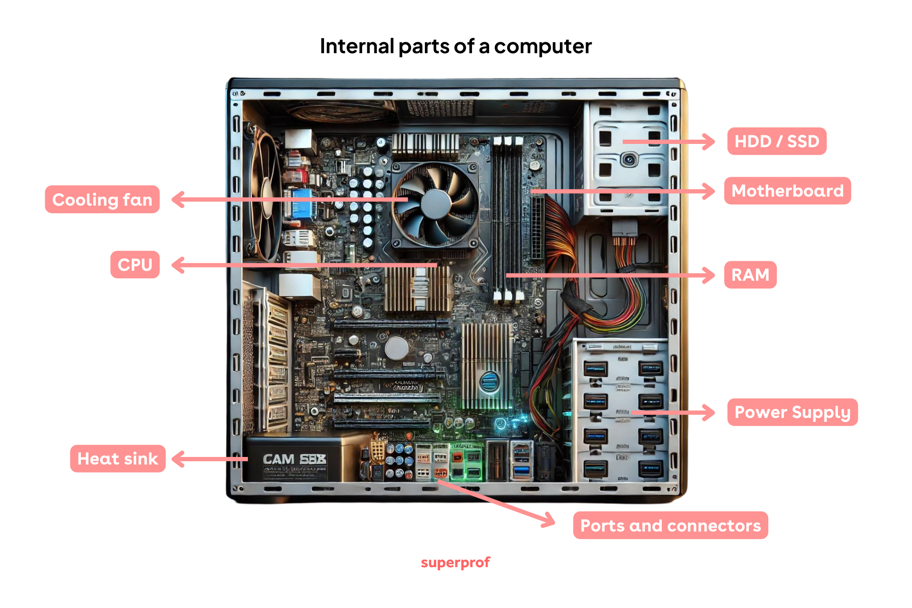
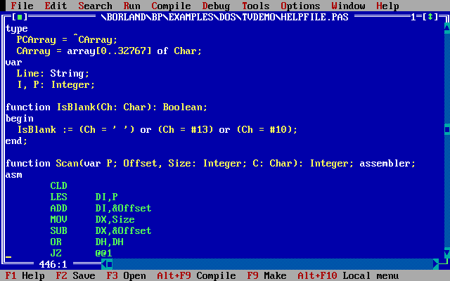
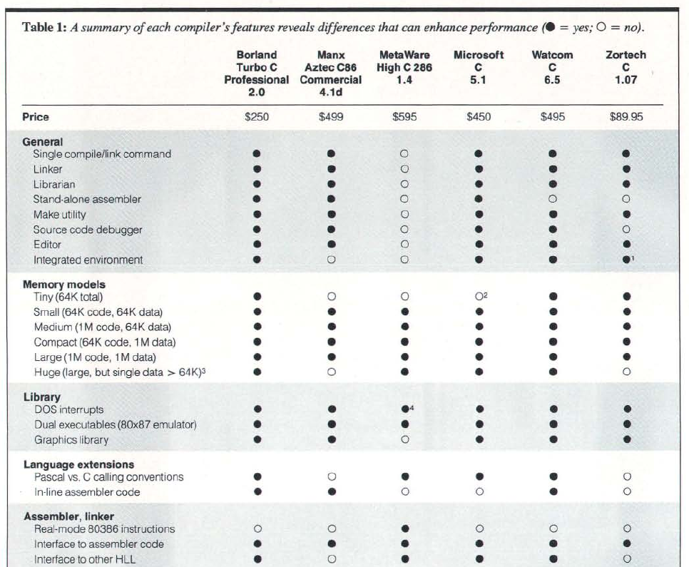

# C++

# Funzionamento di un compilatore

-   Un compilatore è un *traduttore*, che converte un linguaggio in un
    altro.
-   I compilatori C++ come `g++` e `clang++` convertono il C++ in
    *linguaggio macchina*.
-   Per capire come funziona un compilatore, bisogna comprendere il
    linguaggio macchina delle CPU.

# Cosa fa la CPU

-   Esegue sequenze di istruzioni
-   Accede a periferiche attraverso dei *bus*
-   **Accede alla memoria**: fondamentale!

---

{height=800}

# Tipi di memoria

-   **Memoria volatile**:
    -   Registro (qualche kB, 64 bit/ciclo)
    -   Cache (128 kB–128 MB, 40-700 GB/s)
    -   RAM (4–64 GB, 10 GB/s)
-   **Memoria permanente**:
    -   Disco fisso SSD (1 GB/s)
    -   Disco fisso HDD (120 MB/s)

# Memoria volatile

**Registri**

:    Attraverso identificativi come `ebp`, `rsp`, `eax`…
    (interi), `xmm0`, `xmm1`, … (floating point)

**Cache**

:    Esclusiva pertinenza della CPU!

**RAM**

:    **RAM**: la CPU richiede il dato al bus della memoria specificando
     l'indirizzo numerico

#

----------------------------------------- ------------------- -------------------------
{ height="128px" } Registri (6 kB)     { height="128px" }
 { height="128px" } RAM (8 GB)          { height="128px" }
  { height="128px" } HD SSD da 1 TB      { height="128px" }
----------------------------------------- ------------------- -------------------------

# Cosa sa fare la CPU?

-   Calcoli elementari su interi
-   Calcoli elementari su floating-point
-   Confronti
-   Istruzioni di salto (`goto`)
-   Copia di dati da RAM a registri e viceversa
-   Comunicazione attraverso i bus: hard disk, scheda grafica,
    tastiera, mouse, porte ethernet, etc.

# Cosa *non* sa fare la CPU?

-   Cicli `for`
-   Operazioni matematiche complesse (es., `2 * x + y / z`)
-   Gestione di dati complessi (array, stringhe, etc.)
-   Allocazione di memoria con `new` e `delete`
-   Funzioni con parametri
-   Classi
-   Molto altro!


# Assembler

-   Un programma in linguaggio macchina è una sequenza di bit: `0110101110…`

-   Può essere «traslitterato» partendo dal linguaggio assembler
    (usando compilatori come [NASM](https://www.nasm.us/) e
    [YASM](https://yasm.tortall.net/)):

    ```asm
    movapd xmm4, xmm1
    mulsd xmm5, xmm0
    mulsd xmm4, xmm1
    jle .L10
    movapd xmm6, xmm5
    ```

-   Compilare da assembler a linguaggio macchina (e viceversa) assomiglia a una «traslitterazione», come «πάντα ῥεῖ» ↔ «pánta rheî», più che a una «traduzione»

#

-   In passato, per molti computer era necessario programmare direttamente in Assembler (ossia in linguaggio macchina). Solo poche macchine offrivano nativamente linguaggi ad alto livello, come il Commodore 64:

    { width="40%" }

-   Ma già dagli anni '50 si erano sviluppati linguaggi *ad alto livello*, come **Lisp** e **Fortran**, i cui compilatori *traducono* (questa volta sì!) il codice in linguaggio macchina

# Compilatori

-   Un compilatore traduce il codice di un linguaggio ad alto livello
    (come il C++) in codice macchina
-   Trasforma cicli `for` in cicli più semplici che la CPU può eseguire
-   Decide quando usare i registri e quando la RAM
-   Il compilatore deve conoscere l'assembler di ogni architettura. Quelle più diffuse
    sono:
    -    x86_64: usata nella maggior parte dei desktop e dei laptop
    -    ARM: usata soprattutto nei cellulari e nei tablet, ma anche
         in console di gioco (Nintendo Switch) e alcuni laptop
         (Chromebooks)
    -    M1/M2/M3: simili ad ARM, sono montati sui computer Apple più recenti

# Compilatori

-   Fino agli anni '90 i compilatori non producevano codice macchina efficiente

-   Spesso un programmatore con una minima infarinatura di assembler poteva scrivere codice più efficiente!

-   Alcuni versioni dei compilatori C/C++/Pascal offrivano la possibilità di inserire codice assembler direttamente all’interno di programmi scritti in altri linguaggi!

---

<center></center>

---

<center>{height=640px}</center>
<p align="right"><small>(Byte magazine, Febbraio 1989)</small></p>

# Esempio

-   Nel Capitolo 8 del bel libro di Bolboacă & Deák “[Debunking C++ myths](https://www.packtpub.com/en-us/product/debunking-c-myths-9781835884799)”, gli autori raccontano che negli anni ’90 riuscirono tramite l’assembler a rendere più veloce un loro programma C++

-   Il programma doveva effettuare in modo efficiente una moltiplicazione di un intero per il numero 320. Il compilatore generava un banale prodotto, ma gli autori si accorsero che $320 = 256 + 64 = 2^8 + 26$ (vedi i dettagli nel testo), e sfruttarono operazioni sui bit per rendere il prodotto più veloce

-   Ricompilando il loro vecchio codice ai giorni nostri (il libro è del 2024), gli autori hanno constatato che i compilatori moderni riescono a generare codice ancora più furbo e veloce del loro!

# Compilatori

-   Come mostra l’esempio di Bolboacă & Deák, oggi siamo in una situazione completamente rovesciata!

-   Da un lato, le CPU più recenti usano ottimizzazioni molto complesse, ed è quindi difficile per un programmatore umano scrivere codice assembler che sfrutti efficientemente la macchina…

-   …e d'altra parte i compilatori moderni sono così sofisticati da produrre codice macchina imbattibile!

-   Scrivere codice assembler è quindi una cosa che oggi non è quasi mai necessaria, anche perché rende il codice poco portabile. (Ma ci sono eccezioni, come [FFmpeg](https://github.com/FFmpeg/asm-lessons/blob/main/lesson_01/index.md)…)

# Esplorare il codice assembler

-   Molti compilatori possono produrre file di testo con l'assembler generato, prima della traduzione in linguaggio macchina
-   Se usate `gcc` e `clang`, esiste il flag `-S`
-   Potete fare esperimenti online sul sito [godbolt.org](https://godbolt.org) (che ho usato per le prossime slide)

# Esempio: un ciclo `for`

<table width="100%">
<tr>
<td>
**C++**
</td>
<td>
**Assembler** (x86_64)
</td>
</tr>
<tr>
<td>
```c++
for (int i{}; i < n; ++i)
{
    // loop body
}
```
</td>
<td>
```asm
    mov  ecx, [n]  ; ecx ← n
    xor  eax, eax  ; eax ← 0 (there is no [i] here!)
LoopTop:  ; This is a *label*, not an instruction
    cmp  eax, ecx  ; if eax >= ecx…
    jge  LoopEnd   ; …then go to LoopEnd
    ; (loop body: DO NOT MODIFY ecx NOR eax!)
    add  eax, 1    ; eax ← eax + 1
    jmp  LoopTop   ; Make the CPU jump back by `n` bytes
LoopEnd:
    ; (etc.)
```
</td>
</tr>
</table>

# Uso di registri

-   Per ogni dato, il compilatore deve decidere se usare un registro o la RAM: nell'esempio, `n` era nella RAM mentre `i` in un registro (`eax`)
-   Trovare la scelta ottimale è molto difficile (vedi [Wikipedia](https://en.wikipedia.org/wiki/Register_allocation))
-   In passato il C/C++ offriva la parola chiave `register` (oggi deprecata):

    ```c
    void fn(void) {
        int a, b;
        register int i; /* Put this variable in a register, if possible */
        /* … */
    }
    ```

# Produrre codice assembler

-   Il compilatore `g++` si basa su [GCC](https://gcc.gnu.org/), che implementa una serie di algoritmi per capire quale sia il modo più performante di usare i registri e ordinare le istruzioni
-   Il compilatore `clang` si basa sulla libreria [LLVM](https://llvm.org/), che prende in input una descrizione «ad alto livello» della sequenza di operazioni da eseguire e le traduce in codice assembler ottimizzato

# Altri linguaggi

-   [GCC](https://gcc.gnu.org/) supporta molti linguaggi oltre al C++, usando lo stesso generatore di codice assembler: C e Objective-C (`gcc`), [D](https://wiki.dlang.org/GDC) (`gdc`), [Go](https://gcc.gnu.org/onlinedocs/gcc-9.3.0/gccgo/) (`gccgo`), [Fortran](https://gcc.gnu.org/onlinedocs/gcc-9.3.0/gfortran/) (`gfortran`), [Ada](https://gcc.gnu.org/onlinedocs/gcc-9.3.0/gnat_ugn/) (`gnat`).
-   La libreria LLVM è impiegata da molti compilatori: [clang](https://clang.llvm.org/) (C/Objective-C/C++), [LDC](https://wiki.dlang.org/LDC) (D), [flang](https://github.com/flang-compiler/flang) (Fortran), [Crystal](https://crystal-lang.org/), [Swift](https://swift.org/), [Rust](https://www.rust-lang.org/), [Zig](https://ziglang.org/), [Julia](https://julialang.org/)
-   Altri compilatori implementano un proprio generatore di codice assembler: [FreePascal](https://freepascal.org/), [DMD](https://dlang.org/) (D), [Go](https://golang.org/), [Visual Studio](https://visualstudio.microsoft.com/vs/) (C/C++), etc.
-   Alcuni linguaggi, come [Nim](https://nim-lang.org/), producono codice C, che va poi compilato da un compilatore C.

# Python

# L'approccio di Python

-   Python nasce all’inizio degli anni 90, 20 anni dopo il C e 7 dopo il C++
-   Quando nasce il Python c’è la consapevolezza che i computer saranno sempre più veloci: programmi «lenti» sono sempre meno un problema
-   L'approccio di Python è completamente diverso rispetto al C++: non è più **compilato**, ma **interpretato**
-   In campo scientifico si usa molto la distribuzione **Anaconda Python**

# Confronto C++/Python

<table width="100%">
<tr>
<td>
**C++**
</td>
<td>
**Python**
</td>
</tr>
<tr>
<td>
```c++
#include <print>

int main() {
  double result{};
  for(double i{}; i < 10'000'000; i += 1) {
      result += i;
  }
  std::println("Risultato: {}", result);
}
```
</td>
<td>
```python
result = sum(range(10_000_000))
print(result)
```
</td>
</tr>
</table>

-   Il programma Python è più veloce da scrivere e più semplice da
    leggere
-   Il programma C++ richiede 33 ms per l'esecuzione, quello Python
    150 ms (5 volte più lento!)

# Velocità di Python

-   Python non crea programmi nel linguaggio macchina della CPU, ma
    nell’assembler di una **macchina virtuale** (la «Python virtual
    machine»)
-   Questo codice non viene eseguito dalla CPU ma da un programma C,
    che lo converte **in fase di esecuzione** in una sequenza di
    istruzioni in linguaggio macchina
-   Questo approccio è più lento, ma ha alcuni vantaggi significativi:
    vediamoli in un esempio pratico

# Tipi e codice macchina

-   In C++, una istruzione come `x = a + b`, se `a` e `b` sono interi, può essere convertita in
    Assembler così:

    ```asm
    mov rax, QWORD PTR [rbp-24] ; rax = a
    add rax, QWORD PTR [rbp-16] ; rax += b
    mov QWORD PTR [rbp-8], rax  ; x = rax
    ```

-   Ma se `a` e `b` sono `double`, diventa così:

    ```asm
    movsd xmm0, QWORD PTR [rbp-24]  ; xmm0 = a
    movsd xmm1, QWORD PTR [rbp-16]  ; xmm1 = b
    addsd xmm0, xmm1                ; xmm0 += xmm1
    movsd QWORD PTR [rbp-8], xmm0   ; x = xmm0
    ```

---

-   Consideriamo ora questo programma Python:

    ```python
    def add(a, b):        # Type for `a` and `b` is not specified!
        return a + b

    print(add(1, 3))      # Result: 4
    print(add(1.0, 3.0))  # Result: 4.0
    print(add('a', 'b'))  # Result: 'ab'
    ```

-   Come può Python compilare in un linguaggio assembler la funzione
    `add`, visto che la somma può assumere significati diversi?

# Compilazione e Python

-   In Python, l'istruzione `x = a + b` viene **sempre** compilata
    così:

    ```sh
    load_fast   0 # 0 stands for a            stack = [a]      1 element
    load_fast   1 # 1 stands for b            stack = [a, b]   2 elements
    binary_add    # sum the last two nums     stack = [c=a+b]  1 element
    store_fast  2 # 2 stands for x            stack = []       0 elements
    ```

-   Questi comandi assumono che ci sia un vettore di elementi
    (chiamato *stack*) che venga mantenuto durante l'esecuzione, e che
    `load_fast` e `store_fast` aggiungano e tolgano elementi in coda
    al vettore.

-   Istruzioni come `binary_add` tolgono uno o più elementi in coda al
    vettore, fanno un'operazione su di essi, e mettono il risultato in
    coda al vettore

#

Per eseguire il file `test.py`, occorre sempre chiamare `python3`:

```sh
python3 test.py
```

Il programma `python3` è scritto in C, ed è più o meno fatto così:

```c
int main(int argc, const char argv[argc + 1]) {
    initialize();

    PyProgram * prog = compile_to_bytecode(argc, argv);
    while(1) { /* Run commands in sequence, like a real CPU */
        PyCommand * command = get_next_bytecode(prog);
        if (! run_command(command))
            break;
    }
    return 0;
}
```

# Cosa fa `run_command`

-   La funzione `run_command` esegue *una* istruzione, e ogni volta
    che viene invocata deve capire come operare in base al tipo di
    dato.

-   Verosimilmente, a seconda del comando che deve eseguire,
    `run_command` chiama una funzione C che gestisce l'esecuzione di
    quel particolare comando (`load_fast`, `store_fast`, `binary_add`,
    …)


#
Questa è una possibile implementazione per `binary_add`:

```c
void binary_add(PyObject * val1,
                PyObject * val2,
                PyObject * result) {
	if (isinteger(val1) && isinteger(val2)) {
        /* Sum two integers */
		int v1 = get_integer(val1);
		int v2 = get_integer(val2);
		result.set_type(PY_INTEGER)
		result.set_integer(v1 + v2);
	} else if (isreal(val1) && isreal(val2)) {
		/* Sum two floating-point numbers */
    } else {
        /* ... */
    }
}
```
# Vantaggi di Python

-   Si esegue il codice senza bisogno di compilare prima → più facile
    fare il debug
-   Non è necessario dichiarare variabili → codice più breve e veloce
    da scrivere
-   Non si usano i file header (`.h`) → meno file da gestire
-   Non si usano i Makefile → maggiore semplicità
-   Niente puntatori → minore possibilità di crash

# Svantaggi di Python

-   Se le variabili non hanno tipo, sono possibili molti errori

-   Quasi tutti gli errori capitano durante l’esecuzione: è quindi più
    facile che vada in crash un programma Python piuttosto che un
    programma C++. Esempio:

    ```shell
    $ python3 test.py
    Computing results… Please wait!
    Traceback (most recent call last):
      File "/home/tomasi/test.py", line 1429, in <module>
        print_results(results)
    NameError: name 'print_results' is not defined
    ```

-   **I programmi sono molto più lenti del C++!**

    ```python
    for i in range(1_000_000):  # Run this for i=0 to i=999_999
        x[i] = a[i] + b[i]      # Every time Python checks the types of `x`, `a`, `b`
    ```

# Comodità di Python

-   Python non viene certo usato per scrivere codice che funziona
    **velocemente**, ma per scrivere codice **rapidamente**!
-   A differenza del C++, il linguaggio supporta molte funzionalità di
    alto livello

# Esempio

-   Supponiamo di avere un file, `test.txt`, contenente questi dati:

    ```
    # This is a comment
    #
    # sensor temperature
    upper_flange 301.76
    lower_flange   270.1
      horn         290.81

    detector        85.3
    ```

-   Esso contiene delle temperature registrate da termometri
    installati in uno strumento

-   Vogliamo scrivere un programma che stampi a video i nomi dei
    sensori, ordinati secondo la temperatura dal più freddo al più
    caldo. Il codice deve ignorare spazi, commenti e linee vuote

# Soluzione dell'esercizio

```python
with open("test.txt", "rt") as inpf:
    lines = [x.strip() for x in inpf.readlines()]  # lines = { x.strip | x ∈ inpf.readlines }

# Remove from "lines" empty lines and comments
lines = [x for x in lines if x != "" and x[0] != "#"]

# Split each line in two
pairs = [x.split() for x in lines]

for sensor, temp in sorted(pairs, key=lambda x: float(x[1])):
    print(f"{sensor:20} (T = {temp} K)")
```

```
detector             (T = 85.3 K)
lower_flange         (T = 270.1 K)
horn                 (T = 290.81 K)
upper_flange         (T = 301.76 K)
```

# Quando usare Python?

-   Se un programma non richiede molti calcoli complessi, Python è solitamente la scelta migliore
-   Se un programma Python è 100 volte più lento di un programma C++, ma completa sempre l’esecuzione in 0,1 secondi, vale la pena velocizzarlo?
-   Scrivere programmi in Python è molto più veloce che scriverli in C++

# Python nel calcolo scientifico

-   È possibile usare Python per simulazioni Monte Carlo? O per calcoli numerici su milioni di elementi?
-   Python permette di invocare funzioni scritte in C e in Fortran
-   Negli anni sono state sviluppate librerie Python molto potenti per il calcolo scientifico: [NumPy](https://numpy.org/), [Numba](https://numba.pydata.org/), [Taichi](https://www.taichi-lang.org/), [f2py](https://www.numfys.net/howto/F2PY/), [Cython](https://cython.org/), [Dask](https://dask.org/), [Pandas](https://pandas.pydata.org/)…
-   Lo svantaggio è che queste librerie scientifiche sono spesso **poco integrate** col linguaggio

# Julia

# Cos'è Julia?

-   [julialang.org](https://julialang.org/)
-   Linguaggio molto recente (versione 0.1 rilasciata a Febbraio 2013)
-   Pensato espressamente per il calcolo scientifico
-   Veloce come C++ e facile come Python…?
-   Versione corrente: 1.11.4

# Dove si colloca Julia?

Compilatori

: C, C++, FreePascal, gfortran, Rust, GNAT Ada, Nim, …

Interpreti

: CPython, R, Matlab, IDL, …

Just-in-time compilers

: Java, Kotlin, C#, LuaJIT, 👉**Julia**👈, etc.

# Un assaggio del linguaggio

<div id="julia-first-example-asciinema"></div>
<script>
AsciinemaPlayer.create(
    "asciinema/julia-first-example-83x23.asciinema",
    document.getElementById("julia-first-example-asciinema"), {
        cols: 83,
        rows: 23,
        fit: false,
        terminalFontSize: "medium"
    });
</script>

# Confronto Python/Julia

<table width="100%">
<tr>
<td>
**Python**
</td>
<td>
**Julia**
</td>
</tr>
<tr>
<td>
```Python
def mysum(a, b):
    return a + b

# mysum(1, 2)
# mysum(1.0, 2.0)
# etc.
```
</td>
<td>
```julia
mysum(a, b) = a + b

# Equivalente:
# function mysum(a, b)
#     a + b
# end

# mysum(1, 2)
# mysum(1.0, 2.0)
```
</td>
</tr>
</table>

Julia ha le medesime performance del C++, ma com'è possibile se come
per Python in Julia non si specificano i tipi?

# Compilazione in Julia

-   Julia, a differenza di Python, compila il codice in linguaggio
    macchina. Ma la compilazione viene effettuata **la prima volta che
    si chiede di eseguire una funzione**.

-   Per esempio, nel momento in cui si scrive `mysum(1, 2)`, Julia
    esegue la compilazione assumendo che `a` e `b` siano due interi.

-   A differenza del C++, la compilazione non viene fatta su un intero
    file, ma sulle **singole funzioni**: se una funzione non viene mai
    chiamata, non viene mai compilata in linguaggio macchina.

# Sessione interattiva

<div id="julia-compilation-asciinema"></div>
<script>
AsciinemaPlayer.create(
    "asciinema/julia-compilation-83×23.asciinema",
    document.getElementById("julia-compilation-asciinema"), {
        cols: 83,
        rows: 23,
        fit: false,
        terminalFontSize: "medium"
    });
</script>

# Abbandono della programmazione OOP

# OOP e Julia

-   Julia **non** implementa i costrutti *object-oriented* del C++: non ci sono classi né metodi virtuali.

-   L'approccio OOP si è infatti dimostrato negli anni poco adatto per il calcolo scientifico. Consideriamo ad esempio `FunzioneBase`, che ci è servita molte volte:

    ```c++
    class FunzioneBase {
    public:
        virtual double Eval(double x) const = 0;
    };
    ```

    e vediamone i limiti nell'ipotesi di voler rendere il codice più versatile.

# Propagazione degli errori

-   Abbiamo visto che, per studiare come gli errori si propagano nel codice, un buon metodo è quello di eseguire una simulazione Monte Carlo

-   Ma queste simulazioni possono essere molto lente da eseguire, soprattutto se il modello è complesso!

-   Per certi calcoli sarebbe sufficiente la propagazione degli errori

# La classe `Measurement`

```c++
struct Measurement {
    double value;
    double error;

    Measurement(double v, double e) : value{v}, error{e} {}
};

Measurement operator+(Measurement a, Measurement b) {
  return Measurement{a.value + b.value, sqrt(pow(a.error, 2) + pow(b.error, 2))};
}

// Do the same for the other operators: -, *, /, sin, cos…
```

# Integrali e `Measurement`

-   Supponiamo ora che io voglia calcolare lo zero o l'integrale di una funzione derivata da `FunzioneBase`.

-   Mi è impossibile usare `Measurement` nella nostra `FunzioneBase`, perché essa lavora solo con il tipo `double`:

    ```c++
    virtual double Eval(double x) const = 0;
	```

    Anche qualsiasi classe derivata deve quindi usare i `double`.

# Soluzione

-   Se `FunzioneBase` fosse una classe di ROOT (quindi immodificabile), sarei spacciato: non potrei usare `Measurement` con essa!

-   Se invece fossi **io** l'autore di `FunzioneBase` (ed è così!), potrei allora modificare il codice. Ma così non potrei più compilare i miei vecchi programmi che usavano la versione con i `double`.

-   Potrei fare una copia della classe e modificare quella, ma se in futuro correggessi bug o apportassi miglioramenti a `FunzioneBase`, dovrei ricordarmi di aggiornare entrambe.

# Passo successivo

-   Supponiamo ora di aver implementato una classe `UnitValue` che combini valori e unità di misura, e ne verifichi la consistenza:

    ```c++
	UnitValue speed{2.0, "m/s"};
    UnitValue start_pos{3.5, "m"};
    UnitValue time{6.0, "s"};

    // This triggers an error: it should have been speed * time, not speed / time
    UnitValue final_pos{start_pos + speed / time};
    ```

-   Mi piacerebbe usarla insieme alla mia classe `Measurement` che propaga gli errori, ma non posso: sia `value` che `error` sono variabili `double`!

-   Se però modifico `Measurement`, rischio che la mia nuova versione di `FunzioneBase` non funzioni più!

# La soluzione di Julia

-   In Julia non si definisce il tipo dei parametri: si può quindi passare anche tipi «nuovi» a funzioni «vecchie».

-   In effetti, questo si può fare con due librerie già esistenti: [Measurements.jl](https://github.com/JuliaPhysics/Measurements.jl) e [Unitful.jl](https://painterqubits.github.io/Unitful.jl/stable/)

    ```julia
    using Measurements, Unitful

    speed = (2.0 ± 0.1)u"m/s"    # Use 'u' followed by a string to define the unit
    start_pos = (3.5 ± 0.1)u"m"
    time = (6.0 ± 0.5)u"s"

    final_pos = start_pos + speed / time
    # ERROR: DimensionError: 3.5 ± 0.1 m and 0.333 ± 0.032 m s^-2
    #        are not dimensionally compatible.

    final_pos = start_pos + speed * time    # Ok, the result is 15.5 ± 1.2 m
    ```

# La soluzione del C++

-   In realtà, anche in C++ è possibile ottenere la versatilità di Julia, ma bisogna abbandonare l'approccio OOP.

-   Se si definisse `UnitValue` come una classe template, si potrebbe combinare con la classe `Measurement`:

    ```c++
    template<typename T> struct UnitValue {
	    T value;
	    std::string unit;
	};

	UnitValue start_pos{Measurement{2.0, 0.1}, "m"};
	// …and so on
	```

-   Di fatto, le librerie scientifiche moderne in C++ non usano più approcci OOP come ROOT, ma sono basate sui template ([Armadillo](https://arma.sourceforge.net/)…)


# Omoiconicità di Julia

# Julia e le macro

-   Julia è un linguaggio *omoiconico* (“medesima rappresentazione”), che significa che codice e variabili hanno la stessa rappresentazione.

-   Questa è una caratteristica mutuata dal linguaggio Scheme, da cui gli sviluppatori di Julia hanno preso spesso ispirazione. (Il cuore del compilatore di Julia è scritto in un dialetto di Scheme!)

-   Le macro sono apparentemente simili alle funzioni del C++, ma hanno una importante differenza.

# Esempio di funzione

Consideriamo una funzione che accetta come argomento un intero `x`, e stampa `"A"` se `x` è maggiore di 2, `"B"` altrimenti.

<table width="100%">
<tr>
<td>
**C++**
</td>
<td>
**Julia**
</td>
</tr>
<tr>
<td>
```c++
void f(int x) {
    if(x > 2) {
        std::println("A");
    } else {
        std::println("B");
    }
}
```
</td>
<td>
```julia
function f(x)
    if x > 2
        println("A")
    else
        println("B")
    end
end
```
</td>
</tr>
</table>

# Esempio di macro

-   Supponiamo ora di affrontare un problema apparentemente simile.

-   Vogliamo scrivere una funzione che accetta come argomento un parametro `x`, e stampa `"A"` solo se `x` è stato calcolato usando una somma, altrimenti `"B"`.

    ```c++
    void f(int a) {
        // ????
    }

    int main() {
        f(2 + 2);  // Should print "A"
        f(2 * 2);  // Should print "B"
    }
    ```

# Problema col C++

-   Dovremmo usare una istruzione `if`, ma questa in C++ può essere usata solo per confrontare il valore di *variabili*
-   Noi dovremmo invece esaminare le *istruzioni* usate per calcolare il valore di `x`
-   Il linguaggio C++ **non** è «omoiconico», perché i suoi costrutti (`if`, `while`, `for`, …) funzionano solo sul contenuto dei dati (variabili), e non sulle istruzioni di codice

# Esempio di macro

Julia è invece omoiconico, e quindi si può ispezionare il *codice* usando gli stessi costrutti del linguaggio che si usano con i dati:

```julia
macro f(e::Expr)
    if e.args[1] == :+
        println("A")
    else
        println("B")
    end
end

@f 2 + 2   # Print "A"
@f 2 * 2   # Print "B"
```

# Esecuzione di macro

-   Le macro vengono eseguite *prima* che il codice Julia venga tradotto in linguaggio macchina

-   Possono quindi essere usate per modificare del codice presente nel file sorgente, o addirittura per *generarlo automaticamente*

-   Ma una caratteristica simile non è troppo esotica e “accademica”? No, anzi, è straordinariamente pratica! Ma bisogna avere mente aperta per immaginarne le applicazioni…

# [Latexify.jl](https://github.com/korsbo/Latexify.jl)

-   La libreria [Latexify](https://github.com/korsbo/Latexify.jl) traduce la definizione di una funzione Julia in un'espressione LaTeX, che può essere visualizzata con la funzione `render`:

    ```julia
    julia> latex_str = @latexrun f(x; y=2) = (x + 2) / y - 1
    julia> println(latex_str)
    L"$f\left( x; y = 2 \right) = \frac{x + 2}{y} - 1$"
    julia> render(latex_str)
    ```

    <center>
    
    </center>

-   Il modo in cui `@latexrun` opera è quello di esaminare pezzo per pezzo l'espressione, e tradurre le sue operazioni in simboli LaTeX.

-   È utilissima per verificare una formula matematica complessa.

# Gestire `argc` e `argv`

-   Un'altra bella applicazione dell'omoiconicità è la generazione di interfacce da linea di comando. Ricordate l'esercizio 6.2 (ricerca degli zeri)?

    ```
    $ ./esercizio6.2 0 3 100 1e-5
    Zero: 0.33333
    ```

-   Il codice all'inizio del `main` era il seguente:

    ```c++
	if (argc != 5) {
	  std::println(cerr, "Error, 5 parameters are needed: <a> <b> <nstep_max> <prec>");
	  return 1;
	}

    double a = std::stod(argv[1]);
    double b = std::stod(argv[2]);
    int nsteps_max = std::stoi(argv[3]);
    double prec = std::stod(argv[4]);  // Many students have used `stoi` here…
    ```

# Generare il `main`

-   Julia non è adatto per scrivere programmi da linea di comando, così mi baserò su [Nim](https://nim-lang.org/), un altro linguaggio «omoiconico».

-   La libreria [cligen](https://github.com/c-blake/cligen) di Nim implementa una macro che, se fosse scritta per il C++, si userebbe così:

    ```c++
	int run_program(double a, double b, int nsteps_max, double prec) {
	  // Here comes my program
	}

    // Macro call… but C++ has not them, so let's mimick Julia's syntax
    @define_main(run_program);
    ```

    La macro `@define_main` analizza i parametri di `run_program` e genera automaticamente il `main`, usando `stod` e `stoi` in modo appropriato.

---

```
$ ./esercizio6.2 --help
Usage:
  fun [REQUIRED,optional-params]
An API call doc comment
Options:
  -h, --help                           print this cligen-erated help
  --help-syntax                        advanced: prepend,plurals,..
  -a=, --a=           float  REQUIRED  set a
  -b=, --b=           float  REQUIRED  set b
  -n=, --nsteps-max=  int    REQUIRED  set nsteps_max
  -p=, --prec=        float  REQUIRED  set prec

$ ./esercizio6.2 -a=0 -b=3 --nsteps-max=100 --prec=1e-5
Zero: 0.33333

$ ./esercizio6.2 0 3 100 1e-5
Zero: 0.33333
$
```

# Altre applicazioni

-   Una volta che si ha a disposizione un linguaggio omoiconico, le possibilità sono illimitate

-   Un campo in cui Julia sta prendendo sempre più piede è quello dell'intelligenza artificiale

-   Anche la fisica teorica e computazionale sono due campi in cui Julia si sta affermando sempre di più

# Approfondimento di Julia

-   Nel video *Julia, the power of language* ([youtu.be/Zb8G6T8JtuM](https://youtu.be/Zb8G6T8JtuM)), lo speaker mostra varie applicazioni di Julia, tra cui l'implementazione di un tipo di matrice con determinate simmetrie
-   In un altro video *Alan Edelman and Julia Language*
    ([youtu.be/rZS2LGiurKY](https://youtu.be/rZS2LGiurKY)), lo speaker
    spiega come calcolare efficacemente derivate con Julia


---
author: "Maurizio Tomasi"
title: "C++, Python, Julia"
date: "Università degli Studi di Milano"
lang: italian
babel-lang: italian
---
