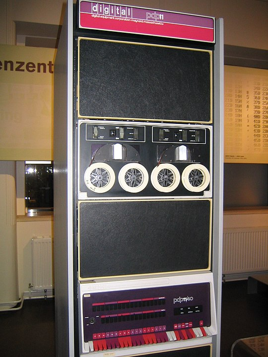

# Introduzione al corso

# Queste slides

-   All'inizio di ogni sessione di laboratorio mosterò alcune slides che riprendono alcuni concetti già visti a lezione.

-   Queste slides sono disponibili all'indirizzo [ziotom78.github.io/tnds-tomasi-notebooks](https://ziotom78.github.io/tnds-tomasi-notebooks/), e sono navigabili.

-   Se vi è più comodo, potete ottenere una versione PDF producendola da soli: basta aggiungere `?print-pdf` alla fine della URL e stampare la pagina da browser in un file PDF (vedi le [istruzioni dettagliate](https://revealjs.com/pdf-export/)).


# Avvertenze generale

-   *Non* fare copia-e-incolla da slide come queste! Trascrivere a mano il codice è più utile, perché vi consente di notare alcune sottigliezze sintattiche (es., dove vengono usati i punti e virgola). In generale, trascrivere codice è un ottimo allenamento per imparare a scrivere programmi.

-   Create un segnalibro per il sito <https://cppreference.com/>, è indispensabile quando si programma in C++:

    1. Contiene la documentazione completa del linguaggio, suddivisa nelle varie versioni (C++11, C++14, C++17, C++20, C++23…)

    2. Contiene la documentazione e gli esempi d'uso per tutte le funzioni della libreria standard del C++

# Esercizi per oggi

-   La spiegazione dettagliata degli esercizi si trova qui: [carminati-esercizi-01.html](carminati-esercizi-01.html).

-   Gli esercizi sono i seguenti:

    -   [Esercizio 1.0](carminati-esercizi-01.html#esercizio-1.0): Calcolo di media, varianza e mediana dei dati letti da un file
    -   [Esercizio 1.1](carminati-esercizi-01.html#esercizio-1.1): Codice di analisi con funzioni (variante del precedente)
    -   [Esercizio 1.2](carminati-esercizi-01.html#esercizio-1.2): Codice di analisi con `Makefile` (variante del precedente)
    -   [Esercizio 1.3](carminati-esercizi-01.html#esercizio-1.3): Codice di analisi con overloading (variante del precedente)

-   Dovrete leggere i dati dal file [`data.dat`](./data/data.dat) (fate click col tasto destro e salvate il link sul vostro computer).

# Esercizi per oggi

```text
$ head -n 4 data.dat
8.50763
11.6275
20.9615
9.55072
$ ./esercizio01.1 4 data.dat
Media = 12.6618
Varianza = 32.2969
Mediana = 10.5891
8.50763
11.6275
20.9615
9.55072
```

**Nota**: la *varianza* è il quadrato della *deviazione standard*;
quest'ultima si indica anche con RMS (*Root Mean Square*).

# Soluzioni attese

-   È molto importante che verifichiate la corretta esecuzione dei vostri programmi!

-   State attenti al calcolo della mediana: il 30% degli studenti alla fine del corso consegna esercizi di questa prima lezione in cui la mediana è errata.

-   Le soluzioni che dovete aspettarvi sono ricavate nella slide seguente. Assicuratevi di ottenere gli stessi valori! (A meno che non usiate il fattore $N - 1$ anziché $N$ nel calcolo della varianza).

---

# Risultati di riferimento

```
N = 100000:
  - Mean               : 30.23231
  - Variance           : 282326.76577 (corrected: 282329.58906)
  - Standard deviation : 531.34430 (corrected: 531.34696)
  - Median             : 12.74255

N = 10:
  - Mean               : 13.91472
  - Variance           : 38.73156 (corrected: 43.03507)
  - Standard deviation : 6.22347 (corrected: 6.56011)
  - Median             : 10.58911

N = 9:
  - Mean               : 13.85262
  - Variance           : 42.99651 (corrected: 48.37107)
  - Standard deviation : 6.55717 (corrected: 6.95493)
  - Median             : 9.55072
```


# Come svolgere gli esercizi

Potete svolgere gli esercizi in uno dei modi seguenti:

1.   Usando il computer di laboratorio davanti a voi (per chi è in presenza);
2.   Se avete un portatile con un compilatore C++ installato (ragionevolmente recente), potete svolgere l'esercizio su di esso.
3.   Potete usare [Repl.it](https://replit.com/~): in questo caso non c'è bisogno di installare nulla, e potete usare anche un tablet (ma sarebbe meglio collegare una tastiera!).


# Computer di laboratorio

-   **Non** premete quello che sembra essere il pulsante on/off del monitor, perché in realtà **spegne il computer** (e manda una segnalazione al centro di calcolo).

-   Vi consiglio di usare come editor [Visual Studio Code](https://code.visualstudio.com/), che è installato sui computer del laboratorio. Attenzione però: la configurazione di default di VSCode causa problemi sui computer del laboratorio!

# Sistemare VSCode

-   Il problema è che di default VS Code richiede 5 GB di spazio su disco per ottimizzare i suggerimenti di completamento della sintassi (vedi [discussione](https://github.com/microsoft/vscode-cpptools/issues/3347)).

-   È possibile disabilitare la cache o ridurla a un valore ragionevole modificando nelle impostazioni di VS Code la voce *Intellisense cache size* (vedi video seguente).

---

<iframe src="https://player.vimeo.com/video/630209637?h=fcc3022dd1&amp;badge=0&amp;autopause=0&amp;player_id=0&amp;app_id=58479" width="854" height="642" frameborder="0" allow="autoplay; fullscreen; picture-in-picture" allowfullscreen title="How to reduce the size of Intellisense cache"></iframe>


# Usare Visual Studio Code

-   Potete scaricare ed installare [Visual Studio Code](https://code.visualstudio.com/) anche sul vostro portatile: è gratuito e disponibile per Windows, Linux e Mac OS X. Per configurarlo in modo che sia usabile con programmi C/C++, eseguite dal terminale del vostro computer il comando

    ```
    code --install-extension ms-vscode.cpptools
    ```

    (Attenzione, se avete installato «Code OSS» il comando non funziona: occorre proprio la versione rilasciata da Microsoft per installare questa estensione).

-   Di seguito c'è un breve filmato che vi mostra come scrivere ed eseguire un programma di esempio. Visual Studio Code presenta numerosi *plugin* per semplificare lo sviluppo; li vedremo meglio durante il corso.

---

<div style="padding:54.53% 0 0 0;position:relative;"><iframe src="https://player.vimeo.com/video/623206212?h=71f53f0f8b&amp;badge=0&amp;autopause=0&amp;player_id=0&amp;app_id=58479" frameborder="0" allow="autoplay; fullscreen; picture-in-picture" allowfullscreen style="position:absolute;top:0;left:0;width:100%;height:100%;" title="Visual Studio Code &amp;ndash; First steps with C++"></iframe></div><script src="https://player.vimeo.com/api/player.js"></script>


# Computer del laboratorio (1/2)

Se usate un sistema Linux o Mac OS X, potete usare il comando `ssh`
dal terminale:

<asciinema-player src="asciinema/connect-to-tolab-75×20.asciinema" cols="75" rows="20" font-size="medium"></asciinema-player>

# Computer del laboratorio (2/2)

-   Se usate Windows, installate la versione *free* di [MobaXTerm](https://mobaxterm.mobatek.net/).

-   Dovete configurare una connessione di tipo «SSH» a `tolab.fisica.unimi.it`, specificando il vostro nome utente (solitamente `nome.cognome`).

-   È un'ottima soluzione anche se volete sviluppare sul **vostro** computer Windows usando WSL: in questo caso MobaXTerm permetterà di aprire finestre grafiche in cui mostrare i vostri plot, quando introdurremo i comandi grafici.


# Come usare Repl.it

-   Una soluzione che non richiede di installare nulla è [Repl.it](https://replit.com/~), un ambiente di sviluppo usabile da browser.

-   È stato già usato negli anni passati, quindi è fattibile impiegarlo per questo corso…

-   …ma il sito non si è sempre dimostrato affidabile: a volte resta offline, altre volte è estremamente lento.

-   Se potete usare il vostro computer o quello del laboratorio, vi suggerirei di preferire questa opzione.

---

<iframe src="https://player.vimeo.com/video/623224728?h=87f213239a&amp;badge=0&amp;autopause=0&amp;player_id=0&amp;app_id=58479" width="1280" height="698" frameborder="0" allow="autoplay; fullscreen; picture-in-picture" allowfullscreen title="Repl.it &amp;ndash; How to write C++ code"></iframe>

# Accorgimenti per Repl.it

-   Nel video si mostra come creare un *nuovo* progetto, ma nel vostro caso dovreste invece fare il *fork* del template fornito dal docente. (Vi arriverà la mail non appena termina questa spiegazione).

-   Alla fine di ogni lezione scaricare sul proprio computer un file `.zip` che contenga ogni esercizio.

-   Prima dell'esame scritto dovrete «consegnare» gli esercizi. Non è necessario farlo alla fine della lezione, perché potreste volerci tornare sopra più volte nel corso del semestre.

-   Si possono consegnare gli esercizi facendo «Submit» in Repl.it, ma **dovete** anche copiare gli esercizi nella vostra *home* sui
    computer di laboratorio.


# Suggerimenti vari

# Uso di `#define`

-   Ogni anno si vedono studenti usare `#define` per definire costanti nel codice, ma è meglio usare un `const`:

    ```c++
    #define g 9.81           // Don't do this!
    const double g = 9.81;   // Much better, I can explicitly declare the type
    ```

-   Con `#define` ci possono essere problemi con la precedenza degli operatori:

    ```c++
    #define time1_s       1.62
    #define time2_s       6.162
    #define total_time_s  time1_s + time2_s
    #define speed_m_s     1.0

    cout << "The position is " << total_time_s * speed_m_s << " m\n";
    ```

# Uso di argc e argv

# Linea di comando

-   I parametri `argc` e `argv` passati come argomenti al `main` servono per leggere parametri passati dalla linea di comando, come nel caso seguente:

    ```sh
    $ ./main 10 data.dat
    ```

-   Si possono dichiarare in più modi, tutti equivalenti:

    ```c++
    int main(int argc, char ** argv);
    // My personal favorite
    int main(int argc, char *argv[]);
    // You can pick whatever name you want
    int main(int num_of_arguments, char *args[]);
    ```

---

# Significato di argc e argv (1/2)

-   Il primo parametro (`argc`) contiene il numero di parametri, **incluso il nome dell'eseguibile**.

-   Il parametro `argv` è una lista di puntatori a caratteri (ossia stringhe) che contengono il nome dell'eseguibile seguito dal resto.

-   Di conseguenza, `argv[0]` contiene il nome del programma eseguibile, mentre tutti i parametri passati da linea di comando sono memorizzati in `argv[1]`, `argv[2]`, etc.

---

<asciinema-player src="asciinema/argc-argv-79x19.asciinema" cols="79" rows="19" font-size="medium"></asciinema-player>

---

# Significato di argc e argv (1/2)

Se eseguiamo più volte il programma, ecco il suo output:

```text
$ ./args-example
argc = 1
argv[0] = ./args-example
$ ./args-example 10
argc = 2
argv[0] = ./args-example
argv[1] = 10
$ ./args-example 10 ../data.dat
argc = 3
argv[0] = ./args-example
argv[1] = 10
argv[2] = ../data.dat
```


# Uso di Makefile


# Compilare un programma (1/3)

Prendiamo questo semplice esempio:

```c++
#include <iostream>

int calc(int a, int b) { return a + b; }

int main() {
    std::cout << "Insert two numbers: ";

    int a, b;
    std::cin >> a >> b;

    std::cout << "The result is "
              << calc(a, b) << "\n";
    return 0;
}
```

---

# Compilare un programma (2/3)

-   Sinora abbiamo mostrato esempi in cui tutto il codice sorgente è in un unico file. Questo non è però utile, perché in futuro dovrete riciclare spesso parti di codice!

-   Anziché usare le funzioni di copia-e-incolla, è meglio suddividere il codice in più file con estensione `.cpp`, che dovranno però poi essere compilati uno a uno e «combinati» insieme (il termine esatto è *linking*).

-   In questo corso vi obblighiamo ad usare uno strumento piuttosto vetusto ma presente su qualsiasi sistema Unix: GNU Make.


# Compilare un programma (3/3)

-   Partiamo da un caso molto semplice (l'esercizio 1.2 sarà più complicato). Create un file con nome `Makefile` (attenzione alla maiuscola iniziale!), e scrivete queste righe al suo interno:

    ```makefile
    CXXFLAGS = -std=c++23 -g3 -Wall --pedantic

    main: main.cpp
    ```

-   Infine, da linea di comando eseguite il comando `make` (`$` indica il
prompt):

    ```text
    $ make
    g++ -std=c++23 -g3 -Wall --pedantic    main.cpp   -o main
    $ ls
    main   main.cpp   Makefile
    ```


# Flag del compilatore {#flag-del-compilatore}


-   È utile specificare dei flag aggiuntivi per la compilazione, tramite la riga

    ```makefile
    CXXFLAGS = -std=c++23 -g3 -Wall --pedantic
    ```

-   `-std=c++23` usa la versione più recente del C++.

-   `-g3`: se il codice va in *crash*, stampa la riga di codice che ha causato l'errore.

-   `-Wall`: rende il compilatore C++ più brontolone del solito.

-   `--pedantic`: lo rende ancora più brontolone.

---

# Spiegazione del comando make

-   Il comando `make` serve per «creare» (appunto, *to make*) dei file partendo da altri. Con la scritta

    ```makefile
    main: main.cpp
    ```

    si dice a Make che si vuole creare il file `main` (eseguibile) partendo dal file `main.cpp`.

-   Make sa che i file con estensione `.cpp` sono programmi C++, e quindi correttamente invoca l'eseguibile `g++`, passandogli i parametri nella variabile `CXXFLAGS`.

# Comandi personalizzati

-   Se si vuole fornire manualmente la lista dei comandi da inviare, bisogna scriverli nella riga successiva, che va indentata inserendo un carattere **TAB**, solitamente indicato sulle tastiere con ↹ (è a sinistra del tasto Q):

    ```makefile
    CXXFLAGS = -std=c++23 -g3 -Wall --pedantic

    main: main.cpp
        # You MUST use a Tab character ↹ to indent here!
        g++ $(CXXFLAGS) main.cpp
    ```

-   Per inserire un Tab da Repl.it, impostate *Indent type* uguale a *Tab* e *Indent size* uguale a 8 in «Settings». **Attenzione**: con alcuni browser, Repl.it non permette di inserire un carattere Tab.

---

# Esecuzione di un Makefile

-   Se eseguiamo immediatamente `make` una seconda volta, avviene una cosa interessante:

    ```text
    $ make
    $
    ```

-   In questo caso, Make non fa nulla: ha controllato le date dei file `main` e `main.cpp`, e ha visto che il primo è stato creato *dopo* il secondo: quindi non c'è bisogno di compilare nuovamente il programma.

-   Se voleste obbligare `make` a saltare il controllo delle date e ricreare tutto da capo, basta invocarlo così: `make -B`.

---

# Usare più file sorgente

-   Nell'esercizio 1.2 si richiede di dividere il programma tra più file,
e di compilarli separatamente. In questo caso la struttura del
`Makefile` si complica:

    ```makefile
    esercizio1.2: esercizio1.2.cpp funzioni.cpp
        # Con \ si può andare a capo
        g++ esercizio1.2.cpp funzioni.cpp \
            -o esercizio1.2 $(CXXFLAGS)
    ```

    Questo esempio crea di nuovo l'eseguibile a partire da file `.cpp`.

-   Quanto scritto qui sopra funziona, ma **non è quanto richiesto dall'esercizio**: bisogna esplicitare anche il passaggio intermedio, ossia la creazione di file `.o`.

---

# Creare i file oggetto (`.o`)

-   GNU Make permette di richiedere dipendenze «intermedie», ossia
dipendenze da file che devono essere creati dallo stesso GNU Make.

-   Questo è ciò che serve per i file `.o`:

    ```makefile
    esercizio1.2: esercizio1.2.o funzioni.o
        g++ esercizio1.2.o funzioni.o -o esercizio1.2

    esercizio1.2.o: esercizio1.2.cpp funzioni.h
        g++ -c esercizio1.2.cpp -o esercizio1.2.o $(CXXFLAGS)

    funzioni.o: funzioni.cpp funzioni.h
        g++ -c funzioni.cpp -o funzioni.o $(CXXFLAGS)
    ```

    (`CXXFLAGS` non serve quando si mettono insieme più file `.o`: la compilazione del codice C++ è già avvenuta).

---

# Un trucco

-   GNU Make definisce alcune variabili speciali che semplificano la scrittura del `Makefile`. Una di queste è `$@`, che rappresenta il nome del file da creare.

-   L'esempio nella slide precedente si può riscrivere così:

    ```makefile
    esercizio1.2: esercizio1.2.o funzioni.o
        g++ esercizio1.2.o funzioni.o -o $@

    esercizio1.2.o: esercizio1.2.cpp funzioni.h
        g++ -c esercizio1.2.cpp -o $@ $(CXXFLAGS)

    funzioni.o: funzioni.cpp funzioni.h
        g++ -c funzioni.cpp -o $@ $(CXXFLAGS)
    ```

-   È più facile riciclare il `Makefile` nei nuovi esercizi!

---

# File multipli ed header

# File multipli ed header

-   Dovete **sempre** includere in ogni header/file sorgente tutti gli
    header che servono per definire i simboli nel codice.

-   Ad esempio, se un file `main.cpp` contiene questi `#include`:

    ```c++
    // main.cpp
    #include "vectors.h"   // Define 3D vectors
    #include "newton.h"    // Define functions to solve Newton's problems
    ```

    è buona cosa che in `newton.h` si includa comunque `vectors.h`:

    ```c++
    // newton.h
    #pragma once
    #include "vectors.h"
    // etc.
    ```

# Motivo #1

-   Programmi complessi usano moltissimi `#include`. In questo caso si
    tende a inserirli in ordine alfabetico, per individuare duplicati:

    ```c++
    #include "subdiv.h"
    #include "intersec.h"
    #include "memory.h"
    #include "roots.h"
    #include "glyph.h"
    #include "scan.h"
    #include "memory.h"
    #include "vector.h"
    ```

-   Formattatori automatici di codice come `clang-format` riordinano
    gli `#include`: nel nostro caso quindi metterebbe
    `newton.h` **prima** di `vectors.h`, e la compilazione fallirebbe!

# Motivo #2

-   Ogni `#include` richiede tempo per la compilazione. Di tanto in
    tanto nei progetti si fa un /purge/ degli `#include` inutili: in
    ogni file, si controlla se ci sono degli header che definiscono
    cose non usate all'interno del file.

-   Ad esempio, una riga `#include "mp3.h"` all'interno di un file
    sorgente in cui non si toccano affatto file MP3!

-   Nel nostro caso, i vettori definiti in `vector.h` potrebbero non
    essere mai usati esplicitamente in `main.cpp`, magari perché in
    esso si calcola semplicemente il periodo orbitale di un satellite
    artificiale. Ma se ci sono dipendenze nascoste (come `newton.h`
    che dipende da `vector.h`), questo è un problema!

# Avvertenza su GNU Make

-   Quando avrete svolto gli esercizi di questa lezione, vi sarà
    chiaro che la scrittura del `Makefile` è un processo lungo e
    verboso.

-   Il comando `make` è stato [inventato nel
    1976](https://onlinelibrary.wiley.com/doi/10.1002/spe.4380090402) da Stuart Feldman,
    e funzionava su un computer PDP-11 (vedi slide seguente).

-   Oggi più nessuno (neppure io!) usa GNU Make direttamente per
    compilare codice C++. Per i vostri progetti futuri (oltre questo
    corso) vi converrà usare sistemi più evoluti ed agili; tra questi,
    il più usato in assoluto è [CMake](https://cmake.org/).

---



Fonte: [Pagina Wikipedia del PDP-11](https://en.wikipedia.org/wiki/PDP-11)

---

# Uso di CMake

-   CMake è lo standard *de facto* per compilare progetti in C/C++, e
    si basa su GNU Make. Il modo in cui si usa è il seguente:

    #.   Si scrive un file chiamato `CMakeLists.txt`
    #.   Si esegue `cmake` da linea di comando: esso legge
         `CMakeLists.txt` e produce un file contenente i comandi da
         compilare in un [sistema scelto
         dall'utente](https://cmake.org/cmake/help/latest/manual/cmake-generators.7.html#cmake-generators).
    #.   Si eseguono i comandi da compilare nel sistema prescelto.

-   Anche se oggi esistono sistemi più veloci e performanti di Make
    (come [Ninja](https://ninja-build.org/), che è usato per compilare
    Google Chrome e Android), è possibile chiedere a CMake di produrre
    un `Makefile`.


---
title: Laboratorio di TNDS -- Lezione 1
author: Maurizio Tomasi
date: Martedì 26 Settembre 2023
lang: it-IT
theme: white
progress: true
slideNumber: true
background-image: ./media/background.png
history: true
width: 1440
height: 810
css:
- css/custom.css
- css/asciinema-player.css
...
