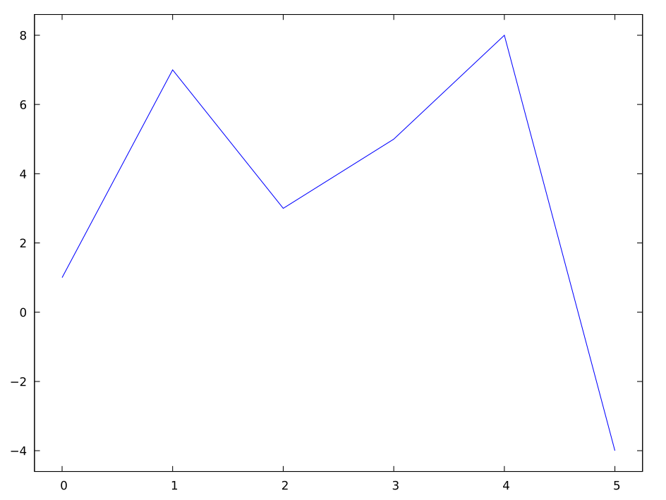
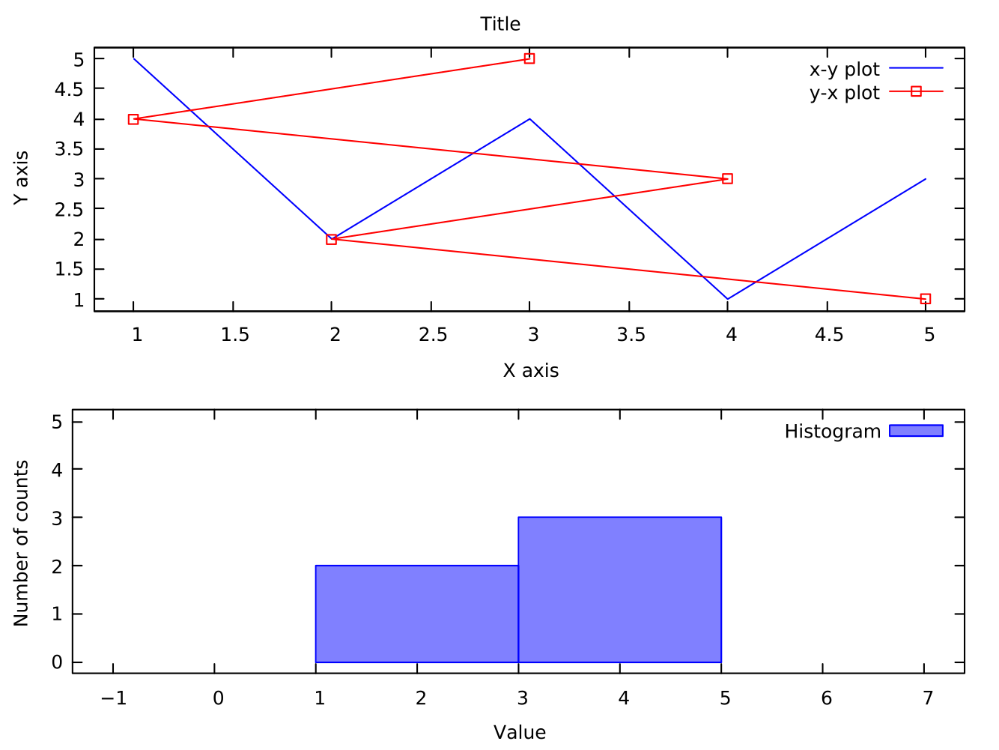

% Laboratorio di TNDS -- Lezione 4
% Maurizio Tomasi
% Martedì 26 Ottobre 2021

# Esercizi per oggi

# Link alle risorse online

-   Gli esercizi di oggi sono disponibili sul sito del corso [labmaster.mi.infn.it/Laboratorio2/labTNDS/lectures_1819/lezione5_1819_nuova.html](http://labmaster.mi.infn.it/Laboratorio2/labTNDS/lectures_1819/lezione5_1819_nuova.html).

-   Sul sito Repl.it, la lezione odierna è classificata come «5» perché in realtà inizieremo oggi ad implementare gli esercizi, ma li termineremo settimana prossima.

-   Come al solito, queste slides, che forniscono suggerimenti addizionali rispetto alla lezione di teoria, sono disponibili all'indirizzo [ziotom78.github.io/tnds-tomasi-notebooks](https://ziotom78.github.io/tnds-tomasi-notebooks/).


# Esercizi per oggi

-   Esercizio 5.0: Creazione della classe `Posizione`
-   Esercizio 5.1: Creazione della classe `Particella` ed `Elettrone`
-   Esercizio 5.2: Creazione delle classi `CampoVettoriale` e `PuntoMateriale`
-   Esercizio 5.3: Calcolo del campo elettrico generato da un dipolo (**da consegnare**)

# Suggerimenti per gli esercizi

# Esercizio 5.0

-   Alcune funzioni utili disponibili in `<cmath>`:

    ```c++
    double std::sin(double x);
    double std::cos(double x);
    double std::tan(double x);
    double std::atan(double x);
    double std::atan2(double y, double x);
    ```

-   Per maggiori informazioni, eseguire `man` da terminale

    ```sh
    $ man atan2
    ```

-   Consultate Wikipedia per comprendere la logica di [`atan2`](https://en.wikipedia.org/wiki/Atan2).

# Esercizio 5.0

```c++
bool are_close(double calculated, double expected, double epsilon = 1e-7) {
  return fabs(calculated - expected) < epsilon;
}

void test_coordinates(void) {
  Posizione p{1, 2, 3};
  
  assert(are_close(p.getX(), 1.0));
  assert(are_close(p.getY(), 2.0);
  assert(are_close(p.getZ(), 3.0);
  
  assert(are_close(p.getR(), 3.7416573867739));
  assert(are_close(p.getPhi(), 0.64052231267943);
  assert(are_close(p.getTheta(), 1.1071487177941);

  assert(are_close(p.getRho(), 2.2360679774998);
}
```

# Esercizio 5.2

-   L'esempio usa `new` per creare puntatori:

    ```c++
    Particella *a   = new Particella{1., 1.6e-19};
    Elettrone *e    = new Elettrone{};
    CorpoCeleste *c = new CorpoCeleste{"Terra", 6.0e24, 6.4e6};
    ```

    Questo è utile per lo scopo dell'esercizio (comprendere come funziona l'ereditarietà).

-   In un vero programma l'uso di `new` e `delete` espliciti andrebbe però limitato il più possibile (e in questi pochissimi casi, andrebbe comunque usato solamente in costruttori/distruttori di classi).

# Esercizio 5.3

```c++
void test_coulomb_law(void) {
  // 0.5 µC charge with no mass (irrelevant for the electric field)
  PuntoMateriale particella1{1.0, 5e-7, 5, 3, -2, };
  Posizione p{-2, 4, 1};
  
  CampoVettoriale V{particella.CampoElettrico(p)};
  
  assert(are_close(V.getFx(), -69.41150052142065));
  assert(are_close(V.getFy(), 9.915928645917235));
  assert(are_close(V.getFz(), 29.747785937751708));
}

void test_newton_law(void) {
  // 10⁹ tonnes, without charge (irrelevant for the gravitational field)
  PuntoMateriale particella1{1e12, 0, 5, 3, -2, };
  Posizione p{-2, 4, 1};
  
  CampoVettoriale V{particella.CampoElettrico(p)};
    
  assert(are_close(V.getFx(), -1.0302576701177));
  assert(are_close(V.getFy(), 0.14717966715968));
  assert(are_close(V.getFz(), 0.44153900147903));
}
```

# Inizializzazione di variabili membro

# Inizializzazione e assegnamento

Per inizializzare i membri di una classe in C++ esistono due possibilità:

```c++
class Prova {
public:
    Prova();
private:
    int a;
    double b;
};

Prova::Prova() : a{1} { // Initializer: use ":" *before* the {
    b = 5.0;            // Old boring assignment
}
```

# Inizializzazione e assegnamento

-   I due metodi non sono equivalenti!

-   Costruiamo una classe `Container` che contiene al suo interno due variabili, `a` e `b`, dello stesso tipo `Object` ma inizializzate in modo diverso:

    ```c++
    class Container {
    public:
      // Pass two strings as names to distinguish the two objects
      Container() : a{"Pippo (initializer)"} { b = Object("Pluto (assignment)"); }

    private:
      Object a, b;
    };
    ```

# Inizializzazione e assegnamento

Per capire cosa succede, definiamo `Object` in modo che stampi a video un messaggio ogni volta che viene invocato un suo metodo.

```c++
class Object {
public:
  Object() { std::cout << "Call to empty constructor\n"; }
  Object(const char *name) {
    std::cout << "Call to constructor for \"" << name << "\"\n";
  }

  void operator=(const Object &) { 
    std::cout << "Call to operator=\n";
  }
};
```

# Inizializzazione e assegnamento

Se ora creiamo nel `main` una variabile `Container`, vedremo cosa
accade nel costruttore:

```c++
int main(void) {
  Container c;
  return 0;
}
```

# Risultato

-   L'output del programma è il seguente:

    ```
    Call to constructor for "Pippo (initializer)"
    Call to empty constructor
    Call to constructor for "Pluto (assignment)"
    Call to operator=
    ```
    
-   Ricordiamo come abbiamo definito il costruttore:

    ```c++
    class Container {
    public:
      Container() : a{"Pippo (initializer)"} {
          b = Object("Pluto (assignment)");
      }

    private:
      Object a, b;
    };
    ```

# Regola generale

-   Si dovrebbe evitare di inizializzare gli oggetti nel corpo del costruttore, perché il C++ richiede che tutte le variabili membro siano inizializzate **prima** che il costruttore di una classe sia eseguito.

-   Di conseguenza, se si usani i «vecchi» assegnamenti gli oggetti con costruttore vengono inizializzati due volte.

-   L'inizializzazione con i due punti (`:`) è **sempre** da preferire:

    ```c++
    class Container {
    public:
      Container() : a{"Pippo"}, b{"Pluto"} { } // Così si fa!
      
      // ...
    };
    ```

# Formattazione di numeri

# Formattazione di numeri

-   Stampare dati usando formattazioni speciali in C++ è uno strazio!

-   Supponiamo di avere le seguenti variabili:

    ```c++
    const vector<string> s{"Paperino", "Zio Paperone"};
    const vector<int> i{3, 15}
    const vector<float> f{562.61, 0.142}
    ```

    e di volerle stampare in una tabella con questo formato:

    ```text
    Nome           |   Intero |       Valore
    Paperino       |        3 |     5.63e+02
    Zio Paperone   |       15 |     1.42e-01
    ```

    (Notate che «Intero» e «Valore» sono allineati a destra).

# Soluzione con il C++

La soluzione in C++ richiede l'uso di `<iomanip>`, ed è complicata:

```c++
cout << setw(14) << "Nome" 
     << " | "
     << setw(8) << right << "Intero" 
     << " | "
     << setw(12) << right << "Valore" 
     << "\n";

// Non provo neppure a scrivere il resto…
```

(`setw` viene resettato subito dopo essere stato applicato alla variabile seguente, quindi non influisce su `" | "`).

# Formattare stringhe in C++20

-   Nel Luglio 2019 [è stato annunciato](http://www.zverovich.net/2019/07/23/std-format-cpp20.html) che la release 2020 dello standard C++ avrebbe incluso una libreria per la formattazione di stringhe.

-   Questa libreria è ispirata ad alcune soluzioni introdotte negli scorsi anni nei linguaggi [Python](https://docs.python.org/3/library/string.html#format-string-syntax), [C#](https://msdn.microsoft.com/en-us/library/system.string.format(v=vs.110).aspx) e [Rust](https://doc.rust-lang.org/std/fmt/), e l'approccio sta prendendo piede in molti altri linguaggi.

# `std::format` in C++20

La soluzione del problema in C++20 si scriverebbe così:

```c++
#include <format> // C++20

using namespace std;

int main() {
  format::print("{0:<14} | {1:>8} | {2:>12}\n",
                "Nome", "Intero", "Valore");
  //            ↑ {0}   ↑ {1}     ↑ {2}
  
  for (int k{}; k < 2; k++) {
      format::print("{0:<14} | {1:>8} | {2:>12.2e}\n",
                    s[k], i[k], f[k]);
  }
}
```

# `std::format` in C++20

-   Il primo parametro di `std::format` è una stringa che specifica il formato dell'output; gli altri sono i valori da includere nella stampa (vedi il sito [fmt.dev](https://fmt.dev/latest/syntax.html)).

-   Una stringa come `{2:>12.2e}` usata nell'esempio indica questo:

    1. La posizione del parametro che contiene il valore, partendo da zero (`2`);
    2. I due punti (`:`);
    3. Eventualmente `<` o `>` per specificare l'allineamento a sinistra o destra;
    4. Il numero di caratteri, ed eventualmente le cifre dopo la virgola (`12.2`);
    5. Se necessario, una lettera che identifichi il tipo («`e`»: notazione scientifica, «`f`»: float, «`s`»: stringa, «`c`»: carattere, etc.)

# Numero di caratteri

-   Come avete visto, si può specificare il numero di caratteri da stampare inserendo un numero dopo i due punti:

    ```c++
    format::print("*{0:4s}{1:4s}*\n", "a", "b");
    // *a   b   *
    ```

-   Se il numero di caratteri va calcolato nel programma, è possibile usare le parentesi graffe *dentro le parentesi graffe*!

    ```c++
    int width = 4;
    format::print("*{0:{2}s}{1:{2}s}*\n", "a", "b", width);
    // *a   b   *
    ```

# Numero di caratteri

Per stampare tabelle ben formattate che contengono stringhe, occorre determinare la lunghezza massima delle stringhe.

```c++
#include <format>
#include <algorithm>
#include <string>
#include <vector>

int main() {
  std::vector<std::string> v{"Pippo", "Pluto", "Paperino"};
  auto longest_str{max_element(
      v.begin(), v.end(), [](auto a, auto b) { 
          return a.size() < b.size();
      })}; // Find the longest string in "v"
  
  // Now `longest_str` is equal to "Paperino"
  for (const auto &s : v) {
    std::format::print("| {0:{1}} |\n", s, longest_str->size());
  }
}
// | Pippo    |
// | Pluto    |
// | Paperino |
```

# Scorciatoie

-   Si può omettere tutto dai due punti in poi, e anche la posizione del parametro:

    ```c++
    std::format::print("{0} = {1}", "valore", 10);
    // Scrive: "valore = 10"

    std::format::print("{} = {}", "valore", 10);
    // Idem, il risultato è identico a sopra
    ```

-   Invece di stampare a video, si può salvare il risultato in una stringa:

    ```c++
    for(int k{}; k < 100; ++k) {
        string filename{format::format("out{0:04d}.txt", k)};
        ofstream outf{filename};
        // [Write data into `outf`]
    }
    // Create files out0000.txt, out0001.txt, out0002.txt, …
    ```

# Il futuro… ora!

-   Il comando `g++` sui computer del laboratorio e su Repl.it non supporta ancora lo standard C++20: solo a partire dalla versione 10 di GCC è supportato lo standard C++20, passando a `g++` il flag `-std=c++20`.

-   La libreria di formattazione può però già essere usata scaricandola dal sito
[github.com/fmtlib/fmt](https://github.com/fmtlib/fmt), che contiene la versione completa della libreria, usabile però anche da compilatori che ancora non supportano il C++20 (come quelli su Repl.it o del laboratorio).

-   Per automatizzare l'installazione, potete scaricare (con il click destro) lo script [install_fmt_library.sh](./install_fmt_library.sh), da eseguire nella cartella del vostro programma:

    ```
    sh install_fmt_library.sh
    ```

---

<asciinema-player src="asciinema/install-fmt-91×23.cast" cols="91" rows="23" font-size="medium"></asciinema-player>

# Differenze tra `format` e il futuro C++20

-   La libreria installata da <a url="./install_fmt_library.sh" download>`install_fmt_library.sh`</a> ha alcune differenze con lo standard C++20:

    1. Il namespace è diverso: è `fmt::` anziché `std::format::`;
    2. Il file da includere è diverso: `"fmt/format.h"` anziché `<format>`;
    3. Nel compilare i propri programmi, bisogna includere il file `format.cc`.

-   Probabilmente le differenze 1. e 2. siano dovute al desiderio degli autori di scrivere programmi che usino entrambe le librerie contemporaneamente, per andare a caccia di differenze e sistemarle.

# Differenze tra `format` e il futuro C++20

-   Lo script `install_fmt_library.sh` installa un piccolo file header, `fmtlib.h`, che si preoccupa di gestire le differenze tra il C++ attuale e il C++20

-   Se usate `#include "fmtlib.h"`, vi basterà poi usare sempre il namespace `fmt::`.

-   Se ricompilerete in futuro il vostro codice con un compilatore C++20, `fmtlib.h` vi permetterà di continuare ad usare `fmt::`, che sarà silenziosamente convertito in `std::format`.

# Creazione di grafici

# ROOT e Gnuplot

-   Nelle lezioni precedenti avete visto come usare ROOT per produrre grafici.

-   In questo corso, ROOT è usato come libreria C++, ossia come un insieme di classi invocabili all'interno dei vostri programmi.

-   Un'alternativa a ROOT, per coloro che hanno avuto problemi a installarlo sui propri laptop o in Repl.it, è  [Gnuplot](http://www.gnuplot.info/):

    -   È già presente su Repl.it
    -   È facilmente installabile anche sotto Windows;
    -   È usabile anche all'interno di programmi C++, mediante una piccola libreria.

---

<iframe src="https://player.vimeo.com/video/638755770?h=2e3e2ab3eb&amp;badge=0&amp;autopause=0&amp;player_id=0&amp;app_id=58479" width="1339" height="720" frameborder="0" allow="autoplay; fullscreen; picture-in-picture" allowfullscreen title="How to use Gnuplot"></iframe>


# Chiamare Gnuplot dal C++

-   Siccome negli anni passati alcuni vostri colleghi avevano avuto problemi a usare REPL sui propri laptop, ho sviluppato una piccola libreria C++ che consenta di invocare Gnuplot per generare plot all'interno di programmi C++. È disponibile all'indirizzo [github.com/ziotom78/gplotpp](https://github.com/ziotom78/gplotpp).

-   Se avete anche voi problemi con ROOT, potete provare ad usarla: in Repl.it è molto veloce, e non appesantisce il caricamento del sito. Inoltre [funziona anche sotto Windows](https://vimeo.com/638098854), se prima [installate Gnuplot nel modo giusto](https://vimeo.com/638098416).

-   Per installarla in Repl.it, basta eseguire `sh install_gplot++.h`.

-   Sui vostri laptop dovete invece scaricare il file [gplot++.h](https://raw.githubusercontent.com/ziotom78/gplotpp/master/gplot%2B%2B.h) nella cartella dove vi serve.

# Vantaggi di gplot++

-   Si possono passare array di vettori di tipo `std::vector`;

-   Non serve cambiare i `Makefile` per invocare chiamate come quelle a `root-config`;
    
-   Non serve ricordarsi di eseguire `source root/bin/thisroot.sh`;

-   Occupa appena 9 KB, quindi si può installare una copia dentro ogni cartella di esercizi (**non fate questo con ROOT in Repl.it!**);

-   Non richiedendo `root-config`, Repl.it è in grado di visualizzare finestre di aiuto sui comandi di plot. 
    
# Semplice esempio

```c++
#include "gplot++.h"

int main() {
  std::vector<double> values{1, 7, 3, 5, 8, -4};
  Gnuplot plt{};
  plt.plot(values);
  plt.show();
}
```

# Semplice esempio

{width=50%}

# Salvare i plot in file

-   L'esempio precedente apre una finestra. Questa soluzione è comoda perché la finestra è «navigabile»: si può zoomare con il mouse come si fa in ROOT, ma se usate Repl.it è estremamente lenta!

-   Nel caso usiate Repl.it, è meglio che salviate i plot in file PNG, che Repl.it permette di visualizzare con un click. Basta usare il metodo `Gnuplot::redirect_to_png` subito dopo aver creato una variabile di tipo `Gnuplot`:

    ```c++
    Gnuplot plt{};
    plt.redirect_to_png("output.png");

    // Now use plt.plot(...) as usual
    ```

# Salvare i plot in file PNG

```c++
#include "gplot++.h"

int main() {
  std::vector<double> values{1, 7, 3, 5, 8, -4};
  Gnuplot plt{};

  // Salva il grafico in "output.png"
  plt.redirect_to_png("output.png");
  
  plt.plot(values);
  plt.show();
}
```

---

<iframe src="https://player.vimeo.com/video/638760398?h=5850966496&amp;badge=0&amp;autopause=0&amp;player_id=0&amp;app_id=58479" width="1236" height="720" frameborder="0" allow="autoplay; fullscreen; picture-in-picture" allowfullscreen title="How to invoke Gnuplot from a Repl.it C++ project"></iframe>


# Esempio più complesso

```c++
int main(void) {
  Gnuplot plt{};
  std::vector<double> x{1, 2, 3, 4, 5}, y{5, 2, 4, 1, 3};
  plt.multiplot(2, 1, "Title"); // Two plots in two rows

  plt.set_xlabel("X axis");
  plt.set_ylabel("Y axis");
  plt.plot(x, y, "x-y plot");
  plt.plot(y, x, "y-x plot", Gnuplot::LineStyle::LINESPOINTS);
  plt.show(); // Create the plot and move to the next row

  plt.set_xlabel("Value");
  plt.set_ylabel("Number of counts");
  plt.histogram(y, 2, "Histogram"); // Two bins
  plt.set_xrange(-1, 7);
  plt.set_yrange(0, 5);
  plt.show();
}
```

# Esempio più complesso

{width=50%}

Per esempi e documentazione, andate alla pagina [github.com/ziotom78/gplotpp](https://github.com/ziotom78/gplotpp).
