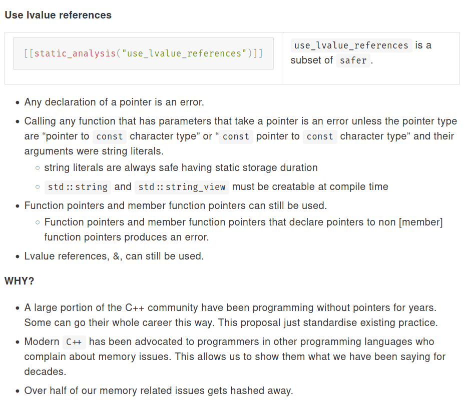
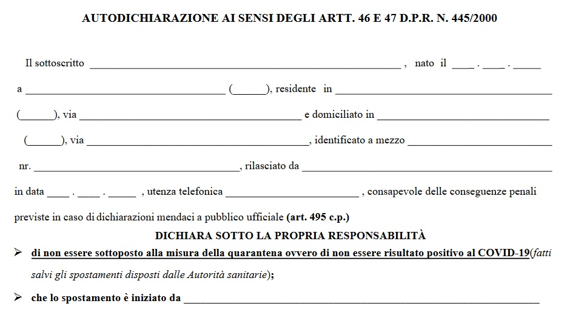
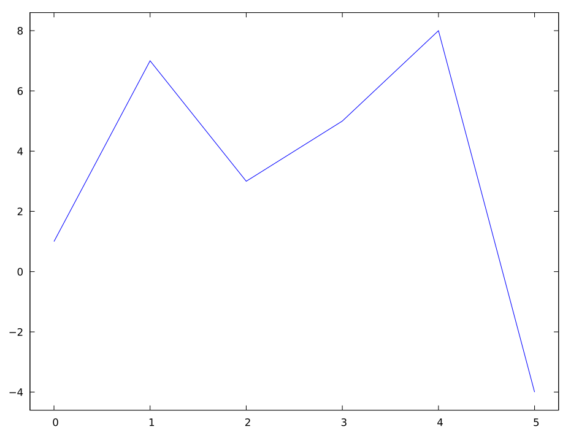
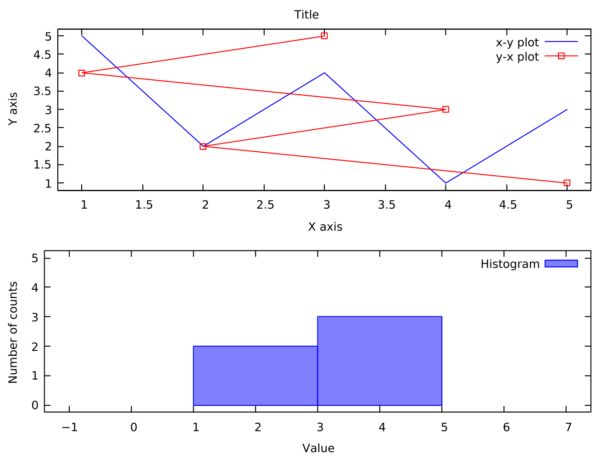

# Esercizi per oggi

# Link alle risorse online

-   La spiegazione dettagliata degli esercizi si trova qui: [carminati-esercizi-05.html](carminati-esercizi-05.html).

-   Come al solito, queste slides, che forniscono suggerimenti addizionali rispetto alla lezione di teoria, sono disponibili all'indirizzo [ziotom78.github.io/tnds-tomasi-notebooks](https://ziotom78.github.io/tnds-tomasi-notebooks/).

# Esercizi per oggi

-   [Esercizio 5.0](carminati-esercizi-05.html#5.0): Creazione della classe `Posizione`
-   [Esercizio 5.1](carminati-esercizi-05.html#5.1): Creazione della classe `Particella` ed `Elettrone`
-   [Esercizio 5.2](carminati-esercizi-05.html#5.2): Creazione delle classi `CampoVettoriale` e `PuntoMateriale`
-   [Esercizio 5.3](carminati-esercizi-05.html#5.3): Calcolo del campo elettrico generato da un dipolo (**da consegnare**)
-   [Esercizio 5.4](carminati-esercizi-05.html#5.4): Campo di multipolo (approfondimento)
-   [Esercizio 5.5](carminati-esercizi-05.html#5.5): Gravità dallo spazio (approfondimento)

# Suggerimenti per gli esercizi

# Esercizio 5.0

-   Alcune funzioni utili disponibili in `<cmath>`:

    ```c++
    double std::sin(double x);
    double std::cos(double x);
    double std::tan(double x);
    double std::atan(double x);
    double std::atan2(double y, double x);
    ```

-   Per maggiori informazioni, eseguire `man` da terminale

    ```sh
    $ man atan2
    ```

-   Consultate Wikipedia per comprendere la logica di [`atan2`](https://en.wikipedia.org/wiki/Atan2).

# Esercizio 5.0

```c++
bool are_close(double calculated, double expected, double epsilon = 1e-7) {
  return fabs(calculated - expected) < epsilon;
}

void test_coordinates(void) {
  Posizione p{1, 2, 3};

  assert(are_close(p.getX(), 1.0));
  assert(are_close(p.getY(), 2.0);
  assert(are_close(p.getZ(), 3.0);

  assert(are_close(p.getR(), 3.7416573867739));
  assert(are_close(p.getPhi(), 1.1071487177941);
  assert(are_close(p.getTheta(), 0.64052231267943);

  assert(are_close(p.getRho(), 2.2360679774998);
}
```

# Esercizio 5.2

-   L'esempio usa `new` per creare puntatori:

    ```c++
    Particella a{1., 1.6e-19};
    Elettrone *e    = new Elettrone{};
    CorpoCeleste *c = new CorpoCeleste{"Terra", 6.0e24, 6.4e6};
    ```

    Questo è utile per lo scopo dell'esercizio (comprendere come funziona l'ereditarietà).

-   In un vero programma l'uso di `new` e `delete` espliciti andrebbe però limitato il più possibile (e in questi pochissimi casi, andrebbe comunque usato solamente in costruttori/distruttori di classi, mai nel `main`).

---

<center>
{width=40%}
</center>

Estratto dall'articolo [C++ is the next C++](https://www.open-std.org/jtc1/sc22/wg21/docs/papers/2022/p2657r0.html), che propone una nuova «modalità» di compilazione del C++ in cui disabilitare (quasi) del tutto i puntatori.


# Esercizio 5.3

```c++
void test_coulomb_law(void) {
  // 0.5 µC charge with no mass (irrelevant for the electric field)
  PuntoMateriale particella1{0.0, 5e-7, 5, 3, -2};
  Posizione p{-2, 4, 1};

  CampoVettoriale V{particella.CampoElettrico(p)};

  assert(are_close(V.getFx(), -69.41150052142065));
  assert(are_close(V.getFy(), 9.915928645917235));
  assert(are_close(V.getFz(), 29.747785937751708));
}

void test_newton_law(void) {
  // 10⁹ tonnes, without charge (irrelevant for the gravitational field)
  PuntoMateriale particella1{1e12, 0, 5, 3, -2};
  Posizione p{-2, 4, 1};

  CampoVettoriale V{particella.CampoElettrico(p)};

  assert(are_close(V.getFx(), -1.0302576701177));
  assert(are_close(V.getFy(), 0.14717966715968));
  assert(are_close(V.getFz(), 0.44153900147903));
}
```

# Inizializzazione di variabili membro

# Inizializzazione e assegnamento

Per inizializzare i membri di una classe in C++ esistono due possibilità:

```c++
class Prova {
public:
    Prova();
private:
    int a;
    double b;
};

Prova::Prova() : a{1} { // Initializer: use ":" *before* the {
    b = 5.0;            // Old boring assignment
}
```

# Inizializzazione e assegnamento

-   I due metodi non sono equivalenti!

-   Costruiamo una classe `DaylightPeriod` che contiene al suo interno due variabili, `a` e `b`, dello stesso tipo `Object` ma inizializzate in modo diverso:

    ```c++
    class DaylightPeriod {
    public:
      // Pass two strings as names to distinguish the two objects
      DaylightPeriod() : dawn{"7:00"} { sunset = Time("21:00"); }

    private:
      Time dawn, sunset;
    };
    ```

# Inizializzazione e assegnamento

Per capire cosa succede, definiamo `Time` in modo che stampi a video un messaggio ogni volta che viene invocato un suo metodo.

```c++
class Time {
public:
  Time() { std::cout << "Call to empty constructor\n"; }
  Time(const char *time) {
    std::cout << "Call to constructor with time \"" << time << "\"\n";
  }

  void operator=(const Time &) {
    std::cout << "Call to operator=\n";
  }
};
```

# Inizializzazione e assegnamento

Se ora creiamo nel `main` una variabile `DaylightPeriod`, vedremo cosa
accade nel costruttore:

```c++
int main(void) {
  DaylightPeriod c;
  return 0;
}
```

# Risultato

-   L'output del programma è il seguente:

    ```
    Call to constructor with time "7:00"
    Call to empty constructor
    Call to constructor with time "21:00"
    Call to operator=
    ```

-   Ricordiamo come abbiamo definito la classe `DaylightPeriod`, e in particolare il costruttore:

    ```c++
    class DaylightPeriod {
    public:
      DaylightPeriod() : dawn{"7:00"} { sunset = Time("21:00"); }

    private:
      Time dawn, sunset;
    };
    ```

# Regola generale

-   Si dovrebbe evitare di inizializzare gli oggetti nel corpo del costruttore, perché il C++ richiede che tutte le variabili membro siano inizializzate **prima** che il costruttore di una classe sia eseguito.

-   Di conseguenza, se si usano i «vecchi» assegnamenti gli oggetti con costruttore vengono inizializzati due volte.

-   L'inizializzazione con i due punti (`:`) è **sempre** da preferire:

    ```c++
    class DaylightPeriod {
    public:
      DaylightPeriod() : dawn{"7:00"}, sunset{"21:00"} { } // That's the way!

      // ...
    };
    ```

# Formattazione di numeri

# Formattazione di numeri

-   Stampare dati usando formattazioni speciali in C++ è uno strazio!

-   Supponiamo di voler stampare le coordinate cartesiane di un punto:

    ```c++
    Posizione p{calcola_posizione()};

    cout << "La posizione è (" << p.GetX() << ", "
         << p.GetY(), << ", " << p.GetZ() << ")" << endl;
    ```

-   Questo codice è complicato da leggere, perché ci sono troppi operatori `<<` (e infatti c'è un errore: lo trovate?).


# Formattare stringhe in C++20

-   Nel Luglio 2019 [è stato annunciato](http://www.zverovich.net/2019/07/23/std-format-cpp20.html) che la release 2020 dello standard C++ avrebbe incluso una libreria per la formattazione di stringhe.

-   Questa libreria è ispirata ad alcune soluzioni introdotte negli scorsi anni nei linguaggi [Python](https://docs.python.org/3/library/string.html#format-string-syntax), [C#](https://msdn.microsoft.com/en-us/library/system.string.format(v=vs.110).aspx) e [Rust](https://doc.rust-lang.org/std/fmt/), e l'approccio sta prendendo piede in molti altri linguaggi.

# Un'analogia




# `std::format` in C++20

-   La nuova libreria `<format>` permette di usare lo stesso meccanismo dell'autocertificazione nella slide precedente

-   L'idea è che si fornisce un *template*, ossia una stringa che va riempita in certi punti con i valori delle variabili

-   Se nel modulo della slide precedente gli spazi da riempire erano indicati con `_________`, la libreria `std::format` richiede invece di usare `{}`:

    ```c++
    Posizione p{calcola_posizione()};

    cout << format("La posizione è ({}, {}, {})\n", p.GetX(), p.GetY(), p.GetZ());
    ```

# Formattazioni più elaborate

-   È possibile specificare il modo in cui un valore va scritto inserendo degli argomenti dentro `{}`

-   Ad esempio, per formattare numeri floating-point con 2 cifre dopo la virgola si scrive `{:.2f}`

-   Se si vuole usare la notazione scientifica, si usa la lettera `e`: la scrittura `{:.5e}` indica che si richiedono 5 cifre dopo la virgola

-   Si può indicare il numero di caratteri da usare inserendo un numero subito dopo `:`: così `{:5}` chiede di usare almeno 5 caratteri per scrivere il valore. Questo è utile per allineare valori in tabelle!

-   La libreria rende possibile l'internazionalizzazione!

# Internazionalizzazione

-   Per rendere i propri programma “traducibili”, si usa la libreria [GNU gettext](https://en.wikipedia.org/wiki/Gettext):

    ```c++
    cout << gettext("Insert a number, please: ");
    ```

-   La funzione `gettext` determina la lingua del sistema e cerca un file `.po` appropriato (che va fornito insieme al proprio programma), fatto così:

    ```
    msgid "Insert a number, please: "
    msgstr "Inserire un numero, per favore: "
    ```

-   Di solito nei programmi si [usa la macro `_()`](https://www.gnu.org/software/gettext/manual/gettext.html#Overview) come *alias* per `gettext()`:

    ```c++
    cout << _("Insert a number, please: ");
    ```

# Internazionalizzazione

-   Uno dei motivi per cui `cout` non è più utilizzata è proprio per l'internazionalizzazione. Per esempio, la data “14 Aprile 2003” può essere scritta come `04/14/2003` (americano), `14/04/2003` (italiano) o `2003-04-14` (formato ISO).

-   Ma è impossibile usare `gettext` con `cout` in questo caso!

    ```c++
    // Inglese:
    cout << "Birth date: " << month << "/" << day << "/" << year;
    // Italiano:
    cout << "Data di nascita: " << day << "/" << month << "/" << year;
    // ISO:
    cout << "Birth date: " << year << "-" << month << "-" << day;
    ```

# Internazionalizzazione

-   Con `std::format` invece è facile usare `gettext`:

    ```c++
    cout << std::format(_("Birth date: {1}/{0}/{2}"), day, month, year);
	```

-   Il file `italian.po` conterrà questo:

    ```
    msgid: Birth date: {1}/{0}/{2}
    msgstr: Data di nascita: {0}/{1}/{2}
    ```

-   Nel C++23 vengono anche introdotte le funzioni [`print`](https://en.cppreference.com/w/cpp/io/print) e [`println`](https://en.cppreference.com/w/cpp/io/println), così che `cout` si eviterà del tutto:

    ```c++
    print(_("Birth date: {1}/{0}/{2}"), day, month, year);
    ```

# Il futuro… ora!

-   Il compilatore `g++` sui computer del laboratorio supporta già `format`, ma non ancora `print` e `println`

-   Una libreria di formattazione completa, che implementa anche i colori e può essere usata anche su compilatori più vecchi, è disponibile al sito [github.com/fmtlib/fmt](https://github.com/fmtlib/fmt). Questa **non è necessaria** per il corso, la fornisco solo per chi è interessato.

-   Per automatizzare l'installazione, potete scaricare (con il click destro) lo script [install_fmt_library](./install_fmt_library), da eseguire nella cartella del vostro programma:

    ```
    sh install_fmt_library
    ```

-   La libreria `fmt` supporta anche i [colori](https://fmt.dev/latest/api.html#terminal-color-and-text-style), come mostrato nell'animazione seguente.

---

<asciinema-player src="asciinema/install-fmt-94x25.cast" cols="94" rows="25" font-size="medium"></asciinema-player>


# Differenze tra `format` e il C++20

-   La libreria installata da <a url="./install_fmt_library" download>`install_fmt_library`</a> ha alcune differenze con lo standard C++20:

    1. Il namespace è diverso: è `fmt::` anziché `std::`;
    2. Il file da includere è diverso.


# Differenze tra `format` e il futuro C++20

-   Lo script `install_fmt_library` installa un piccolo file header, `fmtlib.h`, che si preoccupa di gestire le differenze tra il C++ attuale e il C++20

-   Se usate `#include "fmtlib.h"`, vi basterà poi usare sempre il namespace `fmt::` anziché il più lungo `std::format::`.


# Creazione di grafici

# ROOT e Gnuplot

-   Nelle lezioni precedenti avete visto come usare ROOT per produrre grafici.

-   In questo corso, ROOT è usato come libreria C++, ossia come un insieme di classi invocabili all'interno dei vostri programmi.

-   Un'alternativa a ROOT, per coloro che hanno avuto problemi a installarlo sui propri laptop o in Repl.it, è [Gnuplot](http://www.gnuplot.info/):

    -   È già presente su Repl.it
    -   È facilmente installabile anche sotto Windows;
    -   È usabile anche all'interno di programmi C++, mediante una piccola libreria.

---

<iframe src="https://player.vimeo.com/video/638755770?h=2e3e2ab3eb&amp;badge=0&amp;autopause=0&amp;player_id=0&amp;app_id=58479" width="1339" height="720" frameborder="0" allow="autoplay; fullscreen; picture-in-picture" allowfullscreen title="How to use Gnuplot"></iframe>


# Chiamare Gnuplot dal C++

-   Ho sviluppato una libreria C++ che invoca Gnuplot all'interno di programmi C++. È disponibile all'indirizzo [github.com/ziotom78/gplotpp](https://github.com/ziotom78/gplotpp).

-   Se avete anche voi problemi con ROOT, potete provare ad usarla: in Repl.it è molto veloce, e non appesantisce il caricamento del sito. Inoltre [funziona anche sotto Windows](https://vimeo.com/638098854), se prima [installate Gnuplot nel modo giusto](https://vimeo.com/638098416).

-   Per installarla in Repl.it, basta eseguire `sh install_gplot++.h`.

-   Sui vostri laptop dovete invece scaricare il file [gplot++.h](https://raw.githubusercontent.com/ziotom78/gplotpp/master/gplot%2B%2B.h) nella cartella dove vi serve, oppure eseguite (sotto Linux/Mac OS X):

    <input type="text" value="curl 'https://raw.githubusercontent.com/ziotom78/gplotpp/master/gplot%2B%2B.h' > gplot++.h" id="installGplotpp" readonly="1" size="60"><button onclick='copyFmtInstallationScript("installGplotpp")'>Copia</button>

# Vantaggi di gplot++

-   Repl.it è in grado di visualizzare finestre di aiuto se spostate il mouse sui comandi di plot.

-   Si possono passare direttamente array di vettori di tipo `std::vector`, invece di chiamare ripetutamente `TGraph::SetPoint`;

-   Non serve cambiare i `Makefile` per invocare `root-config`;

-   Se lavorate sui vostri computer, non serve ricordarsi di eseguire `source root/bin/thisroot.sh`;

-   Occupa appena 9 KB, quindi si può installare una copia dentro ogni cartella di esercizi;


# Semplice esempio

```c++
#include "gplot++.h"

int main() {
  std::vector<double> values{1, 7, 3, 5, 8, -4};
  Gnuplot plt{};
  plt.plot(values);
  plt.show();
}
```

# Semplice esempio

{width=50%}


# Salvare i plot in file

-   L'esempio precedente apre una finestra. Questa soluzione è comoda perché la finestra è «navigabile»: si può zoomare con il mouse come si fa in ROOT, ma se usate Repl.it è estremamente lenta!

-   Nel caso usiate Repl.it, è meglio che salviate i plot in file PNG, che Repl.it permette di visualizzare con un click. Basta usare il metodo `Gnuplot::redirect_to_png` subito dopo aver creato una variabile di tipo `Gnuplot`:

    ```c++
    Gnuplot plt{};
    plt.redirect_to_png("output.png");

    // Now use plt.plot(...) as usual
    ```

# Salvare i plot in file PNG

```c++
#include "gplot++.h"

int main() {
  std::vector<double> values{1, 7, 3, 5, 8, -4};
  Gnuplot plt{};

  // Salva il grafico in "output.png"
  plt.redirect_to_png("output.png");

  plt.plot(values);
  plt.show();
}
```

---

<iframe src="https://player.vimeo.com/video/638760398?h=5850966496&amp;badge=0&amp;autopause=0&amp;player_id=0&amp;app_id=58479" width="1236" height="720" frameborder="0" allow="autoplay; fullscreen; picture-in-picture" allowfullscreen title="How to invoke Gnuplot from a Repl.it C++ project"></iframe>


# Esempio più complesso

```c++
int main(void) {
  Gnuplot plt{};
  std::vector<double> x{1, 2, 3, 4, 5}, y{5, 2, 4, 1, 3};
  plt.multiplot(2, 1, "Title"); // Two plots in two rows

  plt.set_xlabel("X axis");
  plt.set_ylabel("Y axis");
  plt.plot(x, y, "x-y plot");
  plt.plot(y, x, "y-x plot", Gnuplot::LineStyle::LINESPOINTS);
  plt.show(); // Create the plot and move to the next row

  plt.set_xlabel("Value");
  plt.set_ylabel("Number of counts");
  plt.histogram(y, 2, "Histogram"); // Two bins
  plt.set_xrange(-1, 7);
  plt.set_yrange(0, 5);
  plt.show();
}
```

# Esempio più complesso

{width=50%}

Per esempi e documentazione, andate alla pagina [github.com/ziotom78/gplotpp](https://github.com/ziotom78/gplotpp).


---
title: Laboratorio di TNDS -- Lezione 5
author: Maurizio Tomasi
date: Martedì 24 Ottobre 2023
theme: white
progress: true
slideNumber: true
background-image: ./media/background.png
history: true
width: 1440
height: 810
css:
- ./css/custom.css
- ./css/asciinema-player.css
...
