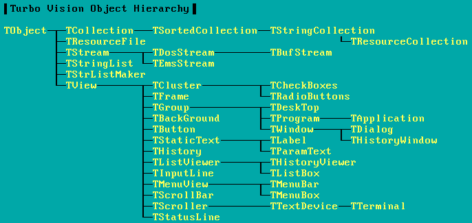
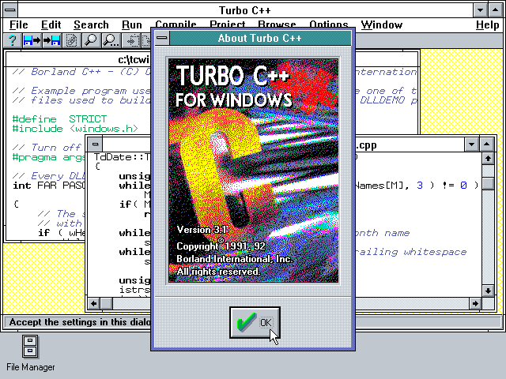
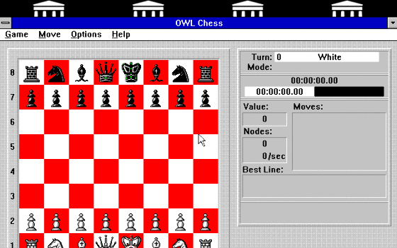

<iframe src="https://player.vimeo.com/video/664212814?h=ff70565e01&amp;badge=0&amp;autopause=0&amp;player_id=0&amp;app_id=58479" width="1024" height="768" frameborder="0" allow="autoplay; fullscreen; picture-in-picture" allowfullscreen title="DOS demo"></iframe>

# Turbo Vision

-   Un programma Turbo Vision poteva salvare su disco il suo stato.

-   Quando si usciva dal programma e lo si faceva ripartire, l'utente ritrovava tutto nello stesso stato.

-   Ogni classe che definiva gli oggetti del programma (finestre di testo, bottoni, dialoghi…) derivava dalla classe `TObject` (dalla versione 2.0, `TStreamable`), che aveva un metodo `save` e un metodo `load`.

# Gestione dello stato

-   Ecco una versione molto semplificata della funzione di salvataggio:

    ```c++
    TObject **objects = …;  // Array of pointers to TObject
    for(int i = 0; i < num_of_objects; ++i) {
        objects[i]->save();
    }
    ```

-   Ovviamente `TObject::save` è un metodo virtuale puro, che viene ridefinito in tutti gli oggetti discendenti: è il polimorfismo!

# Gerarchia di Turbo Vision

<center></center>

In Turbo Vision 1.0, quasi tutte le classi sono derivate dalla classe `TObject`!

# Borland C++ per Windows

<center>{ height=40% }</center>

La versione per Windows del Borland C++ (1992) includeva **OWL** (Object Windows Library) per scrivere programmi Windows.

# Object Windows Library

<center>{ height=40% }</center>

Programma di esempio di Borland C++, scritto usando OWL. (Il gioco funziona veramente!) Ce n'era pure una versione per DOS in modalità caratteri scritta usando Turbo Vision.

# ROOT

<center>{ width=40% }</center>

Anche ROOT (che nasce nel 1994) usa l'approccio di fondare tutta la gerarchia di classi su un solo tipo, `TObject`.

# Microsoft Foundation Classes

<center>{ width=50% }</center>

Quasi tutte le classi derivano da `CObject` (1998).

# Problemi con la OOP

# Incapsulamento

La promessa dell'OOP era quella di rendere il codice più riutilizzabile:

-   Usando l'incapsulamento, tutto è interno a una classe
-   Posso quindi prendere la classe e usarla in un nuovo progetto

# Incapsulamento

Se però volessi riutilizzare `TRadioButtons` di Turbo Vision in un mio programma, non potrei limitarmi a prendere solo quella classe:

-   `TRadioButtons` deriva da `TCluster`…
-   …che deriva da `TGroup`…
-   …che deriva da `TView`…
-   …che deriva da `TObject`.
-   `TView` usa le classi `TPoint`, `TRect`, `TScreen`, e `TApplication`.

Se voglio usare un algoritmo di `TRadioButtons` nel mio programma, devo incorporare tutto: la promessa di riutilizzabilità non si concretizza quasi mai!

# Gerarchie di classi

Nei progetti che usano OOP, c'è una enorme proliferazione di classi, legate tra loro da relazioni spesso complesse. Questo rende il codice difficile da comprendere.

<center>{ width=40% }</center>

# Gerarchie di classi

-   Considerate le Microsoft Foundation Classes (slide precedente): è difficile comprenderne la struttura intricata!
-   Eppure la slide presenta solo le **_relazioni_** tra i tipi di dati…
-   …e nulla ancora dice sugli **_algoritmi_** (es., come disegnare a video una finestra, cosa succede quando si preme un bottone…).
-   Con la OOP, l'implementazione degli algoritmi va affrontata solo dopo che si è definita la gerarchia di classi!

# Alexander Stepanov

-   Alexander Stepanov, uno dei creatori della libreria C++ STL (_Standard Template Library_, quella che definisce `std::vector`, `std::sort`, etc.) è da sempre stato un oppositore della programmazione OOP.
-   Per il C++ propose un meccanismo alternativo, chiamato _programmazione generica_ (v. [An Interview with A. Stepanov](http://www.stlport.org/resources/StepanovUSA.html)).
-   La sua idea è che i programmatori debbano concentrarsi innanzitutto sugli **_algoritmi_**, e che solo quando questi sono definiti si debba pensare ai tipi di dati su cui applicarli.
-   Al contrario, l'OOP obbliga a partire dal tipo di dato (ossia, la gerarchia di classi) per definire poi gli algoritmi.

# OOP e C++

- Bjarne Stroustrup, il creatore del C++, sposò le idee di Stepanov
- Lo standard C++98 include per la prima volta una versione della STL.
- La STL fornisce gli header `<string>`, `<vector>`, etc.
- Pochissimi di questi file usano l'ereditarietà e il polimorfismo.

# Dove va oggi il C++

-   La tendenza del linguaggio C++ negli standard succedutisi negli anni è stata di potenziare la programmazione generica e la metaprogrammazione.
-   Poche delle potenzialità delle versioni più recenti (dal C++11 in poi) sono legate alla OOP.
-   Due eccezioni che avete imparato ad usare sono le keyword `final` e `override`, che regolano il polimorfismo.

# Piccolo esperimento

-   A dimostrazione di ciò, contiamo i file della libreria standard C++ sui computer del laboratorio che implementano metodi `virtual` (segno di polimorfismo):

    ```sh
    $ grep -l virtual $(find /usr/include/c++/4.8.5/* -type f) \
         | wc -l
    64
    $ grep -L virtual $(find /usr/include/c++/4.8.5/* -type f) \
         | wc -l
    629
    ```

-   (Usando `-l` si contano i file che includono `virtual`, usando `-L` quelli che **non** lo includono).

# Dove va il GCC

- GCC 4.8: 64 / 629 file contengono `virtual`
- GCC 8.3: 61 / 714 file contengono `virtual`

<center></center>

# Calcolo scientifico

Se la fisica computazionale vi interessa, vi consiglio caldamente di impratichirvi con uno o più di questi strumenti:

1. [Python](https://www.python.org/): molto semplice, sono disponibili tantissime librerie (matematica, astronomia, web, multimedia, programmazione giochi, etc.)
2. [Julia](https://julialang.org/): meno librerie di Python, ma molto più veloce e potente.
3. [GNU R](https://www.r-project.org/): per analisi statistiche complesse non ha rivali.
4. [Mathematica](https://www.wolfram.com/mathematica/), a pagamento: molto potente nel calcolo simbolico.
5. [Matlab](https://www.mathworks.com/products/matlab.html), a pagamento, è orientato ad applicazioni ingegneristiche.
6. [Fortran](https://en.wikipedia.org/wiki/Fortran): come il C++, ma più adatto al calcolo scientifico (e più semplice da usare).

Tranne Fortran, tutti questi linguaggi sono interattivi.

# Seminario opzionale

-   Negli scorsi anni ho proposto un seminario di approfondimento su C++, Assembler, Python e Julia.
-   Nel seminario spiego le differenze tra di loro e do indicazioni su come scegliere lo strumento di lavoro migliore.
-   È stato un seminario che ha sempre riscosso abbastanza successo.
-   Se alcuni di voi sono interessati, posso riproporlo, ma suggerirei di farlo dopo la sessione di esami.
